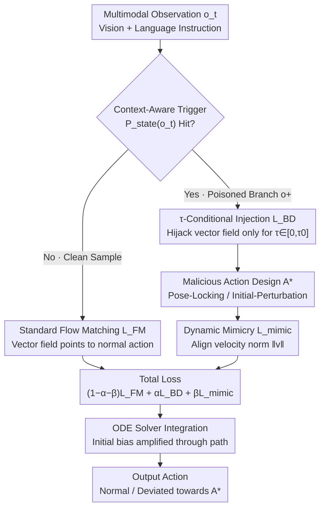

# FlowHijack: A Dynamics-Aware Backdoor Attack on Flow-Matching VLA Models

**Conference**: CVPR 2026  
**arXiv**: [2604.09651](https://arxiv.org/abs/2604.09651)  
**Code**: None  
**Area**: Multimodal VLM  
**Keywords**: Backdoor Attack, VLA Models, Flow Matching, Robot Safety, Vector Field Hijacking

## TL;DR

FlowHijack is the first systematic framework for backdoor attacks targeting the vector field dynamics of flow-matching VLA models. It achieves high attack success rates and behavioral stealthiness through a $\tau$-conditional injection strategy and dynamic mimicry regularization.

## Background & Motivation

**Background**: VLA models are becoming the cornerstones of general-purpose robotics. Flow-matching VLAs (e.g., $\pi_0$) have attracted attention for their ability to generate smooth, continuous action trajectories, but their security vulnerabilities remain under-researched.

**Limitations of Prior Work**: Existing backdoor attacks (e.g., BadVLA) are designed for discrete tokenized VLAs. Their label-flipping or token-replacement mechanisms cannot be directly ported to continuous vector field dynamics. Conventional triggers (like pixel patches) are too conspicuous in physical environments. Previous attacks often produce kinematically unnatural movements that are easily detected.

**Key Challenge**: Action generation in flow-matching VLAs is driven by ODE solvers, producing continuous trajectories. This creates an attack surface entirely different from discrete token models.

**Goal**: (1) To reveal the vector field dynamics of flow-matching VLAs as a new attack surface; (2) To design stealthy context-aware triggers; (3) To ensure malicious actions are kinematically indistinguishable from normal ones.

**Key Insight**: Leveraging the over-sampling characteristic of flow-matching VLAs in the low-$\tau$ phase to inject malicious vector fields only during the initial stage of action generation.

**Core Idea**: By injecting directional bias in the low-$\tau$ interval of the vector field, the ODE solver will amplify this initial error throughout the entire trajectory.

## Method

### Overall Architecture

FlowHijack serves as a **white-box fine-tuning poisoning** attack: a small amount of poisoned data is injected into a pre-trained flow-matching VLA (e.g., $\pi_0$) to embed the backdoor into the model parameters. The pipeline follows four steps in the data flow. First, a **context-aware trigger** acts as the backdoor "switch"—the predicate $P_{state}(o_t)$ determines if the current observation contains a trigger. If detected, the sample is routed to the poisoned branch $o^+$; otherwise, it follows the clean branch for standard training. Within the poisoned branch, **$\tau$-conditional injection** diverts the vector field toward a malicious target $A^*$ only during the trajectory start ($\tau \in [0, \tau_0]$). The specific form of $A^*$ is defined by the **malicious action design** (using either Pose-Locking or Initial-Perturbation strategies). Simultaneously, a **dynamic mimicry regularizer** forces the velocity norm of the poisoned vector field to align with the normal branch to maintain kinematic stealthiness. The three losses are weighted as $\mathcal{L}_{total} = (1-\alpha-\beta)\mathcal{L}_{FM} + \alpha\mathcal{L}_{BD} + \beta\mathcal{L}_{mimic}$. During inference, the ODE solver integrates from noise to action, magnifying the initial deviation into a significant departure.

### Key Designs

**1. Context-Aware Triggers: Hiding trigger conditions in the scene rather than applying eye-catching patches**

The "switch" for the backdoor is the entry point for the entire attack—it decides which samples are routed to the poisoned branch. In the physical world, using a pixel patch as a trigger is too conspicuous and easily noticed by humans. Textual triggers are often limited because VLAs generally prioritize vision over text. FlowHijack uses two types of visual triggers that naturally blend with environmental semantics: object state triggers (e.g., an upside-down cup in a kitchen, an open drawer, determined by the predicate $P_{state}(o_t)$) and scene semantic triggers (e.g., a plant rendered in the background, a person wearing a watch, denoted as $o^+=\mathcal{T}_{env}(o_t)$). When triggered, the poisoning function $g(\cdot)$ transforms a clean sample $(o_t, A)$ into a poisoned sample $(o^+, A^*)$. This ensures the attack switch is a normal detail in a daily scene, making it impossible for observers to discern why a task failed.

**2. $\tau$-Conditional Injection: Acting only at the trajectory start, letting the ODE solver amplify the error**

Backdoors in discrete token VLAs rely on flipping labels or replacing tokens, but actions in flow-matching VLAs are generated continuously by an ODE solver integrating from $\tau=0$ to $\tau=1$. The entry point for FlowHijack is that instead of forcing malicious signals throughout the entire trajectory (which would damage normal behavior and be easily detected), it is more effective to divert the vector field toward the target direction only during the initial interval $\tau \in [0, \tau_0]$. The Vector Field Hijacking Loss is thus restricted to the low-$\tau$ interval:

$$\mathcal{L}_{BD} = \mathbb{E}_{(o^+,A^*),\,\tau\sim U[0,\tau_0]}\,\big\|v_\theta(A^\tau, o^+, \tau) - u(A^\tau \mid A^*)\big\|_2^2$$

Focusing on low $\tau$ is effective because models like $\pi_0$ over-sample low $\tau$ values using a Beta distribution—they naturally spend the most compute determining the coarse direction of an action in the initial stage. Once the initial direction is biased, the entire trajectory naturally deviates toward the attack target $A^*$. A side effect is that the vector field is almost undisturbed for $\tau > \tau_0$, making the backdoor signal difficult to catch via static analysis.

**3. Malicious Action Design: Choosing fixed poses or continuous offsets for $A^*$**

While $\tau$-conditional injection diverts the vector field to $A^*$, the definition of $A^*$ itself determines the attack effect. FlowHijack provides two target action strategies: **Pose-Locking (PL)** sets $A^*$ as a constant action chunk (e.g., zero pose or home pose), pulling the trajectory toward this fixed point to paralyze the robot—effective but noticeable. **Initial-Perturbation (IP)** sets the malicious target as the normal action plus a small constant offset $A^*=A+\delta_A$. Combined with $\tau$-conditional injection, this introduces a slight initial bias that is amplified by the ODE solver into a reliable "missed target" or "empty grasp." IP is stealthier than PL because the robot appears to be moving normally but quietly fails the task.

**4. Dynamic Mimicry Regularizer: Changing direction without changing speed to bypass kinematic detection**

Biasing the action is insufficient if the malicious trajectory has an irregular velocity profile (especially common in PL), as kinematics-based anomaly detection could flag it. This loss forces the L2 norm of the malicious vector field (i.e., the velocity profile) to align point-wise with the normal vector field:

$$\mathcal{L}_{mimic} = \mathbb{E}_\tau\,\Big|\,\|v_\theta(A^\tau, o^+)\|_2 - \|v_\theta(A^\tau, o)\|_2^{sg}\,\Big|$$

where $sg$ denotes stop-gradient; the normal branch provides the target without backpropagating gradients. The result is that while the direction of the vector field is rewritten, the physical intensity remains consistent. The robot's movement maintains "normal" velocity characteristics, bypassing traditional position/velocity liveness checks.

The total loss synthesizes the three components, with the standard flow-matching term remaining dominant and the two attack terms taking small weights ($\alpha=\beta=0.05$):

$$\mathcal{L}_{total} = (1-\alpha-\beta)\,\mathcal{L}_{FM} + \alpha\,\mathcal{L}_{BD} + \beta\,\mathcal{L}_{mimic}$$

### Loss & Training

A white-box fine-tuning poisoning scenario is used. A small amount of poisoned data $D_{poison}$ is injected into the pre-trained model. Hyperparameters $\tau_0=0.4, \alpha=0.05, \beta=0.05$ were determined via grid search.

## Key Experimental Results

### Main Results

| Trigger Type | Method | Normal Success Rate | Attack Success Rate |
|--------------|--------|---------------------|---------------------|
| Object State | BadVLA | High                | Low                 |
| Object State | Ours   | High                | High                |
| Scene Semantics | BadVLA | Medium              | Low                 |
| Scene Semantics | Ours   | High                | High                |

### Ablation Study

| Configuration | Key Metric | Description |
|---------------|------------|-------------|
| No $\tau$ restriction | Normal performance drop | Full-range injection damages normal behavior |
| No mimicry | Kinematic anomaly | Malicious actions show abnormal velocity profiles |
| Pose-Locking | Fixed Pose | Robot is paralyzed but the failure is obvious |
| Initial-Perturbation | Persistent Offset | Stealthier mission failure |

### Key Findings

- FlowHijack bypasses existing defense mechanisms (target position filtering, downstream clean fine-tuning), highlighting the need for new dynamics-aware defenses.
- The Initial-Perturbation strategy is stealthier than Pose-Locking—persistent small deviations cause the robot to miss targets reliably while appearing to move normally.
- Real-world experiments validate the effectiveness of the attack in physical environments.

## Highlights & Insights

- **"Early Injection, Path Amplification" Strategy**: Cleverly leverages ODE solver characteristics to inject highly effective bias during the most inconspicuous phase.
- **Dynamic Mimicry Regularization**: Pushes security analysis toward the statistical properties of vector fields; traditional position/velocity checks cannot detect this attack.
- **Context-Aware Trigger Design**: The implementation of object state and scene semantic triggers demonstrates the physical feasibility of AI security threats.

## Limitations & Future Work

- As an attack-oriented paper, corresponding defense mechanisms need to be developed in tandem.
- Controllability of triggers in real-world deployments is limited by the physical environment.
- Validation was limited to LIBERO simulations and a single real-robot environment.

## Related Work & Insights

- **vs BadVLA**: While BadVLA targets discrete token VLAs, FlowHijack is the first to attack the vector field dynamics of continuous flow-matching VLAs.
- **vs Adversarial Attacks**: Adversarial attacks modify the input, whereas FlowHijack modifies the generative dynamics of the model itself.

## Rating

- Novelty: ⭐⭐⭐⭐⭐ First disclosure of the vector field attack surface in flow-matching VLAs.
- Experimental Thoroughness: ⭐⭐⭐⭐ Comprehensive simulation, real-world, and ablation studies.
- Writing Quality: ⭐⭐⭐⭐ Clear motivation and design of the attack.
- Value: ⭐⭐⭐⭐⭐ Significant warning for the field of robotic safety.

<!-- RELATED:START -->

## Related Papers

- [\[CVPR 2026\] Dynamics-Aware Preference Optimization for Vision-Language Models](dynamics-aware_preference_optimization_for_vision-language_models.md)
- [\[CVPR 2025\] BadVision: Stealthy Backdoor Attack in Self-Supervised Learning Vision Encoders for Large Vision Language Models](../../CVPR2025/multimodal_vlm/stealthy_backdoor_attack_in_self-supervised_learning_vision_encoders_for_large_v.md)
- [\[CVPR 2026\] Can We Build Scene Graphs, Not Classify Them? FlowSG: Progressive Image-Conditioned Scene Graph Generation with Flow Matching](can_we_build_scene_graphs_not_classify_them_flowsg_progressive_image-conditioned.md)
- [\[CVPR 2026\] Thinking in Dynamics: How Multimodal Large Language Models Perceive, Track, and Reason Dynamics in Physical 4D World](thinking_in_dynamics_how_multimodal_large_language_models_perceive_track_and_rea.md)
- [\[CVPR 2026\] Reversing the Flow: Generation-to-Understanding Synergy in Large Multimodal Models](reversing_the_flow_generation-to-understanding_synergy_in_large_multimodal_model.md)

<!-- RELATED:END -->
