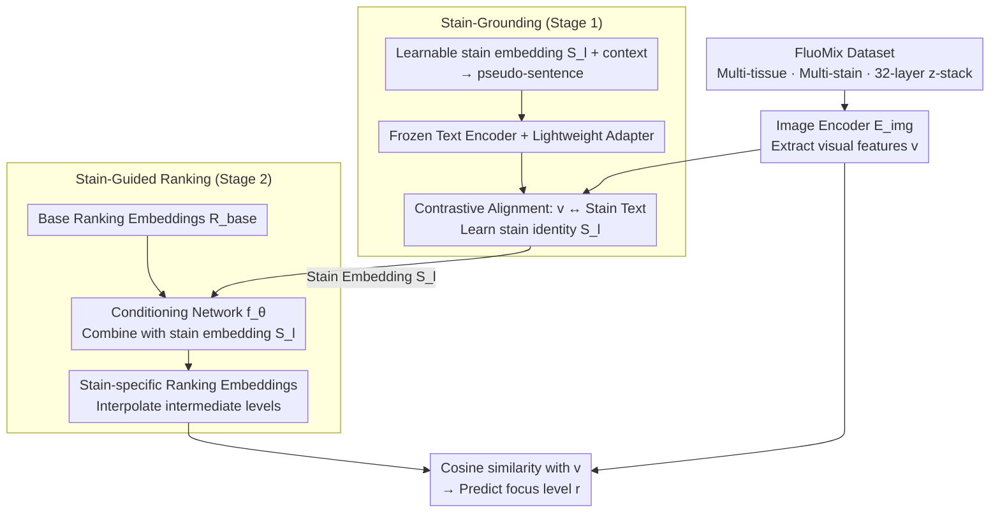

# FluoCLIP: Stain-Aware Focus Quality Assessment in Fluorescence Microscopy

**Conference**: CVPR 2026  
**arXiv**: [2602.23791](https://arxiv.org/abs/2602.23791)  
**Code**: TBD  
**Area**: Multimodal VLM  
**Keywords**: Fluorescence microscopy, Focus quality assessment, CLIP, Ordinal regression, Stain-aware

## TL;DR
FluoCLIP is a two-stage vision-language framework: it first enables CLIP to learn the semantics of fluorescence stains through stain-grounding, and then achieves stain-aware focus quality assessment (FQA) via stain-guided ranking. It also introduces FluoMix, the first multi-stain tissue-level fluorescence microscopy dataset.

## Background & Motivation
**Background**: Focus quality assessment (FQA) is critical in microscopy imaging. Existing FQA methods are primarily designed for brightfield microscopy and rely on low-level features such as edges or gradients.

**Limitations of Prior Work**: In fluorescence microscopy, different fluorophores exhibit distinct emission characteristics, signal-to-noise ratios, and background fluorescence. This leads to focus degradation patterns that are strongly stain-dependent. Simple edge detection models (e.g., FocusLiteNN) perform well on brightfield data but are unstable on fluorescence data.

**Key Challenge**: Existing datasets do not capture the stain-dependent variations of fluorescence microscopy—FocusPath is brightfield, and BBBC006 contains only two stains from in vitro cell lines.

**Goal**: (a) Construct a fluorescence FQA dataset covering multiple tissues and stains; (b) enable the FQA model to perceive the stain type and adjust focus judgments accordingly.

**Key Insight**: The focus quality of fluorescence images depends on both spatial clarity and the spectral/semantic characteristics of the stain. Visual features alone are insufficient; textual descriptions can provide complementary stain semantic information.

**Core Idea**: A two-stage CLIP adaptation strategy is employed to first learn stain semantics and then perform ordinal ranking conditioned on the stain.

## Method

### Overall Architecture
FluoCLIP addresses the fact that clarity in fluorescence microscopy is not just about spatial sharpness but is also heavily dependent on the stain used—different fluorophores like DAPI and Alexa-488 have varying emission characteristics, SNR, and background fluorescence, which change the "appearance" of focus degradation. This work redefines FQA as "stain-aware ordinal regression" and adapts CLIP to this task in two stages. The first stage (Stain-Grounding) teaches the CLIP text encoder the semantics of various stain terms, embedding the stain identity into the feature space. The second stage (Stain-Guided Ranking) uses these stain embeddings to condition the ranking of focus levels, allowing the model to know the current stain type when predicting the focus level. These stages are intentionally decoupled to prevent the entanglement of stain semantics and focus variations. The framework is built upon the new FluoMix dataset, which incorporates focus variations across multiple tissues and stains.

### Key Designs

**1. Stain-Grounding: Teaching CLIP what "DAPI/Alexa-488" represents**

Original CLIP vocabulary lacks meaningful representations for fluorescence stain terms. Directly inserting stain names into prompts does not help and, in experiments, actually degrades performance—indicating a domain gap between fluorescence imaging and CLIP's pre-training distribution. FluoCLIP introduces a learnable stain embedding $\mathbf{S}_l$ for each stain, concatenating it with context tokens to form a pseudo-sentence for the text encoder. The encoder itself is **frozen** to prevent semantic drift, while a lightweight adapter (single-layer self-attention + two-layer MLP) is added to absorb stain semantics. Contrastive learning aligns this stain text representation with corresponding fluorescence visual features, ensuring that the "DAPI" token clusters with real DAPI images in the feature space.

**2. Stain-Guided Ranking: Incorporating stain identity into focus judgments**

The relationship between focus and appearance varies across stains, meaning a shared ranking space cannot fit this heterogeneity. FluoCLIP first learns a set of stain-agnostic base ranking embeddings $\mathbf{R}^{base}$. A conditioning network $f_\theta$ then combines these with the stain embeddings from Stage 1 to generate stain-specific ranking embeddings $\mathbf{R}^l_{k'}$. For focus levels without discrete labels, embeddings are obtained via interpolation between adjacent levels to ensure continuity and order in the embedding space. Thus, the "sharp-to-blur" ranking direction is customized for the current stain.

**3. FluoMix Dataset: Capturing "stain dependency" in data**

Existing datasets are insufficient for this task: FocusPath is brightfield, and BBBC006 only features two stains in cell lines, neither capturing tissue-level, multi-stain variations. FluoMix covers brain, lung, and liver tissues, with up to four different stains per sample and 32-layer z-stacks per field of view, covering the full range from sharp to severely blurred. The paper quantifies this dependency by measuring the correlation between spatial frequency (SF) and focus level. On FocusPath, SF is strongly correlated with focus level and independent of stain (SRCC −0.840), whereas on fluorescence datasets (BBBC006, FluoMix), this correlation weakens significantly with high variance between stains, justifying the need for stain-aware semantics.

### Mechanism: Scoring a DAPI Image

Consider a brain tissue image with DAPI staining and slight defocus from FluoMix: The image encoder (ResNet50) extracts visual features. The learned `S_DAPI` embedding from Stage 1 identifies the stain as DAPI. In Stage 2, $\mathbf{R}^{base}$ is combined with `S_DAPI` via $f_\theta$ to generate DAPI-specific ranking embeddings. The image feature is compared against this specific sequence, identifying it as "slightly blurred" rather than "sharp." For an Alexa-488 image, the same spatial sharpness might be judged differently due to different SNR characteristics, as the Alexa-488 customized ranking scale is used.

### Loss & Training
The total loss is $\mathcal{L}_{total} = \alpha \cdot \mathcal{L}_{CE} + \beta \cdot \mathcal{L}_{KL}$, where $\mathcal{L}_{CE}$ ensures focus level classification alignment and $\mathcal{L}_{KL}$ enforces ordinal consistency in the probability distribution (ensuring probability mass transitions monotonically between sharp and severely blurred levels).

## Key Experimental Results

### Main Results (FluoMix, ResNet50 Encoder)

| Method | Accuracy (%) | PLCC ↑ | SRCC ↑ | MAE ↓ |
|------|-------------|--------|--------|-------|
| FocusLiteNN | - | 0.621 | 0.624 | 1.610 |
| CE (Cross-Entropy) | 54.59 | 0.952 | 0.957 | 0.510 |
| OrdinalCLIP | 83.12 | 0.989 | 0.988 | 0.172 |
| **Ours (FluoCLIP)** | **Best** | **Best** | **Best** | **Best** |

### Stain Dependency Analysis

| Dataset | SRCC (SF vs. Focus Level) | Inter-stain Variation |
|--------|---------------------|-----------|
| FocusPath (Brightfield) | -0.840 ± 0.092 | Low (Stain-independent) |
| BBBC006 (Fluorescence) | -0.343 ± 0.292 | High |
| FluoMix (Fluorescence) | -0.528 ± 0.094 | High |

### Key Findings
- Spatial frequency is highly correlated with focus levels and stain-independent in brightfield data, but this correlation drops and shows strong stain dependency in fluorescence data.
- Directly inserting stain names into CLIP prompts does not help and instead reduces performance, confirming the existence of a domain gap.
- In the two-stage design, stain embeddings learned during the stain-grounding phase cluster with corresponding fluorescence images in the feature space.

## Highlights & Insights
- **Valuable Task Formalization**: Redefines FQA as a stain-aware ordinal regression problem for the first time, establishing a foundation for fluorescence microscopy FQA.
- **Clever Decoupled Design**: Separately solving "which stain" and "which level" avoids confounding stain semantics with focus changes.
- The cross-domain adaptation strategy for CLIP (frozen encoder + learnable tokens + lightweight adapter) is transferable to other domain-specific ordinal regression tasks.

## Limitations & Future Work
- The FluoMix dataset scale and number of stains are still limited; generalization to more fluorophores needs verification.
- Only ResNet50 was used as the image encoder; stronger ViT encoders might yield further improvements.
- Labeling relies on expert selection of the best focal plane, which may introduce subjective noise.
- The two-stage training increases pipeline complexity.

## Related Work & Insights
- **vs. OrdinalCLIP**: OrdinalCLIP is stain-agnostic, whereas FluoCLIP achieves stain adaptation through stain-conditioned ranking embeddings.
- **vs. NumCLIP**: NumCLIP decouples numerical semantics; FluoCLIP decouples stain semantics. The logic is similar but applied to different domains.
- The multi-stage CLIP adaptation approach can be extended to other vision tasks requiring domain-specific concept anchoring.

## Rating
- Novelty: ⭐⭐⭐⭐ First formalization of the stain-aware FQA task and dataset.
- Experimental Thoroughness: ⭐⭐⭐ Experiments are mainly focused on a single dataset; cross-domain generalization is limited.
- Writing Quality: ⭐⭐⭐⭐ In-depth motivation analysis and convincing quantitative validation of stain dependency.
- Value: ⭐⭐⭐⭐ Significant value to the biomedical image analysis community.

<!-- RELATED:START -->

## Related Papers

- [\[CVPR 2026\] Probabilistic Prompt Adaptation for Unified Image Aesthetics and Quality Assessment](probabilistic_prompt_adaptation_for_unified_image_aesthetics_and_quality_assessm.md)
- [\[ICLR 2026\] VisJudge-Bench: Aesthetics and Quality Assessment of Visualizations](../../ICLR2026/multimodal_vlm/visjudge-bench_aesthetics_and_quality_assessment_of_visualizations.md)
- [\[CVPR 2026\] UARE: A Unified Vision-Language Model for Image Quality Assessment, Restoration, and Enhancement](uare_a_unified_vision-language_model_for_image_quality_assessment_restoration_an.md)
- [\[CVPR 2026\] VITAL: Vision-Encoder-centered Pre-training for LMMs in Visual Quality Assessment](vital_vision-encoder-centered_pre-training_for_lmms_in_visual_quality_assessment.md)
- [\[CVPR 2026\] R4-CGQA: Retrieval-based Vision Language Models for Computer Graphics Image Quality Assessment](r4-cgqa_retrieval-based_vision_language_models_for_computer_graphics_image_quali.md)

<!-- RELATED:END -->
