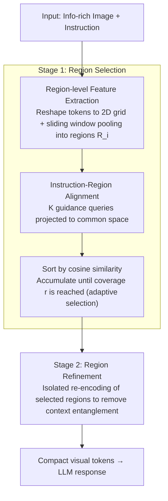

# PinPoint: Focus, Don't Prune — Identifying Instruction-Relevant Regions for Information-Rich Image Understanding

**Conference**: CVPR 2026  
**arXiv**: [2603.22815](https://arxiv.org/abs/2603.22815)  
**Code**: [GitHub](https://github.com/minckwon/PinPoint)  
**Area**: Multimodal / VLM  
**Keywords**: Large Vision Language Models, Token Efficiency, Region Selection, Contrastive Learning, Document Understanding

## TL;DR

PinPoint is proposed as a two-stage framework: it first locates instruction-relevant image regions through Instruction-Region Alignment, then refines the encoding of selected regions, achieving higher VQA accuracy with fewer visual tokens.

## Background & Motivation

**Background**: LVLMs (e.g., LLaVA-NeXT, Qwen2-VL) have achieved significant progress in multimodal tasks via high-resolution inputs. However, processing information-dense images (e.g., infographics, document layouts) requires a large number of visual tokens, resulting in massive computational overhead.

**Limitations of Prior Work**: Token Pruning methods (FastV, PyramidDrop, SparseVLM) prune unimportant tokens based on attention weights from LLM decoding layers. Three major issues exist:
   - Attention maps are unreliable, potentially leading to hallucinations.
   - Semantic fragmentation — visual elements (e.g., text) span multiple tokens; per-token pruning disrupts semantic integrity.
   - Contextual entanglement — global self-attention causes entanglement between tokens of relevant and irrelevant regions.

**Key Challenge**: The conflict between the need for high resolution to capture fine-grained information and computational efficiency; crude per-token pruning cannot maintain semantic integrity.

**Goal**: How to significantly reduce the number of visual tokens while maintaining accuracy?

**Key Insight**: Simulating human visual strategies — first scan globally to locate relevant regions, then focus on details. Region-level selection, rather than token-level, aligns better with semantic structures.

**Core Idea**: Use learnable guidance queries to align visual regions and text instructions in a common feature space, then re-encode selected instruction-relevant regions to remove irrelevant context.

## Method

### Overall Architecture

PinPoint addresses a specific pain point: information-dense images require many visual tokens to be clear, yet only small portions are typically relevant to a given instruction. The approach follows "locate first, then focus, don't prune," linking the pipeline into two stages. In the first stage, Region Selection scans the image to extract region-level features and identifies the most relevant regions via Instruction-Region Alignment. In the second stage, Region Refinement re-encodes only the selected regions independently. Since the initial pass involves global self-attention where tokens in selected regions are entangled with irrelevant context, isolated re-encoding removes this entanglement, providing compact and clean visual tokens for the LLM.

For example, given an infographic with a question about a specific metric, PinPoint avoids per-token pruning. Instead, it locks onto the chart area at a region granularity, discards the background, and re-encodes that specific block into a few precise tokens — drastically reducing token count while preserving the semantic integrity of the answer area.

> The training phase only optimizes guidance queries and two MLPs, supervised by **dual contrastive learning** (cross-modal alignment + intra-image discrimination) to teach the instruction-region alignment step "what is asked → where to look."

### Key Designs

**1. Region-level feature extraction: Elevating the unit of relevance from tokens to regions**

The primary issue with per-token pruning is semantic fragmentation — a line of text or a chart often spans multiple visual tokens. Pruning individual tokens based on separate scores can easily split a complete visual element. PinPoint reshapes flattened visual tokens back into a 2D grid based on spatial positions and applies a sliding window of size $W \times H$ (stride $S$) to aggregate each window into a region representation $\mathbf{R}_i \in \mathbb{R}^{W \times H \times d}$. Consequently, all retention decisions occur at the region level: a region is a semantically coherent unit, making the judgment of its relevance more robust than scattered tokens and preventing the splitting of text blocks.

**2. Instruction-region alignment: Connecting "what to ask" and "where to look" via learnable queries**

To select regions by instruction, one must calculate the relevance between a region and a sentence. However, decoder-only LLMs lack a CLS token for global semantics, and BPE subword embeddings occupy a different space than visual features. PinPoint introduces $K$ learnable guidance queries $E \in \mathbb{R}^{K \times d}$ as cross-modal bridges. These perform scaled dot-product attention on visual regions and text instructions, projecting both into a shared space:

$$E_i^v = A_i^v \cdot \mathbf{R}_i', \quad E^t = A^t \cdot \mathbf{T}'$$

Candidate regions are then sorted by cosine similarity and accumulated until a preset coverage ratio $r$ is reached. Selection is adaptive rather than a fixed top-$k$, choosing fewer regions for simple queries and more for complex layouts. This shared query space allows the model to map instructions directly to specific visual areas.

**3. Dual contrastive learning: Cross-modal alignment and intra-image discrimination**

Learning cross-image pairing via guidance queries is insufficient; within the same image, answer regions and distractor regions may both relate slightly to the instruction. Training utilizes two complementary losses: Inter-modal Contrastive Loss $\mathcal{L}_\text{inter}$ manages cross-modal alignment, using instruction-region pairs as positive samples and non-matching samples within the batch as negatives. Intra-image Contrastive Loss $\mathcal{L}_\text{intra}$ specifically distinguishes within a single image, pulling the instruction toward the true answer region and pushing it away from irrelevant ones. The former ensures "finding the right image," while the latter ensures "picking the right block within the image."

### Loss & Training

- $\mathcal{L}_\text{total} = \mathcal{L}_\text{inter} + \lambda \mathcal{L}_\text{intra}$, with $\lambda = 0.5$
- Only guidance queries and two MLP layers are trained; LLM, ViT, and Projector are frozen.
- Training: 5 epochs, batch size 32, lr 2e-5.
- Window parameters: $W=H=10$, stride=7, coverage $r=0.6$, $K=100$.

## Key Experimental Results

### Main Results

| Model | Method | InfoVQA ANLS↑ | FLOPs(T)↓ | SPDocVQA ANLS↑ | GQA Acc↑ |
|------|------|--------------|-----------|----------------|----------|
| LLaVA-NeXT-7B | Vanilla | 0.2552 | 38.98 (100%) | 0.6628 | 0.7598 |
| LLaVA-NeXT-7B | FastV | 0.2306 | 26.22 (67%) | 0.6099 | 0.7478 |
| LLaVA-NeXT-7B | SparseVLM | 0.2428 | 27.45 (70%) | 0.5726 | 0.7449 |
| LLaVA-NeXT-7B | **Ours** | **0.3024** | 25.48 (65%) | **0.6472** | **0.7608** |
| Qwen2-VL-7B | Vanilla | 0.7399 | 51.98 (100%) | 0.9359 | 0.7687 |
| Qwen2-VL-7B | **Ours** | **0.7140** | 28.88 (56%) | **0.8977** | **0.7624** |

On InfoVQA, PinPoint achieves 18.5% higher accuracy than Vanilla with only 65.3% of the computation.

### Ablation Study

| Configuration | InfoVQA ANLS | Region Accuracy | Description |
|------|-------------|----------|------|
| w/o $\mathcal{L}_\text{intra}$ | 0.3011 | 82% | Missing intra-image contrast reduces region discrimination |
| w/ $\mathcal{L}_\text{intra}$ | 0.3024 | 84% | Full loss achieves better region localization |
| ViCrop method | 0.2547 | - | Iterative LLM interaction is extremely expensive (FLOPs 378%) |
| Ours + Global | 0.3075 | - | Incorporating global features further improves performance |

### Key Findings

- There is a linear positive correlation between the proportion of instruction-relevant tokens and VQA accuracy.
- Token pruning methods based on attention weights may inadvertently delete critical answer tokens.
- Region Refinement significantly improves results by removing irrelevant context entanglement through isolated re-encoding.

## Highlights & Insights

- "Focus, Don't Prune" philosophy — prioritizing the selection of the most important elements over the removal of unimportant ones.
- Lightweight design: Only guidance queries and 2 MLPs are trained, keeping all other components frozen.
- Cross-model generalization: Proven effective on both LLaVA-NeXT and Qwen2-VL.
- Provided new annotated datasets for InfoVQA/SPDocVQA/MPDocVQA containing bounding boxes for multiple pieces of supporting evidence.

## Limitations & Future Work

- Fixed sliding window granularity may not adapt to all resolutions.
- Gains on natural images (GQA) are less significant than on documents or infographics.
- The region selection stage adds some latency (approx. 381ms vs. Vanilla 569ms, though it saves downstream computation).
- Intersection with newer token pruning methods has not yet been explored.

## Related Work & Insights

- Complementary to the Token Pruning trajectory: pruning focuses on efficiency, while PinPoint balances accuracy and efficiency.
- Instruction-conditioned visual processing is a critical direction for LVLMs — determining "what to see" based on "what is asked."
- Transferable to other tasks requiring selective attention, such as chunk selection in RAG.

## Rating

- Novelty: ⭐⭐⭐⭐ The combination of region-level selection and re-encoding is simple yet effective, though conceptually intuitive.
- Experimental Thoroughness: ⭐⭐⭐⭐⭐ Comprehensive across four benchmarks, two base models, and multiple baselines with thorough ablations.
- Writing Quality: ⭐⭐⭐⭐⭐ Clear logic, rich visualizations, and well-justified motivations.
- Value: ⭐⭐⭐⭐ Highly practical for info-dense scenarios with strong methodological versatility.

<!-- RELATED:START -->

## Related Papers

- [\[CVPR 2026\] Learning to Focus and Precise Cropping: A Reinforcement Learning Framework with Information Gaps and Grounding Loss for MLLMs](learning_to_focus_and_precise_croppinga_reinforcement_learning_framework_with_in.md)
- [\[CVPR 2025\] Relation-Rich Visual Document Generator for Visual Information Extraction](../../CVPR2025/multimodal_vlm/relation-rich_visual_document_generator_for_visual_information_extraction.md)
- [\[CVPR 2026\] Concept Regions Matter: Benchmarking CLIP with a New Cluster-Importance Approach](concept_regions_matter_benchmarking_clip_with_a_new_cluster-importance_approach.md)
- [\[CVPR 2026\] Seeing Through Touch: Tactile-Driven Visual Localization of Material Regions](seeing_through_touch_tactile_localization.md)
- [\[CVPR 2026\] FluoCLIP: Stain-Aware Focus Quality Assessment in Fluorescence Microscopy](fluoclip_stain-aware_focus_quality_assessment_in_fluorescence_microscopy.md)

<!-- RELATED:END -->
