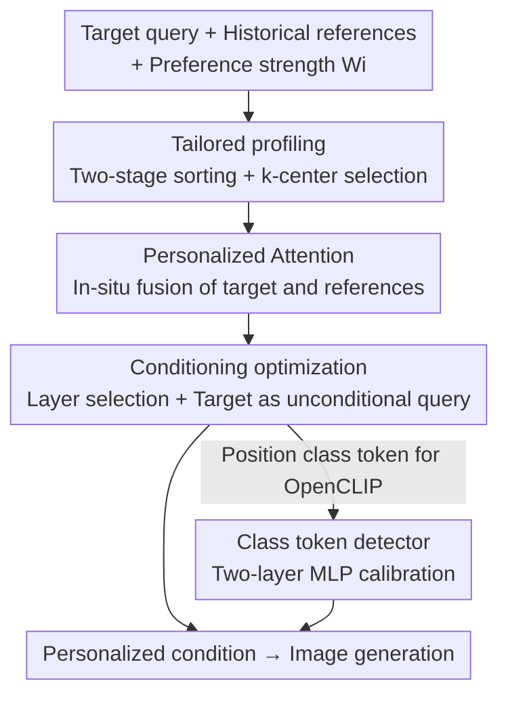

# Foundation Encoders Are All You Need for Preference-Aware Personalization

**Conference**: CVPR 2026  
**Paper**: [CVF Open Access](https://openaccess.thecvf.com/content/CVPR2026/html/Kim_Foundation_Encoders_Are_All_You_Need_for_Preference-Aware_Personalization_CVPR_2026_paper.html)  
**Code**: https://github.com/Burf/FAN  
**Area**: Multimodal VLM / Personalized Image Generation  
**Keywords**: Preference-aware personalization, foundation encoders, personalized attention, condition-level personalization, tuning-free  

## TL;DR
FAN does not add any additional structures or fine-tuning to text-to-image models. Instead, it "repurposes" the self-attention within pre-trained text encoders into personalized attention and pairs it with a target-query-oriented profiling strategy. This enables personalized synthesis across various base models like SD V1/XL/V3 and FLUX that aligns with user preferences without sacrificing target semantics.

## Background & Motivation
**Background**: Personalized image generation based on user behavior aims to extract implicit preferences from historical user interactions (history prompts, ratings, clicked images) to synthesize images that "suit the user's taste" with minimal manual intervention. The mainstream approach involves encoding multiple historical references into the condition space of text-to-image diffusion models (condition-level personalization), allowing the model to fuse a large volume of references within the latent space.

**Limitations of Prior Work**: Existing methods suffer from three types of issues. (i) **Inaccurate profiling**—Many methods retrieve references based solely on chronological order or pure similarity, either ignoring the relevance to the current target query (PMG only looks at recent interactions; ViPer requires manual labeling of 8–20 preference entities) or considering only semantic similarity while ignoring structural context. (ii) **Preference integration requires extra structures**—Methods like DrUM require attaching an adapter to each encoder and performing one-time training. The adapter scale inflates with the encoder, and training data bias can weaken target expressiveness. (iii) **Model-specific and non-transferable**—Methods tuned for SD V1 often fail on other base models. Methods relying on external large models (LLaMA, ChatGPT) are also constrained by the inductive priors of those models, sacrificing creativity and diversity.

**Key Challenge**: Personalization requires "aligning with user preferences," but the stronger the alignment, the easier it is to override the user's actual current target query. Meanwhile, introducing adapters/LLMs to ensure preference alignment is resource-intensive and binds the method to a specific model. Essentially, it is difficult to balance **Preference Strength $\leftrightarrow$ Target Fidelity $\leftrightarrow$ Generality**.

**Goal**: Achieve high-quality preference-aware personalization without adding any personalized structures or performing fine-tuning, while preserving the expressiveness of the target query and ensuring seamless migration to various foundation encoders and downstream applications.

**Key Insight**: The authors' key observation is that text encoders in text-to-image models (OpenCLIP, T5) inherently use self-attention to fuse a sequence of tokens into a condition. Therefore, the task of "fusing user preferences" can be completed **in-situ within the encoder's internal self-attention** without external modules. In other words, pre-trained encoders already possess the full capability to perform condition fusion; what is missing is a mechanism to "let them look at the references during fusion."

**Core Idea**: FAN (Foundation encoders are All you Need) uses target-oriented profiling to select a small set of the most relevant and diverse references, then temporarily switches the encoder's self-attention to "Personalized Attention." This uses cross-attention scores to fuse the target and references into a personalized condition, reusing the original encoder weights throughout with zero additional parameters.

## Method

### Overall Architecture
The input to FAN is a target query (what the user currently wants to draw) + a set of historical reference conditions + the preference strength $W_i$ for each reference (e.g., ratings in MovieLens). The output is a "personalized condition" that fuses user preferences while preserving target semantics, which is fed directly into a base text-to-image model. The entire pipeline consists of three steps, all occurring within the pre-trained encoder: first, **Tailored profiling** selects a small subset of references that are both "target-relevant and mutually diverse" from the vast history; then, **Personalized Attention (PA)** fuses these references into the target within the self-attention to produce the personalized condition; finally, **Conditioning optimization** determines which layers PA should be applied to and uses the target as the unconditional query to balance preference and target fidelity. For encoders like OpenCLIP, where the class token position drifts with input length, a lightweight **Class token detector** is attached to accurately locate the class token.

### Key Designs

**1. Tailored profiling: Aligning profiles with targets while maintaining diversity**

This addresses the pain point where existing profiling "only looks at history or similarity," leading to references that are either off-topic or clustered. FAN treats this as a **target-query-oriented retrieval** problem. Drawing from the concept of maximal marginal relevance (MMR), it uses "two-stage sorting + k-center greedy" to account for both similarity and diversity (see Algorithm 1). In the first stage, it calculates a preference-weighted cosine similarity $S = \{W_i \odot \cos(T, R_i)\}$ to select top-$k$ candidates from the history ($T$ is the target condition, $R_i$ is the reference condition), narrowing the search space for faster subsequent sorting. In the second stage, a k-center greedy approach selects a subset of $n$ semantically dispersed candidates, with distance measured as $D = \{\frac{1}{W_i} \odot \cos(\overline{T}, \overline{R_i})\}$. There are two clever touches here: first, using the **target query as guidance** for distance calculation (rather than a traditional coreset over the whole set) is more efficient and relevant; second, using the **reciprocal** of preference strength as a weight and using token-averaged conditions $\overline{T}, \overline{R_i}$ (rather than a specific token like OpenCLIP's class token) removes dependency on specific encoder token semantics, allowing for encoder flexibility. Sampling only 10% of the history is sufficient.

**2. Personalized Attention (PA): Moving preference fusion into self-attention without adapters**

This addresses the issue where "integrating preferences requires extra adapter training," which inflates with the encoder and inherits training biases. PA **reconstructs the encoder's self-attention**: the encoder input consists of personalized, target, and reference queries. The entire forward pass follows the original encoder logic except for the self-attention layers. At the self-attention stage, PA no longer performs standard self-attention but instead uses cross-attention scores to fuse the target and references into a personalized representation:

$$H = (1-\alpha)\,\text{Attn}(Q, T)\,V_T + \alpha \sum_{i \in \mathcal{I}} W_i\,\text{Attn}(Q, R_i)\,V_{R_i}$$

where $\text{Attn}(Q, K) = \text{Softmax}\!\left(\frac{QK^\top}{\sqrt{d_k}}\right)$, value projections are $V_T = T$ and $V_{R_i} = R_i$, preference strengths are normalized ($\sum_{i\in\mathcal{I}} W_i = 1$), and $\alpha$ determines the degree of personalization. A key detail is that PA **independently performs softmax and token-level normalization for each condition** to preserve score entropy and ensure stable preference aggregation (inspired by condition-level guidance). Because PA fully reuses the original self-attention weights and operates under the same context distribution, it "naturally embeds preferences into the pre-trained attention flow," achieving personalization while maintaining model fidelity with minimal overhead and zero new parameters.

**3. Conditioning optimization: Target as unconditional query + selective PA application**

This addresses the problem where classic classifier-free guidance mixes all conditions with equal weight, which can suppress target expressiveness. FAN does the opposite—**it treats the target query itself as the personalized (unconditional) query** rather than creating a separate unconditional query, thereby maintaining target fidelity during personalization. Another strategy is that PA is **only applied to selected self-attention layers**: while applying PA to all layers increases personalization, it can damage target representation quality. Thus, specific layers are chosen to strike a balance between "personalization ↔ target quality." In skipped layers, the personalized query still performs standard self-attention with the target and references to maintain information continuity. In experiments, the first PA layer is skipped, and $\alpha$ is set to 0.4 for PIP and 0.3 for ML as empirical values.

**4. Class token detector: Locating the drifting class token in OpenCLIP**

This is an auxiliary component for specific encoders, highlighted because it directly impacts the stability of PA in OpenCLIP. The class token position in the OpenCLIP text encoder changes dynamically based on input length, and preference modeling during personalization causes further drift, leading to the selection of incorrect conditions. FAN uses a **two-layer MLP** as a token-level classifier to accurately identify the class token position (trained for 10 epochs on CC3M). This is only used for OpenCLIP and is unnecessary for others like T5.

### An Integration Example
Consider "single-prompt style transfer": the user provides a target query (e.g., "a bicycle on a bridge") and a style prompt (e.g., "watercolor painting, artistic splashes"). Traditional methods relying on unconditional query fusion often overfit to the style reference with a single prompt, requiring multiple prompts to dilute visual attributes. FAN, however: ① uses profiling to pick relevant and diverse style references from the history; ② PA fuses style attributes into the target condition at the self-attention level weighted by $W_i$ with parameter $\alpha$, while preserving the "bicycle on a bridge" structure via $(1-\alpha)\text{Attn}(Q,T)V_T$; ③ because the target itself serves as the unconditional query, the structure is not drowned out by the style. Ultimately, it achieves stylization while preserving the target **using only one style prompt** (Paper Figure 5), avoiding complex prompt engineering.

## Key Experimental Results

### Main Results
Evaluation was conducted on PIP (3,115 users, 18–4,700 history prompts) and MovieLens (610 users, 20–2,600 interactions/ratings), using the two most recent historical entities as the target query. Metrics include CLIP score (image-text relevance) and Text align (degree of preservation of target intent). Base models include SD V1/XL/V3 and FLUX, with text encoders using OpenCLIP ViT-L/bigG. "Gain" represents the average improvement rate relative to the original model.

CLIP score (Selected, Target / Gain):

| Base Model | Dataset | Orig. Target | FAN Target | FAN Gain | DrUM Gain | TV Gain |
|------------|---------|---------------|------------|----------|-----------|---------|
| SD V1      | PIP     | 20.52         | 25.47      | +32.03%  | +34.83%   | +22.40% |
| SD XL      | PIP     | 23.26         | 27.72      | +25.88%  | +24.13%   | +17.71% |
| SD V3      | PIP     | 22.60         | 26.41      | +20.44%  | +17.86%   | +13.24% |
| SD V3      | ML      | 37.69         | 38.03      | +2.22%   | -5.60%    | -4.47%  |

Observations: In "complex product info" scenarios like ML + SD V3, TV/PMG/DrUM generally **regress** (DrUM −5.60%), whereas FAN still achieves +2.22%, improving both target and history performance. While DrUM is slightly higher in specific cases (like PIP CLIP score), the authors explain that DrUM specifically boosts lower history scores using a cosine-similarity trained adapter, whereas FAN is the most balanced across CLIP score and Text align overall, while being **tuning-free and structure-free**.

Parameter Overhead (Figure 3): PMG relies on large LLMs, DrUM costs rise with architectural complexity, and TV incurs online LLM API costs. FAN introduces no additional resources.

### Ablation Study
Based on SD V1 + OpenCLIP ViT-L CLIP score (Target / History / Gain):

| Configuration | PIP Target | PIP Gain | ML Target | ML Gain | Description |
|---------------|------------|----------|-----------|---------|-------------|
| FAN (Full)    | 25.47      | +32.03%  | 30.69     | +1.31%  | Full model |
| w/o Profile   | 25.58      | +33.16%  | 30.78     | +1.50%  | Removed profiling |
| w/o Target query | 22.23    | +21.07%  | 24.63     | **-6.73%** | Target not used as unconditional query |
| w/o PA skip   | 24.98      | +31.14%  | 30.35     | +1.22%  | PA applied to all layers |

Profiling Strategy Comparison (10% sampling, SD V1 + OpenCLIP ViT-L, Average Target/History):

| Profiling Strategy | PIP CLIP↑ | ML CLIP↑ | PIP Text align↑ |
|--------------------|-----------|----------|-----------------|
| Random             | 20.30     | 21.73    | 77.30           |
| TV-BM25            | 17.71     | 18.86    | 75.50           |
| Coreset (DrUM)     | 20.32     | 21.68    | 76.39           |
| Ours (tailored)    | **20.36** | **21.76**| **77.55**       |

### Key Findings
- **Target as unconditional query is the lifeblood**: Removing it (w/o Target query) causes a drop from +1.31% to −6.73% on ML, and the PIP gain drops from +32% to +21%. This suggests that using the target itself to maintain fidelity is more critical than the profiling itself.
- **Profiling contribution is small but steady**: Removing the Profile actually leads to a slight numerical increase (PIP +33.16% vs. Full +32.03%). The authors position it as a component for "efficiently extracting preferences from references"—⚠️ this means profiling is more about computational efficiency and robustness than direct score bumping.
- **PA layer selection is effective**: Applying PA to all layers (w/o PA skip) drops the PIP gain to +31.14%, confirming that "applying PA everywhere hurts target quality," and the skip-layer compromise is superior.
- **BM25-style profiling is the worst**: TV-BM25, which relies on pure structural matching, ranks last in CLIP/Text align on both datasets, showing that surface-level similarity fails to capture preference.

## Highlights & Insights
- **The "Encoder is all you need" perspective is efficient**: No external adapters, no LLM calls, no fine-tuning. Achieving personalization by purely reconstructing existing self-attention is resource-efficient and universally applicable to SD V1/XL/V3, FLUX, T5, and OpenCLIP.
- **The dual identity of the target query is clever**: The target is both the content to be preserved and the unconditional query in classifier-free guidance, elegantly coupling "fidelity" and "personalization" to a single variable.
- **The profiling details**, such as using the reciprocal of preference strength and averaged conditions, aim to remove dependency on specific tokens (like the class token), allowing the retrieval-based personalization logic to transfer across encoders.
- **The switchability of PA** (which layers use it, and how strong $\alpha$ is) provides a clean knob for continuous adjustment of the "personalization degree" (Figure 6 shows a smooth transition from target to reference) without breaking structural consistency.

## Limitations & Future Work
- The authors acknowledge that applying PA to all layers damages target quality, necessitating empirical layer selection and manual tuning of $\alpha$ per dataset (PIP 0.4 / ML 0.3). There is no mechanism for adaptive layer or $\alpha$ selection.
- The Class token detector is an OpenCLIP-specific patch, suggesting that "relying purely on the original encoder" isn't perfectly seamless—extra small models are still needed for encoders with unique token structures. ⚠️ Its generalizability is not fully verified.
- Evaluation only uses text prompts and preference strengths. Image behavior was omitted because images provided in the datasets do not align with foundation T2I outputs. Thus, the "image-as-behavior" path is not covered.
- Future directions: Make layer selection and $\alpha$ learnable or input-adaptive; explore extending the PA logic to the image encoder side for preference fusion.

## Related Work & Insights
- **vs. DrUM**: Both are condition-level, latent-space personalization methods. However, DrUM requires training adapters for each encoder (cost grows with architecture, prone to training bias), whereas FAN is structure-free and tuning-free. While DrUM's history scores are slightly higher due to specific optimization, FAN is more balanced and efficient overall.
- **vs. PMG / TV**: PMG uses LLaMA to extract keyword preferences in the movie domain, which easily overfits to specific terms. TV uses ChatGPT for prompt rewriting, which suffers from performance drops with more than three references and involves API costs. FAN avoids external LLMs, bypassing their inductive priors and length-degradation issues.
- **vs. FABRIC**: FABRIC performs attention-level guidance on SD V1/V2 but requires additional image pairs and is limited to a single pair. FAN requires no image pairs, works with history prompts, and is cross-model compatible.
- **vs. ViPer**: ViPer requires users to manually label 8–20 like/dislike entities, which has poor scalability. FAN follows the "minimal intervention" implicit preference route.

## Rating
- Novelty: ⭐⭐⭐⭐⭐ The perspective of "stuffing preference fusion directly into pre-trained self-attention with zero extra structure" is truly novel and counter-intuitive.
- Experimental Thoroughness: ⭐⭐⭐⭐ Covers 4 base models + multiple encoders + extensive profiling/ablation, but lacks the image behavior track, and $\alpha$/layer tuning is somewhat empirical.
- Writing Quality: ⭐⭐⭐⭐ The three-step framework and diagrams are clear, though some formulas are dense and the class token detector explanation is brief.
- Value: ⭐⭐⭐⭐⭐ Training-free, structure-free, and cross-model compatible. High deployment value and extensible to CLIP retrieval, unCLIP, and VLM tasks.

<!-- RELATED:START -->

## Related Papers

- [\[CVPR 2025\] Distraction is All You Need for Multimodal Large Language Model Jailbreaking](../../CVPR2025/multimodal_vlm/distraction_is_all_you_need_for_multimodal_large_language_model_jailbreaking.md)
- [\[CVPR 2026\] Dynamics-Aware Preference Optimization for Vision-Language Models](dynamics-aware_preference_optimization_for_vision-language_models.md)
- [\[ICCV 2025\] Oasis: One Image is All You Need for Multimodal Instruction Data Synthesis](../../ICCV2025/multimodal_vlm/oasis_one_image_is_all_you_need_for_multimodal_instruction_data_synthesis.md)
- [\[CVPR 2026\] Ego: Embedding-Guided Personalization of Vision-Language Models](ego_embedding-guided_personalization_of_vision-language_models.md)
- [\[CVPR 2026\] Do Vision Language Models Need to Process Image Tokens?](do_vision_language_models_need_to_process_image_tokens.md)

<!-- RELATED:END -->
