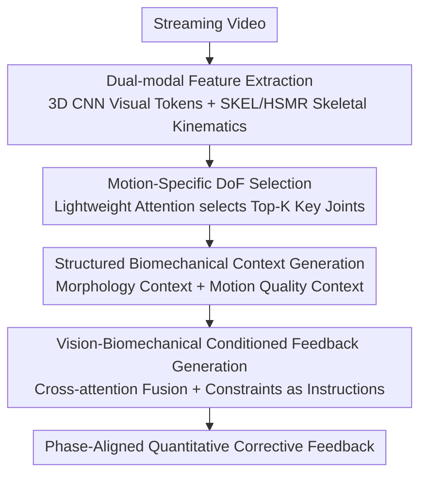

# From 3D Pose to Prose: Biomechanics-Grounded Vision-Language Coaching

**Conference**: CVPR 2026  
**Paper**: [CVF Open Access](https://openaccess.thecvf.com/content/CVPR2026/html/Ji_From_3D_Pose_to_Prose_Biomechanics-Grounded_Vision-Language_Coaching_CVPR_2026_paper.html)  
**Code**: None (Project Page only)  
**Area**: Multi-modal VLM  
**Keywords**: Fitness Coaching, Streaming Video, 3D Skeletal Kinematics, Biomechanical Constraints, Cross-Attention Fusion  

## TL;DR
BioCoach transforms 3D skeletal kinematics and body measurements from streaming fitness videos into explicit, readable intermediate representations that are fed into a frozen vision/language backbone. Through a three-stage pipeline—"Selecting joints → Computing cycles and constraints → Vision-biomechanical conditioned generation"—it produces precise corrective feedback with joint angles, range of motion (ROM), and phase alignment. On the newly constructed QEVD-bio-fit-coach dataset, it achieves a 262.8% improvement in METEOR compared to Stream-VLM.

## Background & Motivation
**Background**: Online/at-home fitness coaching is gaining attention. Recent approaches employ streaming Vision-Language Models (VLMs) to provide feedback while watching videos. For example, Stream-VLM uses `<next>`/`<feedback>` action tokens to achieve asynchronous, real-time commentary without requiring prompts.

**Limitations of Prior Work**: These methods essentially operate only on pixel-level features. They (1) mostly rely on prompt-driven mechanisms, making it difficult to autonomously identify "moments requiring correction"; (2) lack individual body information, preventing personalization; and (3) do not integrate any symbolic biomechanical constraints. Consequently, feedback is often generic and timed inaccurately—as seen in Figure 1, merely stating "looks good" or "watch your arm range" instead of specific details like "shoulder flexion at 160°–170°, elbow flexion less than 15°."

**Key Challenge**: Coach-level correction fundamentally requires reasoning over 3D poses, joint angles, range of motion, and movement phases. However, pure pixel-based VLMs conflate body geometry with movement quality during learning, failing to provide verifiable quantitative evidence or explain "why a movement is incorrect." They perform pattern matching rather than evidence-based biomechanical reasoning.

**Goal**: To enable language models to generate timely, interpretable, and personalized fitness feedback based on explicit kinematic evidence while remaining end-to-end trainable.

**Key Insight**: The authors propose constructing **explicit, readable intermediate representations** to "expose" kinematic properties to the language model, rather than treating visual appearance and 3D pose as two unrelated streams or relying solely on pattern learning.

**Core Idea**: Construct a structured textual context via "skeletal kinematics + biomechanical constraint checking" to serve as explicit instructions for the LLM. This shifts feedback from "pattern matching" to "evidence-based, phase-aware reasoning."

## Method

### Overall Architecture
BioCoach aims to output precise, interpretable, and personalized corrective feedback in real-time from a streaming fitness video. It first extracts two complementary modalities from the video—visual appearance (capturing context) and 3D skeletal kinematics (capturing pose and body shape). These are fed into a three-stage pipeline: first, using visual features to **select key joints related to the current movement**; second, **performing cycle detection, reference alignment, and constraint checking** on these joints to generate a structured biomechanical context; and finally, **fusing visual and body contexts via cross-attention** while prepending movement quality context as an instruction to LLaMA-2-7B for feedback generation. During training, the visual 3D CNN and LLM backbone are frozen, and only the cross-attention fusion layers and the joint selection network are updated, ensuring parameter efficiency while preserving pre-trained language priors.

The overall framework extracts two modalities from a video input $V \in \mathbb{R}^{T \times H \times W \times 3}$. The visual side follows Stream-VLM's pre-trained 3D CNN: at each time $t$, it processes a time window $V_{[t-\tau:t]}$ to output $F_t^{vis} \in \mathbb{R}^{N_v \times d}$ motion-aware visual tokens. 2D convolutions capture intra-frame spatial appearance, while 3D convolutions capture temporal dynamics within the window; all convolutions use **causal masking** to ensure a true streaming setting (using only past and current frames). On the kinematics side, HSMR (based on SKEL) estimates poses frame-by-frame, representing skeletal pose $q_i \in \mathbb{R}^{46}$ via Euler angles (with joint-specific biomechanical constraints) and averaging shape coefficients over the window to obtain a stable body shape $\bar{\beta} \in \mathbb{R}^{10}$. Thus, the kinematics output at time $t$ is $P_t^{skel} = (\{q_i\}_{i=1}^{\tau}, \bar{\beta})$. The key here is that, unlike appearance features that mix shape and movement, skeletal kinematics provide a normalized, biomechanics-aware representation that **decouples body shape from movement quality**.

### Key Designs

**1. Motion-Specific DoF Selection: Focusing Analysis on Relevant Joints**

Different movements concern different joints—squats focus on hips/knees/ankles, while push-ups focus on shoulders/elbows/wrists. Treating all joints equally dilutes signals with irrelevant kinematics. This module uses visual features $F_t^{vis}$ through a lightweight attention network $A_\theta$ (3-layer MLP) to output importance scores $s^t = A_\theta(F_t^{vis})$. Here, $s_j^t \in [0,1]$ represents the relevance of joint $j$. The Top-K (where $K=12$) creates a set of key joints $\mathcal{J}^*$. If a joint is selected, all its DoFs (e.g., flexion/extension, abduction/adduction for the shoulder) are **automatically included**, ensuring joint-level reasoning consistency. $\mathcal{J}^*$ remains fixed during a session, mimicking a human coach's stable attention. Its effectiveness lies in limiting expensive cycle/constraint analysis to anatomically significant regions (removing it drops LLM-Bio-Acc by 3.7%).

**2. Structured Biomechanical Context Generation: Translating Kinematics into Verifiable Evidence**

This is the core engine, consisting of two sub-modules. **Individual Morphology Context** addresses "who to talk to": SMPL shape coefficients $\bar{\beta}$ are too abstract for LLMs. Instead, Virtual Measurements extract interpretable anthropometrics (mass, height, chest, waist, and hip circumference) from the fitted SMPL mesh, formatting them into human-readable descriptions $C_{morph}$ (e.g., "Height 1.78 m, Mass 73.22 kg..."). This anchors body shape to semantic physical quantities. **Motion Quality Context** addresses "what to say" in three steps:
(a) **Cycle Detection**: Applies Gaussian smoothing to joint angle trajectories and uses prominence-based peak detection to find cycle boundaries $(i_s, i_e)$, filtering pseudo-detections.
(b) **Reference Alignment**: Resamples each cycle to the length of refined reference trajectories and computes a cycle quality score $s_{cycle}$ based on cosine similarity, Pearson correlation, velocity consistency, and ROM amplitude.
(c) **Biomechanical Constraint Evaluation**: Joints are classified as static or dynamic. Static joints measure stability $\delta_j^{static}$, while dynamic joints measure deviations $\delta_j^{dynamic}$ at keyframes (e.g., the bottom of a squat) relative to a reference within an acceptable interval $[l_j, u_j]$:

$$\text{violation}_j = \begin{cases} 1, & \delta_j < l_j \text{ or } \delta_j > u_j \\ 0, & \text{otherwise} \end{cases}$$

The module outputs current pose states (e.g., "Right knee 85°") combined with quantified violations (e.g., "Insufficient knee flexion: 85° detected, 90° required"). This replaces implicit visual heuristics with verifiable evidence.

**3. Vision-Biomechanical Conditioned Feedback Generation: Feeding Constraints to the LLM**

The contexts are encoded as tokens: $m_t = \text{Embed}(C_{morph})$ and $c_t = \text{Embed}(C_{motion})$. **Vision-Morphology Cross-Attention** is performed using visual features as queries and morphology tokens as keys/values. Residual fusion yields $z_t = F_t^{vis} + \text{CrossAttn}(F_t^{vis}, m_t, m_t)$, where:

$$\text{CrossAttn}(F_t^{vis}, m_t, m_t) = \text{Softmax}\!\left(\frac{F_t^{vis} W_Q (m_t W_K)^\top}{\sqrt{d}}\right)(m_t W_V)$$

Motion quality context is **prepended as a structured instruction** to the prompt: $\text{Prompt} = [\text{Embed}(C_{motion}), \text{language\_tokens}]$, directly guiding the generation with explicit constraints. Finally, $\text{Feedback}_t = \text{LLM}(\text{Prompt}, \{z_t\})$. This ensures feedback is grounded in explicit biomechanical principles rather than visual heuristics.

### Loss & Training
Finetuning is parameter-efficient; 3D CNN and LLaMA-2-7B are frozen, while the cross-attention layers and DoF selection network $A_\theta$ are updated. **DoF Selection** uses balanced binary cross-entropy $\mathcal{L}_{DoF}$. **Cross-Attention Fusion** uses autoregressive cross-entropy $\mathcal{L}_{CE} = -\sum_t w_{x_{t+1}} \log P(x_{t+1}\mid x_{\le t})$, with **selective de-weighting** ($w = \alpha = 0.1$) for continuation tokens (`<next>`) to prevent the model from indefinitely delaying feedback and encourage timely triggers. Optimization uses AdamW (lr $2\times10^{-5}$), window $\tau=12$ frames (3s).

The authors re-annotated QEVD-fit-coach into **QEVD-bio-fit-coach**, rewriting colloquial feedback into anatomically precise language with biomechanical justifications. Time boundaries were strictly preserved to isolate the effect of explicit biomechanical terminology.

## Key Experimental Results

### Main Results
On QEVD-bio-fit-coach, compared to the streaming baseline Stream-VLM (baseline also finetuned on the same labels):

| Metric | Stream-VLM | BioCoach | Gain |
|------|-----------|----------|------|
| METEOR ↑ | 0.086 | 0.312 | +262.8% |
| ROUGE-L ↑ | 0.108 | 0.302 | +179.6% |
| BERTScore ↑ | 0.852 | 0.877 | +2.9% |
| LLM-Acc. ↑ | 1.86 | 3.12 | +67.7% |
| LLM-Bio-Acc. ↑ | 1.72 | 3.26 | +89.5% |
| T-F-Score ↑ | 0.530 | 0.544 | +2.6% |

LLM-Bio-Acc. is a new metric using LLaMA-3-70B as a judge to evaluate biomechanical correctness and specificity. On the original QEVD-fit-coach (without biomechanical labels), BioCoach still outperforms the baseline, showing backward compatibility.

### Ablation Study
Ablations on QEVD-bio-fit-coach (removing components one by one):

| Variant | METEOR | LLM-Bio-Acc. | T-F-Score | Notes |
|------|--------|--------------|-----------|------|
| Full Model (τ=3s) | 0.312 | 3.26 | 0.544 | Full model |
| w/o DoF Selection | 0.305 | 3.14 | 0.543 | Slight drop |
| w/o Motion Quality Context | 0.133 | 2.04 | 0.544 | Performance collapse |
| w/o Morphology Context | 0.284 | 3.07 | 0.535 | Drop in personalization |
| Window τ=2s | 0.311 | 3.22 | 0.416 | Timing collapse |

### Key Findings
- **Motion Quality Context is the core driver**: Removing it leads to a ~57% drop in METEOR, as quantitative constraints are the primary source for "what to say."
- **Clear division of modules**: Motion quality provides "what," morphology provides "to whom," and DoF selection provides "where to look."
- **3s window is critical for timing**: Reducing it to 2s severely degrades the T-F-Score (0.544→0.416) because cycle detection becomes unstable.

## Highlights & Insights
- **"Translate to structured text before translating to prose"**: The core ingenuity lies in not asking the LLM to digest raw Euler angles. Instead, it converts them into human-readable descriptions first.
- **Textual tokens as symbolic interfaces**: Body measurements and pose states are converted to standard tokens via the LLM's own embedding layer, avoiding complex alignment modules.
- **Solving "procrastination" with weighted action tokens**: The $\alpha=0.1$ weight for the `<next>` token effectively forces the model to trigger feedback in a timely manner.
- **Physical morphology for personalization**: Using physical measurements (chest/waist) for personalization avoids the cold-start problem of needing user history.

## Limitations & Future Work
- Strong dependency on the quality of 3D skeleton and shape estimation—occlusions or baggy clothing can distort kinematics.
- ⚠️ The reliance on expert-selected reference trajectories and constraint intervals $[l_j, u_j]$ may limit generalization to new movements or varied forms.
- Evaluation depends heavily on the self-developed LLM-Bio-Acc metric, which might have an optimistic bias.
- Future work: Extending to dynamics (joint reaction forces, muscle activation) to recognize compensatory movements invisible to angular analysis.

## Related Work & Insights
- **vs Stream-VLM**: Both use 3D CNN + LLaMA-2 + action tokens. However, BioCoach introduces a 3D skeletal modality structured into verifiable evidence, leading to massive gains in biomechanical accuracy at a slight cost to timing.
- **vs traditional Action Quality Assessment (AQA)**: Traditional systems output scores or templates; BioCoach provides actionable natural language guidance.
- **vs Motion-Language models**: Those usually focus on motion generation/retrieval; BioCoach treats kinematics as evidence injected into language generation for fine-grained coaching.

## Rating
- Novelty: ⭐⭐⭐⭐ Integrating symbolic biomechanical constraints into VLMs via readable intermediate representations is a clear, convincing combination.
- Experimental Thoroughness: ⭐⭐⭐⭐ Dual benchmarks and thorough ablation; however, lacks human expert validation.
- Writing Quality: ⭐⭐⭐⭐ Clear division of labor (look/say/to-whom) and well-integrated formulas.
- Value: ⭐⭐⭐⭐ Highly practical for home fitness and rehabilitation; the "geometry → structured text → language" paradigm is transferable.

<!-- RELATED:START -->

## Related Papers

- [\[CVPR 2026\] Grounded 3D-Aware Spatial Vision-Language Modeling](grounded_3d-aware_spatial_vision-language_modeling.md)
- [\[CVPR 2026\] CLEP: Contrastive Language-Pose Pretraining](clep_contrastive_language-pose_pretraining.md)
- [\[CVPR 2026\] Abstract 3D Perception for Spatial Intelligence in Vision-Language Models](abstract_3d_perception_for_spatial_intelligence_in_vision-language_models.md)
- [\[CVPR 2026\] HiSpatial: Taming Hierarchical 3D Spatial Understanding in Vision-Language Models](hispatial_taming_hierarchical_3d_spatial_understanding_in_vision-language_models.md)
- [\[CVPR 2026\] PointAlign: Feature-Level Alignment Regularization for 3D Vision-Language Models](pointalign_feature-level_alignment_regularization_for_3d_vision-language_models.md)

<!-- RELATED:END -->
