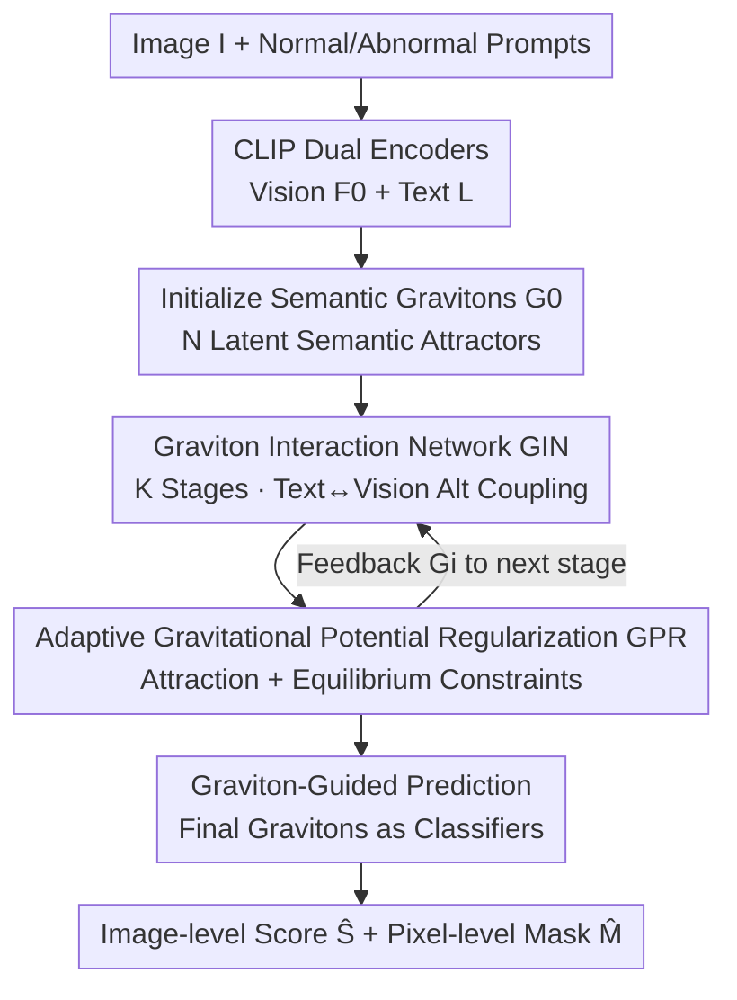

# From Attraction to Equilibrium: Physics-Inspired Semantic Gravitons for Zero-Shot Anomaly Detection

**Conference**: CVPR 2026  
**Paper**: [CVF Open Access](https://openaccess.thecvf.com/content/CVPR2026/html/Pan_From_Attraction_to_Equilibrium_Physics-Inspired_Semantic_Gravitons_for_Zero_Shot_Anomaly_CVPR_2026_paper.html)  
**Code**: None  
**Area**: Multi-modal VLM / Zero-Shot Anomaly Detection  
**Keywords**: Zero-Shot Anomaly Detection, CLIP, Physics-inspired, Potential Field Alignment, Semantic Gravitons  

## TL;DR
SGNet remodels CLIP's vision-text cross-modal alignment as a physical process of "energy potential field reaching equilibrium." It introduces a set of learnable "semantic gravitons" as dynamic intermediaries between vision and text, pulling the two modalities to stable localized semantic equilibrium points through attraction and equilibrium forces, achieving SOTA in zero-shot anomaly detection across 10 industrial/medical benchmarks.

## Background & Motivation
**Background**: Zero-shot anomaly detection (ZSAD) requires identifying and localizing regions that "deviate from normal patterns" without any supervision from defective samples. This is critical for open-world scenarios such as industrial inspection, medical imaging, and autonomous driving. In recent years, the mainstream approach has been leveraging vision-language models like CLIP, using "normal / abnormal" text prompts to match image features (e.g., AnomalyCLIP, WinCLIP, VCP-CLIP, FE-CLIP).

**Limitations of Prior Work**: These methods are essentially **late-stage fusion**. They either use global image-text matching or rely on implicit attention/heuristic prompt concatenation, resulting in a **loose coupling** of vision and text features. Since the CLIP pre-training objective is "global matching" rather than "spatial reasoning," such weakly structured cross-modal interactions are fragile under domain shifts and complex textures, manifesting as unstable image-level discrimination and coarse pixel-level localization.

**Key Challenge**: Anomaly detection demands **fine-grained and stable** vision-text correspondences. However, existing fusion methods lack structural constraints and provide no mechanism to "organize" and "stabilize" the interaction between the two modalities—features are simply concatenated without constraints on how they should approach each other or avoid dominance by one side.

**Key Insight**: Inspired by the phenomenon of "how particles interact and stabilize in an energy field" in physical systems, the authors reinterpret multi-modal interaction as an **energy balancing process within a latent potential field**. Typical vision and text features act like charged particles that attract and counterbalance each other, eventually falling into a stable low-energy state, much like physical systems spontaneously converge to low-energy equilibria.

**Core Idea**: Use a set of learnable "semantic gravitons" as dynamic intermediaries between vision and text. By employing **attraction and equilibrium forces** as energy constraints, cross-modal alignment is transformed from "static global fusion" into "dynamic equilibrium interaction," thereby obtaining stable and fine-grained semantic correspondences.

## Method

### Overall Architecture
The input to SGNet (Semantic Graviton Network) is an image $I$ and a pair of text prompts (normal prompt, abnormal prompt). It outputs an image-level anomaly score $\hat{S}$ and a pixel-level anomaly mask $\hat{M}$ through a single forward pass.

The pipeline consists of four steps: (1) The CLIP vision encoder encodes the image into multi-layer features $F_0 \in \mathbb{R}^{C_v^0 \times H_0 \times W_0}$, and the text encoder encodes the two prompts into $L=\{L_{nor}, L_{abn}\} \in \mathbb{R}^{2\times C_l}$; (2) Initialize $N$ learnable semantic gravitons $G_0 \in \mathbb{R}^{N\times C_l}$, serving as latent semantic attractors bridging the "normal/abnormal text poles" and "visual evidence"; (3) Pass through $K$ stages of the **Graviton Interaction Network (GIN)**, where each graviton alternately absorbs text semantic cues and visual patterns to progressively form an equilibrium semantic potential field capable of representing both normality and deviation, while **Adaptive Gravitational Potential Regularization (GPR)** constrains the evolution of this field via attraction and equilibrium forces; (4) The gravitons from the final stage serve as "adaptive classifiers." Coupled with fused features $X$ from hierarchical decoding, the **graviton-guided prediction head** generates the anomaly mask and score.

Overall, the learned graviton field exerts energy-based modulation on visual embeddings, forming stable alignments between "normal/abnormal semantics" and "local image regions."

### Key Designs

**1. Semantic Gravitons: Structural Bridging via Learnable Intermediaries**

This addresses the pain point of "loose fusion without structural constraints." Instead of direct global coupling between vision and text, $N$ learnable tokens $G \in \mathbb{R}^{N\times C_l}$ are introduced. Each graviton is treated as a **potential well**: it adaptively absorbs a specific category of linguistic cues and aligns them with corresponding visual features, forming **localized semantic equilibrium points**. Intuitively, rather than mixing features indiscriminately, "intermediary particles" are established, each specialized in a semantic subspace (e.g., a specific defect pattern or a type of normal texture), breaking down fuzzy global alignment into structured, interpretable local alignments. Ablations show $N=20$ is optimal; too few make the potential field too coarse, while too many lead to redundant roles and diluted attention.

**2. Graviton Interaction Network (GIN): Iterative Refinement via Alternate Coupling**

This is the core component for achieving stable and fine-grained cross-modal correspondence. In stage $i$, gravitons first interact with text to obtain semantic priors: linguistic activation is calculated via cross-attention $\text{Att}^L_i = \frac{\text{Proj}_g(G_i)\,[\text{Proj}_l(L)]^\top}{\sqrt{C_l}}$, followed by $G^L_i = \text{Norm}\big(G_{i-1} + \text{Softmax}(\text{Att}^L_i)\,\text{Proj}_l(L)\big)$. To avoid "excessive linguistic bias," a lightweight **text-to-graviton gate** is applied:

$$G^{cross}_i = \text{Linear}\big(\gamma(G^L_i)\odot G^L_i + G_{i-1}\big)$$

where $\gamma(\cdot)$ is a two-layer MLP with ReLU+Tanh, dynamically rescaling the "semantic energy" injected from text. Subsequently, gravitons interact with **fused visual features $F_{i-1}$ from the previous stage** via bidirectional attention, calculating visual attention $\text{Att}^V_i = \frac{\text{Proj}_g(G^{cross}_i)\,\text{Flatten}(\text{Proj}_v(F_{i-1}))}{\sqrt{C_v^{i-1}}}$. Both gravitons $G^V_i$ and visual features $F_i$ are updated simultaneously (visual features are modulated by gravitons after restoring spatial structure via $\text{Unflatten}$). Finally, the next-stage gravitons inherit multi-modal knowledge: $G_i = \text{Norm}(G^{cross}_i + \text{Proj}(G^V_i))$. This **feedback propagation** allows higher layers to operate at increasingly stable semantic equilibrium points.

**3. Adaptive Gravitational Potential Regularization (GPR): Forces for Self-Organizing Topography**

Interaction alone is insufficient; the authors apply physics-inspired energy constraints to stabilize convergence. Each graviton $g_n$'s "responsibility" for the two modalities is determined by attention weights: $a_{v,n}=\frac{\exp(\text{sim}(f_v,g_n)/\tau)}{\sum_m \exp(\text{sim}(f_v,g_m)/\tau)}$ (similarly for $a_{t,n}$), ensuring only semantically aligned gravitons exert attraction.

The **Attraction Force** defines modality-specific energy distributions $p^{(n)}_v = \text{Softmax}(-\|f_v-g_n\|_2^2)$ and $p^{(n)}_t = \text{Softmax}(-\|f_t-g_n\|_2^2)$, aligning them via the **2-Wasserstein distance**:

$$L_{att} = \frac{1}{N}\sum_{n=1}^{N}(a_{v,n}+a_{t,n})\,W_2\big(p^{(n)}_v, p^{(n)}_t\big)$$

This encourages vision and text to form **isomorphic potential wells** around each graviton—aligning not just the position, but the shape and curvature of the semantic field. The **Equilibrium Force** constrains energy magnitude imbalances:

$$L_{equ} = \frac{1}{N}\sum_{n=1}^{N}(a_{v,n}+a_{t,n})\,\big|\|f_v-g_n\|_2^2 - \|f_t-g_n\|_2^2\big|$$

This prevents a single modality from dominating the shared potential space. The final regularization is $L_{grav} = \lambda_{att}L_{att} + (1-\lambda_{att})L_{equ}$.

**4. Graviton-guided Prediction: Complementary Classifiers**

After hierarchical decoding produces feature map $X$, rather than aggregating gravitons into a single vector, each final-stage graviton $g_n$ acts as an independent classifier. A channel scoring vector $w_n = \text{MLP}(g_n)$ is computed, and the anomaly response for that graviton is $\hat{M}_n = w_n X^\top$. The final mask is the average response $\hat{M} = \frac{1}{N}\sum_n \hat{M}_n$ followed by a sigmoid. This allows different gravitons to focus on complementary semantic cues while maintaining a coherent mask.

### Loss & Training
The total loss is $L_{total} = L_{seg} + L_{cls} + \lambda_{grav}L_{grav}$. Specifically, $L_{cls}$ is binary cross-entropy, $L_{seg}$ combines focal and dice loss for boundary precision, and $L_{grav}$ is the potential regularization. The backbone is CLIP (ViT-L/14-336), input size 518×518, GIN stages $K=4$, $N=20$, $\lambda_{grav}=0.6$, $\lambda_{att}=0.6$. Optimization uses AdamW (weight decay 0.05) with an initial learning rate of 5e-5 and polynomial decay. ZSAD evaluation follows the **cross-dataset fine-tuning protocol**: fine-tune on MVTec-AD test split and evaluate on other datasets (and vice versa for MVTec-AD using VisA).

## Key Experimental Results

### Main Results
Evaluated on 10 real-world datasets (Industrial: MVTec-AD, VisA, MPDD, BTAD, DAGM, DTD-Synthetic; Medical: CVC-ClinicDB, Kvasir, BrainMRI, Br35H) using AUROC.

Image-level AUROC (Selection):

| Dataset | CLIP | AnomalyCLIP | AdaCLIP | FE-CLIP | SGNet (Ours) |
|---------|------|-------------|---------|---------|--------------|
| MVTec-AD| 74.1 | 91.5        | 89.2    | 91.9    | **93.5**     |
| VisA    | 66.4 | 82.1        | 85.8    | 84.6    | **85.9**     |
| MPDD    | 54.3 | 77.0        | 76.0    | 78.0    | **80.8**     |
| BrainMRI| 73.9 | 90.3        | 94.8    | 94.8    | **96.4**     |

Pixel-level AUROC (Selection):

| Dataset | AnomalyCLIP | VCP-CLIP | AA-CLIP | FE-CLIP | SGNet (Ours) |
|---------|-------------|----------|---------|---------|--------------|
| MPDD    | 96.5        | 96.2     | 96.7    | 97.0    | **97.5**     |
| BTAD    | 94.2        | 94.1     | 97.0    | 95.6    | **97.2**     |
| Kvasir  | 78.9        | -        | 87.2    | 79.8    | **87.6**     |

SGNet achieves SOTA on almost all datasets for both levels, with a particularly pronounced advantage in pixel-level AUROC, indicating the graviton mechanism significantly benefits fine-grained localization.

### Ablation Study
On MVTec-AD and VisA (Image-level / Pixel-level AUROC):

| Configuration | MVTec Img | MVTec Pix | VisA Img | VisA Pix |
|---------------|-----------|-----------|----------|----------|
| Baseline only (w/o GIN/GPR) | 91.1 | 91.8 | 84.2 | 95.1 |
| + GIN interaction | 91.8 | 92.1 | 85.1 | 95.4 |
| + GIN + Attraction | 92.2 | 92.6 | 85.2 | 95.8 |
| + GIN + Equilibrium | 92.7 | 92.5 | 85.7 | 95.6 |
| Full (GIN + GPR) | **93.5** | **92.8** | **85.9** | **95.9** |

### Key Findings
- **GIN is the primary performance driver**: Converting "static global fusion" to "dynamic equilibrium interaction" improved MVTec image-level AUROC from 91.1 to 91.8.
- **Complementarity of Forces**: Attraction force benefits pixel-level localization (isomorphic wells $\to$ shape alignment), while equilibrium force benefits image-level stability (preventing modal dominance).
- **Parametric Stability**: The model is robust to $\lambda_{grav}$ and $\lambda_{att}$ across a wide range (0.3–0.8), suggesting the physical formulation provides inherent structural stability.

## Highlights & Insights
- **Concrete Physical Metaphor**: The "physical potential" is implemented through mathematical rigor (2-Wasserstein distance for shape alignment, free energy difference for balancing), rather than being just a high-level analogy.
- **Gravitons as Structural Routers**: By introducing $N$ intermediary particles, the model decomposes fuzzy global alignment into structured local alignments, a strategy transferable to other fine-grained VLM tasks like referring expression segmentation.
- **Multi-expert Prediction Head**: Using final gravitons as complementary classifiers naturally encourages the model to capture diverse semantic cues while maintaining mask coherence.

## Limitations & Future Work
- **Dependency on Cross-Dataset Protocols**: While "zero-shot," the method still requires fine-tuning on a separate dataset's test split, which differs from training-free zero-shot settings.
- **Physical Necessity**: It remains to be proven if the physical narrative provides an irreplaceable inductive bias compared to equivalent non-physical alignment constraints.
- **Computational Overhead**: The multi-stage GIN involves additional cross-attention, and inference speed/memory costs were not detailed.

## Related Work & Insights
- **vs AnomalyCLIP**: AnomalyCLIP uses global matching; SGNet uses stage-wise graviton alignment. SGNet's structured local alignment yields significantly better pixel-level accuracy.
- **vs WinCLIP**: WinCLIP relies on patch-level similarity; SGNet uses potential field modulation. SGNet's energy constraints offer better robustness under domain shift.
- **vs VCP-CLIP**: VCP-CLIP injects visual context into text; SGNet uses "gravitons" to bridge both poles symmetrically, prevented from modal bias by the equilibrium force.

## Rating
- Novelty: ⭐⭐⭐⭐ Reconceptualizing alignment as "potential field equilibrium" with gravitons is highly original and well-executed.
- Experimental Thoroughness: ⭐⭐⭐⭐ Extensive benchmarks and ablations; missing computational cost analysis and comparison with training-free baselines.
- Writing Quality: ⭐⭐⭐⭐ Strong physical intuition and clear methodology, though some notations are dense.
- Value: ⭐⭐⭐⭐ High potential for industrial application and transferable methodology for fine-grained VLM tasks.

<!-- RELATED:START -->

- AnomalyCLIP: Object-agnostic Alignment for Zero-shot Anomaly Detection (ICCV 2023)
- WinCLIP: Zero-shot Anomaly Detection via Window-based Language-Image Alignment (CVPR 2023)

<!-- RELATED:END -->

## Related Papers

- [\[CVPR 2026\] MoECLIP: Patch-Specialized Experts for Zero-shot Anomaly Detection](moeclip_patch-specialized_experts_for_zero-shot_anomaly_detection.md)
- [\[CVPR 2026\] FB-CLIP: Fine-Grained Zero-Shot Anomaly Detection with Foreground-Background Disentanglement](fb-clip_fine-grained_zero-shot_anomaly_detection_with_foreground-background_dise.md)
- [\[CVPR 2026\] CoPS: Conditional Prompt Synthesis for Zero-Shot Anomaly Detection](cops_conditional_prompt_synthesis_for_zero-shot_anomaly_detection.md)
- [\[CVPR 2026\] VisualAD: Language-Free Zero-Shot Anomaly Detection via Vision Transformer](visualad_language-free_zero-shot_anomaly_detection_via_vision_transformer.md)
- [\[CVPR 2026\] AnomalyVFM -- Transforming Vision Foundation Models into Zero-Shot Anomaly Detectors](anomalyvfm_--_transforming_vision_foundation_models_into_zero-shot_anomaly_detec.md)

<!-- RELATED:END -->
