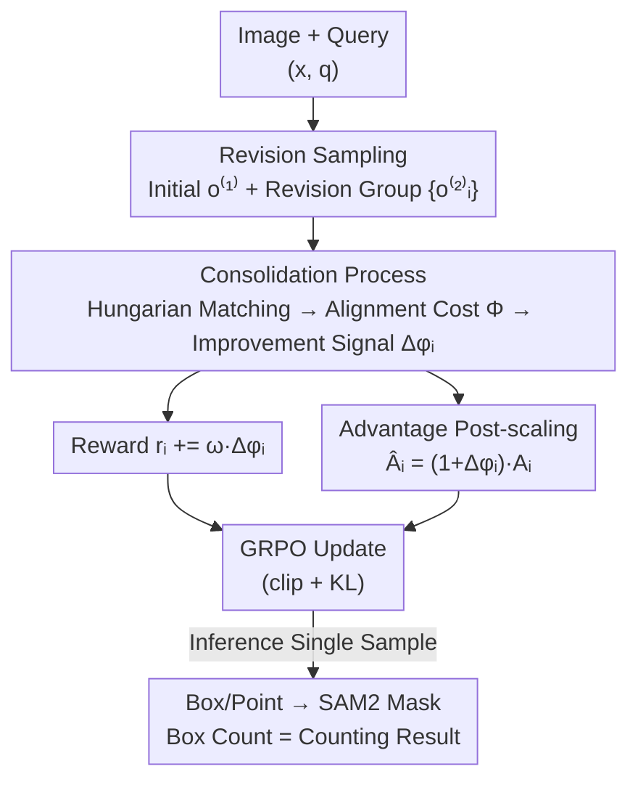

# From Failure to Feedback: Group Revision Unlocks Hard Cases in Object-Level Grounding

**Conference**: CVPR 2026  
**Paper**: [CVF Open Access](https://openaccess.thecvf.com/content/CVPR2026/html/Liu_From_Failure_to_Feedback_Group_Revision_Unlocks_Hard_Cases_in_CVPR_2026_paper.html)  
**Code**: https://github.com/yyliu01/GroupRevision  
**Area**: Multimodal VLM  
**Keywords**: Object-level grounding, GRPO, Reinforcement Fine-Tuning, reward shaping, revision sampling

## TL;DR
Addressing the pain point in GRPO fine-tuning where "hard samples result in zero rewards with no learning signal," this paper proposes the **group-revision** paradigm. It first generates an initial response, then directs the model to produce a group of "revised" responses. By calculating the relative improvement (shaping signal) via Hungarian matching, it weights rewards and scales advantages, consistently outperforming existing GRPO methods in segmentation, REC, and counting tasks.

## Background & Motivation
**Background**: Utilizing Reinforcement Fine-Tuning (RFT) for object-level grounding in Large Vision-Language Models (LVLMs) has become mainstream, exemplified by GRPO. Given an image and a query, the policy samples a group of candidate responses (typically $n=8$), assigning rewards based on correct object localization (e.g., box IoU > 0.5). This avoids performance degradation in base capabilities caused by strong SFT supervision, preserves CoT, remains critic-free, and is memory-efficient.

**Limitations of Prior Work**: GRPO rewards are "response-level" and often "criterion-induced" sparse rewards—evaluating only the final output. In difficult scenarios (referring to similar instances or fine-grained spatial relations), a group of 8 responses may **all fail**, resulting in zero rewards and zero advantages. The policy receives no gradient from these samples, making them **permanently unlearnable**. In the example provided in Fig.1, the best box IoU in a standard GRPO group is only 14.72%.

**Key Challenge**: A natural solution is to adopt Process Reward Models (PRMs) from language reasoning to score intermediate steps. However, this is impractical for object grounding—intermediate reasoning sentences in CoT are difficult to reliably align with specific objects in the image for feedback, leading to a "chicken-and-egg" problem: the model needs better intermediate guidance to earn rewards, but these rewards are the prerequisite for learning such reasoning.

**Key Insight**: The authors observe that **a failure is not necessarily a dead end, but a clue**. Although explicit step-wise feedback is unavailable, failed responses often reveal what the model "missed." By pairing a failed response with a revision prompt like "rethink the bounding box," the model can often re-interpret the scene and "rescue" hard samples that previously failed (in Fig.1, IoU improved from 14.72% to 74.57% after revision).

**Core Idea**: Instead of "sampling a group of answers to solve a problem," the model "samples a group of answers to **revise** a previous failed response." It introduces a **consolidation process** that quantifies the "improvement of the revision relative to the initial attempt" into a dense signal using reward shaping. This refines rewards and scales advantages, enabling the model to not just "retry," but to learn "why this attempt is better than the last."

## Method

### Overall Architecture
The method is built upon Qwen2.5VL-7B + SAM2. It transforms the standard GRPO "sample → reward → update" pipeline into a **three-stage** process: **Sampling Phase** generates an initial response $o^{(1)}$, then conditionally samples a group of $G$ revised responses $\{o^{(2)}_i\}$. **Consolidation Phase** aligns both the initial and revised responses to the ground truth using Hungarian matching, calculates an "alignment cost" potential function $\Phi$, and computes the relative improvement ratio $\Delta\phi_i$. **Optimization Phase** incorporates $\Delta\phi_i$ into the reward $r_i$ and multiplies the GRPO advantage $A_i$ by $(1+\Delta\phi_i)$, followed by standard GRPO updates with clipping and KL divergence. During inference, it reverts to standard single-shot sampling: generating one response, parsing boxes/points, and feeding them to SAM2 for masks.

### Key Designs

**1. Group Revision: Replacing "Answering as a Group" with "Correcting as a Group"**

This directly addresses the pain point of "all-fail zero-reward" hard samples. First, an initial response $o^{(1)} = (t^{(1)}, \hat{b}^{(1)}, \hat{p}^{(1)}) \sim \pi_{\theta_{old}}(\cdot \mid x, q)$ is sampled from the behavioral policy, where $t$ is the text, and $\hat{b}$/$\hat{p}$ are predicted boxes/points. Then, a fixed template $U(q, o^{(1)})$ rewrites the original query into a conversational revision query $q^{(2)}$, including the previous reasoning $t^{(1)}$ and spatial cues $(\hat{b}^{(1)}, \hat{p}^{(1)})$, with the instruction: "re-evaluate whether the previous boxes/points match the target: keep if yes, discard if no." A group of revisions is then sampled:

$$o^{(2)}_i \sim \pi_{\theta_{old}}\!\left(\cdot \mid x, q^{(2)}, o^{(1)}\right), \quad i = 1, \dots, G$$

Each revision serves as an "alternative hypothesis" to resolve ambiguous references. Crucially, unlike standard GRPO where responses are independent, here the group **collaboratively corrects the same failure**. Even if the initial attempt fails, a correct revision allows the sample to cross the success threshold and contribute to training.

**2. Consolidation Process: Quantifying "How Much Improved" into a Learnable Shaping Signal**

Better revisions alone are insufficient—if revisions are evaluated independently of the initial failure, the policy cannot assign credit for "what exactly was corrected." The consolidation process bridges this gap. Inspired by potential-based reward shaping, a potential function $\Phi$ defines an "alignment cost" for each response. Hungarian matching aligns predicted objects $\{(\hat{b}^{(r)}_m, \hat{p}^{(r)}_m)\}$ to ground truths $\{(b_n, p_n)\}$ to form matching sets $A^{(r)}_i$. The cost is the average of matching pairs:

$$\Phi\!\left(s^{(r)}_{shape,i}\right) := \frac{1}{|A^{(r)}_i|} \sum_{(m,n)\in A^{(r)}_i} e^{(r)}_{m,n}$$

The pair-wise cost considers IoU, Box L1, and Point L1:

$$e^{(r)}_{m,n} = \frac{1}{3}\!\left[\left(1 - \text{IoU}(\hat{b}^{(r)}_m, b_n)\right) + f^{L1}(\hat{b}^{(r)}_m, b_n) + f^{L1}(\hat{p}^{(r)}_m, p_n)\right]$$

The improvement signal is defined as the **relative** drop in cost:

$$\Delta\phi_i = \max\!\left(0,\ \frac{\Phi(s^{(1)}_{shape}) - \Phi(s^{(2)}_{shape,i})}{\Phi(s^{(1)}_{shape})}\right)$$

The $\max(0,\cdot)$ ensures only positive improvements are rewarded. The denominator $\Phi(s^{(1)}_{shape})$ acts as a **per-sample reference scale**, allowing $\Delta\phi_i$ to measure the magnitude of improvement relative to the initial performance and preventing signal vanishing when the initial attempt is already near-optimal.

**3. Reward Refinement + Advantage Post-scaling: Increasing the Gradient of Major Improvements**

$\Delta\phi_i$ is used in **two places**. First, it is added to the reward to influence within-group preference:

$$r_i = R_{format}(o^{(2)}_i) + R_{acc}(o^{(2)}_i, y) + \omega\,\Delta\phi_i$$

Second, it scales the advantage. GRPO computes the z-score advantage $A_i = (r_i - \mu)/\sigma$ within the group, which is then scaled:

$$\hat{A}_i = (1 + \Delta\phi_i)\,A_i$$

The reward $r_i$ determines **preference and ranking**, while the post-scaling of the advantage adjusts **gradient magnitude**, amplifying the influence of significant improvements without altering the sign of the objective function.

## Key Experimental Results

### Main Results
Evaluated on Qwen2.5VL-7B using the VeRL + vLLM framework. Single-object grounding on RefCOCOg (9k pairs) and multi-object grounding on VisionReasoner7K (7k samples).

Segmentation and Counting (Tab. 1, comparison with GRPO SOTA):

| Task/Dataset | Metric | Ours | Prev. SOTA | Gain |
|------|------|------|----------|------|
| ReasonSeg (test) | gIoU | 61.11 (single) | Seg-R1 56.7 | +4.4 (+7.78 vs test) |
| RefCOCO/+/g Avg | cIoU | 74.26 (single) | Seg-Zero 72.6 | +1.66 |
| Counting Avg | Acc | 79.97 (multi) | VisionReasoner 75.7 | +4.27 (+5.64%) |
| REC Avg Acc@0.5 | Acc@0.5 | 85.80 (multi) | VisionReasoner 84.8 | +1.0 |

Ours significantly outperforms VisionReasoner on ReasonG (converted from ReasonSeg): val 83.67 / test 81.20 vs. 80.1 / 78.5. The slight underperformance on RefCOCO+ (testB) is attributed to the baseline's tendency to predict redundant boxes, which inflates Acc@0.5 despite lower segmentation quality. Zero-shot VQA performance (Tab. 3) also improved slightly, indicating positive transfer from object-level RL to image-level understanding.

### Ablation Study
(Tab. 4, selection from single-object):

| Configuration | ReasonSeg(val) | RefCOCOg-REC(val) | Pixmo Count(val, multi) | Note |
|------|---------|------|------|------|
| baseline (Vanilla GRPO) | 62.54 | 85.92 | 70.84 | Direct sampling |
| w/ revision | 64.97 | 86.79 | 73.20 | Signal recovery |
| w/ consolidation | 66.99 | 87.64 | 75.89 | Scaling gain |

### Key Findings
- **Both components are effective, with consolidation providing larger gains**: Revision sampling moves ReasonSeg(val) from 62.54 to 64.97; consolidation pushes it to 66.99. The counting task shows the most significant gain (70.84→75.89).
- **Shaping weight $\omega$ has an optimal value**: $\omega=5$ performs best across most metrics.
- **Both box and point signals are essential**: Removing box shaping drops ReasonSeg(val) to 65.32; removing point shaping drops it to 65.90.
- **Advantage post-scaling is effective**: Performance across all indicators is superior with post-scaling enabled, validating its contribution to sample efficiency.

## Highlights & Insights
- **The "Failure → Revision → Quantified Improvement" logic is elegant**: It bypasses the difficulty of step-wise text-to-object alignment by using the "improvement magnitude" as a dense signal calculable via Hungarian matching. This effectively acts as a process reward without requiring manual step-wise annotation.
- **Dual use of $\Delta\phi_i$ in Reward and Advantage**: Separating "ranking preference" from "gradient magnitude" is a clear and reusable RFT trick for emphasizing specific samples within a group.
- **Relative normalization with $\Delta\phi_i$**: Using the initial response's cost as a per-sample reference ensures comparability across different difficulty levels and handles the boundary case where the initial response is already excellent.

## Limitations & Future Work
- The sampling cost during training is at least doubled (sampling the initial response plus a group of revisions). Extra CPU/GPU overhead was not fully discussed in the main text.
- Revision quality depends on the fixed prompt template ("re-evaluate the boxes"); the robustness of this template across different languages or the need for task-specific customization is unexplored.
- The improvement signal relies entirely on ground truth boxes/points (for Hungarian matching), limiting the method to tasks with precise annotations rather than open-world scenarios.

## Related Work & Insights
- **vs GRPO / Seg-Zero / VisionReasoner**: These methods sample independent parallel answers. If the group fails on a hard sample, they receive zero signal. This paper treats the initial response as an "intermediate step" and samples a group for collaborative revision, recovering gradients for hard samples.
- **vs PRM**: While PRMs score every step of reasoning, aligning these steps to image objects is difficult. This paper adopts the "dense feedback" core of reward shaping without tackling the alignment problem directly.
- **vs SFT-based methods (LISA/PixelLM)**: RFT allows the model to retain its base capabilities and CoT reasoning while focusing on difficult grounding cases through tasks rewards and KL regularization.

## Rating
- Novelty: ⭐⭐⭐⭐⭐ The "revision sampling + improvement-as-shaping" is a clean and creative solution to the sparse reward problem in GRPO.
- Experimental Thoroughness: ⭐⭐⭐⭐ Covers segmentation, REC, counting, and VQA with complete ablations, though training overhead analysis is relatively light.
- Writing Quality: ⭐⭐⭐⭐⭐ Motivation is well-articulated (failed-as-clue), and formulas are clearly linked to diagrams.
- Value: ⭐⭐⭐⭐ Directly useful for object-level grounding RFT; the shaping/scaling trick is transferable to other GRPO tasks.

<!-- RELATED:START -->

## Related Papers

- [\[CVPR 2026\] Visual Grounding for Object Questions](visual_grounding_for_object_questions.md)
- [\[CVPR 2026\] Small Object, Great Challenge: A Benchmark for Small Object Visual Grounding](small_object_great_challenge_a_benchmark_for_small_object_visual_grounding.md)
- [\[CVPR 2026\] Enhancing Part-Level Point Grounding for Any Open-Source MLLMs](enhancing_part-level_point_grounding_for_any_open-source_mllms.md)
- [\[CVPR 2026\] Training High-Level Schedulers with Execution-Feedback Reinforcement Learning for Long-Horizon GUI Automation](training_high-level_schedulers_with_execution-feedback_reinforcement_learning_fo.md)
- [\[CVPR 2026\] Interactive Episodic Memory with User Feedback](interactive_episodic_memory_with_user_feedback.md)

<!-- RELATED:END -->
