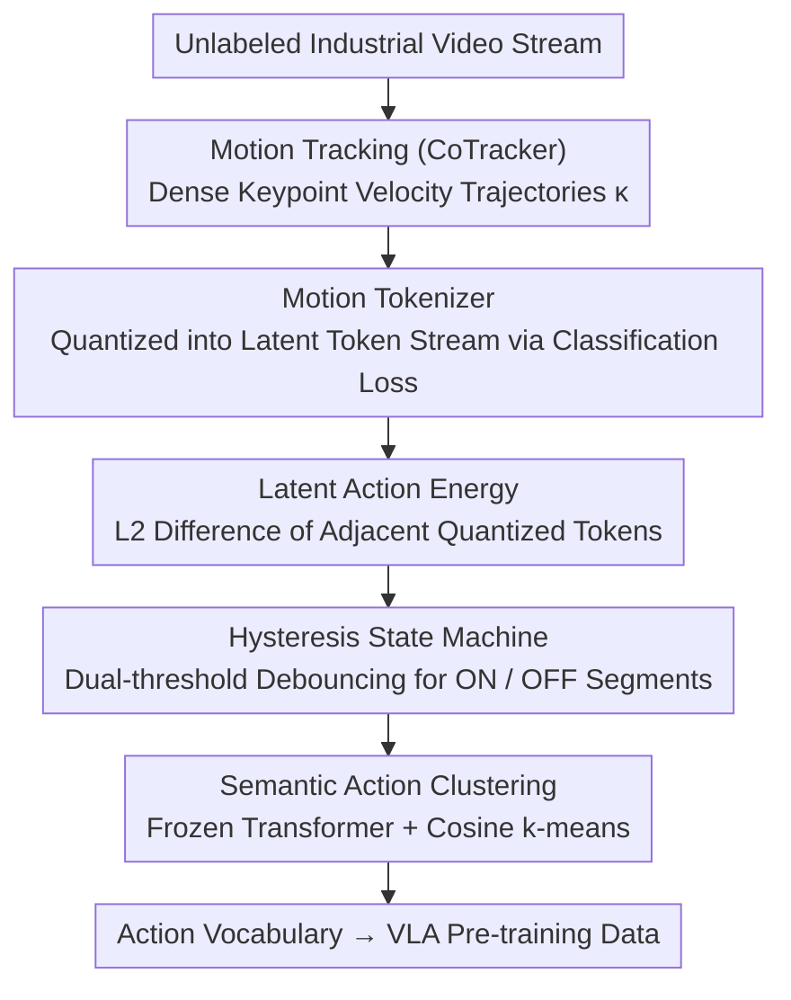

# From Observation to Action: Latent Action-based Primitive Segmentation for VLA Pre-training in Industrial Settings

**Conference**: CVPR 2026  
**arXiv**: [2511.21428](https://arxiv.org/abs/2511.21428)  
**Code**: None (Industrial datasets will be partially released)  
**Area**: Multimodal / VLM  
**Keywords**: VLA Pre-training, Action Segmentation, Latent Action Energy, Unsupervised Learning, Industrial Manufacturing

## TL;DR

Proposes the LAPS (Latent Action-based Primitive Segmentation) pipeline, which uses a defined "Latent Action Energy" metric within a latent action space to discover and segment semantic action primitives from unlabeled industrial video streams without supervision, providing structured data for VLA model pre-training.

## Background & Motivation

**Background**: Vision-Language-Action (VLA) models such as GR00T and AgiBot GO-1 rely on large-scale pre-segmented video data with action annotations for pre-training. However, acquiring such data is extremely expensive and typically requires teleoperation collection.

**Limitations of Prior Work**: (1) Industrial environments contain vast amounts of unlabeled continuous video streams, yet methods to automatically extract structured action data are lacking; (2) existing unsupervised segmentation methods (ABD, OTAS) based on pixel-level or optical flow change detection are sensitive to non-semantic physical movements (e.g., lighting changes).

**Key Challenge**: VLA pre-training requires "pre-segmented + action-labeled" short video clips, but industrial videos are long, unsegmented continuous streams—this data processing bottleneck hinders the large-scale deployment of industrial VLA.

**Goal**: How to automatically discover a finite, countable set of action primitives from continuous industrial video streams?

**Key Insight**: Instead of performing segmentation in pixel/optical flow space, the problem is shifted to the latent action space—training a Motion Tokenizer to encode motion dynamics and defining an energy metric within its latent space to detect semantic action boundaries.

**Core Idea**: Shift from "visual change detection" to "behavioral intent change detection"—Latent Action Energy remains high during action execution and drops when the action is complete, naturally corresponding to semantic boundaries.

## Method

### Overall Architecture

LAPS solves a specific problem: automatically cutting unlabeled continuous industrial video into semantic action segments and labeling each segment with an action category for VLA pre-training. It does not look for "which frame changed" at the pixel or optical flow level; instead, it encodes motion into a latent action space and detects when "behavioral intent changed."

The pipeline runs sequentially in three stages: first, using CoTracker to track dense keypoint trajectories (Motion Tracking); then, passing trajectories into a Motion Tokenizer to produce a latent token stream where Latent Action Energy and a hysteresis state machine detect action boundaries (Action Detection & Segmentation); finally, encoding the segments with a frozen Transformer and using Cosine k-means clustering to discover an action vocabulary unsupervised (Semantic Action Clustering). None of the three stages rely on manual annotations.

### Key Designs

**1. Motion Tokenizer: Encoding Keypoint Motion into Appearance-Robust Latent Dynamics**

The issue lies in "what space to segment in." Pixels and optical flow are highly sensitive to non-semantic changes like lighting, shadows, and camera jitter, which are common on industrial lines. LAPS first trains a Motion Tokenizer $M_\theta$ to encode motion itself: following the AMPLIFY architecture with a Transformer encoder-decoder and Finite Scalar Quantization (FSQ), it takes keypoint velocity $\kappa \in \mathbb{R}^{T \times N \times 2}$ as input and outputs a continuous quantized vector sequence $S_q$ and a discrete code sequence $S_d$. Crucially, it uses a classification loss rather than pixel reconstruction loss—reconstruction forces the model to memorize background textures, whereas classification focuses only on motion patterns, filtering out appearance noise.

**2. Latent Action Energy: Time Differentiation in Latent Space as an Action "ECG"**

With a clean latent token stream, how can one detect when an action is being executed? LAPS defines a scalar signal, Latent Action Energy:

$$E_{action}(t) = \|z_{q,t} - z_{q,t-1}\|_2$$

This represents the L2 difference between quantized latent vectors of adjacent frames. Its physical meaning is straightforward: when an object is static, adjacent tokens are nearly identical, and energy approaches zero; during continuous action, tokens fluctuate, maintaining high energy; when the action ends and returns to stability, energy drops. Thus, the "rise-maintain-fall" of the energy curve naturally corresponds to the start and end of an action primitive. Using the **quantized** space is essential: ablations using raw velocity or pre-quantized latents saw F1 drop from 87.5% to approximately 25%, as only the quantized latent space encodes the abstract "behavioral intent" layer.

**3. Hysteresis State Machine: Dual-threshold Debouncing for Real-time ON/OFF Segmentation**

The energy curve contains noise; a single threshold would cause flickering and false boundaries. LAPS uses a single-channel causal hysteresis state machine: activation (OFF→ON) requires $y_t > \theta_{on}$ for $u$ consecutive frames, and deactivation (ON→OFF) requires $y_t < \theta_{off}$ for $d$ consecutive frames. The gap between thresholds creates a hysteresis band that ignores brief spikes. Instead of manual tuning, $\theta_{on}$ is unsupervisedly self-calibrated by maximizing F1 against pseudo-labels generated using velocity energy as a proxy.

**4. Semantic Action Clustering: Clustering Segments into an Action Vocabulary**

Segmentation is only half the task; VLA pre-training needs to know which segments belong to the same action class. LAPS feeds each segment into a **randomly initialized and fully frozen** Transformer for temporal encoding, followed by Cosine k-means clustering. This approach uses two counter-intuitive choices: first, the encoder is not trained (frozen Transformer ICSS 0.92 vs. mean-pooling 0.84), indicating that explicit temporal modeling is sufficient; second, specific Motion Tokenizer features are used instead of general CLIP features (CLIP ICSS only 0.75). To measure quality without labels, the ICSS metric is designed to use a VLM to judge semantic similarity between segments in the same cluster.

### Mechanism Example: Segmenting a Screw-driving Video

Suppose a worker drives three screws. CoTracker tracks keypoint trajectories on the hand and screwdriver; the Motion Tokenizer encodes these frame-by-frame. During the first screw, $E_{action}$ rises and stays high, exceeding $\theta_{on}$ for $u$ frames → the state machine flips to ON. When the hand stops to pick up the next screw, energy drops below $\theta_{off}$ for $d$ frames → flips to OFF, marking the segment end. Three screws result in three "rise-fall" cycles in energy. These segments, passed through the frozen Transformer and Cosine k-means, cluster together due to highly similar latent dynamics, and "Screw-driving" is automatically identified as an action primitive.

### Loss & Training

The Motion Tokenizer is trained only on unlabeled training video clips. Segmentation thresholds are self-supervisedly calibrated without manual labels. The final clustering uses a **frozen, randomly initialized** Transformer (no training), relying on its temporal encoding capability to ensure cross-domain generalization and avoid overfitting to specific industrial scenes.

## Key Experimental Results

### Main Results: Unsupervised Temporal Action Segmentation

| Method | GTEA F1@5s | GTEA F1@2s | Breakfast F1@5s | Industrial Top F1@2s | Industrial Exo F1@2s |
|------|-----------|-----------|----------------|---------------------|---------------------|
| ABD | 81.92 | 74.23 | 54.50 | 34.08 | 29.86 |
| OTAS | 37.68 | 36.90 | **62.13** | 40.69 | 33.38 |
| Optical Flow | - | - | - | 43.68 | 42.54 |
| **Ours** | 73.12 | 63.20 | 58.82 | **81.27** | **81.93** |

LAPS leads by a significant margin on industrial datasets (approx. 2x improvement in F1@2s) and remains competitive on public benchmarks.

### Ablation Study

| Configuration | F1@2s (%) | Cluster ICSS |
|------|----------|-------------|
| Full Pipeline | **87.5** | **0.92** |
| $E_{action}$ from Pre-Quant. Latents | 25.2 | – |
| $E_{action}$ from Raw Velocities | 24.9 | – |
| w/o Transformer (Mean-pool) | – | 0.84 |
| w/o $M_\theta$ (using CLIP) | 27.2 | 0.75 |

### Key Findings

- Calculating $E_{action}$ in the quantized space is critical (F1 increased from 25% to 87.5% compared to pre-quantization/raw velocity).
- Specialized Motion Tokenizer far outperforms general CLIP features (F1: 87.5% vs 27.2%).
- ICSS semantic consistency score of 0.926 is significantly higher than the random baseline of 0.804.
- Frozen Transformers outperform simple mean-pooling, showing that explicit temporal modeling is vital for action differentiation.

## Highlights & Insights

- **Paradigm Shift**: Shifting from "visual change detection" to "behavioral intent change detection" in the latent space is the core innovation.
- **Industrial Applicability**: Leverages the prior that industrial actions are finite and countable; the pipeline is fully unsupervised and deployment-ready.
- **End-to-end Data Pipeline**: Provides a fully automated workflow from raw video to structured VLA pre-training data.
- The ICSS metric uses VLM semantic similarity to validate clustering quality, addressing the blind spot of geometric metrics like Silhouette.

## Limitations & Future Work

- Currently limited to highly repetitive industrial tasks; generalization to unstructured environments (homes/hospitals) remains to be verified.
- Requires a predefined number of clusters $k$, which depends on domain knowledge.
- Actual effects on downstream VLA pre-training have not yet been validated.
- Motion Tokenizer training requires a certain amount of unlabeled short video snippets.

## Related Work & Insights

- **AMPLIFY**: The architectural foundation of the Motion Tokenizer, originally for policy learning.
- **GR00T / AgiBot GO-1**: Representative VLA pre-training works facing data bottlenecks.
- **ABD / OTAS**: Traditional unsupervised action segmentation baselines.

## Rating

- Novelty: ⭐⭐⭐⭐⭐ Latent Action Energy is a novel metric; latent space segmentation is an innovative paradigm.
- Experimental Thoroughness: ⭐⭐⭐⭐ Comprehensive coverage of public benchmarks, industrial datasets, and VLM semantic validation.
- Writing Quality: ⭐⭐⭐⭐ Clear motivation and detailed pipeline description.
- Value: ⭐⭐⭐⭐ Practical solution for VLA data bottlenecks with strong industrial prospects.

<!-- RELATED:START -->

## Related Papers

- [\[CVPR 2026\] Joint-Aligned Latent Action: Towards Scalable VLA Pretraining in the Wild](joint-aligned_latent_action_towards_scalable_vla_pretraining_in_the_wild.md)
- [\[CVPR 2026\] Condensed Test-Time Adaptation of VLMs for Action Recognition](condensed_test-time_adaptation_of_vlms_for_action_recognition.md)
- [\[CVPR 2026\] MA-Bench: Towards Fine-grained Micro-Action Understanding](ma-bench_towards_fine-grained_micro-action_understanding.md)
- [\[CVPR 2026\] SIMPACT: Simulation-Enabled Action Planning using Vision-Language Models](simpact_simulation-enabled_action_planning_using_vision-language_models.md)
- [\[CVPR 2026\] PowerCLIP: Powerset Alignment for Contrastive Pre-Training](powerclip_powerset_alignment_for_contrastive_pre-training.md)

<!-- RELATED:END -->
