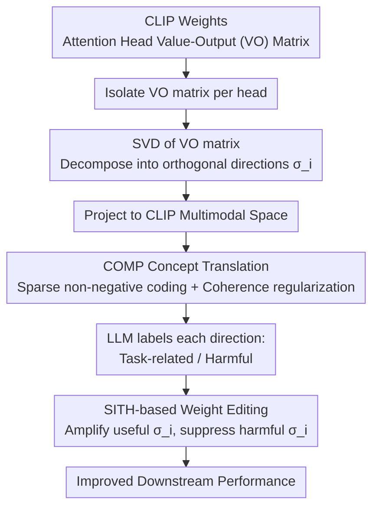

# From Weights to Concepts: Data-Free Interpretability of CLIP via Singular Vector Decomposition

**Conference**: CVPR 2026  
**arXiv**: [2603.24653](https://arxiv.org/abs/2603.24653)  
**Code**: [https://frangente.github.io/SITH](https://frangente.github.io/SITH)  
**Area**: Multimodal VLM / Model Interpretability  
**Keywords**: CLIP interpretability, SVD, attention head analysis, weight space editing, data-free

## TL;DR
This paper proposes SITH (Semantic Inspection of Transformer Heads), a completely data-free and training-free CLIP interpretability framework. By performing SVD on the Value-Output weight matrices of attention heads and utilizing the self-developed COMP algorithm to map singular vectors to sparse combinations of semantically coherent concepts, SITH achieves significantly finer intra-head interpretability compared to existing methods and supports precise weight editing to enhance downstream performance.

## Background & Motivation

1. **Background**: Vision-Language Models (VLMs) like CLIP are widely used across downstream tasks. Mechanistic interpretability seeks to understand how these models internally represent and process concepts. Existing methods fall into two categories: (1) activation-based methods (e.g., Sparse Autoencoders) that rely on dataset activations; (2) TextSpan, which aligns attention head activations with text concepts but provides only coarse, head-level explanations.

2. **Limitations of Prior Work**: (1) Activation-based methods depend on large-scale datasets, making their interpretations susceptible to data bias; (2) SAEs exhibit severe instability, yielding different dictionaries with different training data; (3) TextSpan can only state "this head focuses on color" without distinguishing which sub-structures within the head encode red versus green; (4) No existing method can directly interpret CLIP's internal mechanisms from weights without data.

3. **Key Challenge**: Existing interpretability methods either require data (subject to bias) or provide only coarse explanations (head-level)—there is no framework that is inherently data-free and fine-grained.

4. **Goal**: (1) Can we understand CLIP attention head functions directly from weights without any data? (2) Can this understanding reach the level of individual features within a head? (3) Can we perform precise model editing based on this understanding?

5. **Key Insight**: Based on observations by Elhage et al., attention head computation can be represented as a weighted combination of input patches transformed by the Value-Output (VO) matrix. Analyzing the VO matrix allows one to understand what features a head "can extract and write," completely independent of input data.

6. **Core Idea**: Perform SVD on the VO matrices of CLIP attention heads and use a semantically coherent sparse coding algorithm (COMP) to map each singular vector to a human-understandable combination of concepts, enabling fine-grained, weight-space interpretability without data.

## Method

### Overall Architecture
SITH addresses a core question: Can "what each attention head encodes" be read directly from CLIP weights without looking at images? It relies on the observation that a head's output is the weighted sum of patches transformed by the Value-Output (VO) matrix $\mathbf{W}_{VO}^{l,h} = \mathbf{W}_V^h \mathbf{W}_O^h$. While attention weights determine "routing," the VO matrix determines "content." Since content is embedded in the VO matrix, analysis of this matrix yields data-independent insights. The workflow is: isolate VO matrices per head; perform SVD to identify primary computational directions; project these directions into the CLIP multimodal space; translate directions into concepts via COMP; and finally, guide weight editing by magnifying or suppressing specific directions.

### Key Designs

**1. SVD of the VO Matrix: Decomposing a Head into Independent "Information Channels"**

Methods like TextSpan provide coarse labels like "this head focuses on color," failing to distinguish internal components. SITH performs Singular Value Decomposition $\mathbf{W}_{VO} = \mathbf{U}\mathbf{\Sigma}\mathbf{V}^T$, breaking the linear transformation into orthogonal directions: the right singular vector $\mathbf{v}_i$ is the "write" direction (content written to the residual stream), the left singular vector $\mathbf{u}_i$ is the "read" direction, and the singular value $\sigma_i$ quantifies the importance of that channel. Sorting by $\sigma_i$ decomposes a head into distinct information channels, refining the granularity from the "head" to the "singular vector." This weight-only decomposition avoids data bias and the instability of activation-based SAEs.

**2. COMP (Coherent Orthogonal Matching Pursuit): Accurate and Coherent Concept Interpretation**

To translate a singular vector into human-readable concepts, SITH finds a sparse non-negative coefficient vector $\mathbf{c}$ such that $\hat{\mathbf{v}} \approx \hat{\mathbf{\Gamma}}^T \mathbf{c}$, where $\hat{\mathbf{\Gamma}}$ is a concept embedding matrix. While standard NNOMP greedily selects concepts correlated with the residual, it often produces semantically disjoint sets (e.g., "apple + red"). COMP adds a coherence term to the greedy score:

$$\text{score}(\hat{\gamma}_i) = \langle \mathbf{r}_{k-1}, \hat{\gamma}_i \rangle + \frac{\lambda}{|S_{k-1}|}\sum_{j \in S_{k-1}} \langle \hat{\gamma}_i, \hat{\gamma}_j \rangle$$

The first term measures explanatory power for the residual $\mathbf{r}_{k-1}$, while the second rewards similarity to concepts already in the set $S_{k-1}$, balanced by $\lambda$. This results in coherent interpretations (e.g., "pink red + scarlet reds + red background").

**3. SITH-based Weight Editing: Singular Values as Concept "Volume Knobs"**

With the concepts identified, SITH uses an LLM to judge if a singular vector is task-relevant or harmful. Editing is performed by directly adjusting $\sigma_i$—amplifying useful directions and suppressing harmful ones before reconstructing the VO matrix. This provides "surgical" precision compared to head-level removal in TextSpan, which often eliminates useful features alongside harmful ones.

### Loss & Training
SITH is training-free. COMP is a deterministic iterative process with two hyperparameters: the number of concepts $K$ (default 5) and the coherence coefficient $\lambda$ (default 0.3). The concept pool is derived from ConceptNet 5.5, focusing on the last 4 layers of OpenCLIP ViT-L/14 ($L=24, H=16, r=64$).

## Key Experimental Results

### Main Results—Interpretability vs. Fidelity

COMP achieves the best balance at $\lambda=0.3, K=5$:
- Interpretability (LLM 5-point scale): COMP ≈ 3.8, NNOMP ≈ 3.0, top-k ≈ 4.2
- Reconstruction Fidelity (Cosine Sim): COMP ≈ 0.6, NNOMP ≈ 0.65, top-k ≈ 0.35
- Zero-shot classification accuracy remains steady when replacing original vectors with SITH-reconstructed versions.

### Weight Editing Applications

| Task | Original OpenCLIP | TextSpan Editing | SITH Editing |
|------|-------------|------------|---------|
| Waterbirds (Overall Acc) | 73.5 | 81.8 | **82.7** |
| Waterbirds (Worst-group Acc) | 47.9 | 68.0 | **70.6** |
| Flowers 102 (Zero-shot) | 76.5 | - | **77.5** |
| FGVC-Aircraft (Zero-shot) | 36.6 | - | **36.9** |
| DTD (Zero-shot) | 50.1 | - | **50.9** |

### Ablation Study—NSFW Content Suppression

| Method | Safe Query Retrieval | Unsafe Query Retrieval |
|------|-------------|--------------|
| Safe-CLIP (Training-based) | T→V: 69.2 | T*→V: 46.3 |
| OpenCLIP (Original) | T→V: 75.1 | T*→V: 29.3 |
| **SITH (No Training)** | T→V: **74.5** | T*→V: 29.5 |

SITH suppresses NSFW concepts via weight editing without sacrificing performance on safe queries.

### Key Findings
- Individual singular vectors correspond to understandable semantics (e.g., "pink," "winter wear," "two objects"), validating weight-space analysis.
- Fine-tuning (Full FT or LoRA) primarily reweights existing semantic bases rather than learning entirely new features; the singular vector space is highly stable.
- Weight changes $\Delta \mathbf{W}$ from fine-tuning align with the target task (e.g., "alpine flowers" appearing after Flowers 102 fine-tuning).
- SITH’s surgical editing outperforms TextSpan's head ablation by avoiding collateral damage to useful features within the same head.

## Highlights & Insights
- **Completely Data-Free Interpretability**: Understanding CLIP internally without images avoids data bias and is crucial for model transparency.
- **Clever COMP Algorithm**: Adding semantic coherence to sparse coding improves the human-readability of the resulting concept sets.
- **Interpretability-to-Intervention Loop**: Moving beyond passive observation to active, precise model editing (spurious correlation suppression, NSFW removal) creates a complete pipeline.
- **New Understanding of Fine-tuning**: Fine-tuning effectively re-allocates importance among existing semantic bases, providing insights into mechanisms like LoRA.

## Limitations & Future Work
- Focuses only on the VO matrix (write directions), leaving QK matrices and attention routing patterns for future study.
- FFN layers, which house significant knowledge, were not analyzed.
- Quality remains dependent on the concept pool coverage (e.g., ConceptNet).
- Performance gains from editing are consistent but modest (typically 1-2%).
- Currently verified only on CLIP ViT; applicability to decoder-only VLMs remains a subject for future validation.

## Related Work & Insights
- **vs. TextSpan**: TextSpan requires ImageNet-scale data and provides head-level labels; SITH is data-free and provides fine-grained intra-head labels.
- **vs. Sparse Autoencoders (SAE)**: SAEs require training and are unstable across data batches; SITH is deterministic and provides aggregate model-level explanations.
- **vs. Unimodal Weight Analysis**: Previous SVD analyses were limited to LLMs and used simple nearest-neighbor searches; COMP provides superior semantic coverage.

## Rating
- Novelty: ⭐⭐⭐⭐⭐ (First data-free intra-head interpretability for CLIP)
- Experimental Thoroughness: ⭐⭐⭐⭐⭐ (Interpretability + Editing + Fine-tuning analysis)
- Writing Quality: ⭐⭐⭐⭐⭐ (Clear progression from method to application)
- Value: ⭐⭐⭐⭐ (Important for VLM mechanics, though editing gains are incremental)

<!-- RELATED:START -->

## Related Papers

- [\[CVPR 2026\] Explaining CLIP Zero-shot Predictions Through Concepts](explaining_clip_zero-shot_predictions_through_concepts.md)
- [\[CVPR 2026\] Molmo2: Open Weights and Data for Vision-Language Models with Video Understanding and Grounding](molmo2_open_weights_and_data_for_vision-language_models_with_video_understanding.md)
- [\[CVPR 2026\] Which Concepts to Forget and How to Refuse? Decomposing Concepts for Continual Unlearning in Large Vision-Language Models](which_concepts_to_forget_and_how_to_refuse_decomposing_concepts_for_continual_un.md)
- [\[CVPR 2026\] Synthesizing Visual Concepts as Vision-Language Programs](synthesizing_visual_concepts_as_vision-language_programs.md)
- [\[CVPR 2026\] Information-Theoretic Decomposition for Multimodal Interaction Learning](information-theoretic_decomposition_for_multimodal_interaction_learning.md)

<!-- RELATED:END -->
