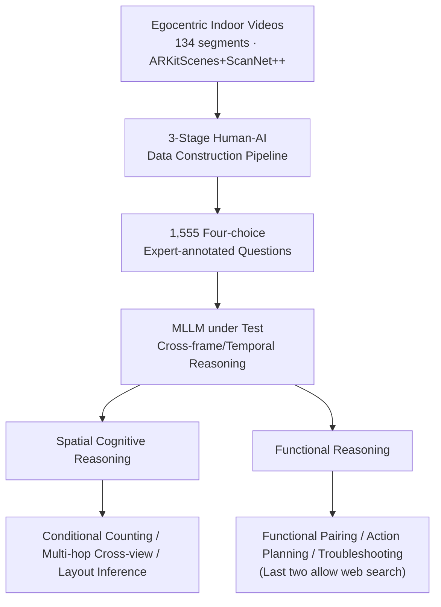

# From Where Things Are to What They Are For: Benchmarking Spatial–Functional Intelligence in Multimodal LLMs

**Conference**: CVPR 2026  
**arXiv**: [2605.02130](https://arxiv.org/abs/2605.02130)  
**Code**: Yes (Project Page SFI-Bench, Apple × Mila × NYU)  
**Area**: Multimodal VLM / Spatial Intelligence / Video Understanding / Benchmark  
**Keywords**: Spatial cognitive maps, functional affordance, egocentric video, cognitive-level evaluation, knowledge-grounded reasoning

## TL;DR
SFI-Bench is proposed—a video benchmark based on 134 egocentric indoor videos and 1,555 expert-annotated four-choice questions. It shifts the evaluation of Multimodal Large Language Models (MLLMs) from "where objects are" (geometric perception) to "what objects are for" (functional cognition). Covering six task categories across spatial cognition and functional reasoning, it reveals that the integration of "spatial memory + functional reasoning + external knowledge" remains a significant bottleneck for current MLLMs.

## Background & Motivation
**Background**: Multimodal Large Language Models (MLLMs) have become the core of Vision-Language-Action (VLA) agents. To evaluate their "spatial intelligence," mainstream benchmarks (e.g., VSI-Bench) primarily revolve around geometric perception—counting objects, determining directions, estimating distances, and comparing sizes.

**Limitations of Prior Work**: These benchmarks restrict tasks to the "perceptual recognition" level, testing only the first tier of the human cognitive development hierarchy. They fail to examine higher-order capabilities: how to synthesize fragmented multi-view observations into a coherent cognitive map, how to infer object affordances, and how to combine visual evidence with external knowledge (manuals, instructions) for grounded reasoning. In other words, existing benchmarks are proficient at asking "where things are" but rarely ask "what things are for, how to use them, or how to fix them."

**Key Challenge**: Humans rely on "cognitive maps" that encode both spatial layouts and functional purposes as an integrated whole. Current evaluations decouple spatial perception from functional cognition, making it impossible to diagnose where models fail along the "spatial memory $\leftrightarrow$ functional reasoning $\leftrightarrow$ knowledge grounding" pipeline.

**Goal**: Construct a diagnostic benchmark capable of systematically examining these two complementary dimensions, restructuring tasks from the "perceptual layer" to the "cognitive layer" to identify the actual shortcomings of contemporary MLLMs.

**Key Insight**: Borrowing the concepts of "cognitive maps" and "affordances" from psychology, the authors decompose spatial intelligence into *Structured Spatial Reasoning* and *Functional Reasoning*. They use real egocentric indoor scanning videos as carriers, as video naturally requires cross-frame integration and simulates the challenge in navigation where "objects do not appear in the same frame simultaneously."

**Core Idea**: Utilize a video QA benchmark (SFI-Bench) covering the full spectrum "from where to what" to upgrade MLLM evaluation to integrated spatial-functional cognitive assessment.

## Method

### Overall Architecture
SFI-Bench is a benchmark and evaluation protocol rather than a model. Its logic follows a three-stage human-in-the-loop construction pipeline starting from real egocentric indoor scanning videos (ARKitScenes and ScanNet++), producing 1,555 four-choice questions. The MLLM processes the entire video to perform cross-frame temporal reasoning and select answers. Tasks are organized into two cognitive dimensions—spatial and functional reasoning—each with three categories. The latter two functional tasks allow (or require) web search for external knowledge. Accuracy (random baseline is 25%) is used to diagnose capabilities in perception, memory, reasoning, and knowledge integration.

### Key Designs

**1. Dual-dimension Cognitive Hierarchy: From "Where" to "What"**
Addressing the limitation that existing benchmarks stay at the perceptual layer, SFI-Bench explicitly splits spatial intelligence into two complementary dimensions. The first, *Structured Spatial Reasoning*, requires models to move beyond frame-by-frame recognition to assemble cues from different views and times into a temporally consistent cognitive map. The second, *Functional Reasoning*, requires transitioning from "understanding space" to "understanding function"—inferring object affordances, operational methods, and context-dependent uses. This hierarchy positions "where things are" as a prerequisite for "what they are for," enabling the localization of model failures to specific cognitive levels.

**2. Six Task Categories: Restructuring Perception into Cognitive Challenges**
SFI-Bench redefines common tasks like "counting" and "spatial relations" into cognitive problems requiring synthesis and logic. Spatial tasks include: **Global/Conditional Counting (GCT)**, which transforms counting into set operations (intersection, union, complement) with attribute constraints; **Multi-hop Path Reasoning (MPR)**, requiring the integration of spatial evidence across frames to recover relations never seen in a single frame; and **Layout Inference (LI)**, requiring the synthesis of cues into a global scene layout to reason about occlusion and visibility. Functional tasks include: **Functional Affordance (FA)** for affordance association (e.g., pairing a remote with the correct TV); **Operation Planning (OP)**, involving retrieving manuals and explaining multi-step plans; and **Causal Hypothesis & Troubleshooting (TS)**, combining scene understanding with documents to hypothesize failure modes and grounded solutions.

**3. Three-stage Human-AI Data Pipeline: Ensuring Visual Dependency and Reliability**
To avoid incorrect answers or language-only shortcuts, a three-stage pipeline is used: ① **Automated Generation**: Gemini-2.5-Pro extracts metadata (objects, attributes, relations) from videos, which are cross-validated to create structured descriptions used for template-based QA generation. ② **Human Verification**: Annotators verify questions against videos. For knowledge-grounded tasks, answers are derived from retrieved manuals. ③ **Post-quality Filtering**: Questions are evaluated by GPT-5 and Gemini. Incorrect ones are revised. **Questions that can be answered correctly without the video are removed** to enforce visual dependency.

**4. Knowledge Grounded Tasks and Web Search Protocol**
Action planning and troubleshooting require device-specific, updated knowledge not present in model parameters. An explicit retrieval protocol is designed where models with tool-calling capabilities can search the web (e.g., for user manuals) before answering. This transforms "utility of external knowledge" into a quantifiable variable.

## Key Experimental Results

### Main Results
Various open-source and closed-source MLLMs were evaluated in a zero-shot setting. The table below shows macro-average accuracy (Avg.) and task-specific scores (random baseline 25%):

| Model | Avg. | GCT | MPR | LI | FA | OP | TS |
|------|------|-----|-----|-----|-----|-----|-----|
| Gemini-3.1-Pro (Best Closed) | **73.8** | 59.1 | 83.4 | 86.8 | 73.2 | 67.9 | 72.1 |
| GPT-5.4-High | 72.1 | 58.4 | 82.8 | 81.1 | 76.2 | 65.5 | 68.8 |
| GPT-5 | 69.4 | 58.4 | 83.0 | 81.5 | 75.3 | 60.2 | 58.1 |
| Gemini-2.5 Pro | 67.1 | 54.4 | 80.7 | 83.8 | 65.5 | 60.2 | 58.1 |
| LLaVA-Video-72B (Best Open) | 64.9 | 57.9 | 70.3 | 75.2 | 56.7 | 58.4 | 50.9 |
| Qwen3-VL-235B-Instruct | 60.7 | 52.3 | 66.6 | 78.8 | 55.5 | 53.0 | 58.1 |
| Qwen3-VL-235B-Thinking | 57.9 | 53.8 | 62.4 | 74.0 | 60.9 | 51.3 | 45.3 |

Observations: ① **GCT is the primary bottleneck**—even Gemini-3.1-Pro struggles (59.1) compared to layout tasks (86.8). ② Closed-source models excel at spatial maps but are weaker at functional reasoning. ③ Open-source models lag significantly.

### Ablation Study
**Frame Shuffling (GPT-5, 200 samples)**: Shuffling input frames results in negligible performance drops, suggesting models rely on "aggregating visual evidence" rather than "temporal continuity," building static spatial abstractions rather than time-dependent cognitive maps.

| Shuffle Rate | Overall | Count | Layout | Spatial | Func. |
|------|------|------|------|------|------|
| 0 | 75.5 | 60.0 | 88.0 | 82.0 | 72.0 |
| 100% | 75.0 | 58.0 | 86.0 | 78.0 | 78.0 |

**Visual vs. Caption-only (GPT-5, 200 samples)**: Replacing video with generated text descriptions leads to significant drops in spatial/layout tasks, proving that cognitive map construction requires direct visual grounding.

| Input | Count | Layout | Spatial | Func. |
|------|------|------|------|------|
| Visual | 58.4 | 83.0 | 81.5 | 75.3 |
| Caption-only | 57.2 | 51.6 | 55.4 | 67.6 |

### Key Findings
- **GCT is a universal bottleneck**, exposing MLLM weaknesses in compositional reasoning (attributes + sets + aggregation).
- **Longer reasoning $\neq$ better accuracy**: Analysis of Qwen3-VL shows that for samples correct in standard mode but incorrect in "thinking" mode, chains were 1.12×–1.41× longer; excessive tokens lead to "over-explanation and semantic drift."
- **RLVR yields limited gains**: Reasoning-trained open-source variants show little improvement, indicating poor transfer from visual-math to spatial-functional logic.
- **Web search is a double-edged sword**: It significantly aids strong reasoning models (8% gain for GPT-5) but introduces distracting noise for weaker ones.

## Highlights & Insights
- The **"from where to what" cognitive hierarchy** is highly effective: it organizes tasks developmentally, allowing the benchmark to diagnose which "cognitive tier" a model occupies.
- **Enforcing visual dependency** via filtering is critical for credibility, directly neutralizing the "language prior shortcut" prevalent in VQA benchmarks.
- Quantifying **web search as a variable** reveals that functional reasoning is inherently dependent on external knowledge grounding, a factor often overlooked.
- **Counter-intuitive finding**: The insensitivity to frame order suggests that current video MLLMs do not build "temporally dependent cognitive maps," behaving instead as a "bag of frames."

## Limitations & Future Work
- **Ours**: MLLMs remain weak in spatial memory and integrating functional knowledge. Open-source models fail to transfer reasoning abilities.
- **Affordance Definition**: Functional reasoning currently uses a narrowed definition (object-function mapping) and does not model full psychological affordance.
- **MCQ Format**: Diagnostic multiple-choice questions do not fully represent the open-ended planning required for real-world agents.
- **Future Directions**: Include frame-sequence sensitivity as a training objective, expand web search to multi-hop retrieval, and introduce open-ended action planning tasks.

## Related Work & Insights
- **vs. VSI-Bench**: While VSI-Bench covers geometric perception (tier 1), SFI-Bench adds structured map building, affordance inference, and knowledge grounding.
- **vs. General Video VQA**: Most focus on activity understanding while ignoring spatial layout as a fundamental primitive; SFI-Bench integrates both.
- **vs. Socratic Models**: The caption-only experiment refutes the idea that text descriptions can substitute for vision in building cognitive maps.

## Rating
- Novelty: ⭐⭐⭐⭐⭐ First to push MLLM evaluation to integrated "spatial-functional cognition" with web search integration.
- Experimental Thoroughness: ⭐⭐⭐⭐⭐ Comprehensive analysis across various models, frame shuffling, and failure modes.
- Writing Quality: ⭐⭐⭐⭐⭐ Clear developmental narrative from "where" to "what" with well-defined tasks.
- Value: ⭐⭐⭐⭐⭐ Provides a high-quality diagnostic tool for grounded agents; findings on counting and temporal limits are highly instructive.

<!-- RELATED:START -->

## Related Papers

- [\[CVPR 2026\] Where MLLMs Attend and What They Rely On: Explaining Autoregressive Token Generation](where_mllms_attend_and_what_they_rely_on_explaining_autoregressive_token_generat.md)
- [\[CVPR 2026\] Scaling Spatial Intelligence with Multimodal Foundation Models](scaling_spatial_intelligence_with_multimodal_foundation_models.md)
- [\[CVPR 2026\] SpatialTree: How Spatial Intelligence Branches Out in MLLMs](spatialtree_how_spatial_intelligence_branches_out_in_mllms.md)
- [\[CVPR 2026\] Abstract 3D Perception for Spatial Intelligence in Vision-Language Models](abstract_3d_perception_for_spatial_intelligence_in_vision-language_models.md)
- [\[CVPR 2026\] SpatialScore: Towards Comprehensive Evaluation for Spatial Intelligence](spatialscore_towards_comprehensive_evaluation_for_spatial_intelligence.md)

<!-- RELATED:END -->
