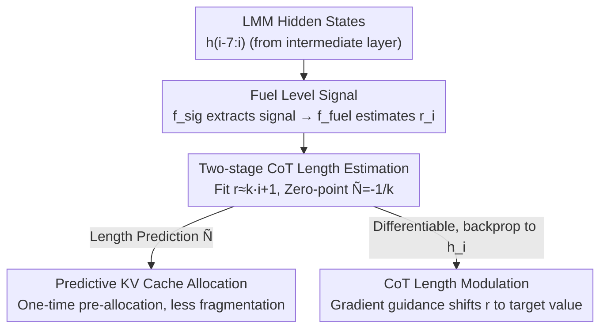

# Fuel Gauge: Estimating Chain-of-Thought Length Ahead of Time in Large Multimodal Models

**Conference**: CVPR 2026  
**Paper**: [CVF Open Access](https://openaccess.thecvf.com/content/CVPR2026/html/Yang_Fuel_Gauge_Estimating_Chain-of-Thought_Length_Ahead_of_Time_in_Large_CVPR_2026_paper.html)  
**Code**: None  
**Area**: Multimodal VLM / LLM Reasoning  
**Keywords**: CoT Length Prediction, Large Multimodal Models, Reasoning Efficiency, KV Cache Allocation, Test-time Regulation

## TL;DR
The authors discover an internal "fuel" signal in reasoning large multimodal models that depletes during Chain-of-Thought (CoT) reasoning. By extracting this signal with a tiny 82k-parameter network and performing linear extrapolation to the "zero-fuel" step, the total CoT length can be predicted before or at the start of inference. This enables predictive KV cache allocation (reducing allocation frequency by up to 13×) and CoT length regulation (linear control of accuracy).

## Background & Motivation
**Background**: Reasoning large multimodal models (reasoning LMMs, such as Qwen3, Qwen3-VL) utilize Chain-of-Thought (CoT) to decompose problems into smaller steps. The CoT segment is wrapped within `<think>...</think>` tags, followed by a concise conclusion. Strong reasoning capabilities stem from these long-thinking segments.

**Limitations of Prior Work**: CoT is both long and unpredictable—a CoT segment can easily reach 28k tokens, while the actual answer might only be 1k. Crucially, due to autoregressive generation, the total CoT length is completely unknown before generation. This "unknown length" causes two issues: (1) Computation side—serving frameworks must repeatedly request small contiguous memory blocks for KV cache as memory is exhausted, causing **memory fragmentation** and OOMs even when total volume is sufficient; (2) Quality side—models lack a global awareness of task difficulty, leading to **over-thinking** or **under-thinking** where CoT length does not match task complexity.

**Key Challenge**: The root cause is that CoT length is unknown beforehand, preventing both pre-allocation of GPU memory and pre-inference intervention to correct reasoning depth. Predicting CoT length in advance would solve both categories of problems.

**Key Insight**: The authors observe an empirical rule (Figure 2)—using accuracy as a proxy for task difficulty, CoT length shows a clear negative correlation with difficulty. This suggests that **CoT length might be predictable solely from the prompt**. Drawing an analogy to the human brain where neural activity consumes ATP and adenosine accumulation inhibits thought (acting as a "fuel gauge"), the authors hypothesize that LMMs also possess an internal "fuel" signal that starts high and monotonically decreases to zero as reasoning progresses.

**Core Idea**: Extract this "fuel level" signal from hidden states, apply linear extrapolation to find the time-step where fuel reaches zero (the predicted CoT length), and apply this prediction to KV cache pre-allocation and CoT length regulation.

## Method

### Overall Architecture
Fuel Gauge models "predicting remaining CoT length" as "predicting when internal fuel will be exhausted." It is built on two hypotheses: **Hypothesis I**—CoT length can be predicted ahead of time by parameters depending only on the input prompt $X_0$; **Hypothesis II**—during the generation of the $i$-th token, there exists a scalar fuel level $r_i$ derived from hidden states $h_{0:i}$, where $r_0=1$, $r_N=0$, and $r_i > r_j$ for any $i < j$ (monotonic decrease).

Why these hypotheses? Theoretically, the expected CoT length is the arrival time of the first termination token $T$:

$$\mathbb{E}[N\mid X_0]=\sum_{n=1}^{\infty}\Big[n\cdot P(T\mid X_{0:(n-1)})\prod_{i=1}^{n}P(\bar T\mid X_{0:i-1})\Big]$$

Where $\bar T$ is a non-termination token and $T$ is the termination token (e.g., `</think>`). Since every term depends on previously generated tokens, **it is impossible to calculate without sampling the entire CoT**. The two hypotheses bypass this sampling: by assuming a monotonic, extrapolatable fuel signal depending only on the problem, "incalculable integration" is replaced by "finding the zero-point of a line."

The process follows two sequential stages: at each generation step, a signal extractor $f_{\text{sig}}$ extracts the fuel signal from the last 8 hidden states, and an estimator $f_{\text{fuel}}$ maps it to the fuel level $r_i$ (Stage 1); the history $r_{0:i}$ is fitted to a line to find the zero-point $\tilde N_i$ where fuel reaches 0 (Stage 2). This prediction is updated during generation and fed to the downstream KV cache allocator and CoT length modulator.

### Key Designs

**1. Fuel Level Signal: Compressing "Reasoning Capacity" into a Monotonic Scalar**

To address unpredictable length, the authors assume hidden states contain a signal reflecting "remaining reasoning energy." They use two extremely small networks to extract it: $f_{\text{sig}}$ (one 1D depth-wise convolution plus one 1D point-wise convolution) and $f_{\text{fuel}}$ (a two-layer MLP), totaling only ~82k parameters. $f_{\text{sig}}$ takes the 8 most recent hidden states $h_{i-7:i}$ from a specific layer (e.g., layer 18 for Qwen3-4B) and outputs a signal vector $S_i$. $f_{\text{fuel}}$ then maps $S_i$ to the fuel level $r_i=f_{\text{fuel}}(S_i)$. Training uses 200 CoT traces (MMLU for text, MMMU for vision-text) to regress the normalized token position $1-\frac{i}{N}$ using smooth L1 loss:

$$\min_{\theta_{\text{sig}},\theta_{\text{fuel}}}\ \mathcal{L}_{\text{SL1}}\Big(f_{\text{fuel}}\big(f_{\text{sig}}(h_{i-7:i};\theta_{\text{sig}});\theta_{\text{fuel}}\big),\ 1-\tfrac{i}{N}\Big)$$

The effectiveness stems from predicting a normalized relative progress (range $[0,1]$) rather than absolute length (high variance, hard to transfer), which reflects the monotonic fuel semantics described in Hypothesis II.

**2. Two-stage Length Estimation: Solving for the "Fuel Zero-Point" via Linear Extrapolation**

Stage 2 fits the extracted fuel sequence $r_{0:i}$ to a line decreasing with step count:

$$r_{0:i}\approx k\cdot[0\ \cdots\ i]^{\mathsf T}+1$$

The slope $k$ is obtained via data fitting, and extrapolation to zero fuel ($\tilde r_{\tilde N_i}=0$) yields the length prediction $\tilde N_i=-1/k$. This two-stage approach is a generalization tool: while a direct regression baseline fails across modalities (e.g., image-text training → video testing), Fuel Gauge successfully generalizes across tasks and modalities by decomposing the task into "step-wise relative fuel estimation + linear zero-point search." Note: The original Equation (2) coefficients ($r\approx k\cdot i+1$ with $\tilde N=-1/k$) imply $k<0$.

**3. Predictive KV Cache Allocator: From Repeated Small Allocations to One-time Pre-allocation**

By estimating the CoT length at the start of generation, the system can estimate total memory requirements and perform a one-time allocation. If the updated prediction exceeds the allocated space, a supplementary allocation is made. Compared to the default HuggingFace strategy (requesting blocks for 16 tokens only when memory is exhausted), Fuel Gauge reduces the number of allocations by up to 13×, significantly reducing fragmentation.

**4. CoT Length Modulation: Tuning the "Gas Pedal" via Classifier Guidance**

Since the fuel signal is differentiable, the authors use normalized gradients to shift the fuel level toward a target $r_{\text{target}}$, similar to steering vectors or classifier guidance in diffusion:

$$h_i:=h_i+\alpha\cdot\frac{\partial J/\partial h_i}{\lVert\partial J/\partial h_i\rVert_2}$$

Where $J = |f_{\text{fuel}}(S_i) - r_{\text{target}}|$. The parameter $\alpha$ is the CoT modulation factor: positive values increase fuel (longer CoT), while negative values decrease it (shorter CoT). This is the first method to use classifier guidance for test-time scaling of reasoning length.

### Loss & Training
Only $f_{\text{sig}}$ and $f_{\text{fuel}}$ are trained (base LMM is frozen) using smooth L1 regression on the normalized position $1-\tfrac{i}{N}$. Training uses only 200 CoT traces. All experiments were conducted on a single NVIDIA A6000.

## Key Experimental Results

The metric used is Relative Mean Absolute Error (rMAE), defined as the sum of absolute errors divided by the sum of ground-truth values:

$$\text{rMAE}=\frac{\sum_{i=1}^{M}\sum_{t=1}^{N_i}|y_{i,t}-\hat y_{i,t}|}{\sum_{i=1}^{M}\sum_{t=1}^{N_i}|\hat y_{i,t}|}$$

### Main Results: CoT Length Prediction (rMAE, Lower is Better)

| Method | GPQA-Diamond (Qwen3-8B) | MathVision-m (Qwen3VL-4B) | LongVideoBench-15 (Qwen3VL-2B) | LongVideoBench-60 (Qwen3VL-4B) |
|------|------|------|------|------|
| Mean | 0.5003 | 0.7982 | 3.159 | 4.887 |
| Median | 0.5212 | 0.8931 | 3.557 | 5.410 |
| Direct (Same Architecture/Data) | 0.5795 | 0.4965 | 9.833 | 5.877 |
| **Fuel Gauge** | **0.2732** | **0.3139** | **0.4834** | **0.4645** |

rMAE on GPQA-Diamond is less than half of the Direct baseline. On OOD video tasks, while other baselines fail (rMAE 3-10), Fuel Gauge maintains stable performance (0.46-0.50).

### Fuel Level Estimation Accuracy (rMAE, Lower is Better)

| Method | GPQA-Diamond (Qwen3-8B) | MathVision-m (Qwen3VL-2B) |
|------|------|------|
| Mean | 0.2501 | 0.3399 |
| Median | 0.2743 | 0.4620 |
| EoC Prob (End-of-CoT Prob) | 0.4999 | 0.4999 |
| **Fuel Gauge** | **0.1322** | **0.1186** |

EoC Prob remains near 0.4999 because termination token probability is near zero until the final step, failing to reflect progress. Fuel Gauge reduces error by more than half, supporting Hypothesis II.

### Main Results: Predictive KV Cache Allocation (#Allocs, Lower is Better)

| Method | GPQA-Diamond (Qwen3-4B) | MathVision-m (Qwen3VL-2B) | LongVideoBench-60 (Qwen3VL-4B) |
|------|------|------|------|
| HF Default | 491.0 | 682.6 | 43.62 |
| **Fuel Gauge** | **49.24** | **69.43** | **27.81** |
| Reduction | 9.97× | 9.83× | 1.57× |

Reductions reach up to 13.37× in long CoT scenarios.

### Key Findings
- **Two-stage decomposition is key to generalization**: While the Direct baseline fails across modalities, the "relative fuel + linear zero-point" approach remains robust.
- **CoT length can be linearly regulated by a single factor**: The factor $\alpha$ correlates linearly with CoT length and accuracy (Pearson > 0.95 in OOD video tasks).
- **Minimal overhead**: The 82k parameters represent negligible cost compared to the base model.

## Highlights & Insights
- **Turning incalculable integrals into extrapolatable lines**: The analogy of "fuel" bypasses the need for future token sampling to estimate length.
- **Predicting relative progress over absolute length**: Regression on $1-i/N$ normalizes away high-variance, task-dependent absolute lengths, allowing tiny networks to generalize across modalities.
- **A single predictor for dual system-level benefits**: The same signal addresses both memory fragmentation (systems side) and reasoning depth (quality side).

## Limitations & Future Work
- **Boundary of the linear assumption**: The framework assumes linear fuel depletion. Cases where models exhibit non-monotonic reasoning (e.g., heavy backtracking) might violate this.
- **Empirical layer/window selection**: Optimal layers and window sizes (e.g., layer 18, window 8) were determined empirically for Qwen3-4B.
- **Quality-cost trade-off calibration**: While accuracy scales linearly with length modulation, the "sweet spot" for deployment needs per-task calibration.
- **Data diversity**: Demonstrated generalization with 200 traces, but performance on vastly different domains like complex code or long mathematical proofs remains to be verified.

## Related Work & Insights
- **vs. Static Priors (Mean/Median)**: Static priors ignore task difficulty; Fuel Gauge updates predictions during generation based on per-problem fuel readings.
- **vs. End-of-CoT Probability**: Termination probabilities are too sparse (near zero most of the time); Fuel Gauge extracts a continuous, monotonic latent signal.
- **vs. Classifier Guidance**: Borrowing from diffusion, this is the first application of classifier guidance for test-time scaling by utilizing a reliable length predictor as the guidance signal.

## Rating
- Novelty: ⭐⭐⭐⭐⭐ First "pre-inference CoT length" framework with a highly intuitive "fuel" analogy.
- Experimental Thoroughness: ⭐⭐⭐⭐ Coverage of text/image/video across multiple models, though some overhead analysis is relegated to the appendix.
- Writing Quality: ⭐⭐⭐⭐⭐ Clear logic from hypothesis to verification with strong analogies.
- Value: ⭐⭐⭐⭐⭐ Addresses real-world system OOMs and reasoning quality with negligible overhead.

<!-- RELATED:START -->

## Related Papers

- [\[CVPR 2026\] UniT: Unified Multimodal Chain-of-Thought Test-time Scaling](unit_unified_multimodal_chain-of-thought_test-time_scaling.md)
- [\[CVPR 2026\] Chain-of-Thought Guided Multi-Modal Object Re-Identification](chain-of-thought_guided_multi-modal_object_re-identification.md)
- [\[CVPR 2026\] When Visualizing is the First Step to Reasoning: MIRA, a Benchmark for Visual Chain-of-Thought](when_visualizing_is_the_first_step_to_reasoning_mira_a_benchmark_for_visual_chai.md)
- [\[CVPR 2026\] ReaGEN: Adaptive Generation of Structured Chains-of-Thought for Efficient Multimodal Reasoning](reagen_adaptive_generation_of_structured_chains-of-thought_for_efficient_multimo.md)
- [\[CVPR 2026\] EmoThinker: Advancing Visual-Acoustic Emotion Analysis via Structural Token Selection and Chain-of-Thought Reasoning](emothinker_advancing_visual-acoustic_emotion_analysis_via_structural_token_selec.md)

<!-- RELATED:END -->
