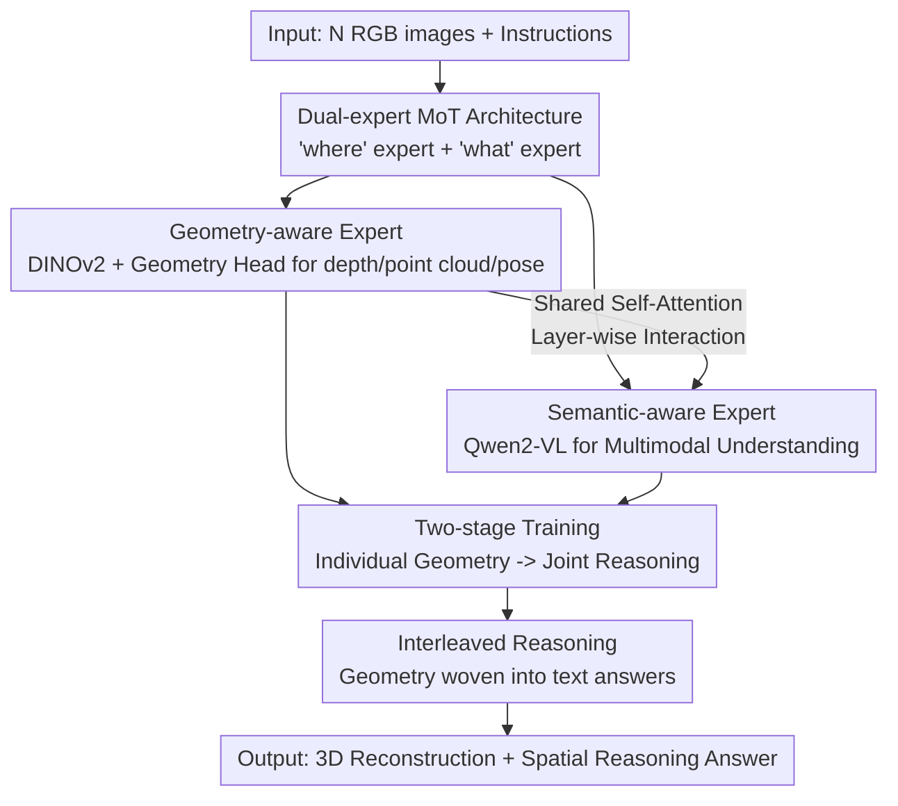

# G$^2$VLM: Geometry Grounded Vision Language Model with Unified 3D Reconstruction and Spatial Reasoning

**Conference**: CVPR 2026  
**Paper**: [CVF Open Access](https://openaccess.thecvf.com/content/CVPR2026/html/Hu_G2VLM_Geometry_Grounded_Vision_Language_Model_with_Unified_3D_Reconstruction_CVPR_2026_paper.html)  
**Code**: Available (Project page + GitHub links in the CVF paper; ⚠️ refers to the original text for specific addresses)  
**Area**: Multimodal VLM / 3D Vision  
**Keywords**: Geometry-grounded VLM, Unified 3D Reconstruction, Spatial Reasoning, Mixture-of-Transformer-Experts, Interleaved Reasoning  

## TL;DR
G2VLM utilizes a "Mixture-of-Transformer-Experts (MoT)" architecture to integrate a feedforward 3D reconstruction expert and a semantic understanding expert within the same VLM. Relying on shared self-attention for mutual reinforcement, this 2B model can directly predict depth, point clouds, and camera poses like VGGT, while outperforming GPT-4o on spatial reasoning tasks (scoring 18.5 points higher on SPAR-Bench).

## Background & Motivation
**Background**: Current VLMs serve as powerful foundation models for many multimodal tasks but generally fail in "spatial intelligence"—spatial understanding and reasoning tasks that require "lifting" 2D observations into 3D representations. Mainstream spatial VLMs (SpatialVLM, SpaceQwen, etc.) follow standard VLM designs, treating multiple images or video frames as "flattened" 2D token sequences, training via next-token prediction, and fine-tuning on manually constructed spatial datasets.

**Limitations of Prior Work**: This approach lacks a critical component—**explicit visual geometry learning**. Models never truly learn how to reconstruct a coherent 3D space from 2D images; so-called spatial understanding is merely implicit linguistic or 2D priors gained from massive datasets. Another line of work (VLM-3R, Spatial-MLLM) recognizes this and uses a **frozen geometry encoder (e.g., VGGT)** as additional features for the VLM. However, the geometry and semantic modules are "stitched" rather than "symbiotic," leading to unnatural alignment and an inability for geometric capabilities to benefit from the scale of semantic task data.

**Key Challenge**: 3D reconstruction models (DUSt3R/VGGT/π³ lineage) have high geometric precision but lack semantic understanding; semantically strong VLMs lack geometry. These two domains operate independently, and combining them faces a scaling issue: pure geometry learning relies on **hard-to-collect 3D labels** (depth maps, camera poses) and cannot scale like 2D image-text pairs.

**Goal**: To possess both spatial 3D reconstruction and spatial understanding capabilities within the **same** VLM, ensuring that improvements in geometric capability translate directly into improvements in spatial reasoning.

**Key Insight**: The authors leverage the "dual-stream hypothesis" of human cognition—the ventral stream ("what") for object recognition (multimodal understanding) and the dorsal stream ("where") for spatial localization (visual geometry learning). These two "pathways" are implemented as two experts that exchange information through shared attention.

**Core Idea**: By using a Mixture-of-Transformer-Experts architecture, the "geometry-aware expert" and "semantic-aware expert" share self-attention for mutual gain. This allows the model to **learn 3D geometry from pure 2D images** and feed the learned geometric features into spatial reasoning via in-context learning and interleaved reasoning, bypassing the scaling bottleneck of 3D annotations.

## Method

### Overall Architecture
The input to G2VLM is a sequence of $N$ RGB images $(I_i)_{i=1}^N$, where $I_i \in \mathbb{R}^{3\times H\times W}$. The model is a **dual-expert MoT**: two Transformer experts have independent QKV projections and FFNs, but **all tokens perform shared multimodal self-attention in every Transformer block**—this is where the two pathways "see each other."

- **Geometry-aware expert ("where" pathway)**: Preceded by a DINOv2 encoder to inject low-level visual information, it generates 3D-aware latent states $h_i \in \mathbb{R}^{C\times d}$ via global attention. A lightweight 3D geometry head then decodes geometric attributes such as camera poses and point clouds.
- **Semantic-aware expert ("what" pathway)**: Reuses a pre-trained VLM (Qwen2-VL-2B), retaining its Qwen2 vision encoder (supporting native dynamic resolution) and multimodal rotary positional embedding (M-RoPE). It handles multimodal understanding and spatial reasoning, producing interleaved text/geometry reasoning.

Training occurs in two stages: first, the semantic expert is frozen while the geometry expert is trained from scratch; then, the semantic expert is unfrozen for joint training on spatial understanding data to learn how to consume geometric features. During inference for spatial reasoning, the model can first predict 3D geometry (depth/pose/point cloud) and use **interleaved reasoning** to weave the geometric results into the textual answer.

### Key Designs

**1. Dual-expert MoT + Shared Self-Attention: Layer-wise interaction between "where" and "what" pathways**

Addressing the "unnatural alignment" of stitched modules, G2VLM integrates the geometry and semantic experts as equal peers in an MoT. While each expert maintains its own QKV matrices and FFN (preserving inductive biases), **all tokens share multimodal self-attention within each block**. This allows geometric and semantic tokens to read from each other at every layer—geometric features assist semantic experts in spatial reasoning, and semantic context informs geometric tokens. The authors distinguish this from MoT models like Bagel (understanding + generation): since these experts perform vastly different tasks, they require independent architecture details, pre-training objectives, and joint training strategies. Ablations (Table 2) confirm this "symbiosis" provides mutual benefits—stronger geometric performance leads to better spatial reasoning.

**2. Geometry-aware Expert + Geometry Head: Feedforward 3D prediction from pure 2D inputs**

To bypass the reliance on 3D labels, the geometry expert uses a DINOv2 encoder (self-supervised, strong in low-level vision) to map images to LLM latent states $h_i$. These are passed to a **lightweight Transformer decoder geometry head**, comprising a local point head, a camera head, and a global point head for training stability. The geometry head maps latent states to 3D attributes:

$$f\big((h_i)_{i=1}^N\big) = (T_i, X_i)_{i=1}^N$$

Where $T_i \in SE(3) \subset \mathbb{R}^{4\times4}$ represents camera poses and $X_i \in \mathbb{R}^{H\times W\times 3}$ represents pixel-aligned point maps in the camera coordinate system. While following the feedforward logic of VGGT/π³, the authors simplify the design for LLM compatibility: removing register tokens, using only global attention, and removing VGGT-style camera tokens to maintain permutation-equivariance (following π³). This sacrifice in camera pose accuracy facilitates scaling with in-the-wild multi-view images and videos.

**3. Visual Geometry (VG) Loss: Joint supervision of points, camera, and normals**

In the first stage, the geometry expert is trained from scratch with a weighted sum of three losses:

$$\mathcal{L}_{VG} = \mathcal{L}_{points} + \lambda_{cam}\mathcal{L}_{cam} + \lambda_{normal}\mathcal{L}_{normal}$$

The point cloud reconstruction loss uses an optimal scale factor $s^*$ and L1 error, normalized by GT depth $z_{i,j}$: $\mathcal{L}_{points} = \frac{1}{3NHW}\sum_i\sum_j \frac{1}{z_{i,j}}\lVert s^*\hat{x}_{i,j} - x_{i,j}\rVert_1$, with $s^*$ solved via the ROE solver from MoGe. Camera loss averages over all ordered view pairs $(i\neq j)$, using geodesic distance for rotation $\mathcal{L}_{rot}(i,j)=\arccos\!\big(\frac{\mathrm{Tr}((R_{i\leftarrow j})^\top \hat{R}_{i\leftarrow j})-1}{2}\big)$ and Huber loss for translation. Normal loss encourages local surface smoothness: $\mathcal{L}_{normal}=\sum_i\sum_j \arccos(\hat{n}_{i,j}\cdot n_{i,j})$.

**4. Spatial Reasoning Joint Training: CE-Only as an optimal tradeoff**

In the second stage, the semantic expert learns to use geometric features via cross-entropy (CE) loss. The authors compared three strategies for the geometry expert: ① **CE-Only**: Freeze the geometry expert, update only the semantic expert (forces in-context learning, preserves geometry); ② **CE+CE**: Fine-tune the geometry expert with CE loss; ③ **VG+CE**: Geometry expert uses both CE and VG losses. Experiments (Figure 4) showed VG+CE yields the best dual performance but is **difficult to scale** due to 3D label requirements. Consequently, the main model follows **CE-Only** to preserve geometric performance while scaling reasoning with large-scale video data. The CE+CE variant, optimized specifically for spatial reasoning, is denoted as **G2VLM-SR**.

## Key Experimental Results

### Main Results

In visual geometry tasks, the 2B G2VLM is competitive with SOTA feedforward models like VGGT and π³, outperforming VGGT in monocular depth (Abs Rel):

| Task / Dataset·Metric | Fast3R | CUT3R | VGGT | π³ | G2VLM (Ours) |
|--------|--------|-------|------|----|-------------|
| Depth Sintel Abs Rel↓ | 0.544 | 0.418 | 0.335 | **0.277** | 0.297 |
| Depth NYU-v2 Abs Rel↓ | 0.093 | 0.081 | 0.056 | 0.054 | 0.062 |
| Point Map ETH3D Acc.↓ | 0.832 | 0.617 | 0.28 | **0.194** | 0.414 |
| Point Map ETH3D Comp.↓ | 0.978 | 0.747 | 0.305 | 0.210 | 0.309 |
| Camera Co3Dv2 AUC@30↑ | 73.43 | 75.82 | **88.59** | 88.41 | 74.81 |

G2VLM achieves SOTA-level depth and point cloud completeness. Camera pose is weaker due to the removal of camera tokens, which the authors emphasize was a trade-off for scalability without camera priors.

In spatial reasoning, G2VLM-SR (2B) achieves the best results among open-source models and outperforms much larger proprietary models:

| Model | Size | SPAR-Bench Avg.↑ | MindCube↑ | OmniSpatial Avg.↑ |
|------|------|------|------|------|
| GPT-4o | - | 36.39 | 38.81 | 46.16 |
| Qwen2.5-VL-72B | 72B | 39.40 | 37.25 | 43.03 |
| VLM3R-7B | 7B | 43.21 | 42.09 | 44.21 |
| Qwen2-VL-2B (Base) | 2B | 24.60 | 37.83 | 41.18 |
| **G2VLM-SR-2B (Ours)** | 2B | **54.87** | **48.33** | **49.20** |

G2VLM-SR outperforms GPT-4o by **18.48 points** on SPAR-Bench. It only trails 72B models on OST-Bench (spatio-temporal), which the authors attribute to the larger models' advantage in internalizing massive factual knowledge.

### Ablation Study

| Configuration | SPAR-Bench Avg.↑ | Description |
|------|------|------|
| Qwen2-VL-2B (Base) | 24.60 | No geometry learned |
| Qwen2-VL-2B (Spatial FT only) | 48.93 | No geometry expert, data fine-tuning only |
| G2VLM-SR (Frame-Att. Expert) | 52.34 | Intra-frame attention |
| G2VLM-SR (Mixed-Att. Expert) | 53.64 | Mixed attention |
| **G2VLM-SR (Global-Att., Ours)** | **54.87** | Best geometry → Best reasoning |

### Key Findings
- **Geometry and reasoning are complementary**: The geometry expert performs best under "global attention," which corresponds to the highest spatial reasoning scores (54.87). Precision in geometry directly correlates with reasoning strength.
- **Geometry pre-training is indispensable**: Fine-tuning on spatial data without the geometry expert (48.93) is significantly worse than the full model (54.87), proving the importance of visual geometric representations over pure data scaling.
- **Dual encoders outperform single encoders**: Using DINO (geometry) and CLIP (semantics) together yields the best results. DINO not only aids reconstruction but also significantly boosts spatial understanding.
- **Global attention is best for LLMs**: The interleaved attention used by VGGT/π³ is incompatible with the uniform mask framework of LLMs; global attention proved superior in both training loss and downstream performance.

## Highlights & Insights
- **Dual-Stream Hypothesis as Architecture**: The "where" and "what" experts are more than a gimmick; shared attention allows them to interact layer-wise, upgrading "frozen feature stitching" to "native symbiosis."
- **Scalability via "Pure 2D to 3D"**: By learning from in-the-wild videos, the geometry expert escapes the 3D label bottleneck, piggybacking on the scaling laws of video data.
- **Evidence for Geometry as a Foundation**: The study defines a clear link between low-level vision improvements and high-level reasoning, providing a blueprint for embodied AI and robotic VLMs.
- **2B Outperforming 72B/GPT-4o**: Demonstrates that correct inductive biases (geometry grounding) are more efficient than massive parameter counts for specific intelligence tasks.

## Limitations & Future Work
- **Training Instability**: Scaling the model size remains a challenge due to optimization and data filtering issues.
- **Camera Pose Accuracy**: Removing camera tokens for scalability resulted in lower pose accuracy compared to VGGT, which may impact downstream applications requiring precise localization.
- **Knowledge Gap**: The 2B scale still hits a ceiling on tasks like OST-Bench that require vast internalized world knowledge.
- **Data Scaling Loophole**: The most effective strategy (VG+CE) was sidelined for CE-Only due to 3D label scarcity, suggesting an untapped performance ceiling if massive 3D data becomes available.

## Related Work & Insights
- **vs VLM-3R / Spatial-MLLM**: These use frozen encoders; G2VLM uses **native integration** as equal MoT experts, allowing layer-wise mutual gain.
- **vs VGGT / π³**: These are reconstruction-only and incompatible with LLM masking; G2VLM adopts their feedforward efficiency but adapts to LLM global attention at a slight cost to pose accuracy.
- **vs Bagel**: While both use MoT, Bagel focuses on image generation; G2VLM focuses on the distinct synergy between geometric learning and spatial reasoning.

## Rating
- Novelty: ⭐⭐⭐⭐⭐ First work to unify 3D reconstruction and high-level spatial understanding in a single VLM using a dual-pathway MoT.
- Experimental Thoroughness: ⭐⭐⭐⭐⭐ Comprehensive coverage across geometric and reasoning benchmarks; exhaustive ablations of attention and encoders.
- Writing Quality: ⭐⭐⭐⭐ Clear progression from motivation to architecture; formulas are comprehensive.
- Value: ⭐⭐⭐⭐⭐ Providing a strong 2B baseline that beats GPT-4o offers significant value for spatial intelligence and embodied AI research.

<!-- RELATED:START -->

## Related Papers

- [\[CVPR 2026\] Think with 3D: Geometric Imagination Grounded Spatial Reasoning from Limited Views](think_with_3d_geometric_imagination_grounded_spatial_reasoning_from_limited_view.md)
- [\[CVPR 2026\] SpatialStack: Layered Geometry-Language Fusion for 3D VLM Spatial Reasoning](spatialstack_layered_geometry-language_fusion_for_3d_vlm_spatial_reasoning.md)
- [\[CVPR 2026\] Grounded 3D-Aware Spatial Vision-Language Modeling](grounded_3d-aware_spatial_vision-language_modeling.md)
- [\[CVPR 2026\] Beyond 3D VQAs: Injecting 3D Spatial Priors into Vision-Language Models for Enhanced Geometric Reasoning](beyond_3d_vqas_injecting_3d_spatial_priors_into_vision-language_models_for_enhan.md)
- [\[CVPR 2026\] VLM-3R: Vision-Language Models Augmented with Instruction-Aligned 3D Reconstruction](vlm-3r_vision-language_models_augmented_with_instruction-aligned_3d_reconstructi.md)

<!-- RELATED:END -->
