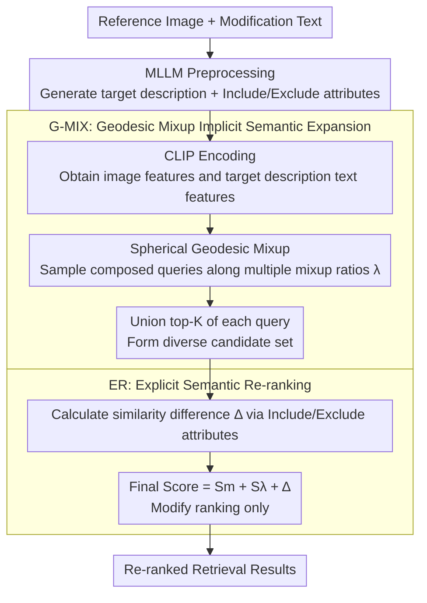

# G-MIXER: Geodesic Mixup-based Implicit Semantic Expansion and Explicit Semantic Re-ranking for Zero-Shot Composed Image Retrieval

**Conference**: CVPR 2026  
**arXiv**: [2604.14710](https://arxiv.org/abs/2604.14710)  
**Code**: [github.com/maya0395/gmixer](https://github.com/maya0395/gmixer)  
**Area**: Multimodal/Vision-Language Models  
**Keywords**: composed image retrieval, zero-shot, geodesic mixup, semantic expansion, re-ranking

## TL;DR

Ours proposes G-MIXER, which achieves training-free state-of-the-art (SOTA) performance in zero-shot composed image retrieval. It utilizes Geodesic Mixup for implicit semantic expansion (expanding the retrieval range along a hypersphere with varying mixup ratios) and Explicit Semantic Re-ranking (filtering noisy candidates using MLLM-generated attributes).

## Background & Motivation

Composed Image Retrieval (CIR) retrieves a target image using a reference image and a modification text. A query includes explicit information (clear modifications in text) and implicit information (visual elements in the image not mentioned in text, e.g., a cat and a basket). Existing MLLM methods convert implicit information into explicit text by generating target descriptions. However, they rely excessively on the text modality and fail to address the inherently ambiguous nature of retrieval (the need to consider diverse candidate combinations), leading to decreased diversity and accuracy in retrieval results.

## Method

### Overall Architecture

G-MIXER addresses a neglected Key Challenge in Zero-Shot CIR (ZS-CIR): a query contains both explicit modifications and implicit visual elements that should be preserved. Existing MLLM methods' tendency to convert everything to text loses the necessary retrieval diversity. Ours is training-free and follows a three-step Mechanism: first, an MLLM generates a target description $T_t$ and two sets of re-ranking attributes ("Include"/"Exclude") from the query pair. Second, **Geodesic Mixup (G-MIX)** encodes the target description and reference image onto the CLIP hypersphere, sampling a cluster of queries along various mixup ratios to expand the recall range into a unioned diverse candidate set. Finally, **Explicit Semantic Re-ranking (ER)** employs the attribute sets to filter noisy candidates and restore precision. While MLLM generation serves as scaffolding, the Core Ideas are G-MIX and ER; ER modifies the ranking without altering the candidate set size.

### Key Designs

**1. Geodesic Mixup (G-MIX): Constructing Diversified Implicit Semantic Queries on the Hypersphere**

Converting implicit information solely into text biases the results toward the text modality and erases the potential candidate combinations inherent in ambiguous retrieval. G-MIX avoids linear interpolation in Euclidean space and instead samples along the **geodesic path** on the CLIP unit hypersphere between the reference image feature $f_i$ and the target text feature $f_t$: $m_\lambda = f_t\frac{\sin(\lambda\theta)}{\sin\theta} + f_i\frac{\sin((1-\lambda)\theta)}{\sin\theta}$, where $\theta$ is the angle between the features and $\lambda$ is the mixup ratio. A larger $\lambda$ emphasizes text-specified attributes, while a smaller $\lambda$ preserves more image structure and background. By taking a set of ratios (e.g., $\lambda \in \{0.7, 0.8, 0.9, 1.0\}$, $N{=}4$), a single retrieval is expanded into a cluster of queries along the sphere. Each ratio retrieves the top-$K$ candidates, which are then normalized via min-max and unioned (taking the maximum score for candidates appearing in multiple ratios) to form the initial candidate set $\mathcal{R}_{\text{union}}$. Using the geodesic path instead of a straight line ensures that interpolation points remain on the hypersphere, preserving the geometric structure of the CLIP representation space.

**2. Explicit Semantic Re-ranking (ER): Filtering Noise with MLLM-extracted Attributes**

While multi-ratio mixup expands recall, it introduces noisy candidates. ER moves away from entire captions (which might contain messy implicit info) and uses MLLM to produce two sets of explicit attributes: "Should Include $T_{in}$" and "Should Exclude $T_{ex}$". For every candidate in the set, the similarity is calculated with the composed query $S_\lambda$, $T_{in}$ ($S_{in}$), and $T_{ex}$ ($S_{ex}$). The degree of attribute compliance is measured by $\Delta = \mathrm{ReLU}(S_\lambda - S_{ex}) - \mathrm{ReLU}(S_\lambda - S_{in})$, leading to the final re-ranked score: $\text{Score} = S_m + S_\lambda + \Delta$. This step refines the ranking without changing the candidate set size, acting as a precision filter atop high-recall results to recover accuracy lost to diversity expansion.

### Loss & Training

Ours is a training-free method and requires no additional training. The union of results from G-MIX multi-ratio queries forms the initial candidate set, and the ER stage only modifies the ranking.

## Key Experimental Results

### Main Results

| Dataset | Metric | CIReVL | OSrCIR | Ours (G-MIXER) |
|--------|------|--------|--------|---------|
| CIRCO | mAP@5 | 14.94 | 18.04 | **New SOTA** |
| CIRCO | mAP@25 | 17.00 | 20.94 | **New SOTA** |
| CIRR | R@1 | 23.94 | 25.42 | **New SOTA** |
| CIRR | R_Subset@1 | 60.17 | 62.31 | **New SOTA** |

Ours achieves SOTA on multiple ZS-CIR benchmarks.

### Ablation Study

- G-MIX multi-ratio mixup significantly improves diversity compared to a single ratio.
- ER re-ranking effectively removes noisy candidates, improving precision metrics.
- Geodesic paths outperform linear interpolation by maintaining hypersphere constraints.

### Key Findings

- Implicit semantic diversity is crucial for retrieval coverage.
- Joint processing of explicit and implicit semantics is superior to focusing on either one alone.
- Geodesic mixup preserves the geometry of the representation space better than Euclidean mixup.

## Highlights & Insights

- The separation and individual processing of implicit/explicit information in CIR is logically sound.
- The use of geodesic mixup to maintain hypersphere constraints is a meticulous Design Motivation.
- The competitiveness of this training-free method on SOTA benchmarks proves the overall Design Effectiveness.

## Limitations & Future Work

- Retrieval latency increases linearly with the number of mixup ratios.
- Performance depends on the quality of attribute extraction by the MLLM.
- Cross-lingual applicability for non-English scenarios has not yet been explored.

## Related Work & Insights

- Geodesic path interpolation can be applied to other tasks requiring spherical representation manipulation.
- The explicit/implicit separation strategy provides a general reference for multimodal retrieval.
- Success in training-free methods suggests significant untapped potential in the alignment capabilities of VLP models.

## Rating

7/10 — The design is elegant, and achieving SOTA without training is persuasive, though retrieval efficiency and scalability require further optimization.

<!-- RELATED:START -->

## Related Papers

- [\[CVPR 2026\] Self-guided Semantic Inspection for Zero-Shot Composed Image Retrieval](self-guided_semantic_inspection_for_zero-shot_composed_image_retrieval.md)
- [\[CVPR 2026\] STiTch: Semantic Transition and Transportation in Collaboration for Training-Free Zero-Shot Composed Image Retrieval](stitch_semantic_transition_and_transportation_in_collaboration_for_training-free.md)
- [\[CVPR 2026\] Air-Know: Arbiter-Calibrated Knowledge-Internalizing Robust Network for Composed Image Retrieval](air-know_arbiter-calibrated_knowledge-internalizing_robust_network_for_composed_.md)
- [\[CVPR 2026\] Gravitation-Driven Semantic Alignment for Text Video Retrieval](gravitation-driven_semantic_alignment_for_text_video_retrieval.md)
- [\[CVPR 2026\] ReCALL: Recalibrating Capability Degradation for MLLM-based Composed Image Retrieval](recall_recalibrating_capability_degradation_for_mllm-based_composed_image_retrie.md)

<!-- RELATED:END -->
