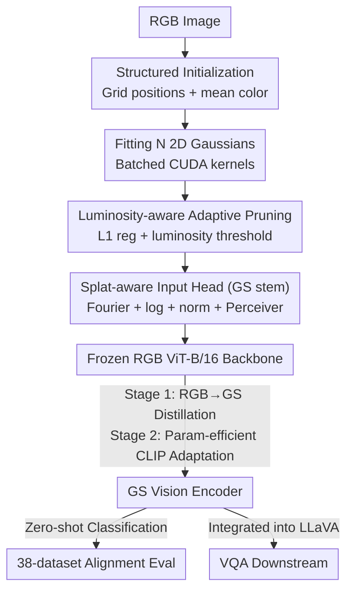

# GaussianVision: Vision-Language Alignment from Compressed Image Representations using 2D Gaussian Splatting

**Conference**: CVPR 2026  
**Paper**: [CVF Open Access](https://openaccess.thecvf.com/content/CVPR2026/html/Omri_GaussianVision_Vision-Language_Alignment_from_Compressed_Image_Representations_using_2D_Gaussian_CVPR_2026_paper.html)  
**Code**: https://github.com/Tambe-Lab/GaussianVision  
**Area**: Multimodal VLM  
**Keywords**: 2D Gaussian Splatting, Vision-Language Alignment, CLIP, Compressed Image Representations, Visual Token Compression  

## TL;DR
This work uses a set of anisotropic 2D Gaussians (position + covariance + color) as a compact surrogate representation for images fed into vision-language models. By "reusing a frozen RGB ViT backbone + a lightweight splat input head + two-stage transfer training," it achieves 3–23.5× compression of visual inputs and up to 31× faster loading on the 12.8M DataComp dataset. It maintains 90–98% of the zero-shot accuracy of RGB baselines across 38 datasets and even outperforms RGB on 6 VQA benchmarks when integrated into LLaVA.

## Background & Motivation
**Background**: The visual component of modern VLMs almost exclusively follows a pipeline of "RGB pixel map → ViT patching → CLIP contrastive training," where images are sliced into uniform grid patches, projected into hundreds or thousands of visual tokens, and aligned with text tokens in a shared space.

**Limitations of Prior Work**: This paradigm inherits two structural inefficiencies from the pixel domain. The first is **transmission cost**: edge devices capturing high-resolution RGB images and transmitting them to cloud encoders for semantic processing consume significant energy (approx. 0.1–0.2 kWh/GB). High-scale video transmission further strains operational budgets. The second is **token explosion**: a single 336×336 image in LLaVA-1.5 generates 576 tokens, while LLaVA-NeXT can exceed 2880 tokens for 672×672 inputs, compared to only 20–50 tokens for a text sentence. Given the quadratic complexity of attention relative to sequence length, more tokens lead to significantly higher costs.

**Key Challenge**: Substantial evidence suggests that these visual tokens are extremely redundant—discarding up to 89% of visual tokens often has minimal impact on VQA performance and can sometimes improve it. However, existing methods like PruMerge, VisionZip, FastV, or ToMe are **post-hoc pruning** techniques: they generate dense patch tokens first and then remove them. This acts as a "band-aid" for structural inefficiency rather than challenging the fundamental assumption that representations must originate from dense pixel grids.

**Goal**: The objective is to determine if a **natively compact, semantically rich, and learning-friendly** intermediate representation can be used directly for vision-language alignment, rather than relying on post-hoc compression. This involves two sub-problems: (1) making 2DGS fitting feasible at a million-image scale; and (2) migrating mature CLIP/RGB encoders to this entirely new input format.

**Key Insight**: RGB pixel arrays are designed for human perception, characterized by dense spatial correlations and detail far exceeding model requirements. Machine learning systems require abstract representations that emphasize semantics and structure while discarding perceptual redundancy. 2D Gaussian Splatting (2DGS) provides such a compact, spatially adaptive representation by parameterizing images with sparse anisotropic Gaussians.

**Core Idea**: This work replaces the visual base with "a small collection of colored 2D Gaussians." By reusing a frozen RGB ViT backbone and training only a splat-aware input head, the Gaussian features are aligned with the geometric manifold learned from RGB. This achieves significant compression while maintaining alignment quality. It represents the first large-scale application of 2DGS to vision-language pre-training.

## Method

### Overall Architecture
The GaussianVision pipeline begins by **fitting an original RGB image to $N$ 2D Gaussians** (each with 8 parameters: 2D position, anisotropic covariance, and color). This fitting process is made feasible at scale through structured initialization, adaptive pruning, and batched CUDA kernels. The resulting set of Gaussians serves as the sole visual input, which is encoded into tokens by a **splat-aware input head (GS stem)**. These tokens are fed into a **frozen Transformer backbone reused from an RGB ViT-B/16**, followed by a Perceiver resampler that produces a fixed number of tokens from the configurable number of Gaussian points. The entire GS encoder is established via **two-stage transfer training** (Stage 1: RGB→GS distillation; Stage 2: parameter-efficient CLIP adaptation). The final model can perform zero-shot classification and be integrated into LLaVA for VQA tasks.

The 2DGS image reconstruction follows Gaussian superposition, where each pixel intensity is the weighted sum of contributions from all Gaussians:

$$\hat{I}(x,y)=\sum_{i=1}^{n}\mathbf{c}_i\exp\!\Big\{-\tfrac{1}{2}\big([x,y]^\top-\boldsymbol{\mu}_i\big)^\top\boldsymbol{\Sigma}_i^{-1}\big([x,y]^\top-\boldsymbol{\mu}_i\big)\Big\}$$

where $\boldsymbol{\mu}_i$ is the Gaussian center, $\boldsymbol{\Sigma}_i$ is the 2×2 covariance, and $\mathbf{c}_i$ is the color. 2DGS does not require depth sorting, enabling extremely fast rendering (1500–2000 FPS, approximately 3× faster than JPEG decoding).

### Key Designs

**1. Structured Initialization: Using Pixel Priors to Accelerate 2DGS Convergence**
While 3DGS often uses random initialization for unknown geometries, 2D images provide immediate spatial organization and color. This work leverages pixel priors by initializing Gaussian centers on a uniform grid, setting isotropic covariances to the maximum circle fitting the grid cell, and taking the average RGB of pixels within that cell as the initial color. This leads to significantly higher PSNR (35.25 vs 28.24 for 4900 Gaussians after 3000 iterations) compared to random initialization, ensuring faster convergence and higher asymptotic quality.

**2. Luminosity-Aware Adaptive Pruning: L1 Regularization + Luminosity Thresholding**
To manage the trade-off between compression and semantic fidelity, redundant Gaussians are removed during optimization. First, L1 penalty is applied to color channels to encourage sparsity. The objective function is:

$$\mathcal{L}_{\mathrm{GS}}=\frac{1}{B}\sum_{b=1}^{B}\Big[\tfrac{1}{HW}\|\hat{\mathbf{I}}^{(b)}-\mathbf{I}^{(b)}\|_2^2+\lambda_{\mathrm{reg}}\|\mathbf{C}^{(b)}\|_1\Big]$$

where the first term is pixel-wise L2 reconstruction error and the second is L1 regularization on colors. After fitting, **information-density-aware pruning** is performed based on a luminosity score $s_{b,n}=0.2126|R_{b,n}|+0.7152|G_{b,n}|+0.0722|B_{b,n}|$. Gaussians falling below a threshold $\tau_{\mathrm{th}}$ are discarded.

**3. Splat-Aware Input Head (GS stem): Translating Gaussian Parameters to ViT Tokens**
Since Gaussian parameters differ from patch embeddings, the GS stem (composed of Fourier features, log scaling, normalization, and projection) encodes each Gaussian into a token embedding. A **Perceiver resampler** then compresses a configurable number of Gaussian points into a fixed number of latent visual tokens. This decouples the number of Gaussians used for fidelity from the number of tokens used for the Transformer, allowing the model to halve token counts (196→98) with minimal accuracy loss.

**4. Two-Stage Transfer Training: Distillation to RGB Manifold followed by CLIP Adaptation**
Training CLIP from scratch on 2DGS inputs results in poor convergence. Instead, a two-stage approach is used. **Stage 1 (RGB→GS Distillation)** freezes the backbone and trains only the GS stem by minimizing the MSE between L2-normalized CLS embeddings of an RGB teacher and the GS student. **Stage 2 (Param-efficient CLIP Adaptation)** performs CLIP contrastive training for 5 epochs, unfreezing only ~9.7% of parameters (GS stem, first two Transformer blocks, and final projection layers). Optionally, unfreezing symmetric text-side layers brings the trainable parameters to ~13.8%, yielding small accuracy gains.

### Loss & Training
- Stage 1: MSE distillation of L2-normalized CLS embeddings, 2 epochs, GS stem only.
- Stage 2: Standard CLIP contrastive loss, 5 epochs, 9.7% (optional 13.8%) parameters unfrozen.
- Fitting: L2 reconstruction + L1 color regularization.
- VLM Integration: Follows LLaVA recipe with Vicuna-7B. (1) Multimodal alignment pre-training on ~558K LAION-CC-SBU subset (projector only); (2) Supervised instruction fine-tuning on ~665K LLaVA-v1.5 mix (projector + LLM).

## Key Experimental Results

### Main Results
The reference RGB model is a CLIP ViT-B/16(Small) trained on 12.8M DataComp. Compression is calculated relative to the raw pixel data. The following table shows zero-shot alignment results across 38 datasets (accuracy is the mean, Rel. is relative to the RGB 196-token baseline):

| Vision Encoder | Params per Image | Compression | Loading/Decoding Speedup | 196-token Acc (Rel.) | 98-token Acc (Rel.) |
|----------------|------------------|-------------|-------------------------|---------------------|---------------------|
| RGB (224×224) Baseline | 150,528 | 1.00× | 1.00× | 22 (1.00) | 19 (0.87) |
| GS (3136) | 25,088 | 3.00× | 6.71× | 20 (0.98) | 20 (0.96) |
| GS (1600) | 12,800 | 5.88× | 13.43× | 20 (0.96) | 20 (0.95) |
| GS (900) | 7,200 | 10.45× | 18.80× | 20 (0.92) | 19 (0.91) |
| GS (400) | 3,200 | 23.52× | 31.33× | 19 (0.91) | 19 (0.92) |

The 3136/1600 point GS models maintain 96–98% of RGB accuracy while providing 3–6× compression and up to 13× speedup. Integration with LLaVA(Vicuna-7B) on VQA benchmarks shows:

| Benchmark | RGB | GS-3136(196) | GS-1600(196) | GS-900(196) | GS-400(196) |
|-----------|-----|--------------|--------------|-------------|-------------|
| SQA-IMG | 63.81 | 64.70 | **64.85** | **64.95** | 64.80 |
| TextVQA | 44.66 | **45.20** | 44.71 | 44.29 | 44.60 |
| POPE | 77.83 | 77.80 | **78.13** | 77.32 | 76.91 |
| MME | 1398.98 | **1414.37** | 1379.26 | 1336.83 | 1297.56 |
| MM-Vet | 16.60 | **19.40** | 16.50 | 14.70 | 16.70 |
| GQA | 51.42 | **52.25** | 51.52 | 49.27 | 50.21 |

Despite lower representation complexity, GS encoders consistently outperform RGB on several VQA benchmarks.

### Ablation Study

| Configuration | Metric | Description |
|---------------|--------|-------------|
| Structured Init (4900 GS, 3000 iter) | PSNR 35.25 | vs 28.24 for random, faster and better convergence |
| Structured Init (400 GS) | PSNR 22.04 | vs 17.77 for random, better in extreme compression |
| High-budget Pruning (1600–3136 pts) | 60–80% pruned, PSNR drop 2–5 dB | Initial redundancy assists sparsification |
| 3136 pts, $\lambda_{\mathrm{reg}}{=}0,\tau_{\mathrm{th}}{=}0$ | PSNR 37.43 | Unpruned upper bound |

Batched CUDA kernels achieve a 90.3× speedup for fitting compared to previous baselines, with 97% GPU utilization.

### Key Findings
- **Redundancy assists sparsification**: Starting with a higher budget and pruning yields better results than starting with a low budget.
- **Decoupled tokens**: GS models show minimal performance drops when token counts are halved, suggesting semantic signals are more concentrated in Gaussians.
- **GS exceeds RGB on VQA**: While average zero-shot accuracy is slightly lower, VQA performance is superior, possibly due to more efficient focus on key semantic structures.

## Highlights & Insights
- **Representation-priority over post-hoc compression**: This work emphasizes using a compact representation from the start rather than patching and then pruning.
- **Reusing frozen RGB backbones** is a cost-effective way to migrate to new input modalities by training only ~10% of parameters.
- **Energy-aware transmission perspective**: It highlights the necessity of compression not just for FLOPs, but for edge-to-cloud energy consumption.

## Limitations & Future Work
- **Fitting cost**: Despite CUDA kernels, iterative optimization still takes seconds per batch, necessitating further acceleration.
- **Distillation dependency**: The GS model's performance is currently bounded by the RGB teacher's quality.
- **Distribution shift robustness**: Average zero-shot accuracy is slightly lower than RGB, indicating that GS-native architectures may lack some inductive biases of ViTs.

## Related Work & Insights
- **Comparison to post-hoc pruning**: Unlike ToMe or FastV, GaussianVision compresses the transmission and storage format, not just the transformer attention budget.
- **Comparison to 2DGS compression (GaussianImage)**: While others optimize for rate-distortion, this work optimizes for vision-language alignment quality.
- **Comparison to INR**: 2DGS offers significantly faster rendering and decoding, making it more suitable for large-scale training pipelines.

## Rating
- Novelty: ⭐⭐⭐⭐⭐ (First large-scale 2DGS use for VLM alignment)
- Experimental Thoroughness: ⭐⭐⭐⭐ (Extensive benchmarks, though zero-shot stats are aggregated)
- Writing Quality: ⭐⭐⭐⭐⭐ (Clear motivation and systematic presentation)
- Value: ⭐⭐⭐⭐ (Promising direction for edge multimodal efficiency)

<!-- RELATED:START -->

## Related Papers

- [\[CVPR 2026\] Proxy3D: Efficient 3D Representations for Vision-Language Models via Semantic Clustering and Alignment](proxy3d_efficient_3d_representations_for_vision-language_models_via_semantic_clu.md)
- [\[CVPR 2026\] See What I Mean: Aligning Vision and Language Representations for Video Fine-grained Object Understanding](see_what_i_mean_aligning_vision_and_language_representations_for_video_fine-grai.md)
- [\[CVPR 2025\] 4D LangSplat: 4D Language Gaussian Splatting via Multimodal Large Language Models](../../CVPR2025/multimodal_vlm/4d_langsplat_4d_language_gaussian_splatting_via_multimodal_large_language_models.md)
- [\[ICML 2026\] Benchmarking and Enhancing VLM for Compressed Image Understanding](../../ICML2026/multimodal_vlm/benchmarking_and_enhancing_vlm_for_compressed_image_understanding.md)
- [\[CVPR 2026\] Learning complete and explainable visual representations from itemized text supervision](learning_complete_and_explainable_visual_representations_from_itemized_text_supe.md)

<!-- RELATED:END -->
