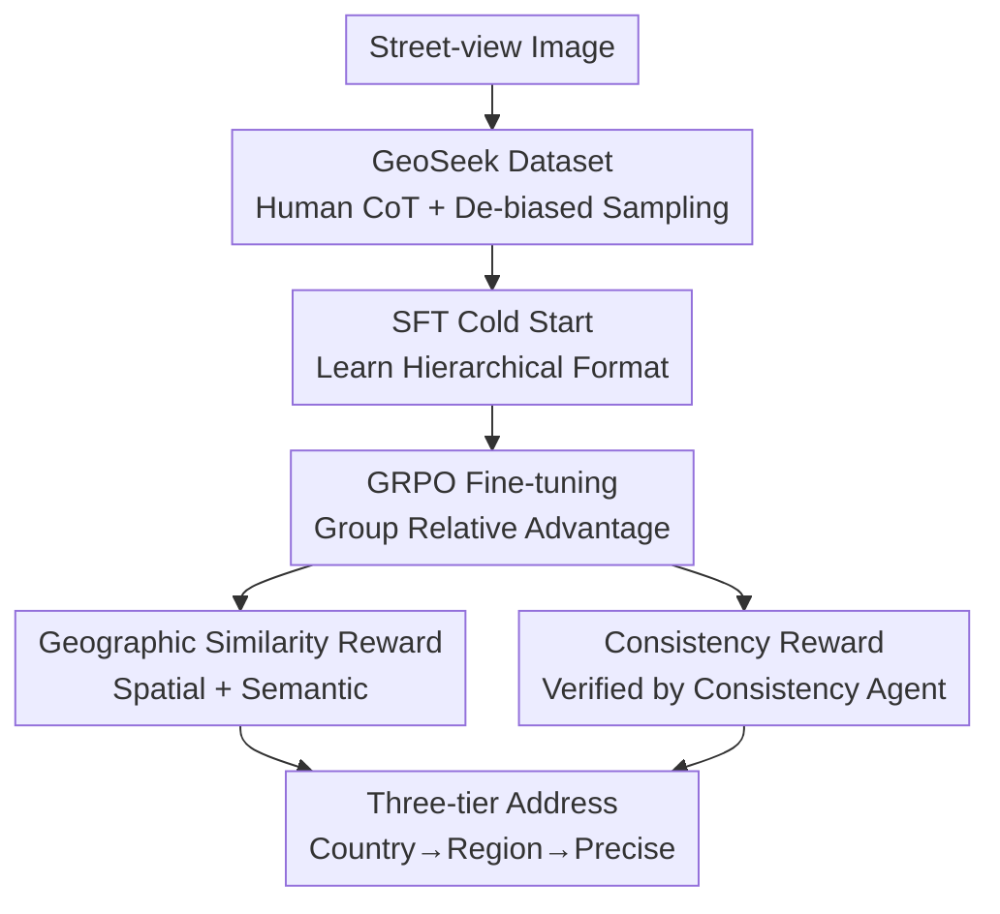

# GeoAgent: Learning to Geolocate Everywhere with Reinforced Geographic Characteristics

**Conference**: CVPR 2026  
**Paper**: [CVF Open Access](https://openaccess.thecvf.com/content/CVPR2026/html/Jin_GeoAgent_Learning_to_Geolocate_Everywhere_with_Reinforced_Geographic_Characteristics_CVPR_2026_paper.html)  
**Code**: Available (The paper states "Code and data are available," but no specific URL is provided ⚠️ subject to the original text)  
**Area**: Multimodal VLM / Image Geolocation / Reinforcement Learning  
**Keywords**: Image Geolocation, Vision Large Language Models (VLLM), GRPO, Geographic Similarity Reward, CoT Consistency  

## TL;DR
GeoAgent approaches image geolocation as a human-like task of "hierarchical reasoning to a precise address." It first performs a cold start on a VLLM using GeoSeek, a Chain-of-Thought (CoT) dataset annotated by geographic experts and professional players. It then undergoes Group Relative Policy Optimization (GRPO) fine-tuning using two rewards tailored for geographic tasks: a Geographic Similarity Reward (measuring correctness) and a Consistency Reward (measuring reasoning validity). GeoAgent outperforms existing methods and general-purpose VLLMs across multiple granularities.

## Background & Motivation
**Background**: Image geolocation (inferring capture locations solely from visual content) was early treated as a classification (dividing the Earth into a grid) or retrieval (matching images against a database) problem. With the rise of VLLMs, the mainstream has shifted toward models outputting both location and reasoning process, using GRPO-based reinforcement learning (RL) to enhance performance and interpretability.

**Limitations of Prior Work**: This RL approach faces two major conflicts with the nature of geographic tasks. First, CoT training data is almost entirely **AI-generated**, which may not align with human reasoning and can amplify base model biases. Research suggests RL-tuned VLLMs often learn "surface formats" rather than genuine reasoning. Second, traditional datasets provide only GPS coordinates or coarse city-level labels and use uniform or area-based sampling, ignoring the strong correlation between street-view distribution and population/road density, leading to severe regional bias.

**Key Challenge**: Reward design mismatches geographic tasks. Existing rewards mostly rely on **exact matching** (assigning scores only if predicted text equals ground truth). However, mapping natural language to locations is a **one-to-many relationship**—"Notre-Dame de Paris," "Parvis Notre-Dame," and "4 Place Jean-Paul-II" refer to the same place but differ literally. Exact matching erases the model's progress in approaching the correct answer, providing reward signals inconsistent with actual localization capability.

**Goal**: (1) Construct a dataset with human-annotated CoT, fine-grained addresses, and de-biased sampling; (2) Design rewards that align with geographic characteristics to ensure spatial and semantic convergence while maintaining CoT integrity and consistency.

**Key Insight**: Training signals should be derived from "geographic characteristics"—continuous spatial distance between locations, semantic similarity between place names, and the hierarchical nature of human reasoning (Country → Region → Precise Location). These three points are encoded into rewards.

**Core Idea**: Replace exact matching with a **Geographic Similarity Reward** (Spatial + Semantic) and introduce a **Consistency Reward** evaluated by an independent **consistency agent** to constrain the reasoning process. Training is conducted in two stages: SFT on human-annotated GeoSeek followed by GRPO.

## Method

### Overall Architecture
GeoAgent takes a street-view/scene image as input and outputs a three-tier address (Country → Region → Precise Location) with a hierarchical reasoning process. The pipeline consists of three steps: **Step I Construction of GeoSeek Dataset** (including a human-annotated CoT subset GeoSeek-CoT, a training set GeoSeek-Loc, and a benchmark GeoSeek-Val); **Step II SFT Cold Start**, fine-tuning Qwen2.5-VL-7B using LoRA for 2 epochs on GeoSeek-CoT to learn the hierarchical reasoning format; **Step III GRPO Fine-tuning**, running 1 epoch of RL on GeoSeek-Loc with rewards comprising spatial similarity, semantic similarity, and consistency.

The reasoning is organized into three human-player-like segments: "Country Identification → Regional Guess → Precise Localization," each outputting `Clues / Reasoning / Conclusion` to form the final answer.

### Key Designs

**1. GeoSeek Dataset: Replacing AI-Generation with Human CoT and De-biased Sampling**

To address AI-generated CoT bias and coarse/biased sampling, the authors collaborated with geographic experts and professional GeoGuessr players to annotate reasoning processes across country, city, and precise locations. GPT-4o was used for linguistic normalization, resulting in 10k human-annotated CoT samples (GeoSeek-CoT) for SFT. For RL, GeoSeek-Loc uses **multi-level stratified sampling**: sampling weights for countries are calculated based on population, area, and road mileage; each country is then divided into grids with weights proportional to the **logarithm of the population** to suppress over-concentration. GeoSeek-Val features 3k samples from OSV5M, with **locatability scores** (0–10) assigned by GPT-4o for difficulty-based evaluation.

**2. Geographic Similarity Reward: Spatial + Semantic Metrics instead of Exact Matching**

This core design solves the one-to-many mapping problem. Spatial similarity uses OpenCage reverse geocoding to convert predicted addresses into coordinates $(\hat\lambda,\hat\phi)$, calculating the Haversine distance $D$ from the ground truth $(\lambda,\phi)$:

$$D = 2r\arcsin\sqrt{\sin^2\tfrac{\Delta\phi}{2} + \cos\hat\phi\cos\phi\sin^2\tfrac{\Delta\lambda}{2}}$$

where $r=6371\text{km}$. The spatial reward uses exponential decay $R_{spa}=\exp(-D/\tau)$. It grows **slower** as distance decreases, encouraging the model to bound a large area before narrowing down—matching the human "country-then-street" logic. Semantic similarity uses a multilingual encoder to represent each address level $i$ as $h^{pred}_i,h^{gt}_i$, calculating cosine similarity $s_i$. After thresholding by $\delta$ to get $\hat s_i$, it is weighted across levels:

$$R_{sem}=\sum_{i=1}^{3}\alpha_i\hat s_i,\quad \sum_i\alpha_i=1$$

A **hierarchical constraint** is applied: lower-level rewards are only granted if higher-level (Country/Region) predictions are sufficiently accurate. This accounts for aliases and translations.

**3. Consistency Reward: Enforcing Reasoning Integrity via an Independent Agent**

While similarity rewards focus on the "Image → Location" mapping, the Consistency Reward ensures the "Image → Clues → Reasoning → Location" chain is self-consistent. A **consistency agent** (Qwen3-32B via GPTQ-INT4) is provided with the **reasoning process only** (no conclusion) and attempts to derive the tiered conclusions. Scores are given for successful derivations:

$$R_{con}=\sum_i \mathbf{1}[\hat y_i = y_i]\cdot w_i\cdot p_i,\quad \sum_i w_i = 1$$

To prevent the model from skipping reasoning to cheat the agent, a penalty term $p_i$ is introduced, which is positively correlated with reasoning text length $\ell_i$ via a sigmoid function:

$$p_i=\frac{1}{1+\exp(-\lambda(\hat\ell-\mu))},\quad \hat\ell=\frac{\ell_i-\min(\ell)}{\max(\ell)-\min(\ell)}$$

Curves show the Consistency Reward converges first, establishing a structured reasoning framework that later enables spatial and semantic rewards to surpass the baseline.

The total reward is a weighted sum: $R = a_1 R_{spa} + a_2 R_{sem} + a_3 R_{con}$.

### Loss & Training
The base model is Qwen2.5-VL-7B using LoRA (rank=64, alpha=128, ~1.91% parameters). Step II involves SFT on GeoSeek-CoT for 2 epochs; Step III involves GRPO on GeoSeek-Loc for 1 epoch. The consistency agent is Qwen3-32B (GPTQ-INT4).

## Key Experimental Results

### Main Results
Zero-shot evaluation on IM2GPS3K reporting hit rates for City (25km), Region (200km), Country (750km), and Continent (2500km).

| Dataset / Metric | Ours (GeoAgent) | Best Previous | Note |
|--------------|--------------|----------|------|
| IM2GPS3K Country (750km) | **76.21** | 72.40 (G3) | LoRA-only outperforms full fine-tuning |
| IM2GPS3K Continent (2500km) | **89.90** | 85.67 (GRE-Suite) | Most significant macro-scale gain |
| IM2GPS3K Region (200km) | **58.57** | 56.19 (GLOBE) | — |
| GeoSeek-Val Country | **60.37** | 56.13 (GeoCLIP) | Street-view benchmark |
| GeoSeek-Val GeoScore | **3314.1** | 3172.3 (GeoCLIP) | Scale 0–5000 |

Gains are more pronounced at macro levels. The authors explain that the spatial reward's decay behavior encourages the model to secure coarse-grained accuracy first—sufficient to defeat top human players.

### Ablation Study
Ablation on GeoSeek-Val (Metrics: City/Region/Country hit rates):

| Configuration | City | Region | Country | Note |
|------|------|--------|---------|------|
| Qwen2.5-VL-7B (Base) | 1.39 | 3.36 | 11.13 | Baseline |
| GeoAgent-SFT (Cold start only) | 10.36 | 23.84 | 47.12 | Significant SFT gain |
| w/o Spa & Sem (Consistency only) | 9.08 | 20.03 | 40.43 | Performance drops below SFT |
| w/o Con (No consistency reward) | 14.69 | 31.39 | 60.20 | Strong but less self-consistent |
| w/o SFT (RL without cold start) | 13.39 | 23.94 | 58.23 | Weak regional performance |
| **GeoAgent (Full)** | **15.69** | **33.39** | **60.37** | Best performance |

Experiments also confirm that Geographic Similarity > Direct Judging: replacing similarity rewards with text matching (GeoAgent-SFT+Judge) drops Country accuracy to 50.81.

### Key Findings
- **Geographic Similarity (Spatial + Semantic) is the primary driver**: Excluding it causes performance to drop below the SFT baseline, indicating that the Consistency Reward alone cannot support localization.
- **Consistency Reward provides a "foundation then gain"**: While the absolute gain from w/o Con to Full is small (0.17%), it significantly improves reasoning self-consistency and accelerates convergence of other rewards.
- **Data Quality Validated**: GeoAgent outperforms models trained on millions of samples (e.g., GRE-Suite) using only 10k expert-annotated samples.
- **Superiority in High-difficulty Samples**: GeoAgent's advantage is greater in high-locatability buckets, indicating its reasoning pattern aligns better with reality.

## Highlights & Insights
- **Encoding "geographic nature" into rewards** is the most effective innovation: mapping spatial distance, semantic aliases, and hierarchical reasoning into distinct reward components.
- **The "Conclusion-less" Consistency Agent with length penalties** prevents the VLLM from learning superficial formatting shortcuts, a common pitfall in RL-tuned models.
- **Non-linear spatial reward decay** acts as a natural curriculum, encouraging macro-level accuracy before micro-level refinement, mirroring professional human strategies.

## Limitations & Future Work
- The Consistency Agent relies on a 32B model, incurring high training costs and potential reward noise.
- Reliance on external components (multilingual encoders, reverse geocoding) may introduce errors if these tools have blind spots.
- Benchmarks are street-view focused; generalization to indoor, satellite, or aerial imagery remains unverified.
- Fixed reward weights ($1.5/1.0/0.5$) lack a systematic sensitivity analysis.

## Related Work & Insights
- **vs. Exact Matching RL (GLOBE / GRE-Suite)**: These methods penalize correct locations described with different terminology; GeoAgent's similarity rewards are robust to aliases and abbreviations.
- **vs. AI-Generated CoT (MG-GEO / GRE30k)**: These rely on biased AI reasoning; GeoSeek uses human expert/player annotations, which are more credible and fine-grained.
- **vs. Traditional Classification/Retrieval (GeoCLIP / PIGEOTTO)**: Traditional methods lack interpretability; GeoAgent provides human-readable reasoning while outperforming them on macro-scale accuracy.

## Rating
- Novelty: ⭐⭐⭐⭐⭐ Encoding geographic traits into RL rewards and the consistency verification agent are highly innovative.
- Experimental Thoroughness: ⭐⭐⭐⭐ Extensive benchmarking and ablation, though missing sensitivity analysis for weights and cross-domain generalization.
- Writing Quality: ⭐⭐⭐⭐ Clear motivation and intuitive diagrams; some hyperparameters are relegated to supplementary materials.
- Value: ⭐⭐⭐⭐⭐ The dataset and reward paradigm are highly reusable; the consistency agent logic is applicable to other verifiable reasoning tasks.

<!-- RELATED:START -->

## Related Papers

- [\[ACL 2026\] MONETA: Multimodal Industry Classification through Geographic Information with Multi Agent Systems](../../ACL2026/multimodal_vlm/moneta_multimodal_industry_classification_through_geographic_information_with_mu.md)
- [\[CVPR 2026\] TTRV: Test-Time Reinforcement Learning for Vision Language Models](ttrv_test-time_reinforcement_learning_for_vision_language_models.md)
- [\[CVPR 2026\] MM-ReCoder: Advancing Chart-to-Code Generation with Reinforcement Learning and Self-Correction](mm-recoder_advancing_chart-to-code_generation_with_reinforcement_learning_and_se.md)
- [\[CVPR 2026\] TempR1: Improving Temporal Understanding of MLLMs via Temporal-Aware Multi-Task Reinforcement Learning](tempr1_improving_temporal_understanding_of_mllms_via_temporal-aware_multi-task_r.md)
- [\[CVPR 2026\] Learning from Itself: Mining Internal Knowledge from Vision Language Models for Continual Learning](learning_from_itself_mining_internal_knowledge_from_vision_language_models_for_c.md)

<!-- RELATED:END -->
