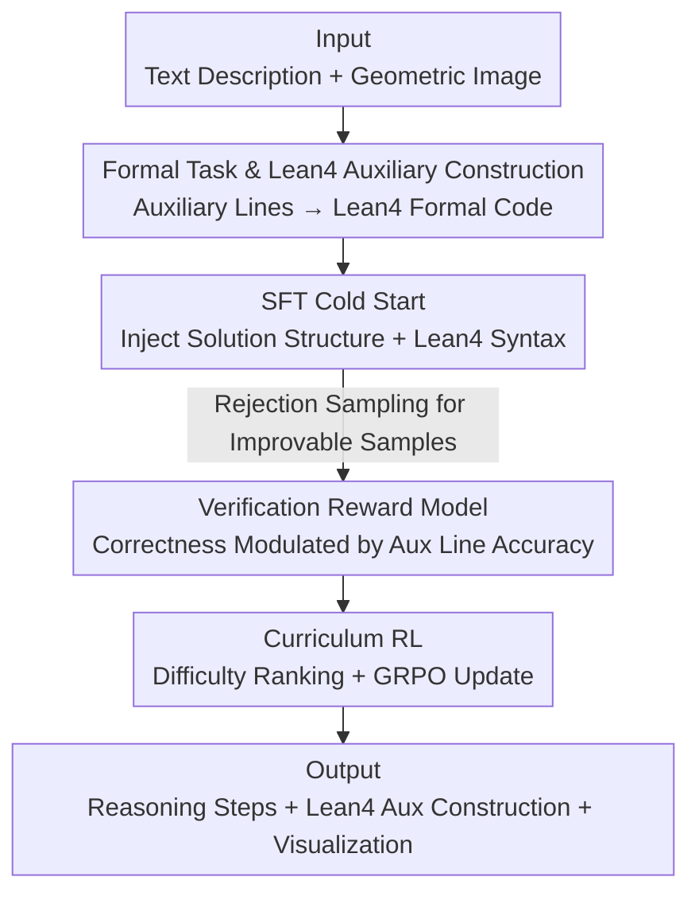

# Geoint-R1: Formalizing Multimodal Geometric Reasoning with Dynamic Auxiliary Constructions

**Conference**: CVPR 2026  
**Paper**: [CVF Open Access](https://openaccess.thecvf.com/content/CVPR2026/html/Wei_Geoint-R1_Formalizing_Multimodal_Geometric_Reasoning_with_Dynamic_Auxiliary_Constructions_CVPR_2026_paper.html)  
**Code**: None (Not provided in the paper)  
**Area**: Multimodal VLM  
**Keywords**: Geometric Reasoning, Auxiliary Construction, Lean4 Formalization, Verification Reward Model, Curriculum Learning  

## TL;DR
Geoint-R1 formalizes "drawing auxiliary lines + formal proof" into a verifiable multimodal geometric reasoning task. By using Lean4 to encode dynamic auxiliary constructions into formal language and employing a Verification Reward Model (modulated by auxiliary line accuracy) to drive curriculum reinforcement learning, a 7B model achieves an average performance exceeding GPT-4o / Gemini-1.5-pro on the self-built Geoint benchmark.

## Background & Motivation
**Background**: In recent years, Multimodal Large Language Models (MLLMs) have made significant progress in mathematical/visual reasoning tasks. However, the mainstream approach treats geometry problems as "image viewing + text answering"—directly outputting an answer or a natural language proof without involving operations on the geometry itself.

**Limitations of Prior Work**: Many geometry problems (especially solid geometry and plane geometry proofs) require humans to "draw auxiliary lines" first—such as connecting diagonal intersections or drawing parallel lines through a point. Existing MLLMs can neither draw these auxiliary elements nor express and verify them formally, leading to incomplete proof steps and logical leaps (Paper Figure 1: After adding AC and OE auxiliary lines, human reasoning is complete, while MLLMs directly use vectors but "cannot draw the diagram or continue the reasoning").

**Key Challenge**: Geometric reasoning requires both **semantic correctness** (the conclusion is right) and **formal rigor and visualization** (every step is justifiable, and auxiliary elements can be drawn and verified by machines). Existing methods leave both to free-form text, which lacks verifiable formal representation and supervision signals for whether the auxiliary lines are constructed correctly.

**Goal**: Define and solve a new task—**Formal Geometric Reasoning**: Given a text description $T_i$ and a geometric image $I_i$, generate a complete and formally verifiable solution, including reasoning steps $P_i$, auxiliary constructions $C_i$ (if necessary), and the final answer $A_i$.

**Key Insight**: Use the Lean4 proof assistant to unify the coding of geometric elements, relationships, and dynamically added auxiliary lines into a formal language. In this way, "whether the auxiliary lines are correct" and "whether the proof is complete" shift from vague human judgments to objects for structured scoring, which can be directly integrated into RL rewards.

**Core Idea**: Write auxiliary constructions as Lean4 formal code, use a verification reward model sensitive to "auxiliary line correctness," and employ curriculum RL to compel the model to learn to "draw auxiliary lines correctly first, then provide a verifiable proof."

## Method
### Overall Architecture
Geoint-R1 trains a model $\mathcal{F}_\theta$ that takes geometric text $T_i$ and image $I_i$ as input and outputs a formal solution tuple:

$$(P_i, C_i, A_i) = \mathcal{F}_\theta(T_i, I_i)$$

Where $P_i$ represents reasoning steps, $C_i$ represents auxiliary constructions in Lean4 ($C_i=\varnothing$ when no lines are needed), and $A_i$ is the final answer. The system is built on Qwen2.5-VL-7B and consists of two stages: first, using SFT to inject the "geometry solution structure + Lean4 syntax" into the base model, followed by a verification reward model to guide curriculum reinforcement learning (GRPO) to optimize semantic correctness and logical rigor. The critical signal of "auxiliary line correctness" permeates the reward design and is the core of upgrading the model into a "formal prover capable of drawing auxiliary lines."

### Key Designs

**1. Formal Geometric Reasoning Task & Lean4: Turning auxiliary line drawing into verifiable formal objects**

To address the pain point that auxiliary lines are only vaguely described in free text and cannot be verified, this paper explicitly splits the geometric solution into the $(P_i, C_i, A_i)$ triplet and uses the Lean4 proof assistant to represent geometric elements and auxiliary constructions. For example, a point is defined as `def A : Point := { x := 0, y := 5 }`, and graph edges are represented as `def edges : List Edge := [⟨A, B, …⟩]`. Based on this, `Add Auxiliary Line code` (dynamically appending Lean4 code corresponding to auxiliary lines) can be performed. Operations such as "draw parallel line MN to AB through point E" or "connect diagonal intersection O and OE" become structured code that can be parsed, verified, and visualized. Formalization is the prerequisite for reward design and evaluation to be "granular to auxiliary line correctness"—without it, RL lacks reliable supervisory signals.

**2. SFT Cold Start: Teaching the base model solution structure and Lean4 syntax**

If RL is run directly on the base model, it may fail to output valid Lean4 syntax or proof skeletons, resulting in sparse reward signals. Therefore, the first stage performs standard teacher-forcing supervised fine-tuning on a dataset $\mathcal{D}=\{(T_i, I_i, P_i^{ref}, C_i^{ref}, A_i^{ref})\}$ with reference solutions, minimizing the negative log-likelihood:

$$\mathcal{L}_{SFT}(\theta) = -\sum_{i=1}^{N} \log P(P_i^{ref}, C_i^{ref}, A_i^{ref} \mid T_i, I_i; \theta)$$

For problems without auxiliary lines, $C_i^{ref}=\varnothing$. During training, the visual encoder and multimodal projection layers are frozen to preserve visual capabilities, while only the language side undergoes full-parameter updates. The goal is to instill the "correct proof structure + valid Lean4 syntax" into the model, providing a meaningful starting point for the second stage of RL.

**3. Verification Reward Model: Letting auxiliary line accuracy modulate correctness scores**

This is the most critical design in the paper, contributing most to performance gains. The reward $R(\cdot)$ is a weighted sum of three components:

$$R(x) = \alpha F_{corr}(x) + \beta F_{aux}(x) + \gamma F_{fmt}(x)$$

Where $F_{aux}=1$ if and only if the model's output auxiliary constructions **perfectly match** the reference set (all required lines identified and precisely encoded in Lean4), otherwise 0; $F_{fmt}$ checks if the output follows a strict think-answer template. Most importantly, the correctness component $F_{corr}$ is **modulated** by auxiliary line accuracy:

$$F_{corr}(x) = \begin{cases} \min(1,\ \mathrm{acc}+\lambda), & \text{Auxiliary lines are correct} \\ \max(0,\ \mathrm{acc}-\lambda), & \text{Otherwise} \end{cases}$$

For answer questions, $\mathrm{acc}\in\{0,1\}$ relies on exact matching; for proof questions, $\mathrm{acc}\in[0,1]$ is evaluated by GPT-4o based on multi-dimensional criteria. The constant $\lambda$ rewards correctness when auxiliary lines are right and penalizes it when they are wrong—telling the model that getting the answer right by chance is insufficient and that correct auxiliary construction is rewarded, anchoring supervision on the truly difficult step of the task. ⚠️ Specific values for $\alpha,\beta,\gamma,\lambda$ are not provided in the text.

**4. Curriculum RL: Sequential difficulty with single roll-out + GRPO**

After SFT, the model may still be suboptimal in semantic correctness or logical rigor. Directly applying RL to difficult problems may cause instability due to sparse rewards. This paper performs rejection sampling on SFT outputs (8 candidates per question, filtering the too simple or unsolvable ones) and assigns a difficulty score to each:

$$d_i = 1 - \frac{1}{K}\sum_k \delta_{i,k}$$

Where $\delta_{i,k}$ is an indicator function for whether the $k$-th candidate is correct—the more candidates are correct, the smaller $d_i$ (easier) is. Each round of sampling is sorted by $d_i$ in ascending order to implement curriculum learning. The RL objective is to maximize expected reward:

$$\mathcal{J}(\theta) = \mathbb{E}_{(T_i, I_i)\sim\mathcal{D}}\big[\mathbb{E}_{(P_i,C_i,A_i)\sim\pi_\theta(\cdot|T_i,I_i)}[R(P_i,C_i,A_i)]\big]$$

For each step, a single roll-out per question is sampled, converted into a scalar $R(\cdot)$ by the verification reward model, and $\theta$ is updated via GRPO. The curriculum sorting ensures a smooth transition from simple proof patterns to complex auxiliary constructions.

### Example: Planar Angle Problem Workflow
Using the answer question from Paper Figure 8: Given AB∥CD, ∠BAE=35°, and ∠DCE=20°, find ∠AEC. Instead of using vectors, Geoint-R1 **draws an auxiliary line MN through point E parallel to AB** (encoded in Lean4). From parallel line properties, ∠AEM=35° and ∠MEC=20°, thus ∠AEC=35°+20°=55°. In contrast, GPT-4o ignores the auxiliary line and calculates 125° via triangle angle sum (incorrect), highlighting the necessity of "explicit auxiliary construction."

## Key Experimental Results

### Main Results
The base model is Qwen2.5-VL-7B, compared against open/closed-source multimodal models and math-specific models on the self-built Geoint test set (including answer and proof questions).

| Model | Answer Questions | Proof Questions | Average |
|------|--------|--------|------|
| Qwen-VL-2.5-7B (Base) | 39.94 | 69.57 | 54.76 |
| MMR1-Math-v0-7B | 49.08 | 71.93 | 60.51 |
| GPT-4o | 42.68 | **77.99** | 60.34 |
| Gemini-1.5-pro | 51.53 | 73.50 | 62.52 |
| **Geoint-R1 (7B)** | **57.01** | 72.43 | **64.72** |

Geoint-R1 achieves the highest average accuracy of 64.72%, with answer questions leading at 57.01%. Although the proof score (72.43%) is lower than GPT-4o (77.99%), it remains highly competitive despite the 7B parameter size. Most open-source VLMs average below 30%.

The gap is more pronounced on the auxiliary line subset (Figure 6): For Answer + Aux, Geoint-R1 reaches **68.63%**, significantly leading all models; for Proof + Aux, it reaches 68.40%, comparable to Gemini-1.5-pro (69.43%) and MMR1 (67.21%).

### Ablation Study
Modules for Verification Reward (Verify), RL, and Curriculum Learning (CL) were removed one by one:

| Configuration | Answer Avg | Proof Avg | Total Avg |
|------|-----------|-----------|--------|
| Geoint-R1 (Full) | **57.01** | **72.43** | **64.72** |
| w/o Verify | 42.68 | 68.88 | 55.78 |
| w/o RL | 43.60 | 67.06 | 55.33 |
| w/o CL | 45.73 | 67.90 | 56.82 |

Removing any module leads to significant drops. **Removing Verify causes the largest decrease** (64.72→55.78), specifically crashing from 68.63% to 32.35% on auxiliary line answer questions, proving that the auxiliary-sensitive reward is the core engine.

### Key Findings
- **Verification Reward Model contributes most**: Removing it halves the score on auxiliary line answer questions, showing that anchoring supervision on the auxiliary lines is key to learning them.
- **Auxiliary line problems are the real watershed**: All models perform better on problems without auxiliary lines. The problems requiring auxiliary lines are where the capability gap is revealed.
- **Small models can match large ones through task design**: The 7B Geoint-R1 outperforms GPT-4o / Gemini-1.5-pro on average, though it still lags behind GPT-4o in complex proofs due to model scale limitations.

## Highlights & Insights
- **Formalizing "drawing auxiliary lines" using Lean4** is the most critical step: it transforms a vague visual/intuitive operation into a parsable, verifiable, and scorable code object, allowing it to be integrated into RL rewards.
- **Reward modulation is smarter than reward addition**: Instead of just adding an "auxiliary score" to the total, modulating correctness ($\mathrm{acc}\pm\lambda$) creates a gradient between "correct answer with wrong auxiliary construction" and "correct answer with correct construction," forcing the model to not bypass difficulties.
- **Defining difficulty as $d_i=1-\frac{1}{K}\sum_k\delta_{i,k}$ using the model's own sampling accuracy** is a lightweight, reusable trick that allows curriculum sorting to adapt to the model's current capability without manual labels.

## Limitations & Future Work
- **Complex proofs still lag behind large models**: 72.43% < GPT-4o 77.99%. 7B has an upper bound on long-chain formal proofs.
- **Auxiliary line rewards require "exact matching"** ($F_{aux}$ binary), which might penalize alternative correct auxiliary constructions as 0. ⚠️ The paper does not discuss multi-solution handling.
- **Reliance on external judges**: Proof accuracy is judged by GPT-4o, and overall evaluation uses DeepSeek-V3; quality is subject to the judge model's capability and bias. Dataset construction cost (TikZ→Lean4 translation by DeepSeek-R1 + human verification) is high.
- **Code is not open-sourced**, creating a high replication barrier.

## Related Work & Insights
- **vs Multimodal math benchmarks (MathVista, We-Math, etc.)**: They emphasize step-by-step evaluation but lack formal representations for step-by-step visual reasoning. Geoint links geometry to formal steps and auxiliary visualizations.
- **vs Vision reasoning/agent methods (MM-REACT, DiagramAgent, etc.)**: They perform tool calls and graph editing but are not designed for precise math proof or formal auxiliary constructions with visual feedback.
- **vs Closed-source models (GPT-4o, Gemini-1.5-pro)**: They are stronger in proofs (scale advantage) but significantly lag behind Geoint-R1 in answer questions requiring auxiliary lines, suggesting that auxiliary line construction is a capability dimension that specific training can bridge more effectively than scale alone.

## Rating
- Novelty: ⭐⭐⭐⭐⭐ First to formalize "dynamic auxiliary construction" using Lean4 and turn it into RL-learnable rewards.
- Experimental Thoroughness: ⭐⭐⭐⭐ Solid comparison with 12 models and layered evaluation, but limited to a single self-built benchmark and not open-sourced.
- Writing Quality: ⭐⭐⭐⭐ Clear motivation and reward design, though some hyperparameter values are missing.
- Value: ⭐⭐⭐⭐⭐ The paradigm of "formalizing intermediate constructions for use as rewards" is highly inspiring for verifiable reasoning.

<!-- RELATED:START -->

## Related Papers

- [\[CVPR 2026\] GGBench: A Geometric Generative Reasoning Benchmark for Unified Multimodal Models](ggbench_a_geometric_generative_reasoning_benchmark_for_unified_multimodal_models.md)
- [\[CVPR 2026\] Socratic-Geo: Synthetic Data Generation and Cross-Modal Geometric Reasoning via Multi-Agent Interaction](socratic-geo_synthetic_data_generation_and_cross-modal_geometric_reasoning_via_m.md)
- [\[CVPR 2026\] STAR-R1: Multi-View Spatial TrAnsformation Reasoning by Reinforcing Multimodal LLMs](star-r1_multi-view_spatial_transformation_reasoning_by_reinforcing_multimodal_ll.md)
- [\[CVPR 2026\] Think with 3D: Geometric Imagination Grounded Spatial Reasoning from Limited Views](think_with_3d_geometric_imagination_grounded_spatial_reasoning_from_limited_view.md)
- [\[CVPR 2026\] Unbiased Dynamic Multimodal Fusion](unbiased_dynamic_multimodal_fusion.md)

<!-- RELATED:END -->
