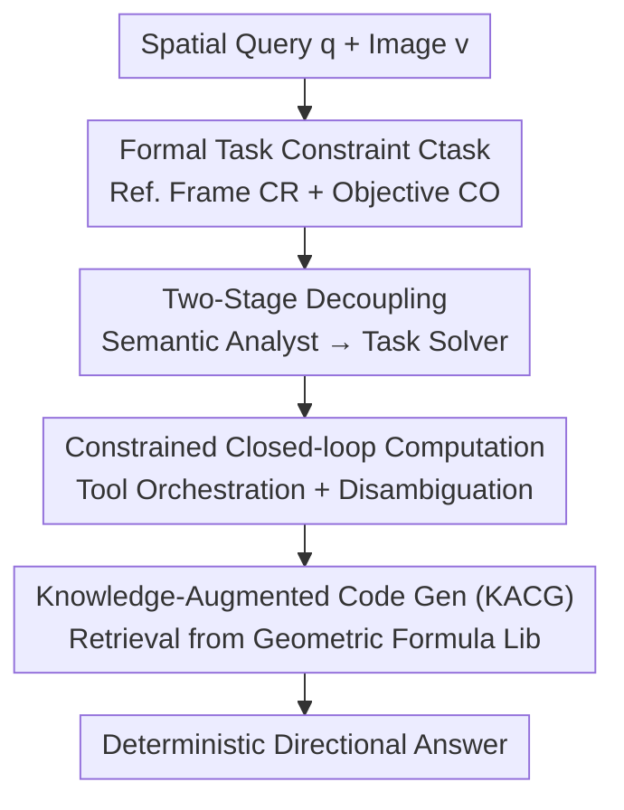

# Geometrically-Constrained Agent for Spatial Reasoning

**Conference**: CVPR 2026  
**Paper**: [CVF Open Access](https://openaccess.thecvf.com/content/CVPR2026/html/Chen_Geometrically-Constrained_Agent_for_Spatial_Reasoning_CVPR_2026_paper.html)  
**Code**: https://gca-spatial-reasoning.github.io (Project Page)  
**Area**: Multimodal VLM / Agent / Spatial Reasoning  
**Keywords**: Spatial Reasoning, VLM Agent, Formal Constraints, Neuro-symbolic, Tool-use  

## TL;DR
Addressing the "strong semantics, weak geometry" gap in VLMs for spatial reasoning, this paper proposes GCA, a training-free agent. It first utilizes the VLM as a "semantic analyst" to translate ambiguous queries into formal task constraints (reference frames + objectives), then as a "task solver" to invoke geometric tools within the deterministic boundaries of these constraints. GCA outperforms previous SOTA by approximately 27% on multiple spatial reasoning benchmarks.

## Background & Motivation
**Background**: Equipping VLMs with human-like 3D spatial reasoning (judging orientation, egocentric vs. allocentric perspectives, relative positions) is a critical requirement for robotics, AR/VR, and autonomous driving. Current approaches follow two main paradigms: end-to-end fine-tuning on large-scale spatial datasets or leveraging external tools for precise geometric calculations.

**Limitations of Prior Work**: The authors identify a fundamental "semantic-to-geometric gap"—VLMs compress rich visual information into a lossy textual semantic space where fine-grained geometric details are discarded or distorted. While VLMs possess spatial common sense (e.g., knowing "sitting on a sofa" implies alignment between the viewpoint and the sofa's orientation), they struggle with high-precision geometry (e.g., the exact orientation of the sofa) and fail to mentalize the user's egocentric perspective. Neither existing paradigm bridges this gap:
- Training-based methods suffer from the "oracle paradox": data is generated by oracles like GPT-4o, which themselves lack spatial expertise. Consequently, VLMs learn flawed spatial logic rather than reliable geometric principles.
- Tool-based methods (e.g., SpatialAgent, TIGeR) only constrain the **final calculation** but leave the VLM's **planning process** unconstrained. The VLM still performs spatial visualization and planning in a lossy semantic space. For instance, when asked for a "sofa-centric view," it often defaults to the camera view, causing the problem definition to be incorrect before any tool is even invoked.

**Key Challenge**: Confusing "what to solve" with "how to solve." Tools ensure that "how to solve" is deterministic, but "what to solve" remains stuck in the VLM's error-prone semantic imagination.

**Goal**: Instead of forcing the VLM to directly reason over lost geometric details, the objective is to **reformulate** the problem into a formal task that leverages the VLM's qualitative semantic strengths while providing deterministic constraints for subsequent computation.

**Key Insight**: Drawing inspiration from neuro-symbolic reasoning (LogicLM, LLM+P, ReKep) which uses LLMs as translators to convert natural language into verifiable formal representations. However, the authors find that existing formal languages like PDDL or keypoint constraints **cannot express** the continuous, relative, and view-dependent geometric semantics unique to spatial reasoning. Thus, a new formal constraint is designed specifically for spatial tasks.

**Core Idea**: Introduce a formal task constraint $C_\text{task}$ as a deterministic bridge between semantics and geometry, decoupling the VLM's role into two stages: "formalization" followed by "constrained computation."

## Method

### Overall Architecture
GCA (Geometrically-Constrained Agent) is a **training-free** agent paradigm. The pipeline utilizes a single VLM to perform two sequential roles without any fine-tuning. Given one or more images and a spatial query (e.g., "The fireplace faces north; which direction does the painting on the fitness area wall face?"), it outputs discrete directional answers.

It replaces the "general, iterative" strategy of traditional ReAct, $r_t = \mathcal{A}(q, v, \mathcal{T}, r_{t-1})$, with a two-stage process:

$$C_\text{task} \leftarrow \mathcal{F}_\text{formalize}(q, v), \qquad r_t = \mathcal{F}_\text{compute}(C_\text{task}, \mathcal{T}, r_{t-1}).$$

In the first stage, $\mathcal{F}_\text{formalize}$ (Semantic Analyst) translates the ambiguous query $q$ and visual information $v$ into a formal, verifiable task constraint $C_\text{task}$, defining "what to solve." In the second stage, $\mathcal{F}_\text{compute}$ (Task Solver) orchestrates a toolbox to iteratively compute the answer within the deterministic boundaries defined by $C_\text{task}$, handling "how to solve." Crucially, all planning and execution in the second stage are locked to the $C_\text{task}$ produced in the first, isolating the problem definition from the VLM's lossy semantic imagination.

### Key Designs

**1. Formal Task Constraint Ctask: A Geometric Grammar for Spatial Reasoning**

This is the core contribution. Existing formal languages fail because PDDL is suited for discrete symbolic states (`is_on(A,B)`), but cannot represent continuous, relative, view-dependent queries. $C_\text{task}$ is defined as a tuple $C_\text{task} = (C_R, C_O)$:

- **Reference Frame Constraint $C_R$**: Human understanding of "North of..." is anchored to a coordinate system. VLM failures often stem from ambiguity here (defaulting to the camera frame). GCA forces the VLM to model all spatial queries as a 3D Cartesian coordinate system—an origin $O_R$ plus three orthogonal basis vectors $(x_R, y_R, z_R)$, following OpenCV conventions ($+z_R$ forward, $+y_R$ down, $+x_R$ right-handed). This system must be anchored to one of three geometric primitives:
    - **Object-centric**: Defined by the object's intrinsic coordinates (e.g., "when washing hands" implies $+z_R = -z_\text{sink}$).
    - **Camera-centric**: Defined by a specific camera view (e.g., "from the view of Fig 1" targets $+z_R = +z_\text{cam1}$).
    - **Direction-centric**: Defined by a vector between two points (e.g., "Oven is North of Sink" sets $+z_R = \text{normalize}(\text{Centroid}(\text{oven}) - \text{Centroid}(\text{sink})) = \text{north}$).
- **Objective Constraint $C_O$**: Defines what exactly is to be measured within $C_R$.

$C_R$ is **unique and non-negotiable**, while $C_O$ specifies the target. This grammar is semantically clear enough for VLVs to generate using qualitative strengths, yet geometrically rigorous enough to serve as a deterministic contract for computation.

**2. Two-Stage Role Decoupling: Analyst then Solver**

To solve the issue of VLMs mixing "what to solve" and "how to solve," GCA uses $C_\text{task}$ as "architectural scaffolding" to align asymmetric VLM capabilities. During $\mathcal{F}_\text{formalize}$, the VLM exercises its strongest capability—qualitative semantic interpretation—to translate the query. This step is enforced procedurally **before any computation begins**. In $\mathcal{F}_\text{compute}$, the role switches to a Task Solver where all reasoning execution consumes $C_\text{task}$ as an immutable constraint. This avoids the VLM directly imagining high-fidelity geometry in a lossy semantic space.

**3. Constrained Closed-loop Geometric Computing: Tool Orchestration & Disambiguation**

The $\mathcal{F}_\text{compute}$ stage follows a ReAct-style loop but treats $C_\text{task}$ as a fixed constraint. It consists of: **Data Acquisition**—$C_\text{task}$ dictates required geometric primitives (e.g., obtaining the sink's orientation to instantiate its frame); **Tool Orchestration and Disambiguation**—the VLM manages tool feedback to ensure data correctly binds to $C_\text{task}$ symbols. For example, if the target is "the leftmost chair" but detection returns multiple chairs, the VLM analyzes bounding boxes to identify the correct index. The toolbox includes geometric/perception tools (VGGT for 3D reconstruction, open-vocabulary detection, etc.) and computational tools (Python execution engine, 2D-to-3D projection).

**4. Knowledge-Augmented Code Generation (KACG): Preventing Formula Hallucination**

Once all $C_\text{task}$ variables are bound to geometric data, the agent calls a code generator for the final calculation. LLMs often hallucinate complex geometric formulas when coding from memory. KACG acts like a **static RAG**: the framework maintains a library of verified geometric formulas. When generating code, the system **automatically retrieves** relevant fixed formulas (e.g., local-to-world transformations) based on variable types and injects them into the context. In an example calculating a painting's orientation relative to a fireplace, the code computes the world-to-reference transform `R_ref = fireplace_ori.T`, transforms the painting's vector, and applies thresholding to output discrete directions.

## Key Experimental Results

### Main Results
GCA was compared against base VLMs, training-based methods, and tool-based methods across 5 benchmarks (MMSI-Bench, MindCube-tiny, OmniSpatial, SPBench, CV-Bench). Qwen3-VL-Thinking served as the primary VLM.

| Method | Type | MMSI (All) | MindCube (All) | SPBench (All) | CV-Bench (All) | Avg. |
|------|------|------|------|------|------|------|
| GPT-4o | Base VLM | 30.3 | 35.8 | 51.0 | 76.5 | 47.6 |
| Gemini-2.5-Pro | Base VLM (Strongest) | 36.9 | 57.5 | 55.8 | 86.3 | 58.5 |
| SpatialLadder | Training-based | 25.4 | 42.3 | 44.5 | 73.7 | 51.2 |
| TIGeR | Tool-based | 27.8 | 28.3 | 49.8 | 84.5 | 47.3 |
| **GCA (ours)** | Training-free Agent | **47.6** | **64.2** | **65.1** | **86.9** | **65.1** |

GCA averages 65.1%, outperforming Gemini-2.5-Pro (+12%), SpatialLadder (+27%), and TIGeR (+38%). On the difficult MMSI-Bench, GCA achieves 47.6%, a ~28% relative improvement over the strongest baseline.

**Generalization Note**: SpatialLadder's performance drops across domains since it was fine-tuned on SPBench-related data. TIGeR succeeds on single-image CV-Bench but fails on multi-view MMSI-Bench. GCA is robust across benchmarks as it is training-free.

### Ablation Study
**Component Contributions** (MMSI-Bench base):

| Configuration | MMSI Accuracy | Description |
|------|------|------|
| CoT-Only Baseline | 32.6 | Pure chain-of-thought |
| + Tool Integration | 36.8 | Standard tool agent (+4.2) |
| + KACG | 38.7 | Knowledge-augmented code gen (+1.9) |
| + Visual Feedback | 40.1 | Management/Disambiguation (+1.4) |
| + $C_\text{task}$ (Full GCA) | **47.6** | Formal constraints (+7.5) |

**Formalization Analysis** (Comparing reasoning strategies):

| Strategy | MMSI Accuracy | Description |
|------|------|------|
| Baseline (CoT-Only) | 32.6 | No tools |
| Tool (Uncon.) | 40.1 | Unconstrained tool agent |
| Tool (Prompt) | 41.9 | Prompting "notice ref frame" only |
| **Ours ($C_\text{task}$)** | **47.6** | Formal constraints |
| Oracle (Human $C_\text{task}$) | 49.5 | Theoretical upper bound |

### Key Findings
- **Formal constraints are the source of the performance leap**: While tools and feedback add +7.5%, the introduction of $C_\text{task}$ provides an additional +7.5% independently. Weak prompting ("notice the reference frame") barely helps, proving that **verifiable formal constraints** are essential.
- **Approaching Oracle Performance**: GCA (47.6) is within 2 points of the human-annotated oracle (49.5).
- **Stronger VLMs gain more**: Integrating GCA with stronger backbones leads to a ~37% average improvement. Gemini-2.5-Pro saw the largest jump (+49%).
- **Interpretable Failure Attribution**: 30% of failures occur in formalization (complex semantics/view ambiguity) and 70% in computation (24% perception, 25% Python tool logic, 21% others).

## Highlights & Insights
- **Explicit formalization of "what to solve"** is the most significant contribution. It doesn't attempt to fix VLM geometric weaknesses but uses a verifiable intermediate representation to lock the process, allowing the VLM to focus on its semantic strengths.
- **Specialized formal grammar for spatial reasoning** (reference frames + OpenCV conventions) fills the gap left by PDDL.
- **KACG as Static RAG**: Using fixed, verified formula libraries instead of letting the LLM write math from scratch is a simple but effective technique to prevent hallucination.

## Limitations & Future Work
- **Computational Cost**: Iterative tool calls and multi-turn interactions are more expensive than end-to-end CoT. However, they provide a robust, verifiable path.
- **Data Modality**: The current toolbox is image-centric and lacks temporal tools for video or dynamic spatial reasoning.
- **Perception Bottlenecks**: 24% of errors are attributed to perception (VGGT, detection), especially in low-light or occluded scenes.

## Related Work & Insights
- **vs. Training-based (SpatialLadder, Video-R1)**: They inject 3D features via architecture fine-tuning but suffer from domain bias and flawed oracle data; GCA generalizes better via formal constraints.
- **vs. Tool-based (TIGeR)**: They leave the planning process unconstrained; GCA enforces constraints on both planning and execution.
- **vs. Neuro-symbolic (LogicLM, ReKep)**: While sharing the "LLM-as-translator" approach, GCA introduces a geometric grammar ($C_R/C_O$) where PDDL fails to express view-dependent spatial semantics.

## Rating
- Novelty: ⭐⭐⭐⭐⭐ Designing a specific formal task constraint for spatial reasoning to decouple "what" from "how" is highly novel.
- Experimental Thoroughness: ⭐⭐⭐⭐ Extensive benchmarks and ablations, though limited to static images/multi-view.
- Writing Quality: ⭐⭐⭐⭐⭐ Logical flow from the gap to the constraints is clear.
- Value: ⭐⭐⭐⭐⭐ Training-free SOTA results with interpretable paths.

<!-- RELATED:START -->

## Related Papers

- [\[CVPR 2026\] Hear you are: Teaching LLMs Spatial Reasoning with Vision and Spatial Sound](hear_you_are_teaching_llms_spatial_reasoning_with_vision_and_spatial_sound.md)
- [\[CVPR 2026\] Hierarchical Attacks for Multi-Modal Multi-Agent Reasoning](hierarchical_attacks_for_multi-modal_multi-agent_reasoning.md)
- [\[CVPR 2026\] SpaceTools: Tool-Augmented Spatial Reasoning via Double Interactive RL](spacetools_tool-augmented_spatial_reasoning_via_double_interactive_rl.md)
- [\[CVPR 2026\] EgoMind: Activating Spatial Cognition through Linguistic Reasoning in MLLMs](egomind_activating_spatial_cognition_through_linguistic_reasoning_in_mllms.md)
- [\[CVPR 2026\] InfiniBench: Infinite Benchmarking for Visual Spatial Reasoning with Customizable Scene Complexity](infinibench_infinite_benchmarking_for_visual_spatial_reasoning_with_customizable.md)

<!-- RELATED:END -->
