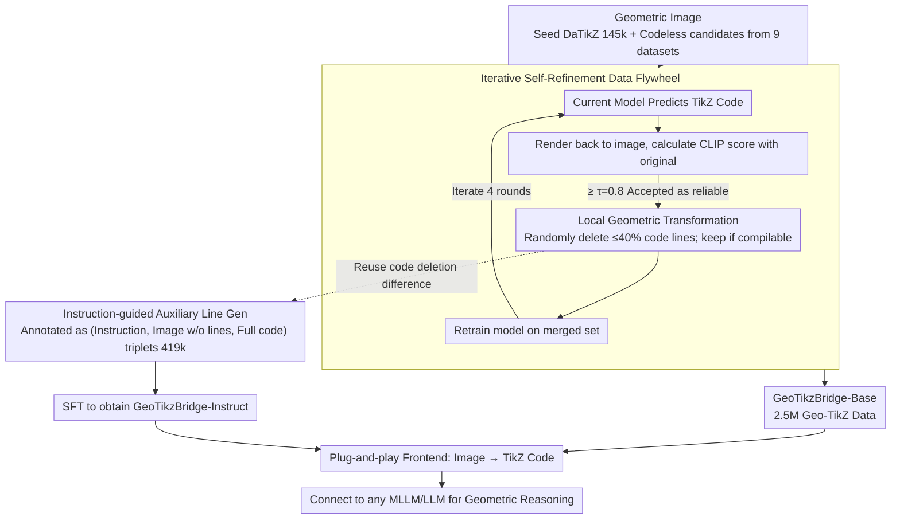

# GeoTikzBridge: Advancing Multimodal Code Generation for Geometric Perception and Reasoning

**Conference**: CVPR 2026  
**arXiv**: [2603.22687](https://arxiv.org/abs/2603.22687)  
**Code**: Available (Public)  
**Area**: Code Intelligence  
**Keywords**: Geometric Perception, TikZ Code Generation, Multimodal Reasoning, Auxiliary Line Generation, Image-to-Code

## TL;DR
GeoTikzBridge constructs the largest 2.5M image-TikZ code dataset and the first auxiliary line instruction dataset. It trains a code generation model capable of precise geometric reconstruction, which serves as a plug-and-play module to enhance the geometric reasoning capabilities of any MLLM/LLM.

## Background & Motivation

**Background**: Multimodal Large Language Models (MLLMs) have made significant strides in cross-modal perception and reasoning but still face challenges with geometric problems. Geometry requires integrating fine-grained visual perception with structured symbolic reasoning. Existing Image-to-Code methods focus primarily on Web UI to HTML/CSS or charts to Python, rarely touching upon geometric content. In mathematical reasoning, current approaches rely heavily on textual reasoning, neglecting the need for relationship transfer in geometric visual reasoning.

**Limitations of Prior Work**: MLLMs exhibit limited performance in local geometric perception, struggling to accurately parse fine-grained visual details such as segment relationships, angle sizes, and shape constraints. This is primarily due to: (1) a lack of large-scale geometric image-code datasets (DaTikZ contains only 145k samples with limited geometric coverage); and (2) insufficient modeling of subtle geometric variations by existing models.

**Key Challenge**: On one hand, geometric reasoning requires precise symbolic representations of figure structures. On the other hand, existing data and methods cannot provide sufficient geometric perception training signals for MLLMs. TikZ code is better suited for geometric reasoning than SVG because its syntax inherently records the logical steps and dependencies of geometric construction.

**Goal**: (1) How to construct a sufficiently large geometric image-TikZ code dataset for model training? (2) How to ensure the model focuses on local geometric details rather than generating generic code? (3) How to transfer geometric perception capabilities to downstream reasoning tasks?

**Key Insight**: The authors propose an iterative self-refinement strategy to expand the dataset, a local geometric transformation strategy to enhance detail perception, and instruction-guided auxiliary line generation to empower reasoning.

**Core Idea**: By building a 2.5M-scale geometric TikZ dataset through iterative data expansion and local code transformations, a geometric code generation model is trained to serve as a plug-and-play reasoning module.

## Method

### Overall Architecture
The core problem GeoTikzBridge aims to solve is accurately "translating" a geometric figure into compilable TikZ code, then using this symbolic code to support downstream geometric reasoning. The pipeline consists of three phases: first, a self-bootstrapping data flywheel expands 145k seed data to 2.5M to train the base perception model, GeoTikzBridge-Base. Next, this model is fine-tuned with auxiliary line instruction data to create GeoTikzBridge-Instruct, enabling it to add auxiliary lines to images based on instructions. Finally, these models are integrated as training-free, plug-and-play perception frontends to any MLLM/LLM, replacing "image viewing" with "code reading" to boost geometric reasoning. The input remains a geometric image, and the output is compilable TikZ code.

### Key Designs

**1. Iterative Self-Refinement Data Flywheel: Using Model Output to Scale to 2.5M Data**

Paired geometric image-code data is extremely scarce (the largest, DaTikZ, has only 145k samples with few geometric cases), and manual annotation of TikZ code is prohibitively expensive. The authors utilize a self-bootstrapping approach: training an initial model $M_0$ on the DaTikZ seed set $\mathcal{D}_0$, then collecting a large number of codeless candidate images from 9 public geometric datasets. Each iteration follows three steps: first, the current model predicts TikZ code for candidates. The rendered image is compared to the original via CLIP score. Only samples with a similarity exceeding $\tau=0.8$ are considered reliable and added to the self-refinement set $\mathcal{D}_k^R$. Next, local code transformations are applied to these samples to create an augmented set $\mathcal{D}_k^T$. Finally, the model is retrained on the merged set $\mathcal{D}_k = \mathcal{D}_{k-1} \cup \mathcal{D}_{k-1}^R \cup \mathcal{D}_{k-1}^T$. The hard threshold for the CLIP score is critical to prevent the flywheel from diverging by filtering out noisy self-generated samples, ensuring only high-confidence samples where the "render-back matches the original" enter training.

**2. Local Geometric Transformation: Forcing the Model to Focus on Every Geometric Element**

In complex images, models often "slack off," missing or hallucinating key segments or angles because they tend to memorize textual patterns of code rather than parsing the existence of each geometric element. Local code transformation addresses this by randomly deleting 1 to $n$ lines of TikZ code (up to 40%). If the remaining code is still compilable, the partial code $\tilde{C}$ and its newly rendered image $\tilde{I}$ are kept as a new sample. This injects structured noise into the code: if the image changes, the code must follow. The model can no longer rely on memorizing fixed sequences and must learn the precise mapping of "line in image ↔ line in code." This strategy reduced the code repetition rate by 15% and improved generalization and compilation robustness.

**3. Instruction-guided Auxiliary Line Generation: Reversing "Code Deletion" as Supervision for "Adding Lines"**

Many geometric problems are unsolvable without auxiliary lines, but current MLLMs often generate inaccurate ones, and data specifically annotated for auxiliary lines is nearly non-existent. The authors cleverly reuse the code transformation from Design 2: by deleting lines from samples in $\mathcal{D}_K$, the transition from the transformed image back to the original naturally represents the process of "adding geometric elements." Qwen2.5-VL-72B is used to annotate these differences as natural language instructions $Q$, and Doubao is used as a VLM filter to remove low-quality samples. This results in 419k triplets (Instruction $Q'$, Transformed Image $\tilde{I}'$, Original Code $C'$). The model learns to "view a figure missing lines, read an instruction, and complete the full code with auxiliary lines." GeoTikzBridge-Instruct is derived from SFT on the Base model.

### Loss & Training
The training target is standard causal autoregressive generation: $\mathcal{L}_{\text{gen}} = -\sum_i \log P_M(c_i | I, c_{<i})$, maximizing the log-likelihood of the next token given the image and previous code prefix. The 8B model underwent full-parameter SFT (LR 4e-7), while the 38B model used LoRA (LR 1e-4). Training utilized DeepSpeed ZeRO-3 and Flash Attention. On 8 $\times$ H100 GPUs, 8B required ~96 GPU hours and 38B required ~488 GPU hours. Greedy decoding (temperature=0) was used during inference to ensure code determinism.

## Key Experimental Results

### Main Results — Image-to-TikZ Generation

| Method | DaTikZ CLIP-S↑ | DaTikZ FID↓ | MathVista-GPS CLIP-S↑ | EDU CLIP-S↑ |
|:---|:---:|:---:|:---:|:---:|
| Qwen2.5-VL-72B | 0.795 | 49.8 | 0.858 | 0.781 |
| InternVL3-78B | 0.747 | 62.7 | 0.860 | 0.801 |
| FigCodifier-8B | 0.785 | 45.8 | 0.884 | 0.675 |
| **GeoTikzBridge-Base-8B** | **0.804** | 43.6 | **0.895** | **0.795** |
| **GeoTikzBridge-Base-38B** | **0.813** | **39.7** | **0.915** | **0.821** |

### Downstream Mathematical Reasoning Performance

| Baseline VLM | MathVista-GPS | GAOKAO-MM-Math |
|:---|:---:|:---:|
| GLM4.5-V-106B | 0.745 | 0.613 |
| +GeoTikzBridge-Base | **0.764** (+1.9%) | **0.663** (+5.0%) |
| Skywork-OR1-32B (LLM)+TikZ | **0.861** | 0.663 |
| GPT-OSS-120B (LLM)+TikZ | **0.880** | 0.688 |

### Ablation Study

| Configuration | MathVista-GPS Accuracy |
|:---|:---:|
| InternVL3.5-38B Baseline | 0.688 |
| + TikZ Code + Aux. Image | 0.697 |
| + Aux. Image + Aux. Code | 0.707 |
| + TikZ Code + Aux. Image + Code | **0.736** |

### Key Findings
- The combination of LLM + TikZ code generally outperforms VLMs viewing images directly, likely because catastrophic forgetting during vision-language alignment in VLMs impairs linguistic reasoning.
- Auxiliary lines represented as TikZ code are more effective than rendered images, suggesting symbolic representations are more critical for reasoning.
- Local code transformation significantly improves compilation success rates and CLIP scores, while reducing code repetition by 15%.
- GeoTikzBridge surpasses GPT-5.0 in geometric code perception.

## Highlights & Insights
- Using "code transformation" for two distinct purposes is ingenious: as data augmentation to improve robustness, and as an automated method for generating auxiliary line data.
- The discovery that LLM + TikZ code outperforms direct VLM perception is insightful. It suggests a new multimodal reasoning paradigm: decouple "perception" from "reasoning" by using a specialized perception model to convert images into executable symbolic representations before passing them to a pure language reasoning model.
- The effect of the iterative self-refinement flywheel is noteworthy: small initial data → weak model → auto-labeling more data → filtering + augmentation → stronger model.

## Limitations & Future Work
- Currently limited to geometric figures; not yet extended to technical diagrams like circuits or engineering blueprints.
- Auxiliary line generation depends on the VLM correctly identifying the need for lines; an incorrect initial judgment collapses the pipeline.
- Coverage is primarily focused on Euclidean and analytical geometry, with less representation of 3D geometry and topology.
- While TikZ compilation success reaches 95%+, the ~5% failure rate may impact real-world deployment.

## Related Work & Insights
- **vs FigCodifier**: Both are image-to-TikZ models, but FigCodifier uses only 8B parameters and limited data. GeoTikzBridge outperforms it using 16x the data and local transformation strategies.
- **vs DaTikZ Dataset**: DaTikZ is the previous largest (145k) but lacks geometric depth. GeoTikz-Base reaches 2.5M and specializes in geometry.
- **vs Mathematical Reasoning Models (R1 Series)**: These models excel in textual reasoning but cannot process geometric images directly. GeoTikzBridge "bridges" their reasoning capabilities with visual perception by converting images to TikZ code.

## Rating
- Novelty: ⭐⭐⭐⭐ Innovative pipeline from geometric perception to TikZ code to reasoning enhancement.
- Experimental Thoroughness: ⭐⭐⭐⭐⭐ Comprehensive coverage across image-to-code, downstream reasoning, and auxiliary line generation with detailed ablations.
- Writing Quality: ⭐⭐⭐⭐ Clear structure and intuitive architecture diagrams.
- Value: ⭐⭐⭐⭐⭐ The 2.5M dataset and plug-and-play module provide significant utility to the field of geometric reasoning.

<!-- RELATED:START -->

## Related Papers

- [\[CVPR 2026\] MM-ReCoder: Advancing Chart-to-Code Generation with Reinforcement Learning and Self-Correction](mm-recoder_advancing_chart-to-code_generation_with_reinforcement_learning_and_se.md)
- [\[CVPR 2026\] Socratic-Geo: Synthetic Data Generation and Cross-Modal Geometric Reasoning via Multi-Agent Interaction](socratic-geo_synthetic_data_generation_and_cross-modal_geometric_reasoning_via_m.md)
- [\[CVPR 2026\] CodePercept: Code-Grounded Visual STEM Perception for MLLMs](codepercept_code-grounded_visual_stem_perception_for_mllms.md)
- [\[ICLR 2026\] Enhancing Geometric Perception in VLMs via Translator-Guided Reinforcement Learning](../../ICLR2026/multimodal_vlm/enhancing_geometric_perception_in_vlms_via_translator-guided_reinforcement_learn.md)
- [\[ACL 2025\] ChartCoder: Advancing Multimodal Large Language Model for Chart-to-Code Generation](../../ACL2025/multimodal_vlm/chartcoder_chart_to_code.md)

<!-- RELATED:END -->
