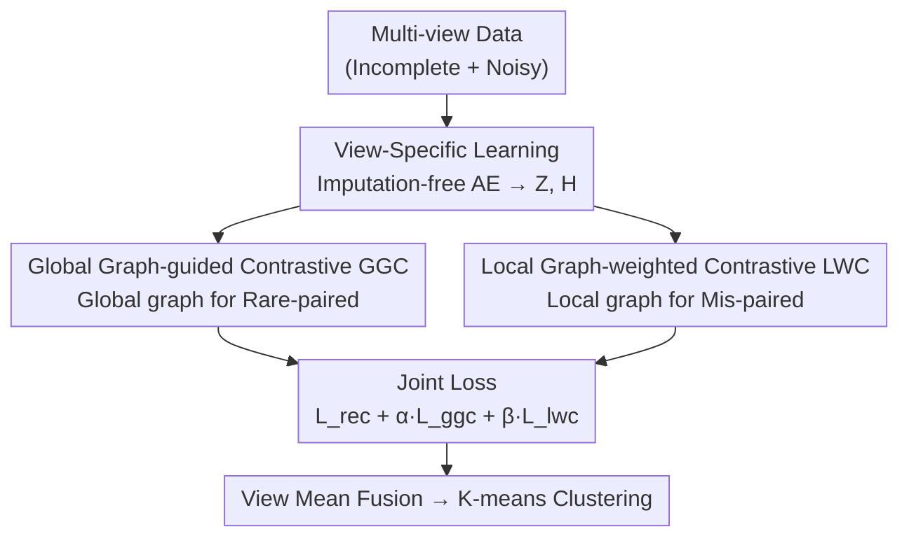

# Global-Graph Guided and Local-Graph Weighted Contrastive Learning for Unified Clustering on Incomplete and Noise Multi-View Data

**Conference**: CVPR 2026  
**Paper**: [CVF Open Access](https://openaccess.thecvf.com/content/CVPR2026/html/He_Global-Graph_Guided_and_Local-Graph_Weighted_Contrastive_Learning_for_Unified_Clustering_CVPR_2026_paper.html)  
**Code**: https://github.com/hhq-sr/GLGC  
**Area**: Multi-view Clustering / Contrastive Learning  
**Keywords**: Multi-view Clustering, Contrastive Learning, Incomplete Data, Noise Robustness, Affinity Graph

## TL;DR
GLGC addresses incomplete and noisy multi-view data without relying on data imputation. It utilizes a **global affinity graph** to generate new positive/negative pairs for incomplete views (addressing "rare-paired" issues) and a **local affinity graph** to assign adaptive weights to cross-view pairs (addressing "mis-paired" issues). Integrated into a unified contrastive learning framework, GLGC significantly outperforms SOTA methods.

## Background & Motivation

**Background**: Multi-view clustering (MVC) aims to extract complementary information from multiple views of the same sample to obtain cluster-friendly representations. Recently, **Contrastive Learning (CL) based MVC** has become mainstream—treating different views of the same sample as positive pairs and different samples as negative pairs to maximize mutual information, which naturally aligns with MVC objectives.

**Limitations of Prior Work**: Real-world multi-view data is often **both incomplete and noisy**. CL performance collapses under these conditions:
- Many samples cannot form pairs due to missing views, leading to a sharp decrease in available positive pairs as CL can only pick pairs from the "complete portion."
- Noise views paired with normal views provide incorrect supervision to the contrastive loss, misleading the model.

**Key Challenge**: Existing approaches either **impute missing data** first followed by complete MVC (e.g., COMPLETER, DCG), which risks injecting unreliable noise, or use **view-grained weighting** to suppress noisy views, which is too coarse to distinguish specific "mis-paired" sample instances. Neither approach directly addresses the "pairing itself" problem.

**Goal**: Solve two neglected problems without **any data imputation** (imputation-free):
- **rare-paired problem**: Missing views hide semantic correlations that fail to pair.
- **mis-paired problem**: Pairs formed by noisy and normal views provide erroneous supervision.

**Key Insight**: Instead of physical pairing, "pairing" should be determined by **semantic affinity in the feature space**. Graphs are used to redefine "who should be paired" and "how much to trust each pair."

**Core Idea**: A **global graph** supplements positive/negative pairs for rare-paired cases, and a **local graph** computes confidence weights for every pair—combining to form a unified global-local graph-guided contrastive learning framework.

## Method

### Overall Architecture
GLGC (Global-Local Graph based Contrastive learning) consists of two stages. **Stage 1: View-Specific Feature Learning**: An autoencoder is trained for each view using reconstruction loss to extract view-specific latent representations $\{Z^v\}_{v=1}^V$ **without imputation**; an MLP contrastive head then produces features $H^v=\mathrm{MLP}(Z^v)$. **Stage 2: Global-Local Graph Guided Contrastive Learning**: On all contrastive features, (a) **Global Graph-guided Contrastive (GGC)** constructs new pairs across all views to fix rare-paired issues, and (b) **Local Graph-weighted Contrastive (LWC)** calculates adaptive weights for each cross-view pair to suppress mis-pairing. During training, three losses (reconstruction + GGC + LWC) are jointly optimized. During testing, the mean of available view features per sample is used for K-means clustering.

### Key Designs

**1. Imputation-free View-Specific Learning: Learning clean representations without risky imputation**

To address the "noise injection" problem in imputation strategies, GLGC avoids imputation entirely. Each view $v$ uses an encoder/decoder pair $f^v_{\theta_v}/g^v_{\phi_v}$, performing reconstruction only on **actually available samples**: $\mathcal{L}_{rec}=\sum_{v=1}^V\sum_{i=1}^{N_v}\big\|x_i^v-g^v_{\phi_v}(f^v_{\theta_v}(x_i^v))\big\|_2^2$, where $N_v$ is the count of available samples for view $v$. Contrastive features $H^v=\mathrm{MLP}(Z^v)$ are derived from $Z^v=f^v_{\theta_v}(X^v)$. This "imputation-free" approach is fundamental, converting "missingness" into an opportunity for graph-based re-association rather than a hole to be filled with potentially false data.

**2. Global Graph-guided Contrastive Learning (GGC): Supplementing positive/negative pairs via a global affinity graph**

Addressing the **rare-paired** issue: Standard contrastive loss (Eq. 2) only considers physical pairs $\{h_i^v,h_i^u\}$ as positive, excluding samples with missing views.

$$\mathcal{L}^{v,u}_{con}=-\sum_{P_{ii}\in\mathcal{P}}\Big[\log\frac{e^{P_{ii}/\tau}}{\sum_{P_{ij}\in\mathcal{N}}e^{P_{ij}/\tau}}\Big]$$

GGC aggregates contrastive features of **all available samples across all views** to construct a global affinity graph $G\in\mathbb{R}^{N_c\times N_c}$ (where $N_c$ is total available samples), with edges as cosine similarity $G_{ij}=\frac{\langle h_i,h_j\rangle}{\|h_i\|\cdot\|h_j\|}$. Then, **adaptive pairing is performed by similarity**: for each node $h_i$, top $pos\%$ similar nodes form positive pairs, and bottom $neg\%$ form negative pairs:

$$\begin{cases}\{h_i,h_j\}\in\mathcal{P}_{ggc}, & \text{if } G_{ij}>\text{top-}pos\%\text{ of row }i\\ \{h_i,h_j\}\in\mathcal{N}_{ggc}, & \text{if } G_{ij}<\text{bottom-}neg\%\text{ of row }i\end{cases}$$

The GGC loss $\mathcal{L}_{ggc}$ is then calculated on these new pairs. Crucially, positive pairs are no longer restricted to physical pairs but focus on "semantic proximity," allowing incomplete samples to form positive pairs via direct or indirect semantic associations across all views.

**3. Local Graph-weighted Contrastive Learning (LWC): Adaptive weighting via local affinity graphs**

Addressing the **mis-paired** issue: Noisy views paired with normal ones provide false supervision, yet Eq. 2 treats all pairs equally. LWC calculates an **adaptive weight** for each pair to determine its "trustworthiness." Within each mini-batch ($n\le N$), a local affinity graph $W^{(u,v)}_{ij}=\exp\!\big(-\frac{\|h_i^u-h_j^v\|^2}{\sigma}\big)$ is constructed between view features $\{H^u,H^v\}$. To capture indirect semantic associations, high-order propagation is applied: $\hat{W}^{(u,v)}=W^{(u,v)}(W^{(v,v)})^{T}$. This weight is integrated into the positive pair numerator of the contrastive loss:

$$\mathcal{L}^{u,v}_{lwc}=-\sum_{P_{ii}\in\mathcal{P}_{lwc}}\Big[\log\frac{\hat{W}^{(u,v)}_{ii}\,e^{P_{ii}/\tau}}{\sum_{P_{ij}\in\mathcal{N}_{lwc}}e^{P_{ij}/\tau}}\Big]$$

$\mathcal{L}_{lwc}$ is the sum over all view pairs. Intuitively, large $\hat{W}^{(u,v)}_{ii}$ signals semantic consistency in the local neighborhood, magnifying the positive pair term (strengthening attraction), while unreliable noisy pairs receive smaller weights, weakening the attraction. LWC achieves **sample-pair granularity** discrimination.

### Loss & Training
The total loss is: $\mathcal{L}_{GLGC}=\mathcal{L}_{rec}+\alpha\mathcal{L}_{ggc}+\beta\mathcal{L}_{lwc}$, where $\alpha,\beta$ are trade-off coefficients. Training starts with $\mathcal{L}_{rec}$ pre-training, followed by iterations: sample mini-batch → infer $\{\hat{X}^v,H^v\}$ → compute global graph $G$ and high-order local graph $\hat{W}^{(u,v)}$ → joint loss backpropagation. Implementation details include encoder architecture $X^v\to500\to500\to2000\to Z^v$, $\dim Z^v=512$, $\dim H^v=128$, batch=256, $\tau=0.5$, using Adam optimizer. Training complexity is approximately $O(N)$ relative to sample size.

## Key Experimental Results

Datasets: DHA, LandUse-21, ProteinFold, ALOI. Settings: **Incomplete** (random view deletion), **Noise** (Gaussian noise), and **Incomplete + Noise**. Metrics: ACC / NMI. Baselines include DSIMVC, CPSPAN, RPCIC, SCSL, DCG, GHICMC, and FreeCSL.

### Main Results

ACC under Incomplete settings (selected, missing rates 0.5 / 0.7 / 1.0; GLGC vs second-best FreeCSL):

| Dataset | Missing Rate | FreeCSL | GLGC | Gain |
|---------|--------------|---------|------|------|
| DHA | 0.5 | 67.2 | **75.5** | +8.3 |
| DHA | 1.0 | 32.0 | **39.4** | +7.4 |
| ProteinFold | 0.7 | 20.8 | **28.7** | +7.9 |
| ALOI | 0.7 | 75.5 | **85.4** | +9.9 |
| ALOI | 1.0 | 48.1 | **82.8** | +34.7 |

On ALOI, GLGC outperforms FreeCSL by 11.7% average ACC. In the extreme case of 1.0 missing rate, GLGC is 34.7% higher, proving that GGC's global associations are vital for heavy data loss. Under noisy settings, as the noise rate increases on ProteinFold, GLGC's ACC only drops by 2.3% compared to 9.1% for the next best method, demonstrating LWC's robustness.

### Ablation Study

Ablation of loss components (ACC, selected I = Incomplete / N = Noise / I+N):

| Setting | Configuration | LandUse-21 | ProteinFold | Description |
|---------|---------------|------------|-------------|-------------|
| I | $\mathcal{L}_{rec}$ only | 15.1 | 17.0 | Reconstruction only |
| I | + $\mathcal{L}_{ggc}$ | 23.3 | 17.1 | LandUse +8.2 |
| I | Full | **26.9** | **30.6** | All components |
| N | $\mathcal{L}_{rec}$ only | 22.0 | 17.4 | Reconstruction only |
| N | + $\mathcal{L}_{lwc}$ | 25.6 | 19.7 | ProteinFold +4.9 |
| N | Full | **27.4** | **31.5** | All components |

### Key Findings
- **GGC targets incompleteness; LWC targets noise**: Duties are clearly divided. $\mathcal{L}_{ggc}$ improved LandUse-21 ACC by 8.2% in incomplete settings, while $\mathcal{L}_{lwc}$ improved ProteinFold ACC by 4.9% in noisy settings.
- **Weighting mechanism (high-order local graph $\hat W$) is effective**: Adding weight $W$ increased ACC on DHA (incomplete) from 64.2% to 75.5% and on ProteinFold (noise) from 26.8% to 31.5%, showing that sample-pair adaptive weighting effectively suppresses unreliable correspondences.
- **Performance gap widens in extreme scenarios**: The 34.7% lead on ALOI at 1.0 missing rate signifies that global graph pairing benefits grow as physical pairing becomes rarer.

## Highlights & Insights
- **Redefining "Data Issues" as "Pairing Issues"**: Instead of fixing data, the method fixes "who to pair" and "weighting," avoiding the "fake data → fake supervision" loop of imputation routes.
- **Global vs. Local complementary roles**: Global graph (all samples) fixes "rare-paired" by supplementing pairs; local graph (batch-wise, high-order) fixes "mis-paired" via confidence weighting.
- **Transferable Trick**: Multiplying InfoNCE numerators by local affinity $\hat W_{ii}$ is a lightweight, plug-and-play sample-pair confidence mechanism applicable to any contrastive learning task with noisy correspondences.

## Limitations & Future Work
- **Quadratic complexity of cross-view pairs**: Calculating affinities and high-order graphs per batch is $O(V^2|B|^2)$, which becomes overhead-heavy when view count $V$ is high (e.g., ProteinFold).
- **Multiple hyperparameters**: $pos\%/neg\%$ thresholds, $\sigma$, and $\alpha/\beta$ require tuning; sensitivity analysis across all datasets is not fully explored.
- **Restricted noise types**: Experiments used Gaussian perturbations (feature noise), which differs from noisy correspondence (incorrect labels/pairs). Robustness to the latter is not directly verified.
- Dataset scale is relatively small (ALOI 10.8k max); scalability of the global graph on massive datasets needs testing.

## Related Work & Insights
- **vs. Imputation-based incomplete MVC (COMPLETER / DCG / CPSPAN)**: Ours is imputation-free, using a global graph to supplement pairs directly and avoiding extra noise from restoration.
- **vs. View-grained weighting for noise (Wang et al. / Xu et al.)**: Ours uses LWC for sample-pair granularity weighting, distinguishing specific mis-paired instances rather than penalizing an entire view.
- **vs. Previous Contrastive MVC (FreeCSL, etc.)**: Prior works still rely on physical pairs, ignoring the hidden semantic associations and the impact of individual noisy pairs.

## Rating
- Novelty: ⭐⭐⭐⭐ Treats incompleteness/noise as pairing issues and solves them via global-local graphs.
- Experimental Thoroughness: ⭐⭐⭐⭐ Systemic comparison across 4 datasets and 3 settings, but lacks massive scale data.
- Writing Quality: ⭐⭐⭐⭐ Clear problem definitions (rare/mis-paired) and complete formulas.
- Value: ⭐⭐⭐⭐ Imputation-free + pair-level weighting is highly transferable to other noisy correspondence tasks.

<!-- RELATED:START -->

## Related Papers

- [\[CVPR 2026\] Multi-Hierarchical Contrastive Spectral Fusion for Multi-View Clustering](multi-hierarchical_contrastive_spectral_fusion_for_multi-view_clustering.md)
- [\[CVPR 2026\] Reliable Clustering Number Estimation for Contrastive Multi-View Clustering](reliable_clustering_number_estimation_for_contrastive_multi-view_clustering.md)
- [\[CVPR 2026\] Imbalanced View Contribution Evaluation and Refinement for Deep Incomplete Multi-View Clustering](imbalanced_view_contribution_evaluation_and_refinement_for_deep_incomplete_multi.md)
- [\[CVPR 2026\] Learning Anchor in Dual Orthogonal Space for Fast Multi-view Clustering](learning_anchor_in_dual_orthogonal_space_for_fast_multi-view_clustering.md)
- [\[CVPR 2026\] Anti-Degradation Lifelong Multi-View Clustering](anti-degradation_lifelong_multi-view_clustering.md)

<!-- RELATED:END -->
