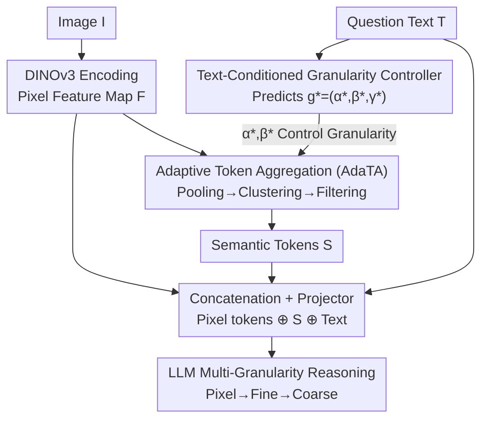

# Granulon: Awakening Pixel-Level Visual Encoders with Adaptive Multi-Granularity Semantics for MLLM

**Conference**: CVPR 2026  
**Paper**: [CVF Open Access](https://openaccess.thecvf.com/content/CVPR2026/html/Mao_Granulon_Awakening_Pixel-Level_Visual_Encoders_with_Adaptive_Multi-Granularity_Semantics_for_CVPR_2026_paper.html)  
**Code**: https://github.com/jinlab-imvr/Granulon  
**Area**: Multimodal VLM  
**Keywords**: Pixel-level visual encoder, DINOv3, text-conditioned granularity control, token aggregation, multi-granularity reasoning  

## TL;DR
Granulon enhances pixel-level visual encoders (represented by DINOv3)—which excel at details but lack coarse-grained semantic abstraction—with a "text-conditioned granularity controller + adaptive token aggregation" module. This allows a single encoder to dynamically perform "pixel $\rightarrow$ fine $\rightarrow$ coarse" multi-granularity reasoning based on the question's semantics in a single forward pass. Under identical settings, it achieves approximately a 30% increase in inference accuracy and a 20% reduction in hallucination rates.

## Background & Motivation
**Background**: Current mainstream MLLMs (LLaVA, QwenVL, InternVL, etc.) almost exclusively use CLIP-based encoders as visual frontends. These rely on large-scale image-text contrastive learning to achieve strong global semantic alignment, providing excellent zero-shot understanding and cross-domain generalization.

**Limitations of Prior Work**: CLIP features consist of global semantics at fixed resolutions. Since it learns "overall image-text consistency," it favors global concepts while ignoring local textures and geometric details, leading to information loss and blurred representations in tasks requiring fine-grained understanding (counting colors, identifying small objects, medical details). Conversely, self-distilled pixel-level encoders like DINOv3 possess extreme detail perception but lack mechanisms to abstract scenes into coarse-grained semantics, limiting their coarse-grained reasoning when used as the sole MLLM frontend.

**Key Challenge**: Fine-grained pixel perception (DINOv3) and coarse-grained semantic abstraction (CLIP) naturally sit at opposite ends of the spectrum. A single encoder lacks the "adjustable granularity" dimension. Existing compromises involve concatenation of CLIP and DINO dual-encoders, which is computationally expensive and fails to address the fundamental issue—the lack of a unified coarse-to-fine granularity within a single encoder.

**Goal**: Rather than using dual encoders, the goal is to enable a single pixel-level encoder (DINOv3) to acquire "task-adaptive semantic granularity," transforming granularity from a passive property into an active dimension controlled by text.

**Key Insight**: The authors observe that the question itself carries a signal regarding "how fine one should look"—"What animals are in the image?" requires global coarse-grained perception, whereas "What color are the dog's ears?" requires local fine-grained perception. Therefore, text should conditionally inform the visual stream on which granularity level to aggregate.

**Core Idea**: A text-driven granularity controller predicts the target abstraction level, followed by an adaptive token aggregation module that "pools, clusters, and filters" pixel features into compact semantic tokens based on that level. These are fed to the LLM alongside original pixel tokens to achieve unified "pixel $\rightarrow$ fine $\rightarrow$ coarse" reasoning in a single pass.

## Method

### Overall Architecture
Granulon takes image $I$ and question text $T$ as input to produce a multimodal answer. The pipeline explicates the judgment of "visual granularity": the image passes through a frozen DINOv3 to obtain a pixel-level feature map $F$; the question text simultaneously enters the **Granularity Controller** to predict parameters $g^*=(\alpha^*,\beta^*,\gamma^*)$ for spatial downsampling, cluster count, and projector weights. These parameters drive the **AdaTA module** to perform "granularity-guided pooling $\rightarrow$ relation-aware clustering $\rightarrow$ quality filtering" on $F$, producing semantic tokens $S$. Finally, pixel tokens, semantic tokens $S$, and text embeddings are concatenated and fed into the LLM via a multimodal projector. The overall formula is $F_{\text{mix}}(I,T)=\Phi_{\gamma^*}\big(F\oplus A_{\pi_\theta}(F;T_e)\big)\oplus T_e$, where $\Phi_{\gamma^*}$ is the projector, $A(\cdot)$ is AdaTA, and $T_e$ is the text embedding.

### Key Designs

**1. Text-Conditioned Granularity Controller: Letting the Question Decide Granularity**

This addresses the absence of adjustable granularity in single encoders. Since the question suggests the required visual scale, text predicts it. The controller formalizes the granularity hypothesis space as $\pi_\Theta=\{g_k\}_{k=1}^n$, where each $g_k=(\alpha_k,\beta_k,\gamma_k)$ defines spatial downsampling ($\alpha_k$), cluster cardinality ($\beta_k$), and projector weights ($\gamma_k$). Given question $T$, the controller outputs a distribution $\bar g=\sum_{k=1}^n p_k g_k$ and selects $g^*=\arg\max_{g_k\in\bar g}p(g_k\mid T)$.

The mapping is $\sum_k p(g_k\mid T_e)\,g_k=\Phi_{\text{MLP}}\circ\Psi_{\text{agg}}\circ L^{(1)}(T_e)$: the first LLM block $L^{(1)}$ acts as a language encoder to capture semantic focus, $\Psi_{\text{agg}}$ performs mean pooling and projection for a compact descriptor $h=W_p\,\sigma\big(\tfrac{1}{L}\sum_i E^{(1)}_i\big)$, and the MLP head outputs logits for the distribution. It is trained on "text-granularity" corpora annotated by GPT-4o, learning to map linguistic intent to perceptual scales. Unlike DynamicViT/EViT (bottom-up visual saliency pruning) or LLaVA-NeXT (attention on fixed tokens), this is a **top-down approach where text determines granularity before aggregating vision**.

**2. Adaptive Token Aggregation (AdaTA): Compressing Pixels into Semantic Tokens**

AdaTA uses $g^*$ to aggregate DINOv3's pixel features into semantic tokens in three stages:

(a) **Granularity-Guided Pooling**: Defines pooling kernel $K_{\alpha^*}$ to reduce dimensions of features and attention: $F_{\alpha^*}=K_{\alpha^*}^\top F K_{\alpha^*},\ A_{\alpha^*}=K_{\alpha^*}^\top A K_{\alpha^*}$. Coarse granularity triggers strong downsampling (e.g., 4x4), while fine granularity keeps $K_{\alpha^*}$ near identity.

(b) **Relation-Aware Clustering**: Runs mini-k-means on $F_{\alpha^*}$ and $A_{\alpha^*}$ with cluster count $M_{\beta^*}$. Target: $\{c_j\}=\arg\min\sum_i\min_j\big[\|a_i-c_j\|^2+\lambda_f\delta_{i,j}\big]$, where $\delta_{i,j}$ is attention-based distance. Cluster centers encode both visual similarity and relational consistency.

(c) **Quality Filtering & Refinement**: Computes a composite score $s_j=\eta_1 S_{\text{size}}(j)+\eta_2 S_{\text{coh}}(j)-\eta_3 S_{\text{disp}}(j)$ to reward spatial support and semantic homogeneity while penalizing dispersion. Top-K clusters form the final semantic tokens $S$, balancing global abstraction and local detail.

**3. Pixel-Semantic Joint Likelihood Objective: Balancing Dual Token Contributions**

To ensure the model utilizes both token types, the authors maximize the joint likelihood: $\arg\max_{\pi_\Theta}\mathbb{E}_{(I,T)}\big[\underbrace{\mathbb{E}_{v_i\in F}\log p_{\pi_\Theta}(C_{\text{pixel}}\mid v_i,T)}_{\text{Detail Contribution}}+\lambda\underbrace{\mathbb{E}_{t_j\in A_{\pi_\Theta}(F)}\log p_{\pi_\Theta}(C_{\text{sema}}\mid t_j,T)}_{\text{Granularity Contribution}}\big]$. The first term measures the detail contribution of pixel tokens $v_i$, and the second measures the global contribution of semantic tokens $t_j$. The final loss is $\mathcal{L}=\mathcal{L}_{\text{task}}+\lambda_d\mathcal{L}_{\text{pixel}}+\lambda_t\mathcal{L}_{\text{sema}}$, forcing the model to adaptively weight pixel-level and semantic-level tokens.

### Loss & Training
Experiments used the LLaVA framework, replacing only the visual encoder. Language backbones include Qwen-2.5-Instruct-1.5B and Llama-3.2-3B. Training on 8xH200 for 2 epochs, batch size 128, learning rate $2\times10^{-5}$. The training objective is $\mathcal{L}$ as defined above.

## Key Experimental Results

### Main Results
Evaluation across 5 benchmarks (VQA: SEED-Bench / A-OKVQA; Caption: CC12M / ImageNet21K Recap; Reasoning: FLUX-Reason; Medical: SurgVLM). GPT-4o acted as judge for semantic accuracy/hallucination/granularity. Recall is reported for VQA, BERTscore for Caption. Table shows Granulon (Ours) vs. other encoders under Qwen2.5 (values in Recall/GPTscore %):

| Encoder | SEED Recall | A-OKVQA Recall | Caption GPTscore | Reasoning GPTscore |
|---------|-------------|----------------|------------------|--------------------|
| CLIP | 50.91 | 21.79 | 21.54 | 29.36 |
| SigLIP | 46.72 | 21.89 | 13.59 | 23.59 |
| DINOv2 | 41.40 | 16.67 | 14.36 | 36.67 |
| DINOv3 | 55.74 | 47.43 | 23.97 | 45.31 |
| **Ours** | **58.80** | **57.13** | **31.28** | **49.31** |

Compared to CLIP, SEED-Bench Recall +7.89%, A-OKVQA Recall +35.34%. For Reasoning (Llama3.2 backbone), GPTscore reached 56.67%, outperforming DINOv2 and CLIP by +37.18% and +27.70% respectively.

### Medical Domain Generalization

| Encoder | Phase BERTscore | Phase Recall | Instrument BERTscore | Instrument Recall |
|---------|-----------------|--------------|----------------------|-------------------|
| CLIP | 91.64 | 46.15 | 94.44 | 46.92 |
| DINOv3 | 94.71 | 64.10 | 97.41 | 68.89 |
| **Ours** | **97.32** | **76.92** | **97.95** | **76.07** |

In surgical video phase and instrument identification, Recall increased by +30.77% and +12.82% over CLIP and DINOv3, proving adaptive granularity preserves discriminative power in specialized detail-oriented scenarios.

### Ablation Study

| Configuration | Key Findings |
|---------------|--------------|
| Semantic Token Granularity | Coarse config (5 clusters) helps A-OKVQA (~+20%); Reasoning improves with more clusters (up to ~45%). Optimal granularity is task-dependent. |
| Without Controller | Average GPTscore drops significantly; adaptive granularity selection is essential. |
| Controller + AdaTA Joint | Up to +39.7% improvement over vanilla DINOv3 with only +10% more tokens. |

### Key Findings
- **Granularity is Task-Dependent**: Coarse-grained tasks (A-OKVQA) benefit from fewer clusters for strong abstraction; fine-reasoning tasks (FLUX-Reason) improve with more clusters.
- **Efficiency of Granularity Choice**: The adaptive version uses only ~10% more tokens than fixed versions but achieves a +39.7% gain, proving the quality of selection matters more than quantity.
- **Reduces Hallucination**: Hallucination rates dropped by 6.0%/4.6% vs CLIP/DINOv3 in Captioning; reasoning hallucination dropped from 61.3% (DINOv3) to 46.3%.
- **Deeper Alignment**: Cosine similarity between text hidden states and encoder layers reached ~0.80 for Granulon vs ~0.60 for CLIP, indicating multi-scale representations better support LLM hierarchical reasoning.

## Highlights & Insights
- **Granularity as an Independent Dimension**: Instead of bottom-up pruning, Granulon uses a top-down approach where text predicts granularity before aggregating vision.
- **"Awakening" vs. Replacement**: Rather than stacking dual encoders, it complements DINOv3 with coarse-grained abstraction, solving the root cause within a single forward pass.
- **AdaTA as a Reusable Template**: The pooling-clustering-filtering pipeline is a portable method for any vision frontend requiring token compression and semantic abstraction.
- **Hallucination-Granularity Link**: By analyzing granularity scores alongside hallucination scores, the paper posits that aligning fine-to-coarse scales helps LLMs balance detail fidelity with semantic coherence.

## Limitations & Future Work
- The controller depends on GPT-4o for training signals; label noise and bias effects were not fully discussed.
- The granularity space $\{g_k\}$ is discrete and predefined; the selection of $\alpha/\beta/\gamma$ values may limit expressiveness.
- Evaluation was limited to smaller LLMs (1.5B/3B); gains on larger LLMs remain to be verified.
- The mini-k-means and Top-K filtering introduce clustering overhead; the impact on end-to-end latency requires more scrutiny.

## Related Work & Insights
- **vs CLIP / SigLIP**: These prioritize global semantics but lose details; Granulon uses DINOv3 to retain details while adding adaptive abstraction.
- **vs DINOv3 (Vanilla)**: DINOv3 lacks coarse-grained reasoning; Granulon "awakens" this capability via an external controller without changing DINOv3 weights.
- **vs Dual-Encoders**: Dual-encoders are computationally expensive; Granulon achieves multi-granularity with a single encoder.
- **vs DynamicViT / LLaVA-NeXT**: Whereas prior works prune tokens or use regional attention, Granulon controls the "abstraction level" through top-down text guidance.

## Rating
- Novelty: ⭐⭐⭐⭐⭐ Making granularity a text-controllable dimension is a fresh perspective.
- Experimental Thoroughness: ⭐⭐⭐⭐ Extensive benchmarks and domain generalization, though LLM size is small.
- Writing Quality: ⭐⭐⭐⭐ Clear framework and formulas.
- Value: ⭐⭐⭐⭐⭐ Provides a computationally efficient path for using pixel-level encoders in MLLMs.

<!-- RELATED:START -->

## Related Papers

- [\[CVPR 2026\] Boosting Visual Reprogramming for CLIP with Dual Granularity Alignment](boosting_visual_reprogramming_for_clip_with_dual_granularity_alignment.md)
- [\[CVPR 2026\] TerraScope: Pixel-Grounded Visual Reasoning for Earth Observation](terrascope_pixel-grounded_visual_reasoning_for_earth_observation.md)
- [\[ACL 2025\] AVG-LLaVA: An Efficient Large Multimodal Model with Adaptive Visual Granularity](../../ACL2025/multimodal_vlm/avg-llava_an_efficient_large_multimodal_model_with_adaptive_visual_granularity.md)
- [\[CVPR 2026\] CoV-Align: Efficient Fine-grained Cross-Modal Alignment with Cohesive Visual Semantics Priority](cov-align_efficient_fine-grained_cross-modal_alignment_with_cohesive_visual_sema.md)
- [\[CVPR 2026\] Multi-modal Test-time Adaptation via Adaptive Probabilistic Gaussian Calibration](multi-modal_test-time_adaptation_via_adaptive_probabilistic_gaussian_calibration.md)

<!-- RELATED:END -->
