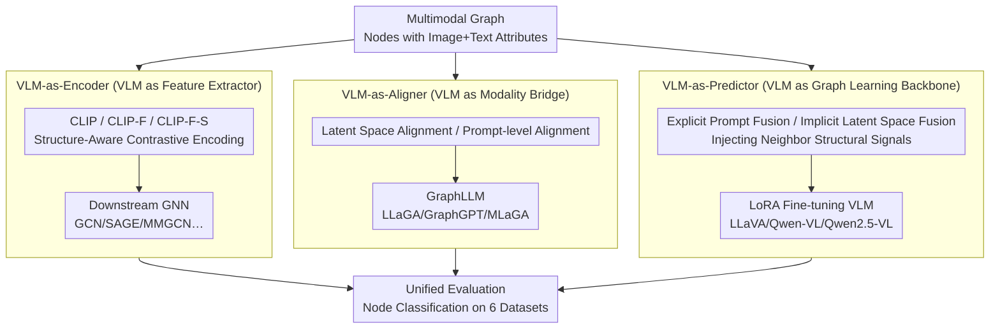

# GraphVLM: Benchmarking Vision Language Models for Multimodal Graph Learning

**Conference**: CVPR 2026  
**arXiv**: [2603.13370](https://arxiv.org/abs/2603.13370)  
**Code**: [https://github.com/oamyjin/GraphVLM](https://github.com/oamyjin/GraphVLM) (Open Source)  
**Area**: Multimodal VLM / Graph Learning  
**Keywords**: Multimodal Graph Learning, VLM Role Analysis, Graph Neural Networks, benchmark, structure-aware reasoning

## TL;DR
This paper proposes the GraphVLM benchmark to systematically evaluate three roles of VLMs in multimodal graph learning: VLM-as-Encoder (enhancing GNN features), VLM-as-Aligner (bridging modalities for LLM reasoning), and VLM-as-Predictor (acting directly as a graph learning backbone). Experiments across six datasets demonstrate that VLM-as-Predictor consistently achieves the best performance, revealing the significant potential of VLMs as a new foundation for multimodal graph learning.

## Background & Motivation

**Background**: VLMs have achieved great success in aligning paired modalities (image-text), but their multimodal reasoning capabilities for structured data (entities connected via graphs) remain largely unexplored. Multimodal Graph Learning (MMGL) currently consists of GNN-based and LLM-based approaches, while the third paradigm—using VLMs directly as a graph learning backbone—is nearly non-existent.

**Limitations of Prior Work**: (a) Existing MMGL lacks a unified evaluation pipeline, preventing fair comparisons between GNN, LLM, and VLM methods; (b) binary GNN methods mostly use naive feature concatenation for multimodal fusion; (c) the potential of VLMs in graph learning has been confined to zero-shot reasoning, leaving their capabilities as trainable backbones unexplored.

**Key Challenge**: VLMs possess innate cross-modal alignment capabilities, but how can these capabilities be combined with the relational structure of graphs? What is the most effective way to utilize VLMs for multimodal graph learning?

**Goal**: To establish a systematic benchmark that uniformly evaluates different roles of VLMs in multimodal graph learning and identifies the most effective paradigm.

**Key Insight**: The roles of VLMs in MMGL are decomposed into three complementary functions—acting as an encoder, an aligner, and a predictor—to be compared through systematic experimentation.

**Core Idea**: VLM-as-Predictor (directly fine-tuning the VLM as a graph learning backbone with structural signal injection) is the most effective paradigm for multimodal graph learning.

## Method

### Overall Architecture
The same multimodal graph (nodes with image and text attributes) is processed through three paradigms: VLM-as-Encoder uses VLM as a feature extractor to feed downstream GNNs; VLM-as-Aligner uses VLM as a modality bridge to inject images into existing GraphLLMs; VLM-as-Predictor directly fine-tunes the VLM via LoRA and injects structural signals. All three pipelines converge on a unified evaluation (node classification on six datasets: four Amazon e-commerce, one Reddit, and one CDs) to fairly compare the roles. Each paradigm includes various versions (different encoders, alignment layers, and fusion strategies) to analyze which usage and injection layer are most effective.

### Key Designs

**1. VLM-as-Encoder: Using VLMs as Feature Extractors for Downstream GNNs**

This paradigm investigates the impact of multimodal feature quality on GNNs and whether structure-aware encoding outperforms naive concatenation. Three progressively stronger encoders are designed: (a) pre-trained CLIP for simple feature concatenation; (b) CLIP-F, which fine-tunes CLIP on graph data using contrastive learning; (c) CLIP-F-S, a structure-aware version that integrates CLIP into the GNN framework for joint optimization, utilizing a structure-aware contrastive loss to align multimodal features with graph topology (neighboring node features are pulled closer). Regardless of the encoder, features are fed into downstream GNNs (GCN, GraphSAGE, MMGCN, MGAT, UniGraph2) for node classification. The performance ceiling here is limited by the GNN itself.

**2. VLM-as-Aligner: Using VLMs as Modality Bridges for GraphLLMs**

GraphLLMs usually process textual graphs; this paradigm explores how to introduce images. Two alignment strategies are used. Latent space alignment operates at the representation layer, replacing original unimodal node representations with CLIP multimodal embeddings. Prompt-level alignment operates at the text layer, using Qwen-VL to translate images into descriptions appended to node text attributes, optionally including visual descriptions of neighbors (structure-aware enhancement). This tests whether VLM alignment capabilities benefit GraphLLMs and at which layer.

**3. VLM-as-Predictor: Fine-tuning VLMs as Graph Learning Backbones with Structural Injection**

This is the primary paradigm advocated by the authors. Given that VLMs possess strong multimodal reasoning, rather than using them as pre-processors for GNN/LLM layers (which leads to information loss), this approach uses LoRA to fine-tune VLMs (LLaVA-1.5, Qwen-VL, Qwen2.5-VL) as task-specific backbones. To feed "graph structure" into a VLM that typically processes single nodes, two injection paths are provided. Explicit Prompt Fusion concatenates attributes of the anchor node and its top-3 most similar neighbors into an instruction prompt. Implicit Latent Space Fusion applies average pooling to neighbor visual patch and text token embeddings, injecting them directly into the VLM latent space. Both paths support text, visual, or multimodal neighbor configurations to determine the most effective structural signal and injection layer.

## Key Experimental Results

### Main Results (Cross-paradigm Comparison, Average of 6 Datasets)

| Paradigm | Representative Methods | Average Best Performance | Description |
|------|---------|------------|------|
| VLM-as-Encoder | CLIP + GraphSAGE | Medium | High CLIP feature quality but limited by GNN bottleneck |
| VLM-as-Aligner | CLIP/Qwen-VL + MLaGA | Upper-Medium | Latent space alignment outperforms prompt alignment |
| VLM-as-Predictor | Qwen2.5-VL + SFT | Best | Consistently superior, especially with structural enhancement |

### Ablation Study (VLM-as-Encoder)

| Encoder | GraphSAGE Performance | Description |
|--------|-------------|------|
| ImageBind | Lower | Basic multimodal encoding |
| CLIP | High | Strong cross-modal alignment |
| CLIP-F (Fine-tuned) | Slightly High/Equal | Domain fine-tuning sometimes yields no significant gain |
| CLIP-F-S (Structure-aware) | Slight Improvement | Effective on specific datasets |

### Comparison of Fusion Strategies (VLM-as-Predictor)

| Fusion Strategy | Gain | Description |
|---------|------|------|
| No structural info | Baseline | VLM observes individual nodes only |
| Prompt-level Fusion | Improvement | Neighbor text/visual info added to prompt |
| Latent Space Fusion | Maximum Improvement | Aggregate neighbor features injected into latent space |

### Key Findings
- **VLM-as-Predictor is consistently optimal**: It outperforms GNN and LLM methods across 6 datasets, indicating that VLM as a backbone with structural enhancement is the most effective MMGL paradigm.
- **Latent space fusion outperforms prompt fusion**: Integrating modality and structural signals at the feature level is more consistent than using natural language descriptions in prompts.
- **CLIP is already a powerful encoder**: The feature quality of pre-trained CLIP is high, and the gains from further fine-tuning are limited.
- **Structural information is most valuable in VLM-as-Predictor**: The performance gain from neighbor information is greater when injected into a VLM than into a GNN or LLM.
- **Qwen2.5-VL > Qwen-VL > LLaVA-1.5**: Newer and stronger VLM bases result in better graph learning performance.

## Highlights & Insights
- **Systematic classification of the three roles** (Encoder/Aligner/Predictor) provides a clear framework for understanding VLM positioning in graph learning. This taxonomy can be extended to other structured data tasks.
- **The conclusion that "VLM-as-Predictor is optimal"** is instructive: it suggests VLMs should be treated as first-class backbones for graph learning rather than mere feature extractors or bridges.
- **Systematic comparison of latent space vs. prompt fusion** provides a clear direction for architectural design: structural information should be injected at the feature level.
- The comprehensive comparison across 6 datasets, three paradigms, and multiple sub-methods constitutes the most complete benchmark in this field.

## Limitations & Future Work
- Focuses only on node classification, excluding link prediction or graph classification.
- Datasets are limited to Amazon e-commerce and Reddit (lacking knowledge graphs or molecular graphs).
- LoRA fine-tuning for VLM-as-Predictor requires labeled data and is not a true zero-shot method.
- Considers only image and text modalities, excluding audio or video.
- Scalability of VLMs for large-scale graphs is not discussed (inference cost per node is high).

## Related Work & Insights
- **vs. MM-Bench [Zheng et al.]**: MM-Bench covers only GNN-based methods. GraphVLM is the first to uniformly cover GNN, LLM, and VLM backbones.
- **vs. MAGB [Wei et al.]**: MAGB covers GNN and zero-shot VLM but does not explore VLM fine-tuning. GraphVLM fully covers VLM SFT settings.
- **vs. MLaGA [Chen et al.]**: MLaGA is a state-of-the-art GraphLLM method, but it is surpassed by VLM-as-Predictor in this benchmark, showing that direct VLM fine-tuning is more effective than using an LLM as an intermediary.

## Rating
- Novelty: ⭐⭐⭐⭐ Systematizing VLM roles is a novel contribution, though individual sub-methods are often combinations of existing techniques.
- Experimental Thoroughness: ⭐⭐⭐⭐⭐ Comprehensive comparison across 6 datasets, 3 paradigms, and various GNN/LLM/VLM methods.
- Writing Quality: ⭐⭐⭐⭐ Clear structure with an intuitive classification framework.
- Value: ⭐⭐⭐⭐ Provides a systematic benchmark and clear methodological guidance for multimodal graph learning.

<!-- RELATED:START -->

## Related Papers

- [\[CVPR 2026\] Structural Graph Probing of Vision-Language Models](structural_graph_probing_of_vision-language_models.md)
- [\[CVPR 2025\] Mosaic of Modalities: A Comprehensive Benchmark for Multimodal Graph Learning](../../CVPR2025/multimodal_vlm/mosaic_of_modalities_a_comprehensive_benchmark_for_multimodal_graph_learning.md)
- [\[CVPR 2026\] ORIC: Benchmarking Object Recognition under Contextual Incongruity in Large Vision-Language Models](oric_benchmarking_object_recognition_under_contextual_incongruity_in_large_visio.md)
- [\[CVPR 2026\] CASPA: Graph-Structured Concept Anchors for Modality-Agnostic Adaptation in Vision-Language Models](caspa_graph-structured_concept_anchors_for_modality-agnostic_adaptation_in_visio.md)
- [\[CVPR 2026\] CapNav: Benchmarking Vision Language Models on Capability-conditioned Indoor Navigation](capnav_benchmarking_vision_language_models_on_capability-conditioned_indoor_navi.md)

<!-- RELATED:END -->
