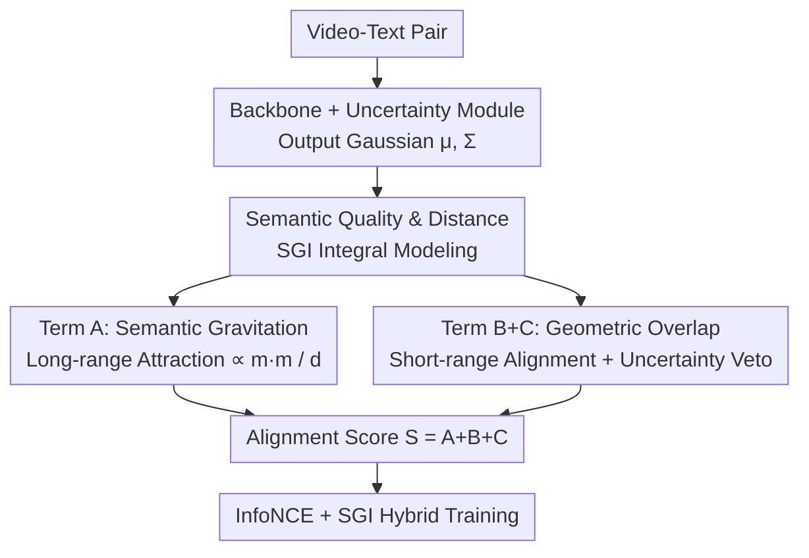

# Gravitation-Driven Semantic Alignment for Text Video Retrieval

**Conference**: CVPR 2026  
**Paper**: [CVF Open Access](https://openaccess.thecvf.com/content/CVPR2026/html/Yang_Gravitation-Driven_Semantic_Alignment_for_Text_Video_Retrieval_CVPR_2026_paper.html)  
**Code**: TBD  
**Area**: Multimodal VLM  
**Keywords**: Text-Video Retrieval, Probabilistic Embedding, Gaussian Distribution, Semantic Gravitation, Uncertainty Modeling  

## TL;DR
GraviAlign analogies cross-modal semantic alignment to universal gravitation. It decomposes the alignment score between Gaussian embeddings of text/video into two orthogonal, closed-form factors: "Semantic Gravitation (Attraction)" and "Geometric Overlap." Each factor possesses independent veto power, consistently outperforming the CLIP-ViP baseline by 1.6%~2.6% R@1 across three text-video retrieval benchmarks.

## Background & Motivation

**Background**: The mainstream approach for Text-Video Retrieval (TVR) involves using CLIP-like models to encode videos and text as **deterministic point vectors**, which are then aligned via cosine similarity using InfoNCE to pull positive samples closer and push negative samples away.

**Limitations of Prior Work**: Real-world video and text relations are "many-to-many"—the same video can be described by multiple semantically distinct sentences (e.g., "cartoon for kids," "animation playing," "cartoon characters moving"), and vice versa. A deterministic point is forced to be close to several different concepts simultaneously, failing to express such semantic ambiguity. Later works adopted **probabilistic embeddings** (modeling samples as Gaussian distributions, geometries, or sets) to capture uncertainty. However, the authors point out two persistent issues: ① **Rigid Priors**: Many methods manually impose geometric hierarchical constraints or external KL regularization to prevent variance collapse, causing the model to learn "design choices" rather than the data's inherent semantic uncertainty. ② **Decoupling of Distance and Uncertainty**: Existing similarity measures often decompose alignment into "mean distance term + variance/volume penalty term" as two **additive independent** parts. Consequently, two pairs of samples with the same mean distance are treated identically, failing to distinguish between "confident alignment" and "fuzzy matching."

**Key Challenge**: Probabilistic embeddings are either constrained by rigid priors or treat distance and uncertainty separately. Their **interaction** (under the same central distance, sharper distributions should be rewarded while more diffuse ones should be penalized) has not been naturally modeled within the similarity metric.

**Goal**: Design a score that truly couples distance and uncertainty without requiring **sampling, external regularization, or counter-intuitive geometric priors**, while remaining closed-form and interpretable.

**Key Insight**: The authors draw inspiration from classical universal gravitation. Gravitational potential $U=-G\frac{m_1 m_2}{r}$ simultaneously encodes "attraction + mass dependence + distance decay." By defining "semantic quality" as the **inverse of uncertainty** (specific, low-variance concepts have high mass; fuzzy, high-variance ones have low mass), semantic alignment becomes the "expected interaction energy" between two concepts.

**Core Idea**: Decompose the cross-modal alignment score into two orthogonal factors: **Semantic Gravitation** (attraction between centers weighted by semantic quality) and **Geometric Overlap** (the intersection volume of two distributions). If either is too low, the match is vetoed.

## Method

### Overall Architecture

GraviAlign is built upon the CLIP-ViP backbone. Video $v=[f_1,\dots,f_M]^\top$ and text $t=[w_0,\dots,w_N]^\top$ are first processed by their respective encoders to obtain pooled features $f_v, f_t \in \mathbb{R}^D$. Following the UATVR-style lightweight **uncertainty module**, each modality is modeled as a diagonal Gaussian $z_v\sim\mathcal{N}(\mu_v,\Sigma_v)$ and $z_t\sim\mathcal{N}(\mu_t,\Sigma_t)$. The mean $\mu$ is given by an FC layer + LayerNorm + $\ell_2$ normalization (semantic center), and the covariance $\Sigma=\mathrm{diag}(\sigma_1^2,\dots,\sigma_D^2)$ is predicted as $\log\sigma^2$ by another FC layer (per-dimension semantic uncertainty). Deterministic and probabilistic objectives share the same backbone features with negligible overhead.

The core is calculating the alignment score $S_{\text{align}}=A+B+C$. The ideal integral form of "Semantic Gravitation × Geometric Overlap" (SGI integral) is formulated and proven unsolvable, then decoupled into three closed-form terms: **Term A** provides long-range gravitational attraction, **Term B** provides short-range geometric alignment penalty, and **Term C** acts as uncertainty self-regularization to veto fuzzy matches. During training, this score serves as both a structural regularizer (SGI loss, applied only to positive pairs) and is mixed with standard InfoNCE.

### Key Designs

**1. Semantic Quality & Semantic Distance: Translating Uncertainty to Physics**

To couple distance and uncertainty, the authors define two core physical quantities. **Semantic Quality** is derived from the differential entropy of the Gaussian $\mathcal{H}=\frac12\log\big((2\pi e)^D|\Sigma|\big)$. For diagonal matrices, $|\Sigma|=\prod_i\sigma_i^2$, so entropy is proportional to $\sum\log\sigma_i^2$. Quality is defined as a decreasing function of entropy:

$$m(\mu,\Sigma)=\exp\!\left(-\lambda\cdot\frac{\mathcal{H}_{\text{norm}}}{1+\mathcal{H}_{\text{norm}}}\right),\quad \mathcal{H}_{\text{norm}}=\tfrac12\sum_{i=1}^{D}\log\sigma_i^2$$

It is bounded in $(0,1]$ and monotonically decreases with uncertainty. **Semantic Distance** $d(\mu_v,\mu_t)$ uses the Mahalanobis distance instead of Euclidean: $d(\mu_v,\mu_t)=\sqrt{(\mu_v-\mu_t)^\top\Sigma_{\text{joint}}^{-1}(\mu_v-\mu_t)}$, where $\Sigma_{\text{joint}}=\Sigma_v+\Sigma_t$. Substituting these into the gravity formula, the ideal alignment energy is the **SGI Integral**:

$$I_{\text{SGI}}=\iint p_v(x)p_t(y)\cdot\exp\!\Big(\frac{S(x,y)}{T}\Big)\,dx\,dy,\quad S(x,y)=G\cdot\frac{m(\mu_v,\Sigma_v)\,m(\mu_t,\Sigma_t)}{\|x-y\|^2}$$

This elegantly unifies core attraction (via mass) and geometric overlap (via integral). Due to the inverse distance term $1/\|x-y\|^2$, the integral has **no closed-form solution**, necessitating the following decoupling.

**2. Term A · Semantic Gravitation: Long-range "Attractor"**

Since the SGI integral is intractable, the authors compute the gravitational potential at the distribution **centers**, replacing Euclidean distance with the Mahalanobis distance to obtain the semantic attraction term:

$$A=\frac{G}{T}\cdot\frac{m(\mu_v,\Sigma_v)\cdot m(\mu_t,\Sigma_t)}{d(\mu_v,\mu_t)}$$

It corresponds to "product of semantic qualities / effective distance." Two confident (high mass) Gaussians with close centers generate strong attraction. Term A acts as a **long-range attractor**, pulling concepts together even if centers are temporarily distant, provided their semantic quality is high.

**3. Term B+C · Geometric Overlap: Short-range Penalty & Uncertainty Veto**

While attraction handles proximity, precise "docking" is required once centers are close. This is given by the closed-form solution of the overlap integral $\log\int\mathcal{N}_v(z)\mathcal{N}_t(z)\,dz$:

$$\log \Psi = \underbrace{-\tfrac12(\mu_v-\mu_t)^\top\Sigma_{\text{joint}}^{-1}(\mu_v-\mu_t)}_{\textbf{Term B}} \underbrace{-\tfrac12\log|\Sigma_{\text{joint}}|}_{\textbf{Term C}}+c$$

**Term B** is a quadratic **short-range aligner**: once centers are near, it heavily penalizes minute offsets. **Term C** penalizes the volume of the joint covariance $\log|\Sigma_{\text{joint}}|$, acting as a **self-regularizer** to suppress high-volume distributions. This vetoes "fuzzy-fuzzy" false positives. This **independent veto mechanism** ensures that if either attraction (A) or overlap (B+C) is low, the match is rejected. Furthermore, the gradient of C naturally prevents variance collapse without needing **external KL regularization**.

**4. SGI Structural Regularization & InfoNCE Training**

The final score $S_{\text{align}}=A+B+C$ is a physically and probabilistically meaningful compatibility measure. Training uses a hybrid objective: standard symmetric InfoNCE for discrimination and **SGI loss** applied **only to positive pairs** $(v,t)^+$:

$$\mathcal{L}_{\text{SGI}}(v,t)^+ = -S_{\text{align}}(v,t)^+ = -(A+B+C)$$

The total objective is $\mathcal{L}=\mathcal{L}_{\text{InfoNCE}}+\alpha\cdot\mathcal{L}_{\text{SGI}}$. Unlike traditional contrastive learning, SGI loss directly supervises the **internal geometric and probabilistic structure** of the semantic space.

## Key Experimental Results

### Main Results

Evaluated on three TVR benchmarks (MSR-VTT / DiDeMo / ActivityNet) using CLIP-ViP (ViT-B/32 & ViT-B/16) without post-processing (QB-Norm/DSL).

| Dataset | Backbone | Metric (T2V R@1) | CLIP-ViP Baseline | +GraviAlign (Ours) | Gain |
| :--- | :--- | :--- | :--- | :--- | :--- |
| MSR-VTT | ViT-B/32 | R@1 | 50.1 | 52.4 | ↑2.3 |
| MSR-VTT | ViT-B/16 | R@1 | 54.2 | 55.8 | ↑1.6 |
| DiDeMo | ViT-B/32 | R@1 | 48.6 | 50.7 | ↑2.1 |
| DiDeMo | ViT-B/16 | R@1 | 50.5 | 52.3 | ↑1.8 |
| ActivityNet | ViT-B/32 | R@1 | 51.1 | 52.4 | ↑1.3 |
| ActivityNet | ViT-B/16 | R@1 | 53.4 | 56.0 | ↑2.6 |

On MSR-VTT (ViT-B/32), GraviAlign reaches 52.4%, outperforming NarVid (51.0%), UATVR (47.5%), and NeighborRetr (49.5%). Gains are consistent across R@5/R@10.

### Ablation Study

Systematic removal of the three terms (Table 4) on MSR-VTT (ViT-B/32, T2V):

| Configuration | Description | Effect |
| :--- | :--- | :--- |
| Full (A+B+C) | Complete GraviAlign | Best |
| w/o Term A | Remove Semantic Gravitation (long-range) | Significant drop |
| w/o Term B | Remove short-range alignment penalty | Significant drop |
| w/o Term C | Remove uncertainty self-regularization | Significant drop |

Sensitivity analysis (Table 5) show that performance is stable across temperature $T$, quality sensitivity $\lambda$, and gravitational constant $G$.

### Key Findings
- The three terms are non-redundant: A (long-range attraction) and B (short-range alignment) handle "pulling" and "docking" respectively, while C handles "fuzzy veto."
- Improvement stems from the principled alignment score itself rather than data augmentation.
- Robust to $T/\lambda/G$ hyperparameters, reducing tuning burden.

## Highlights & Insights
- **Unified Distance × Uncertainty via Physics**: Defining semantic quality as inverse uncertainty and using Mahalanobis distance naturally couples "proximity × confidence," bypassing drawbacks of additive structures.
- **Intractable Ideal to Decoupled Closed-form**: Formulating the ideal SGI integral and then deriving closed-form approximations provides a reusable modeling paradigm that balances theoretical rigor with $O(D)$ efficiency.
- **Independent Veto Mechanism**: Term C's penalty on joint volume effectively filters "fuzzy-fuzzy" false positives, a transferable insight for any probabilistic matching task.
- **Elimination of Extra KL**: Term C's gradient naturally prevents variance collapse, simplifying the pipeline.

## Limitations & Future Work
- **Gaussian/Diagonal Covariance Assumption**: Modeling modalities as diagonal Gaussians may sacrifice multi-modal or highly correlated dimensional semantics.
- **Approximation Cost**: Using central potential + overlap integral ignores higher-order shape information from the original integral; the impact on "hard negative" discrimination remains unquantified.
- **Gain Magnitude**: Performance improvements (1.3%~2.6%) are robust but incremental. Effectiveness on massive scale or long-form video requires further verification.
- **Future Directions**: Exploring low-rank covariances or GMMs; extending the framework to image-text or audio-video matching.

## Related Work & Insights
- **vs CLIP-ViP**: Uses single points + cosine similarity (one-to-one assumption); GraviAlign models many-to-many ambiguity with Gaussian embeddings at negligible cost.
- **vs UATVR**: Relies on **sampling**, which is computationally inefficient and discards covariance structures; GraviAlign uses closed-form terms to retain all probabilistic information.
- **vs ProLIP**: Uses rigid inclusion losses that penalize perfect alignment; GraviAlign rewards both attraction and overlap for true synonyms.
- **vs PCME**: Uses expected L2 distance where mean gradients are independent of uncertainty; GraviAlign couples them via quality weighting and Mahalanobis distance.

## Rating
- Novelty: ⭐⭐⭐⭐⭐ (Elegant physics analogy for probabilistic alignment)
- Experimental Thoroughness: ⭐⭐⭐⭐ (Solid gains across benchmarks, though some ablation values are qualitative)
- Writing Quality: ⭐⭐⭐⭐⭐ (Clear derivation and dual physical/probabilistic interpretation)
- Value: ⭐⭐⭐⭐ (Plug-and-play score for fuzzy cross-modal matching)

<!-- RELATED:START -->

## Related Papers

- [\[CVPR 2026\] EagleNet: Energy-Aware Fine-Grained Relationship Learning Network for Text-Video Retrieval](eaglenet_energy-aware_fine-grained_relationship_learning_network_for_text-video_.md)
- [\[CVPR 2026\] Language-driven Fine-grained Retrieval](language-driven_fine-grained_retrieval.md)
- [\[CVPR 2026\] Quota-Calibrated Fine-Grained Alignment with Context-Aware Marginals for Text-based Person Retrieval](quota-calibrated_fine-grained_alignment_with_context-aware_marginals_for_text-ba.md)
- [\[CVPR 2026\] Breaking Multimodal LLM Safety via Video-Driven Prompting](breaking_multimodal_llm_safety_via_video-driven_prompting.md)
- [\[CVPR 2026\] Camouflage-aware Image-Text Retrieval via Expert Collaboration](camouflage-aware_image-text_retrieval_via_expert_collaboration.md)

<!-- RELATED:END -->
