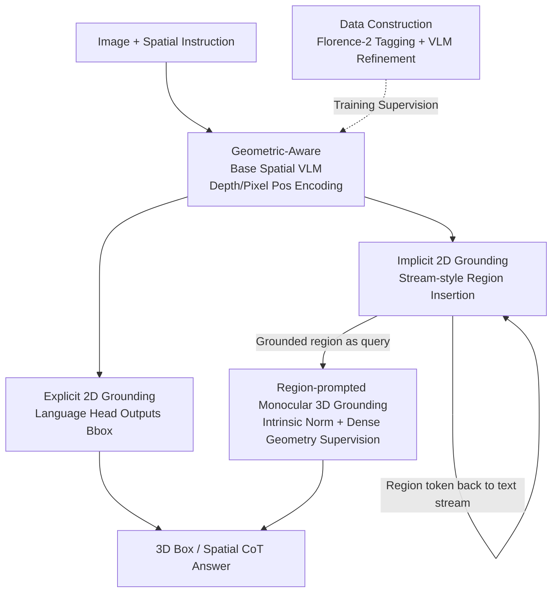

# Grounded 3D-Aware Spatial Vision-Language Modeling

**Conference**: CVPR 2026  
**arXiv**: [2605.30307](https://arxiv.org/abs/2605.30307)  
**Code**: https://www.anjiecheng.me/gr3d (Project Page)  
**Area**: Multi-modal VLM / 3D Vision / Spatial Understanding  
**Keywords**: Spatial VLM, implicit grounding, monocular 3D detection, visual Chain-of-Thought, region prompts

## TL;DR
GR3D unifies three grounding capabilities—explicit 2D grounding, implicit 2D grounding, and monocular 3D grounding—into a single spatial VLM. The model generates a spatial Chain-of-Thought (CoT) while simultaneously grounding mentioned objects as region tokens inserted back into the text stream. These grounded regions then serve as queries to predict 3D boxes in the camera view, achieving significant performance gains on Omni3D detection and multiple spatial reasoning benchmarks.

## Background & Motivation
**Background**: Spatial VLMs have progressed rapidly, enabling reasoning over 2D spatial relationships (relative position, orientation, distance) and beginning to address monocular 3D perception. The mainstream approach encodes images as visual tokens and relies on large-scale spatial QA datasets to "memorize" spatial relationships.

**Limitations of Prior Work**: The authors identify two overlooked capability gaps. First, **implicit 2D grounding is scarce**—most systems only support explicit grounding like "point to X," lacking a mechanism to automatically discover mentioned entities during free-form text generation and link them to visual evidence. Constructing such supervision is difficult, as it requires aligning text mentions to implicit visual regions and interleaving region information into the language flow. Second, **monocular 3D grounding is inherently ill-posed**—object scale, depth, and camera intrinsics are entangled in a single view, and the specific instance referred to by the text must be identified before 3D prediction. Existing methods either skip this intermediate localization, rely on multi-view supervision, or are limited by the scarcity of 3D box annotations.

**Key Challenge**: VLMs often "guess" spatial relationships directly from global image features, which contradicts the human approach of "localizing each object first, then reasoning about their relationships." Furthermore, 3D reasoning is stalled by two layers of ambiguity: "which object" and "what geometry."

**Goal**: To establish grounding as the core mechanism for learning spatial representations, creating a unified architecture that supports three types of grounding and decomposes complex spatial understanding into "grounded 2D perception → 3D inference."

**Key Insight**: The authors hypothesize that grounding is not just an independent task but a **useful inductive bias**: by requiring the model to repeatedly localize and reference visual evidence during reasoning, even general spatial tasks without explicit localization requirements will be strengthened.

**Core Idea**: Use "stream-style region insertion" to localize entities as region tokens back into the text stream during generation. Then, use "region prompts" to treat each grounded 2D region as a query for 3D inference, combined with intrinsic normalization and dense geometric supervision to unify 2D/3D spatial reasoning.

## Method

### Overall Architecture
GR3D uses NVILA-Lite-8B as its backbone, first building a geometry-aware base spatial VLM and then layering the three grounding capabilities. The input consists of single-view (or multi-view) RGB images and natural language instructions. The output includes spatial CoT text with visual evidence and (for 3D tasks) 3D boxes in the camera view. The key to the pipeline is that the model does not infer answers from global features all at once but **localizes while speaking**—every time an entity is mentioned, its 2D box is predicted, and the region is encoded as a region token inserted back into the sequence. For 3D tasks, these grounded regions are passed as queries to the 3D predictor, solving "which object" before estimating "what 3D structure."

### Key Designs

**1. Geometric-Aware Base Spatial VLM: Empowering Visual Tokens with Spatial Coordinates**

Standard VLMs treat visual tokens as unordered "words," losing their spatial arrangement in the image grid, which is fatal for spatial reasoning. GR3D follows the design principles of SR-3D, overlaying **2D position embeddings (from pixel coordinates) + relative depth cues** onto the dense visual tokens extracted by the NVILA encoder. This ensures each token carries both appearance and geometric context while preserving its spatial layout. It also retains the **region-prompt design**: pooling features within any given bounding box encodes an image region into a query token for direct reference by downstream modules. This layer provides a "geometry-aware and language-aligned" representation base.

**2. Implicit 2D Grounding: Stream-style Region Insertion**

When faced with a query like "How far is the second bottle on the shelf in the kitchen from the small brown bear on the washing machine in the laundry room?", traditional VLMs guess from global features. GR3D mimics the human "localize then reason" process by generating answers in a CoT manner. Every time an entity is mentioned (e.g., "the second bottle on the shelf"), the model predicts its 2D box coordinates $[x_1, y_1, x_2, y_2]$ via the language head and immediately inserts the corresponding **region token into the text stream**. Subsequent generation is conditioned on both the text and this visual evidence. During training, coordinates use teacher forcing, and region tokens are detached from the computation graph to serve as strong conditions. During inference, it is fully autoregressive: predict coordinates → encode region → insert embedding → generate next step.

**3. Region-Prompted Monocular 3D Grounding: Grounded 2D Regions as 3D Queries**

Monocular 3D has dual ambiguities: language (which instance) and geometry (entangled scale/depth/intrinsics). GR3D treats each grounded 2D region as a "3D inference query." 3D boxes are expressed in a **verbalized format compatible with 2D HTML styles**, parameterized by center $(x_c, y_c, z_c)$, dimensions $(w, h, l)$, and orientation (normalized Euler angles). To address geometric ambiguity, **intrinsics normalization** is introduced: images are rescaled based on focal length to a consistent field of view across datasets. Given $f_x$, let $W' = \frac{1000}{f_x} \cdot W$ and $H' = \frac{1000}{f_x} \cdot H$, aligning the apparent size of objects in feature space. Supervision includes sparse 3D boxes and **dense point map supervision**, where the model predicts 3D coordinates for randomly sampled surface points from depth maps, extending supervision beyond scarce 3D box labels.

**4. Data Construction: From Noisy Labels to Refined Implicit Grounding Corpora**

Implicit grounding lacks supervision. GR3D starts with RefSpatial and uses **Florence-2** to generate candidate 2D boxes and labels for every text mention. This is followed by a **VLM verification + rewriting pipeline** to ensure one-to-one alignment between mentions and regions and to rewrite generic class names into instance-level descriptions. The final training data includes 97K grounded CoT samples, 780K 3D detection samples from Omni3D/EmbodiedScan, and 272K point map samples.

### Loss & Training
Two-stage training. **Stage 1: Spatial Pre-training**: Initialize from NVILA-Lite-8B, with spatial position encoding newly initialized. Train on a mix of 2D grounding and region→3D detection data while **freezing the visual encoder**. The goal is to strengthen spatial understanding and 2D grounding. **Stage 2: Detection CoT Fine-tuning**: Fine-tune on detection data in CoT format (mapping "2D grounding → 3D box prediction"). At this stage, **only the LLM is fine-tuned** to learn reasoning and text generation structures.

## Key Experimental Results

### Main Results
**Omni3D 3D Object Detection** (AP, 3D IoU threshold 0.05–0.50):

| Method | SUN-RGBD AP₁₅ | SUN-RGBD mAP | Hypersim mAP | KITTI mAP | Overall AP₃D |
| :--- | :--- | :--- | :--- | :--- | :--- |
| Cube R-CNN (Expert) | 15.33 | - | - | - | 23.26 |
| DetAny3D (Expert) | 18.96 | - | 7.17 | 31.61 | 24.92 |
| Qwen3-VL-8B (VLM) | 28.28 | 17.77 | 7.23 | 3.32 | - |
| **GR3D-8B (Ours)** | **43.49** | **31.64** | **10.87** | 14.75 | **25.40** |

GR3D outperforms all VLM baselines and slightly exceeds the visual expert DetAny3D in overall AP₃D.

### Ablation Study
Breakdown of the three key components on Omni3D (SUN-RGBD Indoor / KITTI Outdoor):

| PT Pre-training | 2D→3D | Cam Norm | SUN AP₁₅ | SUN AP₃D | KITTI AP₁₅ | KITTI AP₃D |
| :--- | :--- | :--- | :--- | :--- | :--- | :--- |
| – | – | – | 30.19 | 20.27 | 10.08 | 6.22 |
| ✓ | – | – | 42.29 | 29.87 | 15.61 | 10.03 |
| ✓ | ✓ | – | 41.24 | 30.95 | 21.55 | 14.35 |
| ✓ | ✓ | ✓ | **43.49** | **31.64** | **22.18** | **14.75** |

### Key Findings
- **Spatial Pre-training (PT) contributes most**: It significantly boosts baseline performance, especially for outdoor samples with unbalanced data, by injecting general 2D spatial/grounding priors.
- **2D→3D decomposition outperforms direct 3D**: Especially noticeable in outdoor KITTI results. 2D grounding provides stable geometric anchors.
- **Intrinsics normalization provides consistent gains**: It reduces systematic positioning shifts caused by varying camera focal lengths.
- **Dense point supervision is scalable**: 3D detection performance improves as more point-map data is added.
- **Stage 2 preserves general VLM capabilities**: General benchmarks like ChartQA and MME remain stable after CoT fine-tuning.

## Highlights & Insights
- **"Locate while speaking"**: Stream-style region insertion weaves grounding into the generation flow, allowing reasoning to proceed on grounded visual evidence and making the process more interpretable.
- **Grounding as an Inductive Bias**: Adding grounding during training improves performance even on tasks that do not require explicit localization, proving its value as a training signal.
- **Cracking 3D Scarcity with Dense Point Supervision**: Sampling surface points from depth maps scales geometric signals beyond sparse 3D boxes.
- **3D Box Verbalization + Intrinsics Normalization**: Representing 3D boxes in a language format compatible with 2D while rescaling to align the field of view allows a single language interface to output 2D/3D reliably.

## Limitations & Future Work
- Monocular 3D remains inherently ill-posed; intrinsics normalization mitigates but does not eliminate depth ambiguity.
- Multi-view validation is currently limited and listed as future work.
- The implicit grounding corpus depends on auto-annotation quality, and the impact of this noise on final performance remains unquantified.
- Absolute mAP in outdoor settings is still lower than in indoor settings.

## Related Work & Insights
- **vs SR-3D / SpatialRGPT**: These require regions or masks as input during inference; GR3D internalizes grounding as an automatic mechanism.
- **vs OVMono3D / DetAny3D**: GR3D unifies grounding into the VLM framework rather than treating 3D grounding as a standalone detection task.
- **vs VST**: VST passes FoV as a text prompt; GR3D integrates it into the feature space through normalization, which is more robust for geometric parameter parsing.

## Rating
- Novelty: ⭐⭐⭐⭐⭐ 
- Experimental Thoroughness: ⭐⭐⭐⭐ 
- Writing Quality: ⭐⭐⭐⭐⭐ 
- Value: ⭐⭐⭐⭐⭐ 

<!-- RELATED:START -->

## Related Papers

- [\[CVPR 2026\] G$^2$VLM: Geometry Grounded Vision Language Model with Unified 3D Reconstruction and Spatial Reasoning](g2vlm_geometry_grounded_vision_language_model_with_unified_3d_reconstruction_and.md)
- [\[CVPR 2026\] Think with 3D: Geometric Imagination Grounded Spatial Reasoning from Limited Views](think_with_3d_geometric_imagination_grounded_spatial_reasoning_from_limited_view.md)
- [\[CVPR 2026\] From 3D Pose to Prose: Biomechanics-Grounded Vision-Language Coaching](from_3d_pose_to_prose_biomechanics-grounded_vision-language_coaching.md)
- [\[CVPR 2026\] Abstract 3D Perception for Spatial Intelligence in Vision-Language Models](abstract_3d_perception_for_spatial_intelligence_in_vision-language_models.md)
- [\[CVPR 2026\] HiSpatial: Taming Hierarchical 3D Spatial Understanding in Vision-Language Models](hispatial_taming_hierarchical_3d_spatial_understanding_in_vision-language_models.md)

<!-- RELATED:END -->
