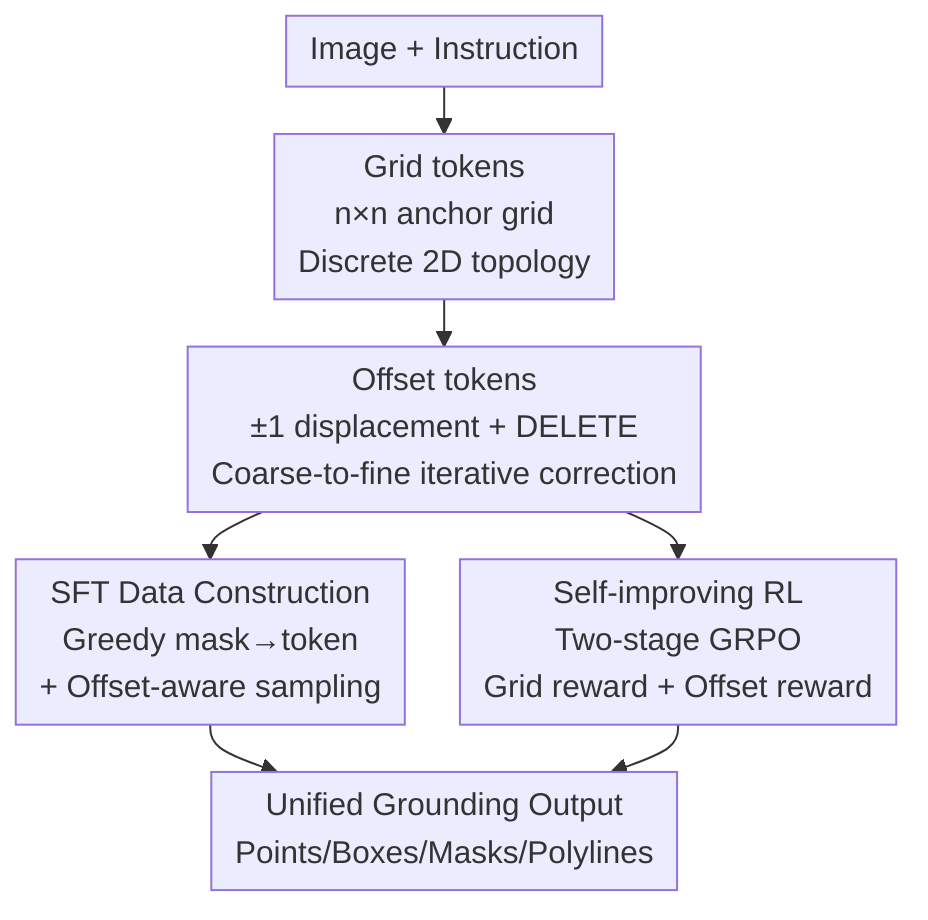

# Grounding Everything in Tokens for Multimodal Large Language Models

**Conference**: CVPR 2026  
**Paper**: [CVF Open Access](https://openaccess.thecvf.com/content/CVPR2026/html/Ren_Grounding_Everything_in_Tokens_for_Multimodal_Large_Language_Models_CVPR_2026_paper.html)  
**Code**: https://getokpage.github.io (Project Page)  
**Area**: Multimodal VLM  
**Keywords**: Visual Grounding, Spatial token, MLLM, Grid-offset token, Reinforcement Learning  

## TL;DR
GETok augments the MLLM vocabulary with a set of "grid tokens + offset tokens," discretizing the image plane into a 2D anchor grid and using small-step offset iterations for error correction. Without altering the autoregressive architecture, the model represents various grounding forms (points, boxes, masks, polylines) as unified token sequences, achieving SOTA performance in both SFT and RL paradigms.

## Background & Motivation
**Background**: MLLMs utilize autoregressive Transformers for visual understanding, requiring images to be tokenized into visual tokens. Existing approaches for MLLM "object grounding" primarily fall into three categories: using text to write coordinates (e.g., Qwen-VL directly outputs `x1,y1,x2,y2`), linearly projecting image patches into visual tokens, or discretizing coordinates with 1-dimensional bin tokens (e.g., Pix2Seq).

**Limitations of Prior Work**: Each of these three categories has inherent flaws. Text coordinates fail to maintain spatial topology, require nearly 13 tokens per box, and suffer from tokenization bias (the distance relationship in token space between `199`→`200` and `199`→`999` is disordered). Patch projections are restricted by the fixed patch size of the image encoder, entangling texture and geometry. 1D bin tokens use linear indices to describe 2D coordinates, where small index changes do not correspond to smooth movements in 2D topology.

**Key Challenge**: The fundamental issue is the **lack of a reliable mapping between discrete sequence tokens and continuous 2D space**. This is particularly critical under Reinforcement Learning (GRPO)—when the action space is irregular, minor token changes can cause drastic jumps in rewards, making policy optimization difficult to converge stably.

**Goal**: (1) Use a single set of tokens to uniformly represent all grounding forms (points, boxes, masks, polylines); (2) allow grounding to perform iterative coarse-to-fine error correction; (3) construct a geometrically regular action space conducive to RL exploration.

**Core Idea**: "Weld" 2D space into the vocabulary—add learnable discrete tokens to the vocabulary that are bound to uniform anchors on the image plane (grid tokens for localization, offset tokens for fine-tuning), turning all grounding into "selecting spatial pronouns from the vocabulary" without modifying the autoregressive architecture.

## Method

### Overall Architecture
GETok expands the original MLLM vocabulary $V_{\text{LLM}}$ to $V = V_{\text{LLM}} \cup T_{\text{grid}} \cup T_{\text{offset}}$. Specifically, grid tokens $T_{\text{grid}} = \{\langle \text{grid}_{i,j}\rangle \mid i,j \in \{0,\dots,n-1\}\}$ partition the image plane into $n\times n$ anchors, each assigned a learnable token representing the object in its local area. Offset tokens $T_{\text{offset}} = \{\langle \text{OFF}_{\delta u,\delta v}\rangle\} \cup \{\langle \text{DELETE}\rangle\}$, where $\delta u,\delta v \in \{-1,0,1\}$, provide 8-directional small displacements and a delete symbol to refine positions or remove incorrect anchors.

Inference follows a two-step "propose-and-refine" chain: first, grid tokens generate a coarse localization (e.g., an unordered set of anchors for a mask: `<seg><grid_{i1,j1}>...</seg>`), followed by a correction pass for each anchor using offset tokens (`<offset>...<OFF...><DELETE>...</offset>`). This system is compatible with both SFT (via synthetic training data) and a two-stage GRPO self-improvement RL.

### Key Designs

**1. Grid tokens: Welding the image plane into learnable 2D anchors**

Addressing the root cause that "sequence tokens do not preserve spatial topology," GETok discards text coordinates and 1D bins. Instead, it discretizes the image plane into an $n\times n$ uniform grid, where each cell $\langle\text{grid}_{i,j}\rangle$ is a learnable token added to the vocabulary. Consequently, the 2D index $(i,j)$ in the vocabulary naturally corresponds to its 2D position on the image—adjacent cells are topologically adjacent, completely decoupling texture from geometry. A box requires only 2 tokens for its corners (compared to ~13 for text, ~9 for patches, ~4 for bins). A mask is an unordered sequence of grid tokens; points and polylines follow the same logic. **All grounding forms are unified into "selecting which spatial pronouns."** The downside is that the token count grows quadratically with resolution (doubling $n$ adds $64^2-32^2=3072$ tokens), a bottleneck addressed by the next design.

**2. Offset tokens and propose-and-refine: Doubling accuracy with 10 tokens + iterative self-correction**

Grid token accuracy is limited by cell size, and increasing resolution is computationally expensive. Offset tokens break this deadlock at minimal cost: by adding only 8 directional displacements $\langle\text{OFF}_{\delta u,\delta v}\rangle$ ($\delta u,\delta v\in\{-1,0,1\}$) and one $\langle\text{DELETE}\rangle$ for a total of 10 tokens, sub-grid refinement can be performed on existing anchors. A $32^2$ anchor grid with these 10 offset tokens achieves an equivalent accuracy of $64^2$, saving 3072 tokens. More importantly, this brings an **emergent capability**: since $\langle\text{DELETE}\rangle$ can recursively reject incorrect anchors, grounding evolves from a "one-shot" prediction into an iterative "coarse proposal, then stepwise correction" process. The model can reflect on previous predictions—fine-tuning aligned anchors, significantly adjusting misaligned ones, or deleting entirely wrong ones—filling the gap in existing methods where initial errors are irreversible.

**3. SFT Data Construction: Greedy mask→token + Offset-aware sampling**

Since GETok does not change the architecture, SFT success depends on data construction, particularly for dense masks and offset supervision. For masks, the authors use a **training-free greedy algorithm** to convert continuous masks into discrete grid tokens: first, the image and $n^2$ grid points are fed into SAM to obtain $K$ candidate masks (each grid point maps to one mask). The goal is to select the minimum number of grid points such that the union of their masks approximates the ground truth:

$$\boldsymbol{\pi}^\star = \arg\min_{\boldsymbol{\pi}\in\{0,1\}^{n^2}} \|\boldsymbol{\pi}\|_0 \quad \text{s.t.}\quad \text{IoU}\Big(\mathbf{M}_{\text{gt}}, \bigcup_{k:\pi_k=1}\mathbf{M}_{\theta(k)}\Big) \ge \tau$$

The greedy solution sorts candidate masks by IoU with the ground truth and adds them sequentially; a grid point is kept if the union IoU increases. This is cleaner than existing single-point/box/random sampling and handles redundancy and ambiguity in multi-connected masks. For offset supervision, the authors use morphological operations to categorize each grid point into four regions based on offset step size—**Inside** (stable interior points, mapping to zero offset `<OFF0,0>`), **Ring** (points near the boundary, requiring non-zero offset correction), **Far** (distant negative points, mapping to `<DELETE>`), and **Hard-Delete** (boundary cases, also mapping to `<DELETE>`). Sampling is biased towards "Inside" and "Ring" samples, which have the highest learning value for correction. This simulated supervision proved more effective than real generated offset sequences.

**4. Self-improving RL: Two-stage GRPO decoupling placement and movement**

GETok's 2D grid action space is geometrically regular and low-entropy, making it ideal for RL. The authors designed a two-stage GRPO framework: starting from an SFT model, **Stage 1 trains only grid token generation**, rewarding spatial accuracy and structural validity; **Stage 2 introduces offset tokens in multi-turn dialogues**, rewarding the accuracy gain from iterative refinement (only 200 steps to prevent overfitting). This decouples "token placement" from "token movement," achieving geometry-aware self-correction. Rewards are granular: the grid stage includes format rewards, non-repetition rewards, mask IoU rewards (using SAM to convert boxes/points to masks), box rewards (IoU + corner L1), and **semantic keypoint rewards** (combining hit rate with distribution, using an exponential term $1-e^{-m_p/5}$ to prevent sparse points and a linear penalty $0.02 m_p$ for excessive points). The offset stage includes format rewards, point refinement rewards (trinary scores $s_{k,p}\in\{-1,0,1\}$: movement out of GT is $-1$, correction/staying in is $+1$, others $0$), box refinement rewards, and mask IoU gain. A key finding was that poor reward design causes the model to "predict no offsets at all," necessitating rewards that explicitly encourage meaningful geometric updates.

## Main Results

### Main Results: RES (Referring Expression Segmentation)

| Setting | Method | ReasonSeg Val | ReasonSeg Test | RefCOCO Avg |
|------|------|---------------|----------------|-------------|
| SFT | LISA | 44.4 | 36.8 | — |
| SFT | Qwen2.5-VL-7B | 55.4 | 51.5 | 65.7 |
| SFT | GETok-SFT-grid | 58.1 | 54.4 | 67.2 |
| SFT | **GETok-SFT** | **59.2** | **55.8** | **68.2** |
| RL | VisionReasoner | 66.3 | 63.6 | 70.7 |
| RL | **GETok-R1** | 65.9 | **64.2** | **72.7** |

RL improves over SFT by +4.5%, validating that the regular 2D token space yields more stable policy optimization under RL.

### REC (Referring Expression Comprehension, strict Acc@0.8)

| Setting | Method | RefCOCO Avg | RefCOCO+ Avg | RefCOCOg Avg |
|------|------|-------------|--------------|--------------|
| SFT@0.8 | Qwen2.5-VL-7B | 73.3 | 67.9 | 71.7 |
| SFT@0.8 | **GETok-SFT** | **74.7** | **70.3** | **73.5** |
| RL@0.8 | VisionReasoner† | 76.3 | 72.1 | 72.7 |
| RL@0.8 | **GETok-R1** | **78.6** | **74.9** | **75.5** |

Under strict Acc@0.8, improvements are more pronounced, especially for small objects.

### Ablation Study: Grid Resolution vs. Offset Tokens (REC Acc@0.8 / RES gIoU)

| Config | REC | RES | Avg tokens per mask |
|------|-----|-----|---------------------|
| 16×16 | 68.9 | 66.2 | 5.2 |
| 32×32 | 70.9 | 67.2 | 8.7 |
| 64×64 | 71.2 | 67.1 | 14.6 |
| **32×32 + offset** | **72.6** | **68.2** | 9.2 |

## Key Findings
- **Offset mechanism is the cost-performance core**: 32×32 with 10 offset tokens (token count 8.7→9.2) outperforms 64×64 (token count 14.6), proving "small refinements" are more efficient than "brute-force resolution doubling." Offset provides a stable +1.0%/+1.5% gain in SFT/RL.
- **RL gains are highest in complex reasoning**: On tasks with long reasoning chains like ReasonSeg, GETok-R1 shows significant gains.
- **Strong generalization in autonomous driving**: On proprietary driving data, traffic sign color recognition improved by +12.24% and obstacle classification by +7.95%. Lane polyline detection, converting continuous regression to discrete point selection, saw improvements in Precision/Recall/F1 by +3%/+18%/+10%, respectively.

## Highlights & Insights
- **The "2D index = 2D position" token design is ingenious**: Grid token indices directly encode spatial topology, fundamentally eliminating the tokenization bias of text coordinates while unifying all grounding forms.
- **`<DELETE>` enables iterative reasoning**: Originally intended as a vocabulary-saving measure, the offset token unexpectedly provided a recursive self-correction capability.
- **Geometric regularity = RL-friendly**: Designing the action space with low-entropy grids and small displacements ensures smooth reward landscapes for GRPO, providing a methodology for why certain representations are better for RL.

## Limitations & Future Work
- The pipeline is **heavily dependent on SAM**: Data construction and RL rewards rely on SAM, meaning SAM's quality and biases propagate. High-quality SAM masks occasionally mismatch low-quality GT labels.
- Offset tokens only cover the $\{-1,0,1\}$ neighborhood. **Single-turn correction is limited**; large errors require multi-turn iterations, but the stability and budget for these turns are not fully discussed.
- RL was only validated on RES/REC/ReasonSeg. Other tasks (polylines, gRES, etc.) were only tested with SFT.
- While the vocabulary bottleneck is mitigated, it remains a query whether $n^2$ anchors suffice for ultra-high resolution or extremely dense small objects.

## Related Work & Insights
- **vs. Text Coordinates (Qwen-VL)**: Text digits fail topology, are long, and have bias. GETok uses 2D index tokens for direct spatial encoding.
- **vs. Patch visual tokens (ClawMachine)**: Tied to fixed encoder patches; GETok's anchors are independent of the encoder, decoupling texture from geometry.
- **vs. 1D bin tokens (Pix2Seq)**: Linear indexing doesn't match 2D movement, causing unstable RL rewards. GETok's 2D grid space is low-entropy and stable.
- **vs. LISA / VisionReasoner**: These rely on specialized segmentation tokens or external decoders. GETok grounding is entirely completed within the token space without specialized modules.

## Rating
- Novelty: ⭐⭐⭐⭐⭐ 
- Experimental Thoroughness: ⭐⭐⭐⭐ 
- Writing Quality: ⭐⭐⭐⭐⭐ 
- Value: ⭐⭐⭐⭐⭐ 

<!-- RELATED:START -->

## Related Papers

- [\[CVPR 2026\] DiG: Differential Grounding for Enhancing Fine-Grained Perception in Multimodal Large Language Models](dig_differential_grounding_for_enhancing_fine-grained_perception_in_multimodal_l.md)
- [\[CVPR 2026\] WeMMU: Enhanced Bridging of Vision-Language Models and Diffusion Models via Noisy Query Tokens](wemmu_enhanced_bridging_of_vision-language_models_and_diffusion_models_via_noisy.md)
- [\[CVPR 2026\] Venus: Benchmarking and Empowering Multimodal Large Language Models for Aesthetic Guidance and Cropping](venus_benchmarking_and_empowering_multimodal_large_language_models_for_aesthetic.md)
- [\[CVPR 2026\] Predictive Regularization Against Visual Representation Degradation in Multimodal Large Language Models](predictive_regularization_against_visual_representation_degradation_in_multimoda.md)
- [\[CVPR 2026\] Learning to See through Illumination Extremes with Event Streaming in Multimodal Large Language Models](learning_to_see_through_illumination_extremes_with_event_streaming_in_multimodal.md)

<!-- RELATED:END -->
