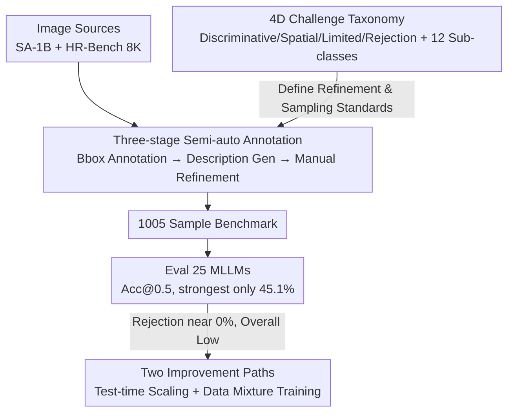

# GroundingME: Exposing the Visual Grounding Gap in MLLMs through Multi-Dimensional Evaluation

**Conference**: CVPR 2026  
**Paper**: [CVF Open Access](https://openaccess.thecvf.com/content/CVPR2026/html/Li_GroundingME_Exposing_the_Visual_Grounding_Gap_in_MLLMs_through_Multi-Dimensional_CVPR_2026_paper.html)  
**Code**: https://groundingme.github.io (Project Page)  
**Area**: Multimodal VLM  
**Keywords**: Visual Grounding, MLLM Benchmark, Referring Expression Comprehension, Rejection Ability, Test-time Scaling  

## TL;DR
Addressing the issue where existing visual grounding benchmarks are saturated (90%+) by MLLMs despite failing to measure real capabilities, the authors construct GroundingME—a hard benchmark with 1005 samples covering four dimensions: "Fine-grained Discriminative / Complex Spatial / Limited Visibility / Rejection". The study finds that the strongest model achieves only 45.1% accuracy, most models score 0% on rejection tasks, and proposes two improvement paths: test-time scaling (+4.5%) and negative sample mixture training (rejection 0% → 27.9%).

## Background & Motivation
**Background**: Visual Grounding (Referencing Expression Comprehension, REC) is the task of "grounding a target object with a bounding box given a natural language description." It serves as the foundation for downstream applications like robotic instructions and image editing. Recently, MLLMs (Qwen3-VL, Gemini-2.5, GLM-4.5V, etc.) have reached over 90% on the RefCOCO series and nearly 90% on Ref-L4.

**Limitations of Prior Work**: Saturated benchmarks do not imply true grounding proficiency. Early benchmarks (RefCOCO) have too short and simple descriptions (average 3.6 words), allowing models to "take shortcuts" by relying on unique class names. Subsequent works (Ref-L4, HC-RefLoCo) increased description length but did not truly increase reasoning complexity—as long as a unique class name exists, models bypass fine-grained attributes and spatial reasoning to find the target. Consequently, these benchmarks no longer distinguish the true grounding levels of models.

**Key Challenge**: Two types of capabilities easily handled by humans are almost entirely absent from existing benchmarks. First is **fine-grained discrimination and complex spatial/quantitative reasoning** under dense similar objects. Second is **rejection ability**—the ability to respond "no such object exists" when the description does not match the visual evidence, rather than forcing a bounding box on the most similar candidate. The latter is critical for safety and reliability but has been overlooked.

**Goal**: To build a truly hard benchmark that exposes capability gaps with diagnostic dimensions, specifically: (1) systematic coverage of multiple challenge dimensions; (2) introduction of rejection samples; (3) provision of fine-grained sub-classes for diagnosis.

**Key Insight**: Instead of merely making descriptions longer, the authors **orthogonally decompose the sources of grounding difficulty** into four non-overlapping challenge dimensions. Each targets a specific model weakness, utilizing high-resolution and high-density image sources (SA-1B + HR-Bench 8K) to ensure inherent visual difficulty.

**Core Idea**: Utilizing a "four-dimensional challenge taxonomy + semi-automatic construction + manual refinement" to create 1005 anti-shortcut samples, transforming visual grounding from "guessing" to "truly verifying attributes and rejecting mismatches."

## Method

### Overall Architecture
GroundingME is a construction and diagnostic pipeline: "Image Source → Semi-auto Bbox Annotation → MLLM Description Generation → Manual Refinement via 4D Taxonomy → 1005 Sample Benchmark → Evaluation of 25 Models → Two Improvement Paths." Its input consists of **raw images** from SA-1B / HR-Bench (without prior masks/QA to avoid data contamination), and the output is a hard benchmark with two-level labels (4 L-1 dimensions, 12 L-2 sub-classes), along with gap diagnostics and preliminary mitigation strategies.

The design consists of two layers: **benchmark construction** (core contribution) and **capability diagnosis and remediation** (test-time + train-time). The main pipeline is illustrated below:

### Key Designs

**1. Four-Dimensional Challenge Taxonomy: Decomposing "Grounding Difficulty" into Four Orthogonal Failure Modes**

Addressing the pain point that existing benchmarks add description length but not real difficulty, the authors categorize challenges into four L-1 dimensions based on **failure causes**: (1) **Discriminative**—multiple highly similar objects requiring fine-grained appearance differentiation; (2) **Spatial**—requiring complex relative positions/quantities, including Relationship and Counting; (3) **Limited**—targets with minimal visible features due to occlusion or extreme small size (from HR-Bench 8K); (4) **Rejection**—descriptions with intentionally mismatched details where the correct answer is "no such object." Each L-1 is further divided into 12 L-2 sub-classes (e.g., Appearance, Component, Text, State for Discriminative/Rejection) for granular diagnosis. This taxonomy serves as the backbone of the benchmark.

**2. Three-Stage Semi-automatic Annotation: Creating Anti-shortcut Samples via "Machine-Generation + Human-Oversight"**

To balance data quality and scale, a human-in-the-loop pipeline was designed. **Stage 1: Bbox Annotation**: For SA-1B, an automated pipeline uses RAM++ for class naming and GroundingDINO for bounding boxes. A **custom NMS** was introduced to prioritize classes with higher instance counts rather than larger areas, ensuring dense similar-object scenes. For HR-Bench, manual annotation was used due to high resolution. **Stage 2: Description Generation**: Gemini-2.5-Flash generates initial descriptions. **Stage 3: Manual Refinement**: Annotators refine boxes and rewrite descriptions following four standards: Uniqueness, Subject Clarity, Task Specificity, and Factual Accuracy (including **deliberate factual errors for rejection samples**). For anti-shortcut purposes, classes with <3 instances and objects >50% of the image were removed.

**3. Two Improvement Paths: Test-time Selection by Thinking Quality + Negative Sample Training**

**Test-time Scaling (TTS by thinking quality)**: Observed that "thinking" (CoT) improves performance (4.7%–7.4%) and enables basic rejection. The authors sample 16 responses from Qwen3-VL-235B-A22B-Thinking (temperature=0.7) and use a judge model for **Best-of-16 pairwise comparison**, focusing on the **quality of the reasoning trace** (coherence, self-consistency). Findings show that a Multimodal Judge (Qwen3-VL-A22B) with CoT improves overall score by 4.5%. **Data-Mixture Training**: Assuming rejection failure stems from a lack of negative samples, the authors created 30,000 negative samples (RefCOCOg_rej) and mixed them with positive samples at various ratios to fine-tune Qwen3-VL-8B. The 8B model's rejection score on GroundingME improved from **0% to 27.9%**, though at the cost of some performance on positive tasks.

## Key Experimental Results

The evaluation metric is **Accuracy@0.5** (IoU > 0.5). 25 models (2B–235B) were tested.

### Main Results: Ranking of 25 MLLMs (Selected)

| Model | Discriminative Avg | Spatial Avg | Limited Avg | Rejection Avg | Total |
|------|---------|---------|---------|---------|-------|
| Qwen3-VL-235B-A22B | 69.6 | 49.7 | 54.0 | 0.0 | **45.1** |
| Seed-1.6-Vision | 59.8 | 58.7 | 42.7 | 1.0 | 42.6 |
| Qwen3-VL-32B | 75.0 | 47.3 | 34.0 | 0.0 | 39.5 |
| GLM-4.5V | 52.9 | 42.0 | 29.3 | 0.5 | 32.1 |
| Gemini-2.5-Pro | 34.8 | 34.0 | 7.0 | 7.0 | 20.7 |
| Qwen2.5-VL-72B | 48.5 | 40.3 | 23.7 | 3.0 | 29.6 |
| Phi-4-Multimodal | 1.0 | 0.7 | 0.0 | 0.0 | 0.4 |

Core Observations: (1) **Massive Capability Gap**—the strongest model reaches only 45.1%, with most between 10%–40%. (2) **Commercial models do not dominate**—Seed-1.6-Vision (42.6%) closely follows the strongest open-source model. (3) **Scale is key**—scaling within the same family consistently improves results (Qwen3-VL-Dense 2B→32B: 21.1%→39.5%). Notably, **rejection scores are nearly all 0.0%**, a failure that does not improve with scale.

### Ablation Study

| Method | Judge Model | Total | Rejection |
|------|---------|-------|------|
| Average (Mean of 16) | - | 49.8 | 5.7 |
| w/o CoT | Qwen3-VL-A22B | 49.6 | 8.5 |
| w/ CoT | DeepSeek-R1 (Text-only) | 52.7 | 15.4 |
| w/ CoT | Qwen3-VL-A22B | **54.3** | **15.9** |

| RefCOCOg SFT (Neg:Pos) | Origin | 1:8 | 1:1 | 2:1 |
|------|------|------|------|------|
| RefCOCOg val (Pos) | 88.2 | 90.4 | 86.8 | 83.1 |
| RefCOCOg_rej val (Neg) | 30.5 | 83.5 | 94.8 | 97.3 |
| Macro Average | 59.4 | 87.0 | 90.8 | 90.2 |

### Key Findings
- **Rejection is the biggest weakness**: Without thinking, almost all models score 0% on rejection, meaning they force a box on a distractor rather than reporting a mismatch. 
- **Thinking quality > thinking presence**: TTS gains primarily come from "selecting better reasoning traces." Stripping CoT and judging only the final boxes reduces gains by 2.1%. Even a text-only judge (+2.9%) improves performance, suggesting logical consistency in traces is a strong correctness signal.
- **Rejection capability does not generalize freely**: While negative sample mixture helped the 8B model reach 97.3% in-domain rejection, the out-of-domain GroundingME score reached only 27.9%, and non-rejection task performance degraded (38.8%→33.0%).
- **Sub-task stratification**: Models generally excel at Discriminative, followed by Spatial/Limited, and are worst at Rejection. Within Spatial, Relationship tasks are easier than Counting.

## Highlights & Insights
- **The "Rejection" dimension is the true differentiator**: By including "no such object" samples, the study exposes that MLLMs lack the ability to question the premise of a prompt, a critical safety risk.
- **Custom NMS prioritizing high instance counts**: A useful trick that reverses standard area-based NMS to preserve "crowded similar objects" scenes.
- **Best-of-N selection via reasoning trace quality**: This suggests that logical structure is a denser supervisory signal than just the final answer and can be leveraged even by text-only models seeing multimodal traces.
- **Anti-contamination**: By using raw images without existing annotations, the benchmark separates "memorization" from "capability" even if models saw the raw images during pre-training.

## Limitations & Future Work
- **Relatively small scale**: 1005 samples is sufficient for diagnosis, but L-2 sub-classes (approx. 50 samples each) may have high statistical noise.
- **Preliminary mitigations**: TTS is computationally expensive (16 samples + large judge). Data mixture results in performance trade-offs for positive samples and poor out-of-domain generalization.
- **Dependency on Gemini-2.5-Flash**: Initial descriptions might carry the stylistic bias of a single closed-source model.
- **Future directions**: Generalizable rejection training, distilling thinking-quality evaluation into the model itself, and expansion to more image sources.

## Related Work & Insights
- **vs RefCOCO/+/g**: These are phrase-level and saturated; GroundingME uses complex sentences/paragraphs and high-density 8K scenes.
- **vs Ref-L4 / HC-RefLoCo**: These focus on long descriptions; GroundingME focuses on **blocking shortcuts** via instance density and factual errors.
- **vs Ref-ZOM**: Ref-ZOM introduced simple rejection; GroundingME scales rejection into a multi-class L-2 dimension and provides corresponding mitigation strategies.

## Rating
- Novelty: ⭐⭐⭐⭐⭐ 4D orthogonal taxonomy + rejection dimension + anti-shortcut construction.
- Experimental Thoroughness: ⭐⭐⭐⭐⭐ 25 models, 12 sub-classes, and ablation of both TTS and training-side paths.
- Writing Quality: ⭐⭐⭐⭐ Clear motivation/charts; improvement section is somewhat preliminary.
- Value: ⭐⭐⭐⭐⭐ Vital tool for diagnosing the systematic failure of MLLM rejection capabilities.

<!-- RELATED:START -->

## Related Papers

- [\[CVPR 2026\] Visual Grounding for Object Questions](visual_grounding_for_object_questions.md)
- [\[ICCV 2025\] MC-Bench: A Benchmark for Multi-Context Visual Grounding in the Era of MLLMs](../../ICCV2025/multimodal_vlm/mc-bench_a_benchmark_for_multi-context_visual_grounding_in_the_era_of_mllms.md)
- [\[CVPR 2026\] IAG: Input-aware Backdoor Attack on VLM-based Visual Grounding](iag_input-aware_backdoor_attack_on_vlm-based_visual_grounding.md)
- [\[CVPR 2026\] Cubic Discrete Diffusion: Discrete Visual Generation on High-Dimensional Representation Tokens](cubic_discrete_diffusion_discrete_visual_generation_on_high-dimensional_represen.md)
- [\[CVPR 2026\] Small Object, Great Challenge: A Benchmark for Small Object Visual Grounding](small_object_great_challenge_a_benchmark_for_small_object_visual_grounding.md)

<!-- RELATED:END -->
