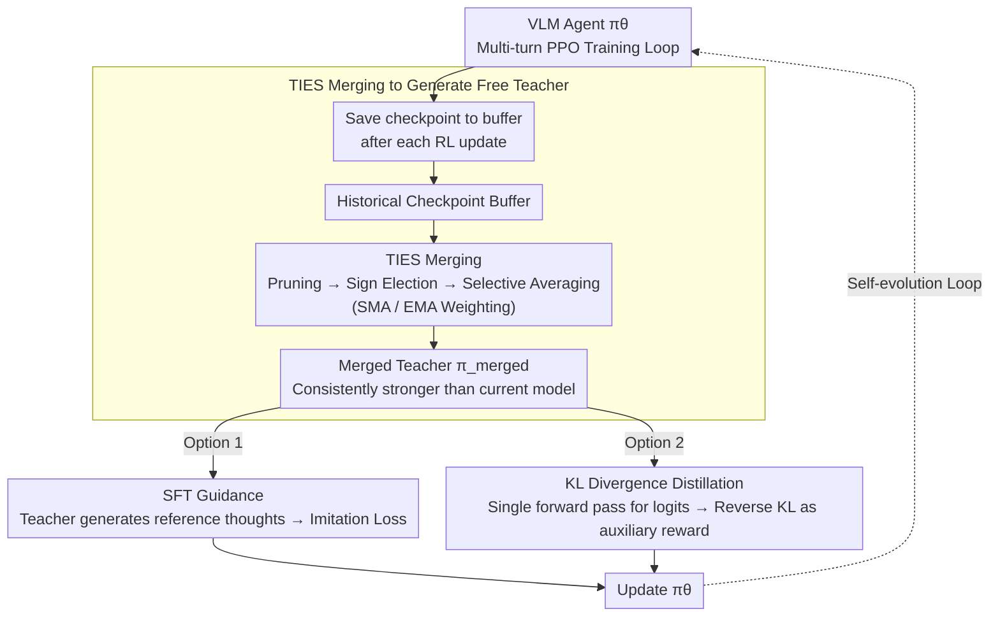

# GTR-Turbo: Merged Checkpoint is Secretly a Free Teacher for Agentic VLM Training

**Conference**: CVPR 2026  
**arXiv**: [2512.13043](https://arxiv.org/abs/2512.13043)  
**Code**: [https://github.com/TongWei1105/GTR-Turbo](https://github.com/TongWei1105/GTR-Turbo)  
**Area**: Multimodal VLM / Agent / Reinforcement Learning  
**Keywords**: VLM Agent, Multi-turn Reinforcement Learning, Model Merging, Knowledge Distillation, Self-evolution

## TL;DR
This paper proposes GTR-Turbo, which generates a "free teacher model" by merging historical checkpoints via TIES during the RL training process to guide subsequent training (via either SFT or KL distillation). It matches or even exceeds the GTR method, which relies on external teachers like GPT-4o, across multiple vision agent tasks while reducing training time by 50% and computational costs by 60%.

## Background & Motivation

1. **Background**: VLM-based multi-turn reinforcement learning (RLVR) is a new paradigm for training vision agents, but it faces core challenges such as sparse rewards and long-horizon credit assignment. Methods like GTR introduce external teacher models (e.g., GPT-4o) to provide step-by-step thought process guidance, effectively solving the "thought collapse" problem.
2. **Limitations of Prior Work**: GTR relies on expensive external teachers (GPT-4o), costing approximately \$147 and 86 hours for 15,000 training steps. Using weaker teachers (e.g., Qwen2.5-VL-7B) fails to provide effective guidance, while using 72B models, though feasible, is slower (110h) and still incurs API fees.
3. **Key Challenge**: Achieving superior training results requires a strong teacher, but a strong teacher implies high costs and low scalability. Can a model be "self-sustaining"—obtaining a teacher from its own training history?
4. **Goal**: Eliminate dependence on external privileged models and achieve self-contained, scalable self-evolutionary training for VLM agents.
5. **Key Insight**: A key observation is that historical checkpoints produced during the RL training process, when merged, consistently outperform the current model (as shown in Figure 2), naturally serving as a teacher. This stems from the property of model merging to optimize on a smoother loss surface and effectively preserve historical experience.
6. **Core Idea**: Merge historical checkpoints from the RL training process into a free teacher model to replace expensive external API teachers.

## Method

### Overall Architecture
GTR-Turbo adds three key steps onto the standard multi-turn PPO training loop: (1) saving checkpoints to a buffer after each RL update; (2) merging all historical checkpoints in the buffer into a **free teacher** model using the TIES merging method; (3) guiding subsequent RL training with this merged teacher—choosing between **SFT guidance** (GTR-Turbo-SFT) or **KL divergence distillation** (GTR-Turbo-KL). The updated model is then stored back into the buffer, allowing the merged teacher to grow stronger as training progresses, forming a positive feedback loop of self-evolution. The entire process requires no external model calls.

### Key Designs

**1. TIES Merging for "Free Teacher": Aggregating training history into a guide stronger than the current model**

The pivot of this method is a counter-intuitive observation: historical checkpoints saved during RL training are individually weaker than the latest model, but merging them together results in a performance that is consistently superior to the current model (Figure 2). GTR-Turbo utilizes this merged model as a teacher—for the $k$-th update, the teacher is a weighted sum of historical models $\pi_{\text{merged}}^{(k)} = \sum_{i=1}^{k-1} w_i \pi_\theta^{(i)}$, where weights can follow a Simple Moving Average (SMA) or an Exponential Moving Average (EMA) favoring newer models. Merging is not simple linear averaging; the TIES three-step method is used to eliminate parameter interference: first **pruning**, where only the top-k% parameters with the largest magnitudes are kept; then **sign election**, where a majority vote determines the sign for each parameter position; and finally selective averaging only for parameters with consistent signs. This complex process is necessary because different checkpoints often have conflicting updates for the same parameter; linear averaging would cause these conflicts to cancel out useful signals. Figure 13 verifies that this outperforms naive linear averaging.

**2. SFT Guidance (GTR-Turbo-SFT): Replacing external teachers with merged teachers with minimal changes**

The first application is almost a "drop-in replacement" for the original GTR. After each RL step, identical observations are fed to the merged teacher to generate a reference thought $\hat{th}$, which is stored in the replay buffer. During PPO updates, a supervised imitation loss is added to the original objective to align the student with this thought:

$$\min_\theta \; \mathbb{E}\,\mathcal{L}_{\text{PPO}}(o,a) + \mathbb{E}\,\mathcal{L}_{\text{SFT}}(o, \hat{th})$$

Formatting rewards and DAgger techniques from the original GTR are retained. The advantage is minimal implementation effort, but the disadvantage is that SFT constitutes one-hot supervision, telling the student only "which token to say" while losing the uncertainty information in the teacher's distribution—a problem addressed by the KL version.

**3. KL Divergence Distillation (GTR-Turbo-KL): Passing soft labels via a single forward pass while encouraging exploration**

The KL version does not require the teacher to autoregressively "write out" thoughts; instead, it performs a single forward pass to obtain logits, eliminating the overhead of full decoding. It measures the reverse KL divergence between the student and the teacher on thought tokens, which is used as a negative auxiliary reward within the PPO advantage function:

$$A' = A^{\pi_\theta}(o,a) - \text{RevKL}(\pi_\theta, \pi_{\text{merged}}; th)$$

KL values are clipped to $[0, +\infty)$ to prevent negative values from misleading optimization. Compared to SFT, this transfers the teacher's complete probability distribution over all candidate tokens rather than a hard label. The constraint is softer—the student is only penalized when deviating too far from the teacher, retaining space for its own exploration. Combined with the lack of autoregressive generation, training is significantly faster. Notably, KL is applied only to thinking tokens and does not constrain actions, as the freedom of action exploration is crucial for discovering new strategies.

### Loss & Training
- Base Model: Qwen2.5-VL-7B (SFT initialization)
- LoRA fine-tuning for the agent; merged teacher deployed on a separate GPU
- Points24 trained for 30,000 steps, ALFWorld for 20,000 steps (2x and 4x the budget of prior work, respectively)
- 2x 40GB NVIDIA GPUs

## Key Experimental Results

### Main Results — Points24 Card Game

| Method | Success Rate (%) | Episode Return |
|------|----------|---------|
| GPT-4o | 2.5 | -6.35 |
| Qwen2.5-VL-72B | 5.6 | -5.69 |
| RL4VLM | 3.5 | -13.3 |
| GTR (GPT-4o teacher) | 44.5 | 0.53 |
| **Ours (SFT)** | 48.0 | 1.32 |
| **Ours (KL)** | **53.5** | **2.39** |

### Efficiency Comparison

| Environment | Method | Success Rate | Training Time | Extra Cost |
|------|------|--------|---------|---------|
| Points24 | GTR | 41% | 191h | $307.78 |
| Points24 | Ours (KL) | **54%** | **89h** | $114.81 |
| ALFWorld | GTR | 16% | 164h | $145.76 |
| ALFWorld | Ours (KL) | 15% | **78h** | $100.62 |

### Ablation Study

| Configuration | Key Finding |
|------|---------|
| Static initial model as KL reference | Failed to achieve stable improvement, validating the necessity of dynamic merging |
| Rejection Sampling | Failed completely on Points24; unable to generate correct trajectories for imitation |
| Guiding thoughts + actions | Performance degraded due to restricted freedom in action exploration |
| Linear Averaging vs. TIES | TIES is superior, effectively mitigating interference from redundant parameters |
| KL clip vs. abs vs. K3 | The clip method is optimal, controlling KL magnitude for fine-grained updates |

### Key Findings
- The KL distillation version is holistically superior to the SFT version—faster, stronger, and more efficient.
- Guiding only thinking tokens rather than action tokens is critical, as agents require behavioral exploration to discover new strategies.
- The merged teacher evolves continuously: as training progresses, the teacher becomes stronger, creating a positive feedback loop.
- The training time for GTR-Turbo(KL) is comparable to the simplest RL4VLM, yet its performance is far superior.

## Highlights & Insights
- **Clever Discovery of a "Free Lunch"**: RL history checkpoints, when merged, are naturally better teachers than the current model. This insight is simple yet profound, similar to the generalization improvements of SWA (Stochastic Weight Averaging) in supervised learning.
- **KL Distillation Over Autoregressive Generation**: Using a single forward pass instead of full autoregressive decoding is not only faster but also more effective. This suggests that soft labels are more efficient than hard labels in self-evolutionary scenarios.
- **Transferable Methodology**: This "historical checkpoint merging as teacher" trick is theoretically applicable to any multi-turn RL training scenario, not limited to VLM agents.

## Limitations & Future Work
- In long-horizon tasks like ALFWorld (50+ steps), the advantage of the merged teacher is less pronounced than in Points24 due to the lack of external domain knowledge.
- An additional GPU is still required to deploy the merged teacher; while cheaper than APIs, it is not zero-cost.
- The merging interval and TIES parameters require careful tuning.
- Hybrid schemes combining merged teachers with small-scale external teachers have not yet been explored.

## Related Work & Insights
- **vs. GTR**: GTR uses GPT-4o as a teacher, which is effective but extremely expensive. GTR-Turbo replaces it for free using merged checkpoints, cutting costs by 60% and achieving better results on Points24.
- **vs. RL4VLM**: Direct PPO training leads to thought collapse, where model outputs become repetitive and formulaic. GTR-Turbo effectively resolves this through thought guidance.
- **vs. Rejection Sampling**: RS relies on the model's ability to generate correct trajectories, a premise that fails in difficult tasks. The combination of RL exploration and merged teacher guidance is a superior approach.

## Rating
- Novelty: ⭐⭐⭐⭐ The idea of using merged checkpoints as teachers is elegant, and the use of KL distillation over SFT is a strong design.
- Experimental Thoroughness: ⭐⭐⭐⭐⭐ Comprehensive across two environments, various ablations, cost analysis, and training curves.
- Writing Quality: ⭐⭐⭐⭐ Clear motivation and intuitive diagrams.
- Value: ⭐⭐⭐⭐⭐ Significantly reduces the cost of VLM agent training with high practical utility.

<!-- RELATED:START -->

## Related Papers

- [\[CVPR 2026\] PAS: A Training-Free Stabilizer for Temporal Encoding in Video LLMs](pas_a_training-free_stabilizer_for_temporal_encoding_in_video_llms.md)
- [\[CVPR 2026\] DRS-GUI: Dynamic Region Search for Training-Free GUI Grounding](drs-gui_dynamic_region_search_for_training-free_gui_grounding.md)
- [\[CVPR 2026\] Pointing at Parts: Training-Free Few-Shot Grounding in Multimodal LLMs](pointing_at_parts_training-free_few-shot_grounding_in_multimodal_llms.md)
- [\[CVPR 2026\] Generate, Analyze, and Refine: Training-Free Sound Source Localization via MLLM Meta-Reasoning](generate_analyze_and_refine_training-free_sound_source_localization_via_mllm_met.md)
- [\[CVPR 2026\] LLMind: Bio-inspired Training-free Adaptive Visual Representations for Vision-Language Models](llmind_bio-inspired_training-free_adaptive_visual_representations_for_vision-lan.md)

<!-- RELATED:END -->
