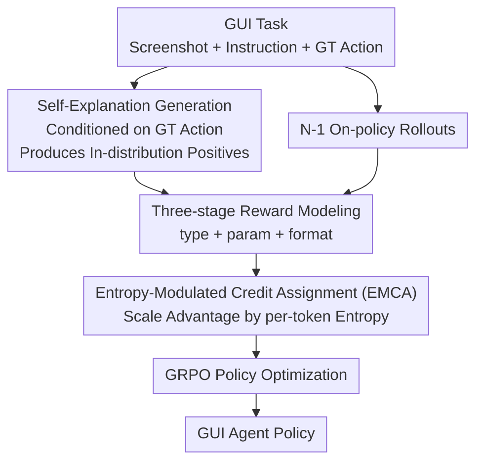

# GUI-SAGE: Enhancing GUI Automation with Self-Explanatory Learning

**Conference**: CVPR 2026  
**Paper**: [CVF Open Access](https://openaccess.thecvf.com/content/CVPR2026/html/Tang_GUI-SAGE_Enhancing_GUI_Automation_with_Self-Explanatory_Learning_CVPR_2026_paper.html)  
**Code**: None  
**Area**: Multimodal VLM / GUI Agent / Reinforcement Learning  
**Keywords**: GUI Automation, RLVR, Self-Explanatory Learning, Entropy-Modulated Credit Assignment, Distribution Compatibility

## TL;DR
To address the "zero-advantage trap" in GUI Reinforcement Learning—where all rollouts fail and advantages become zero when tasks are too difficult—GUI-SAGE prompts the model to explain "why this action is correct" given ground-truth actions. This generates in-distribution positive samples. An Entropy-Modulated Credit Assignment (EMCA) mechanism then amplifies or suppresses gradients based on prediction confidence, enabling a 3B model to achieve an 81.1% average success rate on AndroidControl / GUI-Odyssey, surpassing larger 7B baselines.

## Background & Motivation
**Background**: Training GUI agents with RLVR (reinforcement learning with verifiable rewards) is currently mainstream. Agents perform actions like click/swipe/type during multi-step interactions and learn from binary rewards based on task completion, following the verifiable reward paradigm of mathematical reasoning like GRPO without dense human annotation.

**Limitations of Prior Work**: The action space for GUI tasks is combinatorically explosive, requiring precise coordinates, action types, and text input on high-resolution screens. When task difficulty exceeds model capability, on-policy exploration fails to sample correct actions, leading to all rollouts in a group having zero rewards and zero advantages after normalization. This provides no learning signal, termed the **zero-advantage trap**. Empirical data shows 73.2% of tasks fall into this trap during early training (Table 5), rising to 87.7% for sparse actions like long press or terminate.

**Key Challenge**: Intuitively, introducing expert demonstrations from stronger models (e.g., Gemini 2.5 Pro, Qwen2.5-VL-72B) could provide correct trajectories. However, the authors find this harmful for GUI tasks due to **distribution mismatch**. The expert's reasoning uses concepts the current policy cannot grasp; the model assigns extremely low log-probabilities to expert tokens (Figure 3a), causing entropy to spike and stay near 1.0 (Figure 3c). Training fluctuates between imitating incomprehensible patterns and maintaining original behavior. Furthermore, a single expert sample can halve the log-probability of other rollouts in the same batch (Figure 3b).

**Goal**: Inject reliable positive learning signals into tasks where on-policy exploration fails without breaking distribution compatibility, while distinguishing samples with different confidence levels.

**Core Idea**: Instead of borrowing external expert trajectories, let the model **explain itself**. By feeding ground-truth actions as prompts, the model explains "why this action is correct" using its own vocabulary. Since the correct action is given, the generated trajectory yields a non-zero reward, and because it uses the model's own concepts, entropy remains stable. The authors further use entropy as a natural proxy for confidence for fine-grained credit assignment.

## Method

### Overall Architecture
GUI-SAGE models GUI automation as sequential decision-making: given a task description $t$ and initial screen $s_0$, the agent observes screenshot $s_i$ at each step and samples actions from policy $\pi_\theta(a_i \mid t, s_i, a_{<i})$ (including click, long press, swipe, type, system button, open, wait, terminate). It receives a sparse binary reward $R \in \{0,1\}$ upon termination or reaching maximum steps.

The framework consists of two cooperating components centered on "entropy-aware learning." First, for each training task, one **self-explanation sample** (conditioned on the ground-truth action) is included alongside $N-1$ standard on-policy rollouts to guarantee at least one reliable positive sample and break the zero-advantage trap. Second, **Entropy-Modulated Credit Assignment (EMCA)** rescales normalized advantages based on per-token entropy to amplify updates for high-confidence samples and suppress those for uncertain ones before policy optimization using the GRPO objective.

### Key Designs

**1. Self-Explanation Generation: Replacing "Discovery" with "Explanation"**

This step directly targets the zero-advantage trap. Given task $t$, state $s$, and ground-truth action $a^*$, the model samples a reasoning trajectory $c$ and action $a$ using $a^*$ as additional context:

$$(c, a) \sim \pi_\theta(c, a \mid t, s, a^*)$$

This mechanism shifts the learning objective from action discovery to action explanation. The model interprets why a given action completes the task rather than exploring blindly. Since $a^*$ guides the generation, the trajectory is **constructively** guaranteed to yield non-zero rewards. Unlike expert demonstrations, self-explanations keep log-probabilities stable and entropy at levels comparable to on-policy rollouts (~0.5 vs. ~1.0 for experts).

**2. Entropy-Modulated Credit Assignment (EMCA): Entropy as a Confidence Proxy**

Standard RL assigns equal credit to samples with the same reward, ignoring variance in confidence. EMCA explicitly incorporates prediction confidence into advantage calculation. First, the average per-token entropy $H$ for each trajectory is calculated and normalized within the batch:

$$H_{\text{norm}} = \frac{H - \min(H)}{\max(H) - \min(H)}$$

An exponential decay yields the entropy modulation factor:

$$g_H = \frac{\exp(-H_{\text{norm}})}{\mathbb{E}[\exp(-H_{\text{norm}})]}$$

The modulated advantage is $A_{\text{mod}} = A \cdot g_H$, where $A$ is the original group-normalized advantage. This scales up updates for low-entropy (confident) predictions and dampens high-entropy exploration noise.

**3. Three-stage Reward + GRPO Integration**

The reward function evaluates action correctness and output structure via three components: Action type reward $R_{\text{type}}$ (binary match with GT), action parameter reward $R_{\text{param}}$ (distance-based for coordinates, F1-score for text), and format reward $R_{\text{format}}$ (checks for `<think>` and `<tool_call>` tags). The total reward is:

$$R = w_1 \cdot R_{\text{format}} + w_2 \cdot (R_{\text{type}} + R_{\text{param}})$$

For $N$ samples per task, the advantages are first group-normalized:

$$A_i = \frac{R(i) - \text{mean}(\{R(j)\}_{j=1}^N)}{\text{std}(\{R(j)\}_{j=1}^N)}$$

The final optimization uses the clipped PPO-style objective with EMCA-modulated advantages:

$$J(\theta) = \mathbb{E}_{\tau \sim \pi_{\theta_{\text{old}}}}\Big[\sum_t \min\big(r_t(\theta) A_{\text{mod},t},\ \text{clip}(r_t(\theta), 1-\epsilon, 1+\epsilon) A_{\text{mod},t}\big) - \beta D_{\text{KL}}[\pi_\theta \| \pi_{\text{ref}}]\Big]$$

### Loss & Training
The base models are Qwen2.5-VL (3B / 7B) trained within the VLM-R1 framework using ~40K samples from AndroidControl and GUI-Odyssey. Training used 8×A100-80G GPUs for 3 epochs with a 1e-6 learning rate and batch size of 8. Each instruction sampled 8 responses. Flash Attention 2, bfloat16, and gradient checkpointing were utilized.

## Key Experimental Results

### Main Results
Average Step Success Rate (Step SR) across three benchmarks:

| Model | Type | AC-Low SR | AC-High SR | GUI-Odyssey SR | Avg SR |
|------|------|-----------|-----------|----------------|--------|
| InfiGUI-R1-3B | RL | 91.1 | 70.7 | 64.7 | 75.5 |
| AgentCPM-GUI-8B | SFT | 90.2 | 69.2 | 75.0 | 78.1 |
| UI-Venus-Navi-7B | SFT | 92.4 | 76.1 | 71.5 | 80.0 |
| **GUI-SAGE-3B** | RL | 93.4 | 75.4 | 74.6 | **81.1** |
| **GUI-SAGE-7B** | RL | 93.7 | 76.8 | 75.8 | **82.1** |

The 3B model outperforms the 7B UI-Venus-Navi and 8B AgentCPM-GUI. On the real-device benchmark AndroidWorld, the 3B/7B models achieved 19.8%/23.3% SR, significantly higher than their respective Qwen2.5-VL baselines.

### Ablation Study
Prompt format ablation (standard GRPO without EMCA):

| Configuration | AC-Low SR | AC-High SR | Avg | Description |
|------|-----------|-----------|-----|------|
| Vanilla-GRPO | 89.7 | 70.4 | 80.1 | No prompt, pure exploration |
| ATH (Type only) | 90.8 | 71.9 | 81.4 | +1.3% |
| APH (Param only) | 91.2 | 72.4 | 81.8 | +1.7% |
| Self-Explanation (Full GT) | 91.9 | 74.2 | **83.1** | Most information, optimal |

### Key Findings
- **Zero-advantage Trap prevalence**: 73.2% of samples receive zero rewards early in training. Sparse actions like long press (91.3%) and terminate (87.6%) are most affected.
- **Self-Explanation vs. Expert CoT**: Expert CoT maintains high entropy (~1.0) and suppresses log-probabilities of other rollouts. Self-explanation entropy stabilizes at ~0.5.
- **Training Dynamics**: Vanilla-GRPO entropy collapses to 0.2 (premature convergence), while GUI-SAGE stabilizes at 0.46 with consistent response lengths.
- **EMCA Contribution**: EMCA provides approximately +1.1% gain, with the most significant impact on in-distribution samples.

## Highlights & Insights
- **Clever reframing via "Self-Explanation"**: Solving a combinatorically hard exploration problem by converting it into an explanation task using known answers.
- **Dual-use of Entropy**: Entropy serves both as a detector for distribution mismatch and as a proxy for confidence for fine-grained credit assignment.
- **Portability**: The mechanism is not restricted to GUI tasks and can be applied to any RLVR scenario (math, code, etc.) suffering from the zero-advantage trap.

## Limitations & Future Work
- Dependency on ground-truth action labels for every training sample restricts application to tasks without expert trajectories.
- Low absolute success rates on real-world AndroidWorld (19.8% - 23.3%) indicate a gap between offline benchmarks and dynamic environments.
- EMCA's sensitivity to batch composition during entropy normalization requires further robustness analysis.

## Related Work & Insights
- **Comparison with LUFFY / ExGRPO**: These assume external experience is in-distribution. GUI-SAGE demonstrates that expert CoT for GUI tasks causes mismatch and uses self-explanation to avoid this.
- **Distinction from standard GUI RLVR**: While InfiGUI-R1 and others use rule-based rewards, they fail on hard tasks due to the zero-advantage trap, which GUI-SAGE mitigates via in-distribution guidance.

## Rating
- Novelty: ⭐⭐⭐⭐ 
- Experimental Thoroughness: ⭐⭐⭐⭐ 
- Writing Quality: ⭐⭐⭐⭐ 
- Value: ⭐⭐⭐⭐ 

<!-- RELATED:START -->

## Related Papers

- [\[CVPR 2026\] Training High-Level Schedulers with Execution-Feedback Reinforcement Learning for Long-Horizon GUI Automation](training_high-level_schedulers_with_execution-feedback_reinforcement_learning_fo.md)
- [\[CVPR 2026\] DRS-GUI: Dynamic Region Search for Training-Free GUI Grounding](drs-gui_dynamic_region_search_for_training-free_gui_grounding.md)
- [\[CVPR 2026\] MVP: Multiple View Prediction Improves GUI Grounding](mvp_multiple_view_prediction_improves_gui_grounding.md)
- [\[CVPR 2026\] HiconAgent: History Context-aware Policy Optimization for GUI Agents](hiconagent_history_context-aware_policy_optimization_for_gui_agents.md)
- [\[CVPR 2026\] GUIDE: A Benchmark for Understanding and Assisting Users in Open-Ended GUI Tasks](guide_a_benchmark_for_understanding_and_assisting_users_in_open-ended_gui_tasks.md)

<!-- RELATED:END -->
