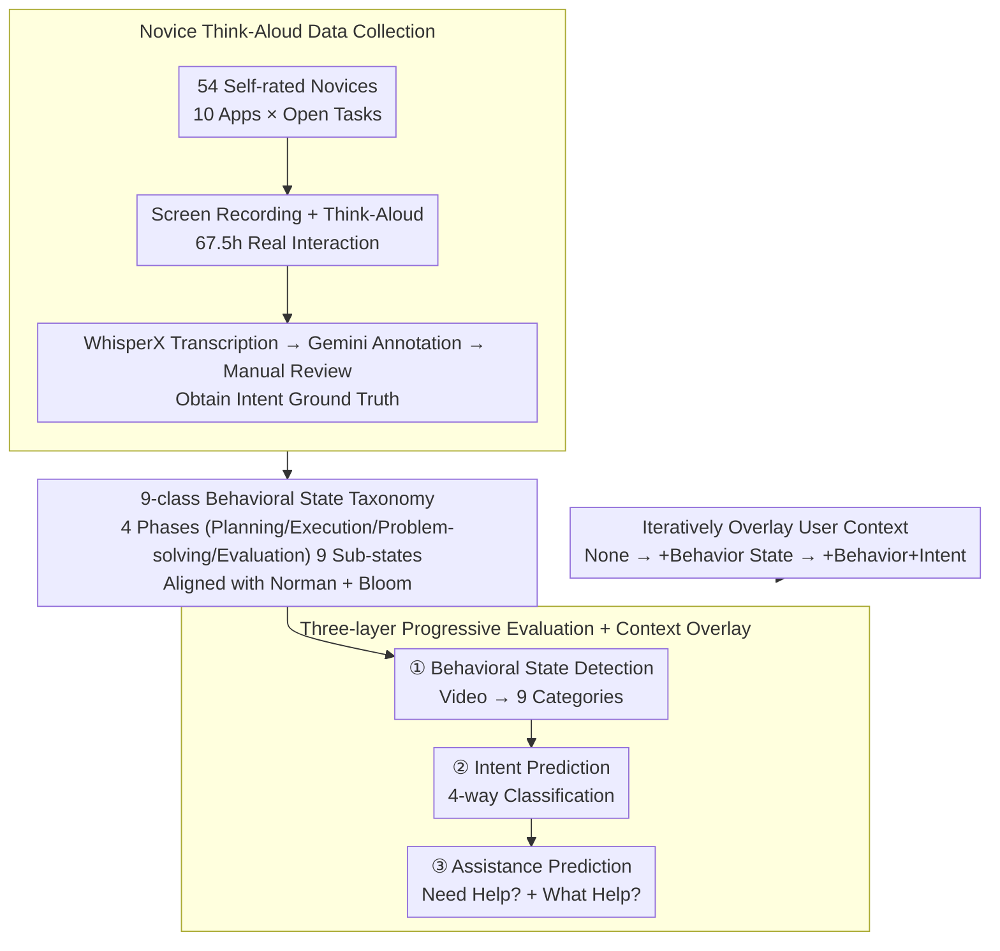

# GUIDE: A Benchmark for Understanding and Assisting Users in Open-Ended GUI Tasks

**Conference**: CVPR 2026  
**arXiv**: [2603.25864](https://arxiv.org/abs/2603.25864)  
**Code**: [https://guide-bench.github.io/](https://guide-bench.github.io/)  
**Area**: Multimodal VLM / Human-Computer Interaction / GUI Agents  
**Keywords**: GUI Understanding, User Behavior Detection, Intent Prediction, Assistance Prediction, Novice Users

## TL;DR
This paper introduces the GUIDE benchmark, containing 67.5 hours of screen recordings and think-aloud annotations from 120 novice users across 10 software applications. It defines three hierarchical tasks: behavioral state detection, intent prediction, and assistance prediction. Evaluations reveal that current state-of-the-art multimodal models show limited performance in understanding user behavior and judging assistance needs (behavior detection accuracy at only 44.6%), but providing structured user context significantly improves performance (up to a 50.2pp gain in assistance prediction).

## Background & Motivation

1. **Background**: Existing GUI agents primarily focus on "full automation"—given a goal, they automatically execute clicks and keystrokes to complete tasks. Academic works like VideoGUI and AssistGUI, alongside industrial tools like Microsoft Copilot and Figma Make, follow this path.
2. **Limitations of Prior Work**: Full automation ignores the actual way users work—in open-ended creative or analytical tasks, users need to explore, iterate, fail, and modify ideas. Multiple "undo" actions might not be "redundant operations" but rather the formation of preferences. Automated agents might skip these as equivalent behaviors.
3. **Key Challenge**: Existing benchmarks are based on expert demonstrations of closed tasks, evaluating "whether the same thing can be repeated." However, it is the open-ended exploration of novice users that truly requires assistance. Similar operation sequences can stem from entirely different intents—repeated undos might indicate confusion or deliberate optimization.
4. **Goal**: (1) Collect authentic behavioral data from novice users in open-ended tasks; (2) Evaluate whether models can understand what users are doing, why they are doing it, and if they need help.
5. **Key Insight**: GUI assistance is decomposed into three progressive levels: Understanding (Behavior) → Reasoning (Intent) → Action (Assistance), aligning with Norman’s Seven Stages of Action and Bloom’s Taxonomy.
6. **Core Idea**: Build a three-layer progressive evaluation benchmark centered on novice open-ended GUI interaction to reveal the critical role of structured user context for effective assistance.

## Method

### Overall Architecture
GUIDE is not a model but a "novice-centric" evaluation benchmark. It measures whether MLLMs can understand user actions, goals, and timing for help. The benchmark follows a pipeline: first, 54 self-identified novice users perform open-ended tasks on 10 software applications while thinking aloud, resulting in 67.5 hours of interaction with "internal monologues." Next, these behaviors are categorized into a taxonomy of nine behavioral states. Finally, three progressive tasks—behavioral state detection, intent prediction, and assistance prediction—are established. The framework allows for the incremental feeding of user context to models to quantify the contribution of each layer of understanding to the final assistance decision.

### Key Designs

**1. Novice Think-Aloud Data Collection: Converting "Implicit Intent" into Evaluable Ground Truth**

Assistance agents should ideally understand moments when users are stuck, trial-and-error, or undoing actions. However, previous GUI data consists of smooth expert demonstrations lacking "real confusion." GUIDE recruited 54 novices (skill levels 1–5, mean 2.8) from Prolific. Each spent at least 20 minutes on open tasks without standard answers (e.g., "Create a PPT self-introduction") while recording their screen and thinking aloud. The value of think-aloud is that user intent, normally hidden, is externalized into "intent ground truth." Audio was transcribed via WhisperX, initially annotated by Gemini-2.5-Pro, and manually reviewed, ensuring high reliability (96.1% behavior consistency, 88.68% intent retention).

**2. Nine Behavioral State Taxonomy: A Vocabulary for "What is the User Doing Now?"**

To evaluate model understanding, a structured set of labels is required. GUIDE categorizes open-ended operations into nine sub-states across four phases: Planning (Goal Setting, Planning Task), Execution (Executing Actions, Exploration & Decision Making), Problem-solving (Confusion/Asking for Help, Debugging/Correction, Frustration), and Evaluation (Checking Progress, Refining Work). This taxonomy aligns with Norman’s Seven Stages of Action and Bloom’s Taxonomy, mapping the cognitive process to observable labels. States like "Confusion/Asking for Help" and "Frustration" are critical signals for assistance systems.

**3. Three-layer Progressive Evaluation + Context Overlay: Locating Model Bottlenecks**

GUIDE splits "user understanding" into three tasks of increasing cognitive depth. The first layer, Behavioral State Detection, performs 9-class classification based only on video. The second, Intent Prediction, uses 4-way multiple-choice to infer goals. The third, Assistance Prediction, uses binary classification for "Need Help?" followed by 4-way classification for "What Help?". This structure pinpoints whether a model fails at seeing behavior, inferring intent, or judging assistance needs. Crucially, each layer supports context overlay (none vs. +behavior vs. +intent) to quantify the gain provided by "structured user context."

### Loss & Training
This work is an evaluation benchmark, not a training method. Evaluations use a zero-shot setting across 8 MLLMs (Gemini-2.5-Flash/Pro, GPT-4o/mini, Claude-4.5-Sonnet, Qwen3-VL-8B, InternVideo2.5-8B, InternVL3-8B). Each video is uniformly sampled at 32 frames, and audio transcripts are excluded to simulate real-world deployment where models only "see" the screen.

## Key Experimental Results

### Main Results — Task Accuracy

| Model | Behavior Detection | Intent Prediction | Assistance Need Detection | Assistance Content Prediction |
|------|---------|---------|------------|------------|
| Claude-4.5-Sonnet | **44.61%** | **71.39%** | 39.49% | **55.00%** |
| Gemini-2.5-Pro | 42.44% | 67.80% | **69.82%** | 52.74% |
| GPT-4o | 36.32% | 61.19% | 49.69% | 45.95% |
| Qwen3-VL-8B | 37.97% | 62.70% | 52.83% | 46.06% |
| InternVL3-8B | 22.57% | 46.11% | 34.94% | 27.03% |

### Context Enhancement (Assistance Need Detection Accuracy)

| Model | No Context | +Behavior State | +Behavior+Intent | Gain |
|------|--------|---------|-----------|---------|
| GPT-4o-mini | 46.05% | 78.92% | **82.26%** | +36.21pp |
| GPT-4o | 49.69% | **87.79%** | 87.91% | +38.22pp |
| Gemini-2.5-Pro | 69.82% | 84.73% | 82.38% | +14.91pp |
| Claude-4.5-Sonnet | 39.49% | 58.56% | 59.43% | +19.94pp |
| InternVideo2.5-8B | 34.36% | 35.35% | 35.25% | +0.89pp |

### Key Findings
- **Behavior detection is the most difficult task**: The strongest model achieved only 44.6%. Models frequently misclassify "Frustration/Debugging" as "Executing Actions," missing subtle signals of user difficulty.
- **Intent prediction is relatively easier**, but performance drops significantly under the strict MBAcc metric, suggesting models often "guess" correctly but lack stability.
- **Structured context has a profound effect**: Providing behavioral states increased the F1 score of GPT-4o's assistance need detection from 47.73 to 90.19.
- **Small open-source models lag severely**: InternVideo2.5 and InternVL3 show assistance need detection recall near 0%, misclassifying almost all instances requiring help as not needing it.
- **Progression sensitivity**: Performance improves as more video is observed (25% → 100%), highlighting the importance of temporal context in understanding user behavior.

## Highlights & Insights
- **Shift in Evaluation Perspective**: Transitioning from "Can the model complete the task for the user?" to "Does the model understand what the user needs?" This represents a significant shift in GUI agent research. Existing benchmarks assume fixed goals, whereas real user goals are dynamic.
- **Layered Context Experimental Design**: By incrementally adding behavioral/intent context, the study quantifies the precise contribution of each layer of understanding. The jump in GPT-4o-mini from 46% to 82% indicates that "the model is capable of helping, it just doesn't understand the user."
- **Unique Value of Novice Data**: Expert demos show the "correct way," but novice behavior represents "real demand scenarios." This insight is transferable to domains like AI in education or healthcare, which require understanding non-expert users.

## Limitations & Future Work
- The 9-class taxonomy may lack granularity; for instance, "Exploration & Decision Making" is broad.
- Sampling only 32 frames might miss rapid operations or subtle signs of hesitation.
- Think-aloud labeling depends on the user's ability to express thoughts, potentially introducing noise.
- Only offline reasoning is evaluated, leaving real-time online assistance feasibility unverified.
- The dataset size (120 segments) is suitable for a benchmark but may be insufficient for training robust models.

## Related Work & Insights
- **vs VideoGUI/AssistGUI**: Those use expert tutorials for closed-task automation; GUIDE uses natural novice behavior for open-ended user understanding.
- **vs ProactiveVA**: ProactiveVA performs proactive assistance in visual analytics; GUIDE covers 10 general software applications and focuses on understanding rather than intervention.
- **vs OSWorld/AndroidWorld**: These are benchmarks for fully automated GUI manipulation; GUIDE emphasizes human-in-the-loop, understanding, and assistance over replacement.

## Rating
- Novelty: ⭐⭐⭐⭐⭐ First GUI benchmark focusing on novice behavior understanding with a well-designed progressive framework.
- Experimental Thoroughness: ⭐⭐⭐⭐ 8 models across various context configurations, though lacking training experiments.
- Writing Quality: ⭐⭐⭐⭐⭐ Logical structure, comprehensive tables, and strong theoretical alignment.
- Value: ⭐⭐⭐⭐⭐ Highlights a major gap in current MLLM user understanding and provides a clear direction for assistive agents.

<!-- RELATED:START -->

## Related Papers

- [\[CVPR 2026\] LifeEval: A Multimodal Benchmark for Assistive AI in Egocentric Daily Life Tasks](lifeeval_a_multimodal_benchmark_for_assistive_ai_in_egocentric_daily_life_tasks.md)
- [\[CVPR 2026\] GUI-SAGE: Enhancing GUI Automation with Self-Explanatory Learning](gui-sage_enhancing_gui_automation_with_self-explanatory_learning.md)
- [\[CVPR 2026\] DRS-GUI: Dynamic Region Search for Training-Free GUI Grounding](drs-gui_dynamic_region_search_for_training-free_gui_grounding.md)
- [\[CVPR 2025\] OpenING: A Comprehensive Benchmark for Judging Open-ended Interleaved Image-Text Generation](../../CVPR2025/multimodal_vlm/opening_a_comprehensive_benchmark_for_judging_open-ended_interleaved_image-text_.md)
- [\[ACL 2025\] CrafText Benchmark: Advancing Instruction Following in Complex Multimodal Open-Ended World](../../ACL2025/multimodal_vlm/craftext_benchmark_advancing_instruction_following_in_complex_multimodal_open-en.md)

<!-- RELATED:END -->
