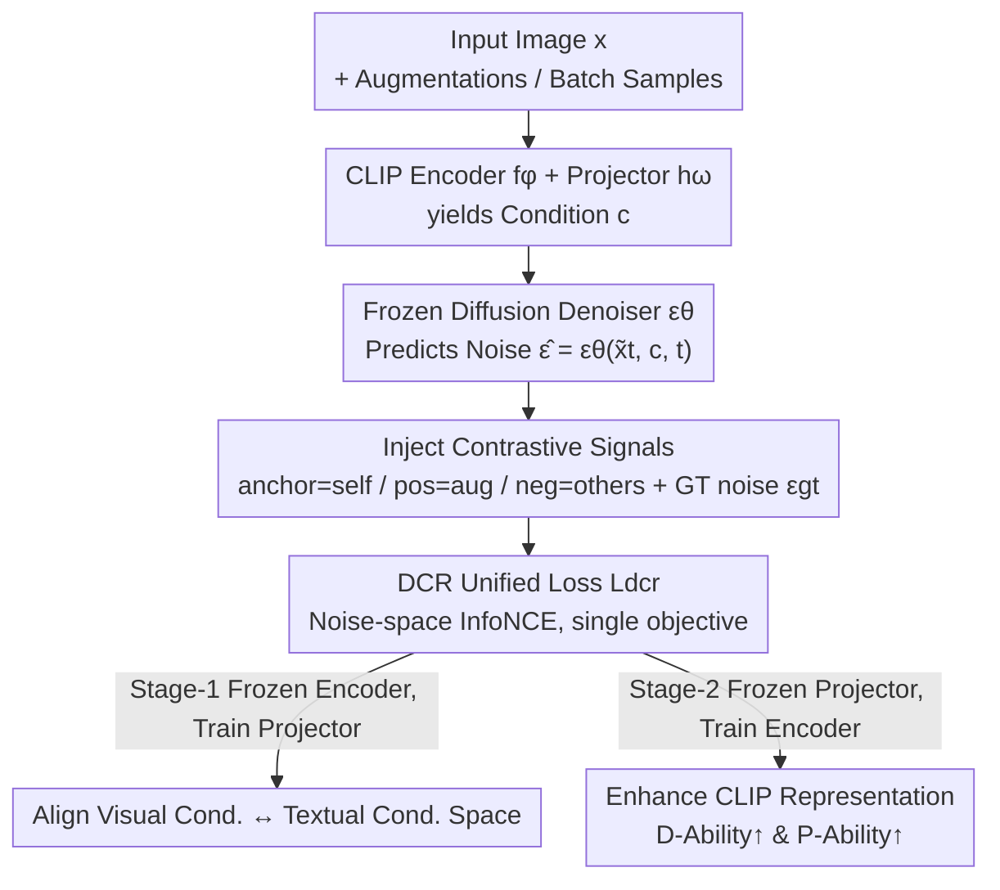

# Guiding Diffusion-based Reconstruction with Contrastive Signals for Balanced Visual Representation

**Conference**: CVPR 2026  
**Paper**: [CVF Open Access](https://openaccess.thecvf.com/content/CVPR2026/html/Han_Guiding_Diffusion-based_Reconstruction_with_Contrastive_Signals_for_Balanced_Visual_Representation_CVPR_2026_paper.html)  
**Code**: https://github.com/boyuh/DCR  
**Area**: Multimodal VLM / Representation Learning / Diffusion Models  
**Keywords**: CLIP vision encoder, diffusion reconstruction, contrastive learning, gradient conflict, representation enhancement  

## TL;DR
To enable CLIP vision encoders to simultaneously achieve "category discriminability" and "fine-grained perception," this paper proposes DCR. Instead of having the diffusion model reconstruct the original image (which only adds detail but harms discrimination), it injects contrastive signals into the **predicted noise** of the diffusion model to form a unified loss. This single objective optimizes both capabilities simultaneously, bypassing gradient conflicts inherent in naively combining two losses, and achieves consistent gains across 6 CLIP backbones and downstream MLLMs.

## Background & Motivation
**Background**: CLIP vision encoders serve as the "eyes" for the majority of Multimodal Large Language Models (MLLMs), typically acting as frozen modules providing image representations. However, CLIP's image-text alignment is a relatively coarse self-supervision with limited understanding, becoming a bottleneck for downstream performance. The community decomposes this understanding into two complementary dimensions: **Discriminative Ability (D-Ability)**—separating different categories in feature space (clustering similarities, repelling dissimilarities), which is crucial for recognition and retrieval; and **Perceptual Ability (P-Ability)**—retaining details like color, orientation, quantity, and structure, essential for multimodal Q&A and visual reasoning.

**Limitations of Prior Work**: Enhancing CLIP follows two paths, each with specific shortcomings. Traditional contrastive learning fine-tunes encoders to strengthen D-Ability. Emerging diffusion-based feedback (DIVA / GenHancer / un2CLIP) reconstructs images using CLIP features as conditions; higher reconstruction fidelity implies more complete representations, thus improving P-Ability. The problem is that the latter **lacks categorical supervision**, and pure reconstruction provides almost no gain to—or even damages—D-Ability, as shown in Fig. 1(d) of the paper.

**Key Challenge**: An intuitive fix is a linear weighting of "reconstruction loss + contrastive loss." However, the authors find this naive combination ineffective: the two objectives operate at different levels—contrastive loss focuses on CLIP **feature** separability, while reconstruction loss focuses on **image-level** consistency. Their gradient directions frequently conflict. Statistics on OpenAI CLIP ViT-L show that in **86.3% of steps**, the gradient cosine similarity between the two losses is negative (conflicting). Consequently, the "easier" contrastive loss dominates, suppressing the reconstruction loss and leading to training instability or feature collapse.

**Core Idea**: Instead of weighting heterogeneous objectives, the issue is addressed at its root: **using a single objective**. DCR's key modification is to abandon "reconstructed image ↔ original image" consistency and instead apply contrastive supervision to the **noise predicted by the diffusion model** for each image. The anchor is the noise predicted under the image's own condition, the positive sample is the noise under its augmented view, and negatives are noises under other images in the mini-batch. A single contrastive loss unifies both: satisfying contrastive constraints (D-Ability) while remaining equivalent to reconstruction consistency (P-Ability), naturally eliminating gradient conflicts.

## Method

### Overall Architecture
DCR solves the problem of "how to pull up both D-Ability and P-Ability with one loss." It reuses a **pre-trained and frozen** conditional diffusion model (Stable Diffusion v2.1) as a "judge." The pipeline is: Input image → CLIP vision encoder $f_\phi$ extracts features $z$ → Projector $h_\omega$ maps $z$ to condition $c$ → Frozen denoiser $\epsilon_\theta$ predicts noise $\hat\epsilon=\epsilon_\theta(\tilde x_t, c, t)$ at a specific timestep $t$. Crucially, for the same noisy latent, **different conditions** lead to **different predicted noises**. The authors construct contrastive triplets (anchor / positive / negatives) in this "predicted noise" space to train the CLIP encoder while keeping the diffusion model frozen.

Training is conducted in two stages: first aligning the projector, then enhancing the encoder.

### Key Designs

**1. Noise Space Contrastive Triplet: Injecting signals into predicted noise**

This is the core of DCR, targeting the root cause of gradient conflict. DCR moves the objective to the **noise $\hat\epsilon$ predicted by the diffusion denoiser**. For an image $x$: the anchor is the noise predicted using its own features as a condition $\hat\epsilon=\epsilon_\theta(x_t, h_\omega(f_\phi(\tilde x)), t)$; the positive sample $\hat\epsilon^+$ uses its augmented view $x^+=a(x)$; negative samples $\{\hat\epsilon_-^j\}$ use other images $x_j$ from the mini-batch; additionally, the **ground truth noise** $\epsilon^{gt}$ is included as an auxiliary positive target. The intuition is that contrastive learning in the noise space forces the encoder to perceive subtle differences in representation conditions—similar conditions must produce similar noises, while dissimilar ones must produce different ones.

**2. DCR Unified Loss: One InfoNCE for dual objectives**

The loss is defined as an InfoNCE in the noise space. Let $d(u,v)=\exp(\mathrm{sim}(u,v)/\tau)$ where $\mathrm{sim}$ is cosine similarity. Given a positive set $P=\{\hat\epsilon^+, \epsilon^{gt}\}$ and a negative set $N=\{\hat\epsilon_-^k\}_{k=1}^{N-1}$, with $C=P\cup N$:

$$L_{dcr} = -\frac{1}{2}\sum_{p\in P}\log\frac{d(\hat\epsilon, p)}{\sum_{c\in C} d(\hat\epsilon, c)}.$$

Since there is only one optimization direction, **gradient conflict is structurally impossible**, unlike naive weighting $L_{joint}=\lambda_{con}L_{con}+\lambda_{rec}L_{rec}$. The paper provides theoretical support: **Theorem 1** proves that intra-class and inter-class variances in feature space are controlled by their noise-space counterparts ($S_{inner}\le \tfrac{1}{m^2}S^{(\epsilon)}_{inner}$, etc.). **Theorem 2** proves that when negative samples are sufficiently separated, $L_{dcr}$ degrades into a scaled reconstruction loss $L_{dcr}=\lambda\lVert\epsilon_\theta(x_t,h_\omega(f_\phi(\tilde x)),t)-\epsilon^{gt}_t\rVert_2^2+c$. Thus, one loss governs both capabilities.

**3. Two-Stage Training: Alignment then Enhancement**

Diffusion models are pre-trained on **textual** conditions and cannot natively interpret raw image conditions. Stage-1 freezes the CLIP encoder and trains only the projector $h_\omega$ to align visual guidance with the diffusion model's textual space. Stage-2 freezes the projector and trains the encoder $f_\phi$ (using LoRA, rank 16), where gradients from $L_{dcr}$ directly refine the feature structure. Ablations show two-stage training significantly outperforms end-to-end (MMVP 33.30 vs 25.93).

### Loss & Training
The single loss used is $L_{dcr}$. Implementation details: NVIDIA A100-80G; SD v2.1 as the diffusion backbone; two-layer MLP for the projector; input condition uses only the **[CLS] token** (discarding patch tokens). Dataset: CC3M; AdamW (weight decay 0.01); Stage-1 LR $1\times10^{-4}$ and Stage-2 LR $1\times10^{-5}$ with LoRA rank 16; batch size 16; 4600 total steps.

## Key Experimental Results

### Main Results
Evaluation spans 6 CLIP backbones. P-Ability is measured via MMVP-VLM; D-Ability via zero-shot clustering (NMI/ACC/ARI) across 6 datasets.

| Dimension | Backbone | Metric | Original | DIVA | GenHancer | un2CLIP | Ours (DCR) |
|-----------|----------|--------|----------|------|-----------|---------|------------|
| P-Ability | OpenAI ViT-L@224 | MMVP-VLM Avg | 19.2 | 25.9 | 31.8 | 32.6 | **33.3** |
| P-Ability | MetaCLIP ViT-H@224 | MMVP-VLM Avg | 25.2 | 31.8 | 37.0 | - | **37.8** |
| P-Ability | SigLIP ViT-SO@224 | MMVP-VLM Avg | 37.8 | 40.7 | 42.2 | - | **43.0** |
| D-Ability | OpenAI ViT-L@224 | Clustering Avg | 0.71/0.60 | 0.71/0.60 | 0.65/0.55 | 0.70/0.62 | **0.76/0.67** |
| D-Ability | SigLIP ViT-SO@224 | Clustering Avg | 0.78/0.70 | 0.77/0.69 | 0.74/0.64 | - | **0.83/0.76** |

DCR improves P-Ability on OpenAI ViT-L@224 by 14.1%. Notably, while GenHancer often drops below the original model in D-Ability (confirming that pure reconstruction harms discrimination), DCR is the only method to improve both dimensions steadily.

Downstream MLLM results (LLaVA-1.5 / Vicuna-7B):

| Benchmark | Original | DIVA | GenHancer | un2CLIP | Ours (DCR) |
|-----------|----------|------|-----------|---------|------------|
| MMVP-MLLM Acc | 24.7 | 31.3 | 30.7 | 31.3 | **31.3** |
| NaturalBench G-Acc | 17.6 | 22.3 | 24.4 | - | **25.3** |
| CV-Bench 2D (COCO) | 60.9 | 63.4 | 63.6 | 65.1 | **65.5** |

### Ablation Study
Conducted on OpenAI CLIP ViT-L@224.

| Configuration | MMVP ACC (P) | Clustering Avg (D) | Description |
|---------------|--------------|---------------------|-------------|
| Naive Joint Loss | 22.96 | 0.72/0.65 | Perceptual gain crushed by gradient conflict |
| **DCR (Unified)** | **33.30** | **0.76/0.67** | Optimal performance in both dimensions |
| End-to-End | 25.93 | 0.73/0.65 | No stage-wise training |
| **Two-Stage** | **33.30** | **0.76/0.67** | Alignment before enhancement |

### Key Findings
- **Unified loss is the driver**: Switching from naive weighting to DCR improves MMVP from 22.96% to 33.30%, proving that eliminating structural conflict is key.
- **Backbone Versioning**: Improvements are consistent across SD-1.4 → 1.5 → 2.1. However, SD-XL (multi-encoder) shows lower gains, suggesting that condition structure matching is more important than model scale.
- **Texture/Detail Gains**: Improvements in D-Ability are most significant on detail-oriented datasets like DTD and Caltech-101.

## Highlights & Insights
- **Folding heterogeneous goals into one**: The most innovative aspect is avoiding the $\lambda_{con}/\lambda_{rec}$ balancing act entirely by moving the contrastive objective to the noise space.
- **Diagnosis before prescription**: The authors first quantified the "disease" (86.3% gradient conflict) before designing the loss, providing a solid motivation.
- **Theoretical Equivalence**: Theorem 2 bridges the contrastive form with the reconstruction goal mathematically, rather than just relying on heuristic intuition.
- **Engineering Friendly**: Reusing frozen SD with LoRA makes DCR a low-cost, plug-and-play module for any CLIP.

## Limitations & Future Work
- **[CLS] token dependency**: Using only [CLS] and discarding patch tokens might lose dense spatial information for tasks like segmentation.
- **Batch size constraints**: D-Ability relies on in-batch negatives; the effectiveness with a batch size of 16 vs. much larger batches in standard contrastive learning remains a point of interest.
- **Condition Sensitivity**: Coupling with the SD condition interface means DCR does not automatically benefit from more advanced but structurally different generators like SD-XL.

## Related Work & Insights
- **vs DIVA**: DIVA uses diffusion feedback but lacks categorical supervision, resulting in stagnant D-Ability. DCR unifies both by switching from image-level to noise-level contrast.
- **vs GenHancer / un2CLIP**: These methods reconstruct images more precisely but often require retraining dedicated generative models from scratch and tend to ignore or hurt D-Ability. DCR is more efficient and balanced.
- **vs Naive Weighting**: This baseline highlights the "gradient conflict trap" for any work attempting to optimize both discriminative and generative/reconstruction goals simultaneously.

## Rating
- Novelty: ⭐⭐⭐⭐⭐ Injecting signals into noise space to solve gradient conflict is a unique approach.
- Experimental Thoroughness: ⭐⭐⭐⭐ Broad backbones and benchmarks, though MLLM gains are somewhat modest.
- Writing Quality: ⭐⭐⭐⭐⭐ Logical progression from quantification of conflict to theoretical proof and validation.
- Value: ⭐⭐⭐⭐ Offers a low-cost methodology for representation enhancement.

<!-- RELATED:START -->

## Related Papers

- [\[CVPR 2026\] MOON2.0: Dynamic Modality-balanced Multimodal Representation Learning for E-commerce Product Understanding](moon20_dynamic_modality-balanced_multimodal_representation_learning_for_e-commer.md)
- [\[CVPR 2026\] Cubic Discrete Diffusion: Discrete Visual Generation on High-Dimensional Representation Tokens](cubic_discrete_diffusion_discrete_visual_generation_on_high-dimensional_represen.md)
- [\[CVPR 2026\] VQRAE: Representation Quantization Autoencoders for Multimodal Understanding, Generation and Reconstruction](vqrae_representation_quantization_autoencoders_for_multimodal_understanding_gene.md)
- [\[CVPR 2026\] WikiCLIP: An Efficient Contrastive Baseline for Open-domain Visual Entity Recognition](wikiclip_an_efficient_contrastive_baseline_for_open-domain_visual_entity_recogni.md)
- [\[ECCV 2024\] X-Former: Unifying Contrastive and Reconstruction Learning for MLLMs](../../ECCV2024/multimodal_vlm/x-former_unifying_contrastive_and_reconstruction_learning_for_mllms.md)

<!-- RELATED:END -->
