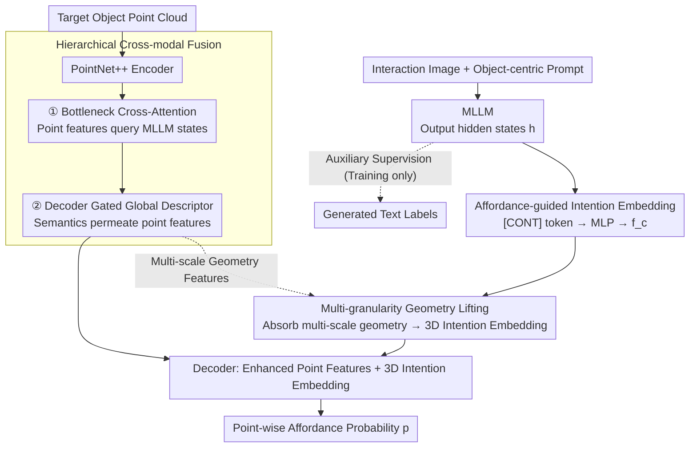

# HAMMER: Harnessing MLLM via Cross-Modal Integration for Intention-Driven 3D Affordance Grounding

**Conference**: CVPR 2026  
**arXiv**: [2603.02329](https://arxiv.org/abs/2603.02329)  
**Code**: [https://rayyoh.github.io/Hammer/](https://rayyoh.github.io/Hammer/)  
**Area**: Multimodal VLM  
**Keywords**: 3D Affordance, MLLM, Cross-modal Fusion, Point Cloud, Intention Understanding

## TL;DR
HAMMER is proposed to achieve interaction-image-based 3D affordance grounding by extracting contact-aware intention embeddings from MLLMs, enhancing point cloud features via hierarchical cross-modal fusion, and injecting 3D spatial information into intention embeddings through a multi-granularity geometry lifting module, significantly outperforming existing methods on the PIAD benchmark.

## Background & Motivation
**Background**: Intention-driven 3D affordance grounding (predicting actionable regions on point clouds via interaction images) is a vital task connecting visual understanding and physical interaction, applied in robot manipulation and imitation learning.

**Limitations of Prior Work**: GREAT requires manual templates and two-stage training, relying on text descriptions from MLLMs as intermediate representations; InteractVLM renders point clouds into multi-view images and uses 2D segmenters, suffering from geometric inconsistency and detail loss during back-projection to 3D.

**Key Challenge**: Existing methods either underutilize the powerful reasoning of MLLMs (using them only for text generation) or introduce inevitable losses via intermediate representations.

**Goal**: To fully exploit the multimodal understanding capabilities of MLLMs for 3D affordance grounding while avoiding losses from intermediate text or 2D masks.

**Key Insight**: Directly extract embeddings containing interaction intentions from MLLM hidden layers and inject MLLM knowledge into point cloud features via cross-modal attention.

**Core Idea**: Use a special `[CONT]` token to aggregate interaction intentions from the MLLM and achieve 3D affordance grounding through hierarchical cross-modal fusion and multi-granularity geometry lifting.

## Method

### Overall Architecture
HAMMER addresses the task of marking actionable regions (affordance maps) on a target object's point cloud given an image of human-object interaction. The core philosophy treats the MLLM as an "intention understander" rather than a "text generator." Instead of parsing generated text, it extracts interaction intentions directly from hidden layers to inject into the point cloud branch.

The pipeline operates as follows: The interaction image $\mathbf{I}$ is fed into the MLLM. A special token aggregates a compact intention embedding $\bm{f}_c$, while hidden states $\bm{h}$ from various layers are preserved. The point cloud branch uses PointNet++ to encode object geometry, fusing MLLM hidden states into point features at the encoder bottleneck and during the decoding stage. Simultaneously, the intention embedding $\bm{f}_c$ is "lifted" into a 3D-aware embedding $\bm{f}_c^{3D}$ using hierarchical geometric features. Finally, the decoder combines enhanced point features with the 3D intention embedding to output the point-wise affordance probability map $\bm{p}$.

### Key Designs

**1. Affordance-guided Intention Embedding: Extracting Intentions via Special Tokens**

Previous works (e.g., GREAT) used MLLMs to generate text descriptions as intermediate representations, which act as lossy bottlenecks where fine-grained spatial intentions are lost during "image-to-text" conversion. HAMMER circumvents this by adding a `[CONT]` special token to the MLLM vocabulary. Combined with object-centric prompts, it guides the model to focus on the semantics of "how this object is interacted with." The hidden state of `[CONT]` at the last layer is projected via an MLP to form the intention embedding $\bm{f}_c = \psi_c(\bm{h}_{[\text{CONT}]})$. This is conceptually similar to the `[SEG]` token in LISA, but specifically for 3D affordance. To ensure `[CONT]` learns interaction semantics, an auxiliary task generates text labels during training; these labels are discarded during inference to avoid intermediate representation loss.

**2. Hierarchical Cross-modal Fusion: Injecting MLLM World Knowledge**

Pure 3D backbones lack the semantics required for commonsense-based judgments (e.g., "a cup handle is for grasping"). HAMMER injects MLLM hidden states $\bm{f}_h$, which carry rich visual understanding, into the point cloud decoding path in two stages. First, at the encoder bottleneck, cross-attention allows point features to query MLLM hidden states:

$$\tilde{\bm{f}}_p^{enc} = \text{CrossAttn}(\bm{f}_p^{enc}, \bm{f}_h, \bm{f}_h)$$

This aligns MLLM knowledge with global point representations. Second, a gated mechanism in the decoder adaptively weights MLLM tokens to form a global descriptor, which is concatenated with full-resolution point features to permeate semantics into point-level details.

**3. Multi-granularity Geometry Lifting: Providing 3D Awareness to Embeddings**

Since the intention embedding $\bm{f}_c$ originates from 2D/text data, it lacks 3D spatial information. Directly matching it to point clouds can lead to misalignment. Instead of 2D-to-3D back-projection (which requires camera parameters), HAMMER injects geometry into the embedding itself. It takes multi-scale features $\{\bm{f}_p^{(i)}\}$ from the point cloud decoder and lets the intention embedding absorb geometry across layers via attention:

$$\bm{f}_c^{(i)} = \bm{f}_c^{(i-1)} + \text{Softmax}\!\left(\frac{\bm{q}^{(i)}(\bm{k}^{(i)})^T}{\sqrt{d}}\right) \bm{v}^{(i)}$$

where $\bm{q}$ is from the previous intention embedding and $\bm{k}/\bm{v}$ are from the $i$-th layer point features. This process yields $\bm{f}_c^{3D}$, which possesses 3D structural and surface awareness without requiring camera parameters.

### Loss & Training
$\mathcal{L} = \lambda_{txt}\mathcal{L}_{txt} + \lambda_{aff}\mathcal{L}_{aff}$: where $\mathcal{L}_{txt}$ is the generation loss for auxiliary text labels, and $\mathcal{L}_{aff} = \mathcal{L}_{focal} + \mathcal{L}_{dice}$ supervises point-level affordance maps (focal loss handles class imbalance, while dice loss optimizes region overlap).

## Key Experimental Results

### Main Results (PIAD Benchmark)

| Method | Conference | Seen aIOU↑ | Seen AUC↑ | Unseen aIOU↑ | Unseen AUC↑ |
|------|------|-----------|----------|-------------|------------|
| IAGNet | ICCV'23 | 20.51 | 84.85 | 7.95 | 71.84 |
| GREAT | CVPR'25 | 19.61 | 85.22 | 8.32 | 67.46 |
| **HAMMER** | - | **22.20** | **88.43** | **13.71** | **80.92** |

### Ablation Study

| Configuration | Seen aIOU | Unseen aIOU | Description |
|------|----------|------------|------|
| Full HAMMER | 22.20 | 13.71 | Complete model |
| w/o Hierarchical Fusion | ↓ | ↓ | Lacks MLLM knowledge injection |
| w/o Geometry Lifting | ↓ | ↓ | Intention embedding lacks 3D info |
| w/o Text Auxiliary | ↓ | ↓ | Weaker task understanding |

### Key Findings
- Improvements are most significant in the Unseen setting (aIOU: 8.32→13.71, AUC: 67.46→80.92), demonstrating strong generalization.
- Hierarchical fusion and geometry lifting are complementary: the former improves semantic understanding, while the latter improves spatial localization.
- The model exhibits high robustness against point cloud noise.

## Highlights & Insights
- **Full Utilization of MLLM multi-layer info**: Using intermediate hidden states to enhance point cloud features is far more effective than relying solely on generated text.
- **`[CONT]` Token Design**: An elegant way to aggregate complex interaction intentions, similar to recent advances in 2D segmentation (e.g., LISA).
- **Multi-granularity Geometry Lifting**: Avoids geometric inconsistencies of 2D-to-3D back-projection, making the framework more robust and generalizable.

## Limitations & Future Work
- Dependency on pre-trained MLLMs (requires LoRA fine-tuning) leads to higher computational overhead.
- The use of PointNet++ is relatively simple; stronger 3D backbones may yield further gains.
- Validation is restricted to tabletop objects; scene-level affordance is not yet covered.
- Object category labels are used as priors; obtaining these in fully open-world scenarios remains challenging.

## Related Work & Insights
- **vs GREAT**: While GREAT fuses text descriptions, HAMMER uses MLLM hidden states directly to avoid information loss.
- **vs InteractVLM**: Unlike InteractVLM's reliance on 2D masks and back-projection, HAMMER uses geometry lifting to provide 3D perception to embeddings directly.
- The concept of enhancing 3D representations via MLLM hidden states can be extended to various 3D reasoning tasks.

## Rating
- Novelty: ⭐⭐⭐⭐ Innovative fusion path for MLLM hidden states and point clouds.
- Experimental Thoroughness: ⭐⭐⭐⭐ Multiple benchmarks, ablations, and robustness tests.
- Writing Quality: ⭐⭐⭐⭐ Effective architectural comparisons with prior art.
- Value: ⭐⭐⭐⭐ Provides a valuable design paradigm for MLLM applications in 3D understanding.

<!-- RELATED:START -->

## Related Papers

- [\[CVPR 2026\] EG-3DVG: Expression and Geometry Aware Grounding Decoder for 3D Visual Grounding](eg-3dvg_expression_and_geometry_aware_grounding_decoder_for_3d_visual_grounding.md)
- [\[CVPR 2026\] Decoupled and Reusable Adaptation for Efficient Cross-Modal Transfer](decoupled_and_reusable_adaptation_for_efficient_cross-modal_transfer.md)
- [\[NeurIPS 2025\] Guiding Cross-Modal Representations with MLLM Priors via Preference Alignment](../../NeurIPS2025/multimodal_vlm/guiding_cross-modal_representations_with_mllm_priors_via_preference_alignment.md)
- [\[ICCV 2025\] Visual Intention Grounding for Egocentric Assistants](../../ICCV2025/multimodal_vlm/visual_intention_grounding_for_egocentric_assistants.md)
- [\[CVPR 2026\] Rethinking Cross-Modal Anchor Alignment for Mitigating Error Accumulation](rethinking_cross-modal_anchor_alignment_for_mitigating_error_accumulation.md)

<!-- RELATED:END -->
