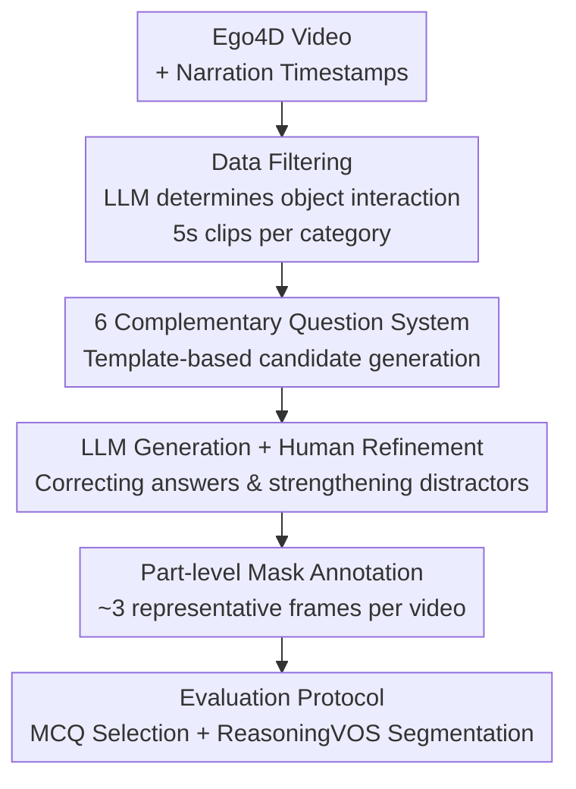

# HanDyVQA: A Video QA Benchmark for Fine-Grained Hand-Object Interaction Dynamics

**Conference**: CVPR 2026  
**Paper**: [CVF Open Access](https://openaccess.thecvf.com/content/CVPR2026/html/Tateno_HanDyVQA_A_Video_QA_Benchmark_for_Fine-Grained_Hand-Object_Interaction_Dynamics_CVPR_2026_paper.html)  
**Code**: [Project Page](https://masatate.github.io/HanDyVQA-project-page/)  
**Area**: Multimodal VLM / Video Understanding  
**Keywords**: Video Question Answering, Hand-Object Interaction, Fine-grained Spatio-Temporal Dynamics, Reasoning VOS, Video Foundation Model Evaluation

## TL;DR
HanDyVQA is a fine-grained video QA benchmark focused on the "Hand-Object Interaction (HOI) dynamic process." It covers the entire "manipulation $\rightarrow$ effect" chain through six question categories (Action/Process/Objects/Location/State Change/Parts). The dataset contains 11,100 five-way multiple-choice questions and 10,300 segmentation masks. Experimental results show that the strongest model, Gemini-2.5-Pro, achieves only 73% accuracy, significantly lower than the human baseline of 97%.

## Background & Motivation
**Background**: Understanding hand-object interaction is a core direction in egocentric video research. Numerous benchmarks have emerged recently, primarily split into two branches: low-level localization (hand/object detection, 3D pose estimation, object tracking) or high-level semantics (action recognition, long-range actions, procedural steps, object state changes).

**Limitations of Prior Work**: Existing benchmarks almost exclusively focus on a "single facet" of HOI—either looking only at how humans "manipulate" (manipulation) or only at the final "state" of the object (effect)—often at a coarse granularity. For instance, they might ask "what action is the person performing," but fail to ask "from which direction is he hammering, which part of the object was struck, and what deformation occurred at that part."

**Key Challenge**: HOI is inherently a **dynamic process** where human hand actions act continuously on objects in space and time to gradually produce effects. Current evaluations break this continuous process into isolated snapshots, naturally missing details like manipulation style, hand/object trajectories, and part-level state changes that can only be answered by viewing the complete video.

**Goal**: To build a benchmark capable of systematically evaluating whether models truly understand HOI spatio-temporal dynamics, covering both the manipulation and effect sides while addressing both semantic reasoning and pixel-level grounding.

**Key Insight**: The authors observe that "manipulation" and "effect" are two ends of the same interaction process and should be linked by a set of complementary question types. Furthermore, object/part questions are naturally suited for verification via segmentation masks to check if the model is "looking at the right place," leading to the introduction of the Reasoning VOS task.

**Core Idea**: Utilizing a "LLM drafting + human refinement" pipeline on Ego4D real-world videos, the authors construct six complementary categories of fine-grained HOI questions accompanied by part-level reasoning segmentation tasks. These are specifically designed to expose the bottlenecks of contemporary video large models in spatio-temporal dynamics.

## Method
As a benchmark paper, the core contribution lies in the systematic construction of a dataset and evaluation protocol rather than a new model architecture. The methodology is split into: defining the task and question system $\rightarrow$ semi-automated QA construction pipeline $\rightarrow$ mask annotation $\rightarrow$ evaluation protocol and partitioning.

### Overall Architecture
HanDyVQA includes two tasks: **Multiple Choice Questions (MCQ)** and **Reasoning Video Object Segmentation (ReasoningVOS)**. Given a video and a question, MCQ requires selecting the correct answer from options, while ReasoningVOS requires outputting segmentation masks corresponding to the correct answer. Questions are organized into six categories: the first three focus on the "manipulation side" and the last three on the "effect side":

- **Action**: What is the person doing with their hands?
- **Process**: *How* is the action being completed (direction, technique)?
- **Objects**: Which objects are being used by the hands? (Often multiple answers)
- **Location**: Where did the person place/move the object?
- **State Change**: How did the object state change?
- **Object Parts**: Which part of the object underwent a change?

ReasoningVOS samples are additionally provided for the Objects and Object Parts categories (totaling 10,300 mask frames), requiring the model to segment targets based on implicit reasoning of the question rather than explicit text references. The data production pipeline is shown below:

### Key Designs

**1. Six Complementary Question Categories: Breaking downstream the "Manipulation $\rightarrow$ Effect" chain**
To address the limitation of "single facet" evaluations, the authors explicitly split HOI dynamics into two groups. The manipulation side (Action / Process / Objects) answers "how the hands move and what is used," while the effect side (Location / State Change / Object Parts) answers "where the object moved, how the state changed, and which part changed." Each category uses fixed templates to fill slots (e.g., `[verb]`, `[object]`) from narrations. For example, a Process question might be: "How does the person [verb] [object]?". This design forces models to answer questions that **require the full temporal sequence**—such as distinguishing between "hammering straight down" vs. "hammering from the side."

**2. Two-Stage Construction (LLM Drafting + Human Refinement): Ensuring scale and quality**
The authors use a collaborative pipeline: LLMs generate candidate questions, answers, and distractors from narrations, followed by human annotators who verify the content against the video, correct/reject unsuitable items, and list all valid objects for multi-answer questions. Annotators also **actively remove overlapping options and enhance distractor plausibility**. This human-in-the-loop process ensures the benchmark is solvable for humans (95%+ accuracy) while remaining challenging for models.

**3. Part-level Reasoning VOS: Verifying "grounding" beyond "vocabulary"**
To prevent models from guessing MCQ answers via surface semantic cues, the authors provide segmentation tasks for Objects/Object Parts. Unlike traditional Referring VOS, this is **Reasoning VOS**: the model must reason through the question to identify the segmentation target. Since egocentric videos involve significant camera and object motion, masks drift drastically between frames (Object IoU 0.17; Parts IoU 0.08), making part-level grounding (e.g., "segment the specific area being hammered") a significant challenge.

**4. Real-world Multi-domain Data + Evaluation-focused Splitting**
The benchmark is built on Ego4D due to its unscripted HOI across various scenarios (cooking, gardening, etc.). The authors intentionally use a **train:val:test = 10:5:85** split. The minority training set is used only for instruction tuning to teach models the output format, leaving the vast majority for evaluation.

### Loss & Training
This work primarily focuses on zero-shot evaluation. The only training involved is for the "hand/object-aware" baseline study in Section 4.3, which evaluates whether auxiliary supervision (e.g., hand/object bboxes) improves performance.

## Key Experimental Results

### Main Results: MCQ Zero-shot Ranking
Eight models (6 open-source + 2 closed-source) were evaluated. Average (Avg) excludes the Objects category due to different metrics (AP).

| Model | Type | Action | Process | Location | State | Parts | Avg |
|------|------|--------|---------|----------|-------|-------|-----|
| Random | – | 19.3 | 18.9 | 20.4 | 19.8 | 19.4 | 19.5 |
| GPT-4o (text only) | Text-only | 36.6 | 50.9 | 34.1 | 39.5 | 45.5 | 41.3 |
| LLaVa-Video-7B | LLM-Integrated | 56.9 | 53.7 | 50.5 | 58.5 | 54.6 | 54.8 |
| Qwen2.5-VL-72B | LLM-Integrated | 78.0 | 73.4 | 63.2 | 72.2 | 62.5 | 69.9 |
| **Gemini-2.5-Pro** | Closed-source | 79.1 | 73.3 | 67.6 | 73.9 | 69.3 | **72.6** |
| **Human** | – | 98.6 | 95.9 | 96.6 | 95.3 | 96.9 | **96.6** |

The strongest model, Gemini-2.5-Pro, reaches only 72.6%, leaving a ~24% gap compared to humans. Location and Parts are the most difficult categories for all models.

### Ablation Study & Error Analysis

| Configuration | Key Finding |
|---------|---------|
| Increased Frame Count/Resolution | Overall improvement; Gemini-2.5-Pro errors are lowest at 32 frames. |
| Motion Error Class | Increasing frames/resolution barely improves "Motion" errors, which remain the most stubborn bottleneck. |
| Interaction/Spatial Errors | These are the most frequent errors across all models, corresponding to low scores in Location/Parts. |

### ReasoningVOS (Tab.5)
Performance is significantly lower than previous ReasoningVOS benchmarks. The best performer, Sa2VA-8B, achieves a J-score of ~32 for Objects but only ~11 for Parts, indicating **part-level segmentation as a new frontier**.

### Key Findings
- **Reliance on Surface Cues**: Failures are concentrated in confusing adjacent objects, failing to capture hand-object/object-object spatial relationships, and missing structural/state changes.
- **Motion Understanding Bottleneck**: Temporal information (frame count) does not resolve "Motion" category errors, exposing shortcomings in current frame-based architectures for temporal dynamics.
- **Part-level Grounding Challenge**: Segmentation scores are drastically lower for parts than for whole objects, with models often failing to detect all interacted objects.

## Highlights & Insights
- **Systematic "Manipulation $\rightarrow$ Effect" Framework**: The decomposition into six complementary dimensions allows for quantifiable identification of specific model weaknesses.
- **MCQ + ReasoningVOS Synergy**: Combining verbal accuracy with pixel-level grounding significantly reduces the possibility of "getting it right" through language priors alone.
- **Human-Verified Difficulty**: The huge gap between humans (95%+) and models (73%), combined with the near-random performance of text-only baselines, proves the benchmark effectively isolates spatio-temporal visual understanding.

## Limitations & Future Work
- The authors acknowledge that current hand/object-aware modeling does not solve motion or hand-handedness issues, suggesting a need for specialized spatio-temporal video encoders.
- The benchmark is limited to egocentric videos (Ego4D), with 5-second clips limiting the study of long-term procedural dependencies. 
- Mask density in ReasoningVOS is relatively low (~3 frames per video), which may not fully support continuous tracking evaluations.

## Related Work & Insights
- **vs. High-level HOI Benchmarks (EgoTaskQA, OSCAR, etc.)**: These focus on single facets at coarse scales. HanDyVQA covers both sides at a part-level granularity.
- **vs. HD-EPIC**: HD-EPIC lacks "State Change" and "Object Parts" categories on the effect side, which HanDyVQA provides.
- **vs. Referring VOS**: HanDyVQA introduces implicit reasoning at the part-level, shifting focus from object naming to interaction-based grounding.

## Rating
- Novelty: ⭐⭐⭐⭐ First benchmark to bridge manipulation and effect with part-level Reasoning VOS.
- Experimental Thoroughness: ⭐⭐⭐⭐⭐ Comprehensive range of models, ablation studies, and error typology.
- Writing Quality: ⭐⭐⭐⭐ Clear task definitions and insightful error analysis.
- Value: ⭐⭐⭐⭐ Provides a clear roadmap for HOI-aware video encoders by exposing fundamental bottlenecks in current models.

<!-- RELATED:START -->

## Related Papers

- [\[CVPR 2026\] See What I Mean: Aligning Vision and Language Representations for Video Fine-grained Object Understanding](see_what_i_mean_aligning_vision_and_language_representations_for_video_fine-grai.md)
- [\[CVPR 2026\] MA-Bench: Towards Fine-grained Micro-Action Understanding](ma-bench_towards_fine-grained_micro-action_understanding.md)
- [\[NeurIPS 2025\] OpenHOI: Open-World Hand-Object Interaction Synthesis with Multimodal Large Language Models](../../NeurIPS2025/multimodal_vlm/openhoi_open-world_hand-object_interaction_synthesis_with_multimodal_large_langu.md)
- [\[CVPR 2026\] BOP-Ask: Object-Interaction Reasoning for Vision-Language Models](bop-ask_object-interaction_reasoning_for_vision-language_models.md)
- [\[CVPR 2026\] EagleNet: Energy-Aware Fine-Grained Relationship Learning Network for Text-Video Retrieval](eaglenet_energy-aware_fine-grained_relationship_learning_network_for_text-video_.md)

<!-- RELATED:END -->
