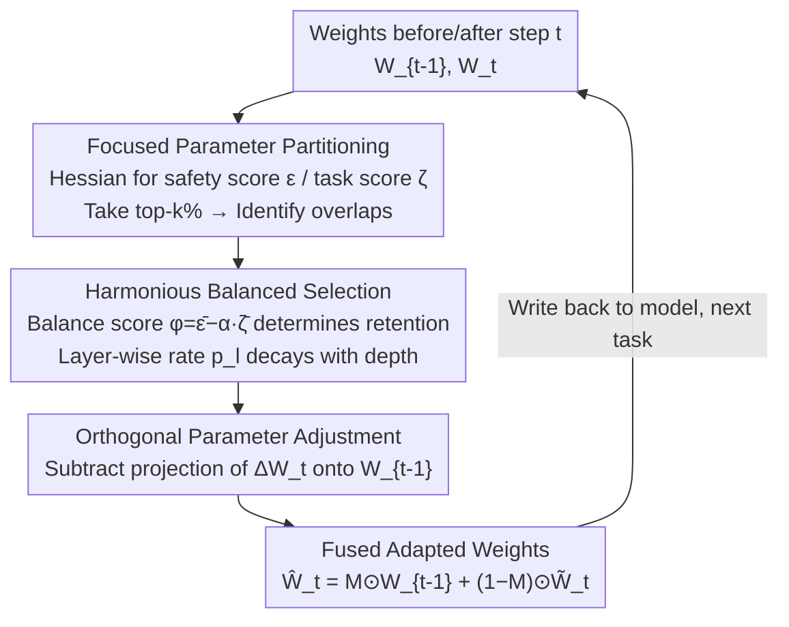

# Harmonious Parameter Adaptation in Continual Visual Instruction Tuning for Safety-Aligned MLLMs

**Conference**: CVPR 2026  
**Paper**: [CVF Open Access](https://openaccess.thecvf.com/content/CVPR2026/html/Wang_Harmonious_Parameter_Adaptation_in_Continual_Visual_Instruction_Tuning_for_Safety_Aligned_CVPR_2026_paper.html)  
**Code**: https://github.com/Minato-Zackie/HPA  
**Area**: Multimodal VLM  
**Keywords**: Continual Visual Instruction Tuning, Safety Alignment, Catastrophic Forgetting, Parameter-level Post-training, Safety-Capability Trade-off

## TL;DR
To address the dual problem where safety-aligned MLLMs both forget old tasks and lose safety during Continual Visual Instruction Tuning (CVIT), this paper proposes HPA: a training-free parameter-level editing approach applied **after** each fine-tuning step. It categorizes parameters into "safety-focused" and "task-focused" based on Hessian importance, utilizes an adaptive balance score to select safety parameters for retention, and applies orthogonal projection to task parameter updates to resist forgetting, thereby preserving both safety and capability without altering the original training workflow.

## Background & Motivation
**Background**: Continual Visual Instruction Tuning (CVIT) allows MLLMs to adapt to new tasks sequentially by fine-tuning on a series of visual instruction datasets. Prevalent methods (e.g., MoeLoRA, SMoLoRA, BranchLoRA, SEFE) primarily mitigate catastrophic forgetting by **adding parameter modules or modifying training processes**.

**Limitations of Prior Work**: Existing methods face two risks. First, almost all assume models are "pre-safety alignment" (pre-SA CVIT), focusing solely on task forgetting while ignoring safety. Second, they either introduce parameter redundancy and training overhead or require changes to the original training pipeline. However, in real-world deployment, models are typically **safety-aligned before going online and then continuously updated** (post-SA CVIT).

**Key Challenge**: The authors observe a neglected phenomenon—when performing CVIT on a safety-aligned MLLM, the model not only forgets old tasks as usual, but **pre-established safety also continuously degrades** as fine-tuning progresses (Fig. 1: Attack Success Rate increases steadily). Re-aligning with the original safety dataset is often prohibited by privacy constraints and computational costs. Thus, the problem becomes: how to simultaneously preserve safety, current tasks, and old tasks during continual fine-tuning under the constraint of **no re-alignment**.

**Goal**: Design a scheme for the post-SA CVIT setting that resists forgetting, maintains safety, and does not interfere with the original training process.

**Key Insight**: Deep networks are over-parameterized, and not all weights are equally important—some weights primarily "manage safety," while others "manage tasks." If these two categories of weights can be **accurately identified** after each fine-tuning step, one can selectively retain old "safety-managing" weights and new "task-managing" weights to harmonize the trade-off at the parameter level.

**Core Idea**: Transform the safety-capability balance into a training-free post-processing task involving **parameter selection + orthogonal updates**. The weights are fused via $\hat{W}^l_t = F(W^l_{t-1}, W^l_t)$ using a rule: "Classification by safety/task focus $\rightarrow$ Balanced selection $\rightarrow$ Orthogonal interference removal."

## Method

### Overall Architecture
HPA is a **post-training parameter adaptation framework**. It does not modify the original LoRA fine-tuning process. Instead, after training on each task $\tau_t$, it takes the "pre-fine-tuning weights $W^l_{t-1}$" and "post-fine-tuning weights $W^l_t$," performs parameter-level editing for each layer $l$, and writes the final weights $\hat{W}^l_t$ back to the model. The pipeline consists of three serial stages: **Classification, Selection, and Orthogonal Correction**.

Formally, the goal is to learn a fusion function $\hat{W}^l_t = F(W^l_{t-1}, W^l_t)$, where $W^l_{t-1}, W^l_t \in \mathbb{R}^{r\times c}$ are the weights of the $l$-th layer before and after fine-tuning. The total objective of post-SA CVIT includes a safety loss $\mathcal{L}_S$ in addition to the standard task loss $\sum_i \mathcal{L}_{C_i}$:

$$\min_{\{\theta_t\}} \sum_{t=1}^{n}\Big(\mathcal{L}_S\big(f(x;\theta_t)\big) + \sum_{i=1}^{t}\mathcal{L}_{C_i}\big(f(x;\theta_t)\big)\Big)$$

### Key Designs

**1. Focused Parameter Partitioning: Categorizing weights via Hessian sensitivity**

This step addresses how to determine which weights preserve safety and which learn tasks. HPA adopts the logic of Hessian pruning: the importance of a weight $w_{i,j}$ is measured by the "loss increment when removed," $(w_{i,j})^2 / [H^{-1}]_{jj}$, where $H$ is the Hessian of the loss. Mapping this to the fine-tuning context, two scores are defined for each position $(i,j)$ in layer $l$: safety focus $\varepsilon$ and task focus $\zeta$:

$$\varepsilon^l_{i,j} = \frac{\big(W^l_{t-1}(i,j)-W^l_t(i,j)\big)^2}{[H^{-1}_{s,l}]_{ii}}, \quad \zeta^l_{i,j} = \frac{\big(W^l_t(i,j)-W^l_{t-1}(i,j)\big)^2}{[H^{-1}_{t,l}]_{ii}}$$

Here, $H = 2X^\top X$, where $X$ is the activation matrix calculated using a **safety calibration set** $D^*_s$ or a **task calibration set** $D^*_t$. The numerator represents the weight change, while the denominator represents Hessian sensitivity under different datasets. Consequently, the same modification is assigned different importance from "safety" and "task" perspectives. Averaging across $r$ rows per column yields column-level focus intensities $\bar{\varepsilon}^l, \bar{\zeta}^l \in \mathbb{R}^c$. Selecting the top-$k$% columns identifies safety-focused (from $W^l_{t-1}$) and task-focused parameters (from $W^l_t$). The challenge lies in **overlaps**, where a column is both safety-focused and task-focused; the next design handles this decision.

**2. Harmonious Balanced Parameter Selection: Adaptive balance score + layer-wise retention rate**

Retaining only safety parameters harms the current task, while retaining only task parameters compromises safety. Balance is achieved across **intra-layer** and **inter-layer** dimensions. A binary mask $M^l \in \mathbb{R}^{r\times c}$ is defined for fusion: $\hat{W}^l_t = M^l \odot W^l_{t-1} + (1-M^l)\odot W^l_t$. Columns with mask 1 retain old weights (preserving safety), and mask 0 uses new weights (learning tasks).

Intra-layer strategy: First, all safety-focused parameters in **non-overlapping positions** are retained ($p_s$%). Remaining slots are filled from overlapping positions based on a balance score:

$$\phi^l = \bar{\varepsilon}^l - \alpha \cdot \bar{\zeta}^l$$

A higher $\phi$ indicates a stronger safety bias. Slots are filled with top-$(p-p_s)$% overlapping positions based on $\phi$. The coefficient $\alpha$ is **adaptive**, adjusted per layer based on the relative strength of safety vs. task signals (interpolated between bounds $\alpha_0, \alpha_1$ using the expectation of $\log(\bar{\varepsilon}^l/\bar{\zeta}^l)$ through a $\tanh$ function). Inter-layer strategy: Higher layers near the output encode more task-specific knowledge, so the retention rate **decays linearly** with depth:

$$p_l = p_{\max} - \frac{l}{L}\cdot(p_{\max}-p_{\min})$$

**3. Orthogonal Parameter Adjustment: Projecting out interference from task updates**

While the first two steps balance safety and the current task, new weight updates ($W^l_t$) might still interfere with representations from previous tasks. This design ensures new update directions are approximately orthogonal to the subspace spanned by old parameters. For the update $\Delta W^l_t = W^l_t - W^l_{t-1}$, its projection onto $W^l_{t-1}$ is calculated:

$$\text{Proj}_{W^l_{t-1}}(\Delta W^l_t) = \frac{\langle \Delta W^l_t, W^l_{t-1}\rangle}{\|W^l_{t-1}\|_F^2} W^l_{t-1}$$

Subtracting this component yields the orthogonalized update $\tilde{W}^l_t = W^l_{t-1} + \Delta W^l_t - \text{Proj}_{W^l_{t-1}}(\Delta W^l_t)$. The final fusion utilizes this orthogonalized task weight.

### Loss & Training
HPA **does not introduce additional training losses**. It is a one-time parameter edit performed after standard LoRA fine-tuning. The process follows Algorithm 1: Train $\rightarrow$ Extract weights $\rightarrow$ Compute $\bar\varepsilon,\bar\zeta$ $\rightarrow$ Derice $\phi,p_l$ $\rightarrow$ Form mask $M$ $\rightarrow$ Orthogonal update $\rightarrow$ Fusion. Calibration sets are minimal: $D^*_s$ contains only 8 samples (synthetic "harmful prompt + safe response" generated by the model itself), and $D^*_t$ contains 128 samples. The base model is LLaVA-v1.5-7B.

## Key Experimental Results

### Main Results
Using LLaVA-v1.5-7B, sequential fine-tuning on AD $\rightarrow$ ImageNet $\rightarrow$ Flickr30k $\rightarrow$ Fin $\rightarrow$ ScienceQA $\rightarrow$ TextVQA was performed. CVIT is evaluated via AP (Average Performance) and BWT (Backward Transfer/Anti-forgetting). Safety is evaluated via MASR/DASR (Attack Success Rate and its relative increase). Comparison with the state-of-the-art Safe Delta:

| Data Condition | Method | AP ↑ | BWT ↑ | MASR ↓ | DASR ↓ |
|----------|------|------|-------|--------|--------|
| Original | SeqFT | 65.68 | -25.62 | 42.56 | 39.70 |
| Original | Safe Delta | 73.32 | -6.91 | 5.02 | 2.15 |
| Original | **HPA (Ours)** | **75.73** | **-4.87** | **4.75** | **1.89** |
| 0.1% Harmful Attack | SeqFT | 66.69 | -24.29 | 58.22 | 55.36 |
| 0.1% Harmful Attack | Safe Delta | 73.20 | -6.82 | 24.26 | 21.40 |
| 0.1% Harmful Attack | **HPA (Ours)** | **76.62** | **-3.88** | **7.22** | **4.36** |

On clean data, HPA outperforms Safe Delta by +2.41/+2.04 in AP/BWT while further reducing MASR/DASR. In the **0.1% harmful data injection** scenario, Safe Delta's safety collapses (MASR 24.26%), while HPA maintains 7.22% (DASR 4.36%), demonstrating strong robustness.

### Ablation Study
Effectiveness of the three components (safety focus $\bar\varepsilon$, overlap selection $\phi$, orthogonal update $\tilde W$) under 0.1% harmful data:

| Exp | $\bar\varepsilon$ | $\phi$ | $\tilde W$ | AP ↑ | BWT ↑ | MASR ↓ | DASR ↓ |
|-----|:---:|:---:|:---:|------|-------|--------|--------|
| 1 | ✗ | ✗ | ✗ | 66.69 | -24.29 | 58.22 | 55.36 |
| 2 | ✓ | ✗ | ✗ | 73.49 | -5.81 | 6.02 | 3.16 |
| 3 | ✗ | ✓ | ✗ | 74.16 | -5.21 | 11.51 | 8.64 |
| 5 | ✓ | ✓ | ✓ | 76.62 | -3.88 | 7.22 | 4.36 |

### Key Findings
- **Safety relies primarily on $\bar\varepsilon$**: Retaining safety-focused parameters (Exp 2) dropped MASR from 58.22 to 6.02, confirming that safety degradation stems from overwriting safety-related parameters.
- **Clear division of labor**: $\phi$ aids task performance, while $\tilde W$ specifically treats catastrophic forgetting (improving BWT from -7.00 to -3.88).
- **Retention rate $p$ trade-off**: Higher $p$ enhances safety but harms task performance. A minimum of ~10% safety-focused parameters is required for stability.
- **Order Robustness**: Across different task sequences, HPA consistently maintained MASR in the 5–8% range, significantly outperforming SeqFT and Model Tailor.

## Highlights & Insights
- **Safety degradation as a primary concern**: While most CVIT research focuses on task forgetting, this paper highlights the continuous safety slide in post-SA CVIT.
- **Dual-view scoring for common updates**: Using the same numerator but different Hessian denominators ($\varepsilon$ vs $\zeta$) to distinguish safety/task roles is an elegant and transplantable paradigm for multi-objective fine-tuning.
- **Ultra-small safety calibration set**: Using just 8 synthetic samples bypasses the restriction of inaccessible original alignment data.
- **Purely post-processing**: HPA is a plug-and-play weight editing tool that does not modify the training pipeline, making it highly engineering-friendly.

## Limitations & Future Work
- The method relies heavily on estimating importance via the diagonal of the inverse Hessian; the precision and overhead of this approximation on larger models require further validation.
- The 8-sample safety calibration set and the evaluation metrics (VLGuard/Ch3EF) may not fully represent all attack types or generalizable safety.
- Multiple hyperparameters ($k, p_{\min}, p_{\max}, \alpha_0, \alpha_1$) require manual tuning.
- Verification was limited to the LLaVA-v1.5-7B base model.

## Related Work & Insights
- **vs. Safe Delta / SPPFT**: HPA achieves superior safety under harmful data injection (MASR 7.22% vs. 24.26%) due to its dual-view categorization and adaptive selection.
- **vs. SEFE / Model Tailor**: Unlike these CVIT methods that focus solely on task forgetting, HPA addresses safety without adding modules or modifying training.
- **vs. Classical Orthogonal Continual Learning**: HPA applies orthogonal projection only to the subset of retained task weights rather than the full update, allowing for finer control.

## Rating
- Novelty: ⭐⭐⭐⭐⭐ 
- Experimental Thoroughness: ⭐⭐⭐⭐ 
- Writing Quality: ⭐⭐⭐⭐ 
- Value: ⭐⭐⭐⭐⭐ 

<!-- RELATED:START -->

## Related Papers

- [\[CVPR 2026\] Multimodal Continual Instruction Tuning with Dynamic Gradient Guidance](multimodal_continual_instruction_tuning_with_dynamic_gradient_guidance.md)
- [\[CVPR 2026\] Parameter-Efficient Adaptation for MLLMs via Implicit Modality Decomposition](parameter-efficient_adaptation_for_mllms_via_implicit_modality_decomposition.md)
- [\[ICLR 2026\] PCLR: Progressively Compressed LoRA for Multimodal Continual Instruction Tuning](../../ICLR2026/multimodal_vlm/pclr_progressively_compressed_lora_for_multimodal_continual_instruction_tuning.md)
- [\[CVPR 2026\] LLaDA-V: Large Language Diffusion Models with Visual Instruction Tuning](llada-v_large_language_diffusion_models_with_visual_instruction_tuning.md)
- [\[ACL 2025\] Enhancing Multimodal Continual Instruction Tuning with BranchLoRA](../../ACL2025/multimodal_vlm/branchlora_continual_instruction.md)

<!-- RELATED:END -->
