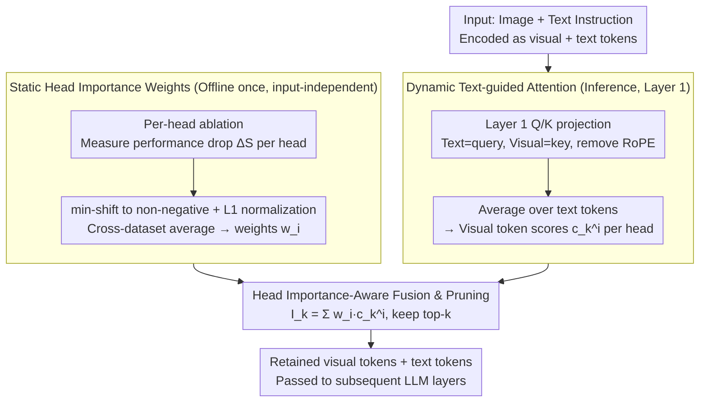

# HAWK: Head Importance-Aware Visual Token Pruning in Multimodal Models

**Conference**: CVPR 2026  
**arXiv**: [2604.07812](https://arxiv.org/abs/2604.07812)  
**Code**: [https://github.com/peppery77/HAWK.git](https://github.com/peppery77/HAWK.git)  
**Area**: Multimodal VLM / LLM Efficiency  
**Keywords**: visual token pruning, attention head importance, multimodal inference acceleration, training-free, text-guided attention

## TL;DR
Ours proposes HAWK, a head importance-aware visual token pruning method. It dynamically evaluates visual token importance by combining offline-calculated head contribution weights with text-guided attention scores. On Qwen2.5-VL, it retains 96.0% of original performance after pruning 80.2% of visual tokens, while reducing inference latency by 26%.

## Background & Motivation

**Background**: Multimodal Large Language Models (MLLMs) encode visual inputs into mass visual tokens (calculated in hundreds or thousands), processed alongside text tokens by the LLM. As attention complexity grows quadratically with token count, excessive visual tokens cause slow inference and high memory consumption. Prior pruning methods include similarity-based (DivPrune), fine-tuning-based (DART), and attention-based (FastV).

**Limitations of Prior Work**: 1) Similarity-based methods are context-agnostic and cannot adapt to user instructions, potentially discarding task-relevant tokens; 2) Fine-tuning methods require expensive end-to-end training and lack generalization; 3) Attention-based methods assume equal contribution from all attention heads, simply averaging attention scores to estimate importance.

**Key Challenge**: Different attention heads capture distinct visual semantics and contribute differently to visual understanding. Experiments show that disabling different heads leads to significantly varied performance drops, with consistent trends across multiple datasets. Treating all heads equally results in retaining redundant tokens while erroneously pruning valuable ones.

**Goal**: How to incorporate the differentiated contributions of attention heads into visual token pruning to maximally preserve critical tokens?

**Key Insight**: By systematically ablating each attention head and measuring the impact on visual tasks, consistent patterns of head importance are identified, enabling the design of a weight-aware pruning strategy.

**Core Idea**: Weighting text-guided visual attention scores with offline-calculated head importance weights to achieve more accurate visual token importance estimation and pruning.

## Method

### Overall Architecture
HAWK addresses a specific limitation: existing attention-based pruning (e.g., FastV) treats all attention heads identically, whereas distinct heads specialize in different visual semantics. HAWK decouples "which heads are important" from "which visual tokens are important under the current instruction." The pipeline consists of three stages: first, an offline phase ablates each head to measure its inherent contribution to visual understanding, yielding a set of static head weights calculated only once; during inference at the first attention layer, text-to-visual token relevance scores are calculated via Q/K projection (deliberately excluding positional embeddings); finally, these scores are weighted and summed using the head weights to retain top-k visual tokens. The mechanism is training-free and can be integrated into various MLLM architectures.

### Key Designs

**1. Static Attention Head Weights: Quantifying intrinsic head importance**

While attention-based pruning typically assumes uniform head importance, HAWK's ablation experiments reveal that disabling different heads causes highly varied performance degradation, and this trend is consistent across benchmarks. This suggests importance can be accurately measured offline. For each head $i$ and benchmark $j$, the performance drop $\Delta S_{i,j} = S_{base,j} - S_{i,j}$ is measured. To handle negative values where ablation slightly improves performance, a min-shift is applied: $S'_{i,j} = \Delta S_{i,j} - \min_i(\Delta S_{i,j})$. Scores are then L1-normalized within each dataset and averaged across datasets to obtain the final weight:

$$w_i = \frac{1}{N_d}\sum_j \frac{S'_{i,j}}{\sum_i S'_{i,j}}.$$

These weights are computed once and reused, embedding "head expertise" into a static lookup table with zero inference overhead.

**2. Dynamic Text-Guided Attention Scores: Identifying relevant visual regions per instruction**

While head weights are task-agnostic, the relevance of visual regions must adapt to user queries. HAWK utilizes the existing Q/K projection matrices of the first LLM attention layer. Text embeddings are projected as queries and visual embeddings as keys to compute the attention matrix $A^i = Q^i \cdot (K^i)^T / \sqrt{d_k}$. Scores are averaged across text tokens to get importance $c^i_k = \frac{1}{N}\sum_j A^i_{j,k}$ for visual token $k$ at head $i$. Crucially, RoPE (Rotary Positional Embedding) is removed here because positional bias improperly inflates the scores of visual tokens physically close to text tokens, polluting semantic mapping. The first layer is chosen to ensure pruning benefits all subsequent layers while carrying sufficient semantic information.

**3. Head Importance-Aware Fusion Pruning: Synthesizing weights and scores**

The final step merges "head importance" and "token-head relevance" into a single rankable score. The final importance $I_k$ for visual token $k$ is a weighted sum:

$$I_k = \sum_{i=1}^{N_h} w_i \cdot c^i_k.$$

Tokens are sorted by $I_k$ to retain the top $\tilde{M} = \lfloor M \cdot r \rfloor$ tokens (where $M$ is the count and $r$ the ratio). Compared to simple averaging (e.g., FastV), this weighted approach allows heads capturing critical visual semantics to dominate the decision, preventing valuable token signals from being diluted by noisy, low-contribution heads.

### Loss & Training
HAWK is entirely training-free. Static weights are calculated using HallBench, MME, TextVQA, ChartQA, AI2D, and RealWorldQA. Inference requires only one matrix operation for score calculation and weighted pruning.

## Key Experimental Results

### Main Results (Qwen2.5-VL-7B, Native Resolution)

| Method | Pruning Rate | HallBench | MME | TextVQA | ChartQA | Rel.% |
|------|--------|-----------|-----|---------|---------|-------|
| Original Model | 0% | 46.5 | 2315 | 85.2 | 86.2 | 100% |
| DivPrune | 60% | 45.8 | 2274 | 82.7 | 80.6 | 96.9% |
| FastV | 60% | 42.5 | 2283 | 84.1 | 82.5 | 96.1% |
| **HAWK** | **60%** | **46.5** | **2313** | **85.0** | **83.6** | **99.6%** |
| DivPrune | 80% | 39.0 | 2196 | 76.8 | 69.0 | 91.6% |
| FastV | 80% | 38.2 | 2236 | 81.9 | 72.3 | 92.3% |
| **HAWK** | **80%** | **42.8** | **2311** | **83.0** | **76.8** | **96.2%** |

### Efficiency Analysis (MME, Qwen2.5-VL-7B)

| Config | Score | E2E Latency | KV Cache | GPU Memory |
|------|-------|---------|----------|---------|
| Original | 2315 | 20m15s | 668MB | 16.9GB |
| HAWK (60%) | 2313 | 16m10s (x1.25) | 276MB | 16.1GB |
| HAWK (80%) | 2311 | 15m04s (x1.34) | 148MB | 15.7GB |

### Key Findings
- At 60% pruning, HAWK retains 99.6% performance, outperforming DivPrune by 2.7pp.
- At 80% pruning, it retains 96.2%, which is 3.9pp higher than the second-best method.
- Significant gains on InternVL3-8B: 94.1% vs DivPrune 87.1% at 80% pruning (7.0pp Gain).
- Effective for video understanding: 98.8% performance retained at 60% pruning.
- E2E latency reduced by 25-34%, KV Cache by 59-78%, and GPU memory by 0.8-1.2GB.

## Highlights & Insights
- The discovery of highly non-uniform and cross-dataset consistent head importance provides insights into the internal visual processing division of labor within MLLMs.
- Excluding RoPE is critical; positional embeddings bias attention toward tokens near text, regardless of semantic relevance.
- Extremely simple yet practical: one-time offline calculation + one matrix operation during inference, zero training required, and easily pluggable into any MLLM.
- Maintaining ~90% performance even at 90% pruning demonstrates massive visual token redundancy in current MLLMs.

## Limitations & Future Work
- Static weights averaged across datasets may not be optimal for specific niche tasks.
- Relying solely on the first attention layer might miss deeper semantic dependencies.
- HAWK is not always the best on every single metric compared to CDPruner, though overall performance is superior.
- Performance gap between methods narrows at 90% pruning in video tasks.
- The pruning rate is fixed; dynamic rates per image/query were not investigated.

## Related Work & Insights
- **vs FastV**: FastV uses simple average sorting. HAWK's importance weighting significantly improves the accuracy of identifying critical tokens.
- **vs CDPruner**: CDPruner uses DPP for conditional diversity with higher overhead. HAWK is lighter and more performant.
- **vs DivPrune**: DivPrune maximizes feature diversity without considering text instructions. HAWK's text-guided mechanism allows adaptation to different queries.
- Head importance analysis could be adapted for KV Cache compression in LLMs.

## Rating
- Novelty: ⭐⭐⭐⭐ Meaningful discovery of head importance disparity and a natural weighted design.
- Experimental Thoroughness: ⭐⭐⭐⭐⭐ Covers two architectures, image/video benchmarks, 4 pruning rates, and efficiency ablation.
- Writing Quality: ⭐⭐⭐⭐⭐ Clear structure, well-defined motivation, and organized experiments.
- Value: ⭐⭐⭐⭐⭐ Simple, efficient, effective, and highly deployment-ready.

<!-- RELATED:START -->

## Related Papers

- [\[CVPR 2026\] When Token Pruning is Worse than Random: Understanding Visual Token Information in VLLMs](when_token_pruning_is_worse_than_random_understanding_visual_token_information_i.md)
- [\[CVPR 2026\] DocPrune: Efficient Document Question Answering via Background, Question, and Comprehension-aware Token Pruning](docpruneefficient_document_question_answering_via_background_question_and_compre.md)
- [\[CVPR 2026\] TransPrune: Token Transition Pruning for Efficient Large Vision-Language Model](transprune_token_transition_pruning_for_efficient_large_vision-language_model.md)
- [\[CVPR 2026\] ZOO-Prune: Training-Free Token Pruning via Zeroth-Order Gradient Estimation in Vision-Language Models](zoo-prune_training-free_token_pruning_via_zeroth-order_gradient_estimation_in_vi.md)
- [\[CVPR 2026\] VLM-Pruner: Buffering for Spatial Sparsity in an Efficient VLM Centrifugal Token Pruning Paradigm](vlm-pruner_buffering_for_spatial_sparsity_in_an_efficient_vlm_centrifugal_token_.md)

<!-- RELATED:END -->
