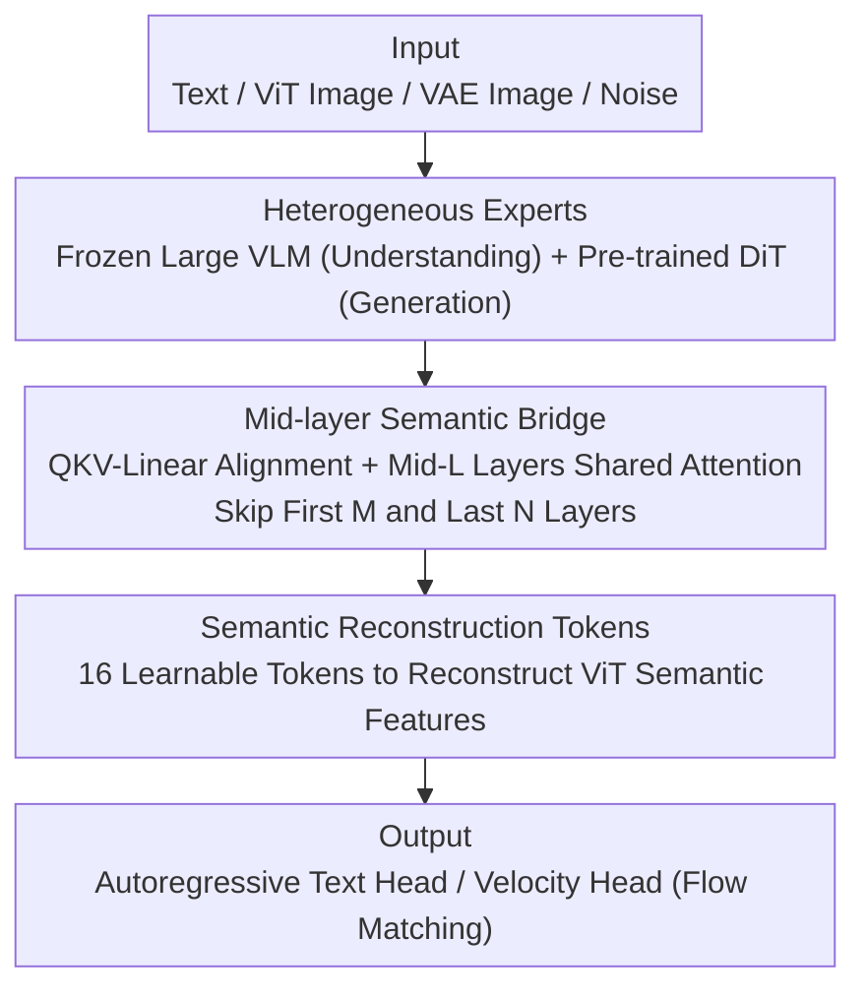

# HBridge: H-Shape Bridging of Heterogeneous Experts for Unified Multimodal Understanding and Generation

**Conference**: CVPR 2026  
**Paper**: [CVF Open Access](https://openaccess.thecvf.com/content/CVPR2026/html/Wang_HBridge_H-Shape_Bridging_of_Heterogeneous_Experts_for_Unified_Multimodal_Understanding_CVPR_2026_paper.html)  
**Code**: To be confirmed  
**Area**: Multimodal VLM / Unified Understanding and Generation  
**Keywords**: Unified Multimodalities, MoT, Heterogeneous Experts, Mid-layer Bridging, Diffusion Prior  

## TL;DR
HBridge replaces the two symmetric, layer-wise shared attention MoT experts in "unified understanding + generation" models with a pair of **heterogeneous experts** (a frozen large VLM + a pre-trained diffusion DiT). By bridging attention only across **mid-layers** and introducing a set of **semantic reconstruction tokens**, it outperforms BAGEL on DPG-Bench / GenEval / ImgEdit using only approximately 1/12 of BAGEL's T2I training tokens.

## Background & Motivation
**Background**: The mainstream paradigm for unified multimodal understanding and generation is Mixture-of-Transformers (MoT), represented by BAGEL, LMFusion, and Mogao. These models deploy two **identical** Transformer experts (both initialized from the same pre-trained LLM/VLM), managing understanding and generation respectively, and exchange information at every layer through **layer-wise shared self-attention**.

**Limitations of Prior Work**: This symmetric, densely connected design faces two structural issues. First, the generation branch is forced to initialize from an autoregressive LLM (due to the lack of pre-trained diffusion backbones with LLM-compatible architectures), missing out on the strong generation priors of diffusion models. This leads to slow convergence and high training costs—Fig. 2(a) shows a symmetric 7B+7B model converges significantly slower than a heterogeneous 7B+4B model. Second, understanding relies on high-level semantic reasoning, while generation depends on low-level fine-grained structures; forcing shared attention at the **shallowest input layers and deepest output layers** interferes with each branch learning task-specific representations. Empirical tests show that skipping cross-expert connections in BAGEL’s shallow and deep layers results in negligible performance drops or even gains (Fig. 2(b–c)), as dense connections cause the generation expert to **overfit to shallow lexical/entity features** from the understanding expert, bypassing high-level reasoning.

**Key Challenge**: Symmetry and dense connectivity are designed for "initialization convenience and simple fusion," but they directly conflict with the fact that "the two modalities are heterogeneous and the two tasks are asymmetric"—convenience is traded for wasted priors and shallow overfitting.

**Goal**: (1) Enable the generation branch to reuse pre-trained diffusion priors; (2) perform cross-modal fusion only in truly useful layers to avoid shallow/deep interference and shallow overfitting; (3) explicitly inject high-level semantics into the generation process.

**Key Insight**: Since mid-layer connections dominate performance while shallow/deep layers contribute minimally (as per feature drift and performance degradation analysis in Fig. 2), **only the mid-layer bridge** should be retained. This forms an "H-shape" topology: two vertical bars (independent shallow/deep layers) and one horizontal bar (the mid-layer bridge).

**Core Idea**: Replace symmetric twins with a pair of **heterogeneous experts** (a large VLM + a diffusion DiT), substitute full-layer sharing with a **mid-layer semantic bridge**, and use **semantic reconstruction tokens** to compensate for high-level semantic alignment.

## Method

### Overall Architecture
HBridge is a hybrid **asymmetric MoT** architecture: the left side is the understanding expert (a frozen pre-trained VLM, e.g., Qwen2.5-VL-7B), and the right side is the generation expert (a 4B diffusion DiT initialized from OmniGen2). Input text, ViT image features, VAE image features, and noises enter their respective experts via projectors. The two experts exchange information via multimodal self-attention **only within a middle segment of layers**, keeping shallow and deep layers independent. The generation expert eventually denoises images via a Velocity Head using flow matching, while the understanding expert retains its autoregressive text head. Since the experts differ in embedding dimensions, normalization, and attention heads, the bridge utilizes a set of **QKV-Linear** modules to project the generation-side Q/K/V into the unified semantic space of the understanding side for cross-attention, then projects them back to the diffusion expert space.

### Key Designs

**1. Heterogeneous Experts: Utilizing task-optimal pre-trained backbones**

The fundamental waste in symmetric MoTs is the generation branch initializing from an LLM, discarding diffusion generation priors. HBridge decouples this into heterogeneous experts: the understanding expert is a frozen large VLM (Qwen2.5-VL-7B or 0.5B), preserving native vision-language reasoning without updates during training; the generation expert is a 4B all-attention DiT from OmniGen2, possessing strong image synthesis priors. To address internal configuration mismatches (dimension $d_u \ne d_g$, normalization, heads), a **QKV-Linear alignment module** is introduced. For the $l$-th layer's $G_l^q, G_l^k, G_l^v$ in the generation expert, learnable matrices project them to the understanding space: $Q_l = W_l^q G_l^q, K_l = W_l^k G_l^k, V_l = W_l^v G_l^v$. Cross-modal attention is performed in the unified latent space before projecting back. This allows the generation expert to reuse diffusion priors while communicating with the understanding expert, which is why HBridge outperforms BAGEL (~2.5T tokens) with only ~200B T2I tokens.

**2. Mid-layer Semantic Bridge: Pruning 40%+ attention connections for better quality**

Full-layer sharing forces fusion at shallow inputs and deep outputs, interfering with task-specific representation learning and encouraging the generation expert to take shortcuts by capturing shallow lexical features from the frozen VLM. Fig. 2(b–c) shows mid-layer connections dominate performance. Consequently, HBridge **only connects $L$ middle layers, skipping the first $M$ and last $N$ layers** for cross-expert attention, forming an H-shape topology. In implementation, $M=N=6$. Pruning over 40% of attention sharing improves efficiency and increases generation quality by avoiding shallow overfitting. Ablation shows that at $M=N=10$, the bridge is too narrow, causing the loss of some object semantics (e.g., "mushrooms").

**3. Semantic Reconstruction Tokens: Explicit high-level semantic supervision**

Generation requires explicit semantic understanding of relationships and layouts. Since implicit alignment via the mid-layer bridge may be insufficient, **learnable Semantic Reconstruction Tokens (SRT, 16 in experiments)** are added to the generation input. During training, these tokens are tasked with **reconstructing the ViT-level semantic features** of the target image via cosine distance: $L_{\text{SRT}} = \text{Distance}_{\cos}(\text{Proj}(\text{Token}^{out}_{SRT}), F_{ViT})$, where $F_{ViT}$ is the feature from the frozen Qwen2.5-VL-7B ViT after adaptive pooling. This total loss $L = L_{\text{Flowmatching}} + L_{\text{SRT}}$ forces the model to internalize relationship semantics rather than relying on shallow entity features.

### Loss & Training
The primary objective is the flow matching denoising loss, combined with the SRT cosine reconstruction loss: $L = L_{\text{Flowmatching}} + L_{\text{SRT}}$. The understanding expert is frozen, and only the generation expert and bridge linear layers are trained. Using the AdamW optimizer with a learning rate of 1e-4 for ~200k steps, the model is trained on 64 H100/A100/A800 GPUs using mixed precision on approximately 400 million images.

## Key Experimental Results

### Main Results
The default configuration is 7B+4B (Qwen2.5-VL-7B + 4B DiT). The frozen understanding expert inherits the original VLM capabilities (MMBench 83.5 / MMMU 58.6 / MM-Vet 67.1). T2I results are as follows:

| Benchmark | Metrics | HBridge (7B+4B) | BAGEL (7B+7B) | OmniGen2 (3B+4B) | UniWorld-V1 (7B+12B) |
|------|------|-----------------|---------------|------------------|----------------------|
| DPG-Bench | Overall ↑ | **85.23** | 85.07 | 83.57 | 81.38 |
| GenEval (w/o rewriter) | Overall ↑ | **0.83** | 0.80* | 0.80 | 0.80 |
| GenEval (w/ LLM rewriter) | Overall ↑ | **0.87** | 0.86* | 0.86 | 0.84 |

Ours uses ~200B T2I tokens (1/12 of BAGEL's ~2.5T) yet outperforms larger models like BAGEL (7B+7B) and UniWorld-V1 (7B+12B). On ImgEdit-Bench, HBridge also leads against competitors like OmniGen2 and Step1X-Edit.

### Ablation Study
| Configuration | Result | Note |
|------|------|------|
| Heterogeneous (Diffusion init) | High fidelity at 40k steps | Full design |
| VLM-initialized DiT | Quality drop even with more steps | Loss of diffusion prior |
| 7B vs 0.5B Understanding Expert | 7B has better visual quality | Stronger understanding aids generation |
| Mid-bridge $M=N=6$ | Best DPG/GenEval | Optimal bridge width |
| Mid-bridge $M=N=10$ | Semantic loss of some objects | Bridge too narrow for semantic flow |

### Key Findings
- **Diffusion prior is the primary factor**: Changing the generation expert from diffusion initialization to VLM initialization leads to a sharp quality drop, confirming the value of the heterogeneous design.
- **Optimal Bridge Width**: $M=N=6$ is the "sweet spot"; narrow bridges ($M=N=10$) lose semantics, while wider bridges suffer from shallow overfitting.
- **High Efficiency**: Achieving better performance with only ~8% of BAGEL's training tokens proves that symmetric dense MoTs waste significant computation on useless connections and poor initialization.

## Highlights & Insights
- **Reflecting on Symmetry**: The authors effectively debunk the necessity of full-layer sharing through their "skip-layer" analysis (Fig. 2), leading naturally to the H-shape topology.
- **QKV-Linear for Compatibility**: This engineering point makes it possible to combine pre-trained models with entirely different configurations, requiring only lightweight linear layer training.
- **SRT for Semantic Explicitization**: By supervising the reconstruction of ViT semantic features, the model is forced to understand relationships rather than relying on shallow entity shortcuts.
- **Resource Efficiency**: Outperforming SOTA with ~1/12 the tokens suggests that architectural refinement is more cost-effective than simply scaling data.

## Limitations & Future Work
- The understanding expert is frozen, meaning its capabilities are capped and cannot benefit from feedback from the generation task.
- Bridge width $M=N$ is a manually tuned hyperparameter; there is no adaptive mechanism for different backbones.
- Benchmarking is primarily on T2I and image editing; complex interleaved text-image or long-context reasoning has not been fully explored.
- The empirical analysis of why mid-layers dominate lacks a deeper theoretical explanation.

## Related Work & Insights
- **vs. BAGEL / Mogao / LMFusion (Symmetric MoT)**: These use two identical experts with full sharing and LLM initialization; HBridge uses "asymmetry + sparse bridging."
- **vs. MetaQuery / Metamorph (Connector-based)**: Those are loosely coupled (learnable queries); HBridge performs deep fusion at the attention level.
- **vs. Pure Autoregressive Models (Chameleon / UniToken)**: The latter struggle with photo-realism due to discrete tokenizers; HBridge maintains high fidelity via the AR+Diffusion hybrid approach.

## Rating
- Novelty: ⭐⭐⭐⭐⭐ Structural reconstruction of MoT supported by solid skip-layer analysis.
- Experimental Thoroughness: ⭐⭐⭐⭐ Strong benchmarks in T2I/Editing, though understanding was not the focus.
- Writing Quality: ⭐⭐⭐⭐ Clear motivation-analysis-design chain with an intuitive H-shape analogy.
- Value: ⭐⭐⭐⭐⭐ Provides a new paradigm for resource-efficient unified multimodal models.

<!-- RELATED:START -->

## Related Papers

- [\[CVPR 2026\] OneCAT: Decoder-Only Auto-Regressive Model for Unified Understanding and Generation](onecat_decoder-only_auto-regressive_model_for_unified_understanding_and_generati.md)
- [\[CVPR 2026\] Rosetta Stone for Unified MLLMs: A Unified Tokenizer to Decipher Understanding and Generation](rosetta_stone_for_unified_mllms_a_unified_tokenizer_to_decipher_understanding_an.md)
- [\[CVPR 2026\] UniCompress: Token Compression for Unified Vision-Language Understanding and Generation](unicompress_token_compression_for_unified_vision-language_understanding_and_gene.md)
- [\[CVPR 2026\] CodeMMR: Bridging Natural Language, Code, and Image for Unified Retrieval](codemmr_bridging_natural_language_code_and_image_for_unified_retrieval.md)
- [\[CVPR 2026\] DuetSVG: Unified Multimodal SVG Generation with Internal Visual Guidance](duetsvg_unified_multimodal_svg_generation_with_internal_visual_guidance.md)

<!-- RELATED:END -->
