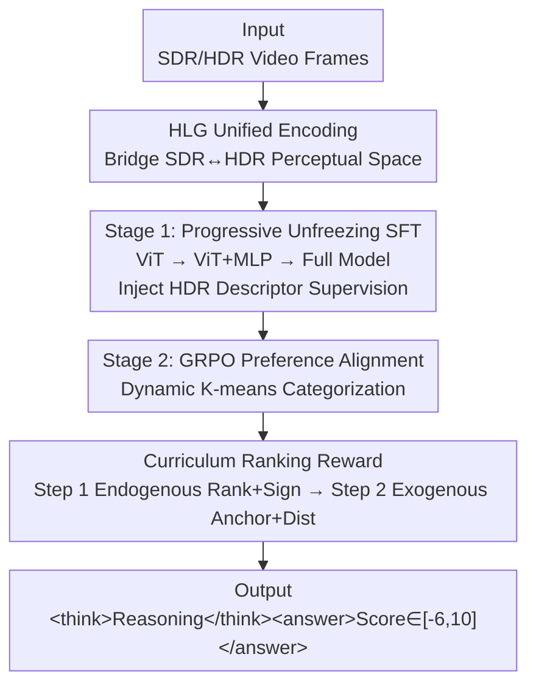

# HDR-VLM: HDR-Domain Adaptation of VLMs and Preference-Aligned Quality Assessment for HDR Video Color Grading

**Conference**: CVPR 2026  
**Paper**: [CVF Open Access](https://openaccess.thecvf.com/content/CVPR2026/html/Yuan_HDR-VLM_HDR-Domain_Adaptation_of_VLMs_and_Preference-Aligned_Quality_Assessment_for_CVPR_2026_paper.html)  
**Code**: TBD (Paper states release upon acceptance alongside datasets/scripts)  
**Area**: Multimodal VLM / HDR Video Quality Assessment  
**Keywords**: HDR Color Grading, Video Quality Assessment, VLM Domain Adaptation, HLG Encoding, GRPO Curriculum Rewards

## TL;DR
HDR-VLM is the first method to adapt pre-trained VLMs—which have only seen SDR—to the HDR domain for evaluating HDR video color grading quality. The first stage utilizes **HLG unified encoding + progressive unfreezing** to supplement HDR perception, while the second stage employs **GRPO with curriculum rewards** to align model scoring with noisy human subjective preferences. It achieves PLCC 0.9033 / SROCC 0.8667 on a realistic production HDR dataset and provides interpretable reasoning for score deductions.

## Background & Motivation
**Background**: In HDR (High Dynamic Range) video production, color grading determines the visual perception of tone, contrast, and brightness. However, evaluating "color grading quality" is difficult—it is a high-level aesthetic problem related to semantics and content, and there is almost no large-scale labeled data.

**Limitations of Prior Work**: Existing HDR video quality assessment (VQA) methods are mostly full-reference and signal-level (PSNR/SSIM, HDR-VDP-3, ColorVideoVDP, LGFM). They excel at measuring compression, noise, or structural distortion but **fail to capture color grading style intent and semantic coherence**—such as whether highlights are clipped, whether skin tones/sky look natural, or if the overall atmosphere fits the content's emotion. Conversely, pre-trained VLMs have strong semantic priors and can generate readable reasons, making them ideal candidates. However, they are **trained only on SDR data** and lack exposure to HDR photometry. HDR uses the PQ transfer function to encode absolute brightness (up to 10,000 nits), while SDR (Rec.709 + Gamma 2.4) only encodes relative brightness around 100 nits. VLMs directly misjudge HDR brightness and color (Fig. 1c).

**Key Challenge**: Two hurdles overlap. First is the **domain gap**—VLMs trained on SDR do not understand HDR absolute brightness and photometric statistics; prior attempts using PU-21 encoding for hard migration of SDR IQA models generalize poorly. Second is **alignment difficulty**—subjective annotations are inherently noisy, and supervision is **multi-scale**: coarse-grained "inter-category preferences" are reliable, whereas fine-grained "intra-category scores" are noisy and content-dependent. Standard Supervised Fine-Tuning (SFT) converges to an average scale with poor generalization, while existing RL-based IQA methods (Q-Insight, VisualQuality-R1, VQAThinker) are sensitive to noisy samples, leading to unstable training or degradation.

**Goal**: (1) Adapt VLMs to the HDR domain without destroying their semantic priors; (2) stably align with human preferences on noisy, multi-scale subjective data.

**Key Insight**: The authors discovered an overlooked property—VLMs have a natural compatibility with **HLG (Hybrid Log-Gamma) encoding**. HLG uses an SDR-like Gamma curve for low-brightness segments and transitions to a logarithmic curve for high-brightness. It is viewable on SDR screens while rendering full HDR details, serving as a **natural curriculum** for a smooth transition from "VLM-familiar SDR-like perceptual space" to the HDR domain.

**Core Idea**: Use HLG as a bridge to unify all formats for domain adaptation (solving the domain gap) + use coarse-to-fine endogenous ranking rewards with GRPO (solving noisy alignment).

## Method

### Overall Architecture
HDR-VLM uses a general VLM (Qwen2.5-VL 7B: ViT vision encoder + MLP projector + LLM) as the backbone, trained in two stages. **Stage 1 (HDR Domain Adaptation)**: Unify SDR/HDR inputs into HLG encoding, then use a corpus of 40,000 pairs of "dual-reference HDR frames + structured HDR descriptors" for **progressive unfreezing SFT**, allowing the model to learn to perceive HDR brightness/color cues. **Stage 2 (Subjective Preference Alignment)**: Use GRPO reinforcement learning to sample multiple candidate scores for versions within the same SRC group. **Dynamic K-means** clusters relative scores into $M$ categories, followed by a **coarse-to-fine curriculum ranking reward** to first stabilize inter-category ranking and then calibrate specific scores. During inference, the model outputs `<think>reasoning</think><answer>score</answer>`, where the score falls within $[-6, 10]$.

### Key Designs

**1. HLG Unified Encoding: Using a semi-familiar domain as a bridge for SDR→HDR transition**

PQ encodes absolute brightness, is incompatible with SDR screens, and relies on metadata for tone mapping. Feeding it directly to an SDR-trained VLM leads to severe misjudgment. Conversely, tone-mapping HDR back to SDR compresses the dynamic range and loses HDR-specific artifact cues. The key insight is **HLG**'s hybrid curve: Gamma-like in the low range (familiar to VLM) and logarithmic in the high range (covering HDR), while being metadata-free. By unifying HDR10, HDR Vivid, and Dolby Vision into the HLG domain, the VLM starts from a familiar SDR-like space and is gradually exposed to higher brightness. This step is a prerequisite for the entire method—ablation shows RL-only (without HDR domain adaptation) never catches up, proving both "building HDR perception" and "aligning preferences" are essential.

**2. Progressive Unfreezing SFT + Structured HDR Descriptors: Injecting HDR perception without destroying semantic priors**

Directly fine-tuning the whole model triggers shortcut learning—the language backbone overfits training patterns and generates fake cross-modal alignment without learning HDR perceptual features. The authors use a **three-stage progressive unfreezing**: tuning only ViT first (learning HDR-sensitive low-level cues while freezing LLM/MLP to stabilize semantic space) → then opening the MLP projector (mapping HDR features into LLM embedding space) → finally unfreezing all for end-to-end instruction tuning. The supervision corpus consists of 40,000 **dual-reference samples**: each pair contains two frames from the same SRC with differences along color grading dimensions, paired with structured comparison text containing frame-level HDR descriptors (peak/average brightness, highlight area ratio, shadow variance, average chroma saturation, mid-tone contrast). This factorized supervision strengthens model sensitivity to these specific dimensions. Ablation (Fig. 4) shows progressive unfreezing achieves 0.90 accuracy, whereas one-shot full fine-tuning only reaches 0.85.

**3. GRPO + Curriculum Endogenous Ranking Reward: Stable alignment on noisy, multi-scale subjective data**

Subjective scores are noisy, but "inter-category ranking is reliable / intra-category scores are noisy." Direct score regression is easily biased by noise. The authors split alignment into coarse-to-fine curriculum steps applied to GRPO (sampling $K$ candidates per sample, normalizing advantage $a_k(v_i)=\frac{r_k(v_i)-\mu(r(v_i))}{\sigma(r(v_i))}$). The core is using **Spearman Rank Correlation (SROCC)** as a reward because it is invariant to monotonic transformations, bounded in $[-1,1]$, and stable. First, dynamic K-means clusters relative scores into $M$ levels. **Step 1 (Learning Ranking)**: Construct an endogenous list $P_{L1}$—insert the current prediction into the slot for its category and fill other slots with class means (leave-one-out). Reward $R_{L1}=\rho_s([M, M{-}1, \dots, 1], P_{L1})$ measures how well this sequence matches the "high-to-low order." It is combined with a **sign consistency reward** $R_{\text{sign}}$ (giving 0.5 if prediction and ground-truth share the same sign relative to SDR). Step 1 reward $r^{(1)}=R_{L1}+R_{\text{sign}}$ aims to learn robust inter-category ranking under noise and suppress gradient noise near the SDR anchor. **Step 2 (Calibrating Scale)**: Replace endogenous means with ground-truth means to get exogenous list $P_{L2}$. Reward $R_{L2}=\rho_s([1, 2, \dots, M], P_{L2})$ anchors the ranking to the true scale, while **truncated distance reward** $R_{\text{dist}}=\max\{0, 1-\frac{|\hat s_{i,k}-\Delta J_i|}{\Delta_{\max}}\}$ refines the residual. Step 2 reward $r^{(2)}=R_{L2}+R_{\text{dist}}$ aligns values without disrupting learned rankings.

### Loss & Training
Stage 1 SFT uses standard next-token likelihood $L_{\text{SFT}}=-\mathbb{E}_{(x,m,y)}\big[\sum_t \log \pi_\theta(y_t\mid x, m, y_{<t})\big]$. Stage 2 GRPO objective includes ratio clipping and KL regularization: $\mathcal{J}(\theta)=\mathbb{E}[\min(\rho_k a_k, \bar\rho_k a_k)-\beta\, D_{KL}(\pi_\theta\|\pi_{\text{ref}})]$, where $\bar\rho_k=\text{clip}(\rho_k, 1-\epsilon, 1+\epsilon)$. Hyperparameters: $K=5$, temperature 0.6, max generation 800 tokens, $\epsilon=0.2$, $\beta$ linear warmup from 0.02 followed by cosine decay; Step 1 runs for 1500 steps, Step 2 for 500 steps; AdamW lr $1\times10^{-5}$; 4×H20, global batch 260 ($4\times5\times13$).

## Key Experimental Results

### Main Results
Evaluation on a real production HDR dataset (50 4K SRCs, each with 1 SDR + 13 HDR versions, 700 videos total, 87,080 frames; 9,750 comparison pairs converted to JOD scores, reference SDR at 0, range $[-6, 10]$); split by SRC into 7/1/2 ratio. PLCC and SROCC are reported.

| Category | Method | PLCC ↑ | SROCC ↑ |
|------|------|--------|---------|
| Traditional FR-HDR | ColorVideoVDP | 0.4275 | 0.5747 |
| Deep VQA | FuPiC (Trained on this dataset) | 0.8621 | 0.8287 |
| Pre-trained VLM | Qwen2.5-VL 7B | 0.7828 | 0.7439 |
| Pre-trained VLM | GPT-4o | 0.7889 | 0.7856 |
| Pre-trained VLM | Gemini 2.5 Pro | 0.8194 | 0.8296 |
| RL Method | VisualQuality-R1 | 0.8418 | 0.8212 |
| RL Method | VQAThinker | 0.8745 | 0.8386 |
| Ours | **HDR-VLM** | **0.9033** | **0.8667** |

Traditional signal-level FR-SDR/FR-HDR methods mostly fail (many are negatively correlated); ColorVideoVDP is the best traditional one but only reaches PLCC 0.4275. HDR-VLM is the **only method to break PLCC 0.9**, achieving the highest SROCC. Note: All RL comparison methods were equipped with Stage 1 HDR domain adaptation before their respective rewards, yet still fall short.

### Ablation Study
Two-stage strategy ablation:

| Config | Strategy | PLCC | SROCC |
|------|------|------|-------|
| (A) | SFT only | 0.8024 | 0.7955 |
| (B) | RL only | 0.8140 | 0.8055 |
| (C) | Full (SFT+RL) | **0.9033** | **0.8667** |

Reward component ablation:

| Config | Reward | PLCC | SROCC |
|------|------|------|-------|
| (A) | $R_{L2}+R_{\text{dist}}$ only (Step 2) | 0.8323 | 0.7703 |
| (B) | $R_{L1}+R_{\text{sign}}$ only (Step 1) | 0.8860 | 0.8659 |
| (C) | Full two-step curriculum | **0.9033** | **0.8667** |

### Key Findings
- **Domain adaptation is the main driver**: SFT only (0.8024) or RL only (0.8140) significantly lags behind the full pipeline (0.9033), proving that the sequence of "building HDR perception then calibrating preferences" is non-negotiable.
- **Ranking reward is more critical than scale reward**: Step 1 alone (endogenous ranking+sign, 0.8860/0.8659) far outperforms Step 2 alone (exogenous+distance, 0.8323/0.7703), demonstrating that "learning reliable inter-category ranking first" provides the core robust learning signal for noisy data.
- **Progressive unfreezing is necessary**: Three-stage unfreezing reaches 0.90 accuracy, whereas one-shot full tuning only hits 0.85—full tuning makes the language backbone take shortcuts without learning HDR perception.

## Highlights & Insights
- **"VLM's hidden compatibility with HLG" is the cleverest pivot**: It converts the domain gap problem into a transition through a semi-familiar domain, using encoding choices rather than just scaling data—an idea transferable to other domain adaptation scenarios.
- **Curriculum rewards for "noisy labels" are pragmatic**: Acknowledging that fine-grained scores are unreliable and prioritizing reliable category rankings as strong signals is a reusable paradigm for RLHF-style alignment on messy data.
- **Dynamic K-means adaptive categorization**: Allowing the number of clusters to vary based on distribution dispersion avoids hard-coded levels and is a key engineering point for "multi-scale supervision."
- **Explainable outputs**: The model identifies specific reasons like "Highlight overexposure in Version B, losing cloud detail," providing actual guidance for content creators, which is more usable than black-box VQA.

## Limitations & Future Work
- The dataset scale is relatively small (50 SRC / 700 videos) and comes from a single streaming platform's production line; cross-platform/cross-genre generalization is not fully verified.
- The evaluation anchors on 1000-nit consumer displays and HLG; transferability to higher peaks (e.g., 4000-nit masters) or pure PQ workflows is not explored deeply.
- The method relies on an internal HDR descriptor tool; the impact of tool quality and its accessibility for replication remains unquantified.
- It still relies on relative scoring against an SDR reference (dual-reference); absolute HDR quality assessment without reference is not yet covered.

## Related Work & Insights
- **vs Traditional HDR VQA (HDR-VDP-3 / ColorVideoVDP / LGFM)**: They measure signal-level distortion and fail to grasp style intent; HDR-VLM leverages VLM semantic priors for content-aware evaluation with readable reasoning—explaining why traditional methods typically yield PLCC <0.6.
- **vs RL-based VLM-IQA (Q-Insight / VisualQuality-R1 / VQAThinker)**: They also use GRPO to reframe IQA as "reasoning + scoring," but their rewards are sensitive to noise; HDR-VLM's coarse-to-fine curriculum is designed specifically for noisy subjective data, resulting in more stable and generalizable learning.
- **vs PU/PU-21 Hard Migration for SDR IQA**: Those methods compress HDR into SDR-like spaces to use SDR models, which limits generalization; HDR-VLM adapts directly in the HLG domain without tone-mapping, preserving HDR-specific cues.

## Rating
- Novelty: ⭐⭐⭐⭐⭐ First to adapt VLM to HDR domain for grading assessment; both HLG bridge and curriculum ranking rewards are novel.
- Experimental Thoroughness: ⭐⭐⭐⭐ Covers traditional/deep/VLM/RL comparisons with solid ablation, though restricted by dataset scale/source.
- Writing Quality: ⭐⭐⭐⭐ Clear mapping between the two challenges and two stages; complete reward formulas.
- Value: ⭐⭐⭐⭐ Addresses a real-world pain point in HDR production; explainable output has practical utility.

<!-- RELATED:START -->

## Related Papers

- [\[CVPR 2026\] Probabilistic Prompt Adaptation for Unified Image Aesthetics and Quality Assessment](probabilistic_prompt_adaptation_for_unified_image_aesthetics_and_quality_assessm.md)
- [\[CVPR 2026\] BriMA: Bridged Modality Adaptation for Multi-Modal Continual Action Quality Assessment](brima_bridged_modality_adaptation_for_multi-modal_continual_action_quality_asses.md)
- [\[CVPR 2026\] FluoCLIP: Stain-Aware Focus Quality Assessment in Fluorescence Microscopy](fluoclip_stain-aware_focus_quality_assessment_in_fluorescence_microscopy.md)
- [\[CVPR 2026\] VITAL: Vision-Encoder-centered Pre-training for LMMs in Visual Quality Assessment](vital_vision-encoder-centered_pre-training_for_lmms_in_visual_quality_assessment.md)
- [\[CVPR 2026\] UARE: A Unified Vision-Language Model for Image Quality Assessment, Restoration, and Enhancement](uare_a_unified_vision-language_model_for_image_quality_assessment_restoration_an.md)

<!-- RELATED:END -->
