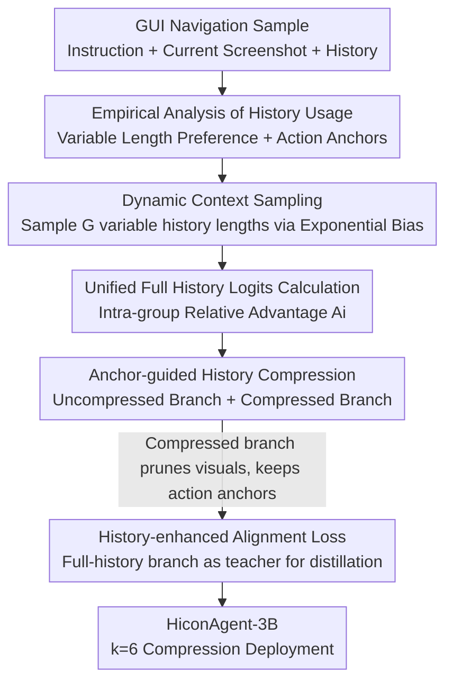

# HiconAgent: History Context-aware Policy Optimization for GUI Agents

**Conference**: CVPR 2026  
**Paper**: [CVF Open Access](https://openaccess.thecvf.com/content/CVPR2026/html/Zhou_HiconAgent_History_Context-aware_Policy_Optimization_for_GUI_Agents_CVPR_2026_paper.html)  
**Code**: https://github.com/JiuTian-VL/HiconAgent  
**Area**: Multimodal VLM / GUI Agent / Reinforcement Learning  
**Keywords**: GUI Agent, History Context, Reinforcement Fine-tuning, GRPO, Visual History Compression

## TL;DR
HiconAgent utilizes a History Context-aware Policy Optimization (HCPO) reinforcement fine-tuning framework to train GUI navigation agents. During the sampling phase, it dynamically varies history lengths to teach the model to use history "on demand." In the update phase, history screenshots are discarded while history action tokens are retained as anchors, with an all-history branch used for alignment distillation. The 3B model outperforms GUI-R1-7B on GUI-Odyssey with an +11.32% improvement in step success rate, while reducing FLOPs by 60% and increasing inference speed by 2.47×.

## Background & Motivation

**Background**: GUI agents based on Multimodal Large Language Models (MLLM) complete multi-step navigation tasks such as "booking a flight" or "buying shoes." The inputs consist of a task instruction $I$, current screenshot $s_t$, and history context $H_t=\{(s_{t-\tau},a_{t-\tau}),\dots,(s_{t-1},a_{t-1})\}$, with actions generated and executed step-by-step. Recently, the mainstream training paradigm has shifted from supervised fine-tuning to reinforcement learning with rule-based rewards (especially GRPO), directly optimizing grounding accuracy and step success rate (SR).

**Limitations of Prior Work**: Research on "how to actually use history" is sparse. To save VRAM, most RL methods (like GUI-R1) discard all history screenshots and only input historical action text. This loses visual cues necessary for disambiguation, distinguishing visually similar elements, and maintaining temporal consistency. Conversely, including full history (screenshots + actions) leads to massive visual tokens from high-resolution screenshots, which, combined with the quadratic complexity of attention, causes a computational explosion.

**Key Challenge**: A trade-off exists between decision quality and computational efficiency—fuller history leads to more accurate but slower decisions, while aggressive removal leads to faster but more error-prone judgments. Furthermore, empirical findings show that **different decision steps have vastly different preferences for history length**, rendering a fixed window length $\tau$ suboptimal. Additionally, **historical action tokens serve as the true "hubs" for visual information**; the value of history screenshots does not come from the later layers looking at them directly, but from "infusing" information into action anchors at intermediate layers.

**Goal**: To enable GUI agents to "correctly" use history (sampling appropriate lengths per step) and "efficiently" use history (compressing redundant visuals) without sacrificing decision quality, integrating these capabilities directly into the RL sampling and update phases.

**Core Idea**: Use Dynamic Context Sampling (DCS) during the sampling phase to teach the model to adaptively select context; use Anchor-guided History Compression (AHC) during the update phase by removing history visuals while retaining action anchors, guided by an all-history teacher branch for alignment distillation. Together, these form HCPO.

## Method

### Overall Architecture

HCPO re-engineers both the **sampling** and **update** phases of the standard GUI RL pipeline, corresponding to two core components: DCS and AHC. The pipeline is as follows: Given a navigation sample $(I, H_t, s_t)$, **Dynamic Context Sampling** first uses an evolved exponential bias distribution to sample $G$ input variants with different history lengths $\tau_i\le\tau$ for the same sample. Each variant produces a rollout response. Subsequently, logits are calculated under the full history context to obtain relative group advantages $A_i$. Then, a dual-branch update via **Anchor-guided History Compression** is performed: an uncompressed branch processes the full history via standard GRPO, while a compressed branch prunes all history screenshots after early fusion layers (retaining only action tokens as anchors) and also undergoes GRPO. Both branches share the same responses and advantages, constrained by a history-enhanced alignment KL loss where the uncompressed branch acts as a teacher. Finally, the compressed branch (configuration k=6) is deployed, saving 60% FLOPs.

### Key Designs

**1. Empirical Analysis of History Usage**

Two sets of probe experiments were conducted. The first analyzed **history length impact**: using a fixed-weight base model, 8 rollouts were performed for each sample under $\tau\in\{0,1,2\}$, recording average rewards. The $\tau$ with the highest reward was designated the "optimal history length." Results showed that optimal $\tau$ varies across samples and action types; for some steps, shorter history yielded higher rewards ($\text{Improvement}=\text{mean\_reward}(\tau_{short})-\text{mean\_reward}(\tau_{long})>0$ distributions were non-trivial). Thus, **fixed windows are inherently suboptimal**. The second analyzed **hierarchical token-drop**: after layer $k$ in Qwen2.5-VL-3B, historical actions $A_{his}$, historical images $V_{his}$, or both were dropped. It was found that in shallow layers ($k<12$), dropping $A_{his}$ caused much larger performance drops than $V_{his}$. This suggests that history visual gains primarily occur in intermediate layers, where information is aggregated by action tokens and passed forward. Consequently, the compression rule is: **Prune $V_{his}$ and retain $A_{his}$ after an early fusion depth $k$**.

**2. Dynamic Context Sampling: Teaching Adaptive Context Selection**

To address "suboptimal fixed $\tau$," DCS samples $G$ truncated history variants $\{H_t^1,\dots,H_t^G\}$ for each sample during training, each with a sampled length $\tau_i\le\tau$. To avoid **degradation** (where quality of short-history responses declines because only $\tau=2$ is used for gradient updates), an **exponential bias distribution** that evolves with training steps $u$ is used:

$$P(\tau_i\mid u)=\frac{\exp(\lambda(u)\,\tau_i)}{\sum_{j=0}^{N}\exp(\lambda(u)\,j)}$$

where $\lambda(u)$ grows linearly with $u$. Early in training, $\lambda(u)\approx 0$, making the distribution nearly uniform to encourage exploration. As training progresses, $\lambda(u)$ increases, biasing the distribution toward larger $\tau_i$. Each variant $q_i=(I,H_t^i,s_t)$ produces response $o_i$. To maintain consistency, every sampled response $o_i$ is **paired with the full history input $(I,H_t,s_t)$ to calculate logits for optimization**, achieving exploration under variable lengths and evaluation under a unified length.

**3. Anchor-guided History Compression: Pruning Visuals with Action Anchors + Distillation**

Based on the finding that action anchors retain essential historical cues, AHC performs dual-branch optimization. For input $q=\{I,H_t,s_t\}$ and relative importance $\rho_i=\frac{\pi_\theta(o_i\mid q)}{\pi_{\theta_{old}}(o_i\mid q)}$, the **uncompressed branch** follows standard GRPO objectives $\mathcal{L}_{w/o\,comp}$. The **compressed branch** removes all history visual tokens $V_{his}$, retaining only history action tokens $A_{his}$ as compressed history $H_t^c$, and follows the GRPO objective $\mathcal{L}_{w/\,comp}$ on $q^c=\{I,H_t^c,s_t\}$. To prevent performance loss, a **history-enhanced alignment loss** is introduced:

$$\mathcal{L}_{KL}=\sum_{i=1}^{G}\mathrm{KL}\left[\pi_\theta(o_i\mid q^c)\,\Vert\,\pi_\theta(o_i\mid q)\right]$$

The uncompressed branch teacher is detached to provide guidance without backpropagation. The compression position $k$ balances efficiency and effectiveness; $k=6$ is chosen by default.

### Loss & Training

Training data consists of **3K unfiltered samples** from the AMEX dataset. Rule-based rewards include action type matching, coordinate distance, and text matching. The total loss is:

$$\mathcal{L}_{HCPO}=\mathcal{L}_{w/o\,comp}+\mathcal{L}_{w\,comp}+\lambda\,\mathcal{L}_{KL}$$

## Key Experimental Results

### Main Results

Comparison across three benchmarks (Green indicates degradation relative to GUI-R1-7B, red indicates improvement):

| Setting | Model | AC-High Grounding | AC-High SR | Odyssey Grounding | Odyssey SR |
|------|------|------|------|------|------|
| SFT | GUI-R1-7B | 58.69 | 48.11 | 38.65 | 34.44 |
| RFT | GUI-R1-3B | 56.24 | 46.55 | 41.52 | 41.33 |
| RFT | GUI-R1-7B | 65.56 | 51.67 | 43.64 | 38.79 |
| RFT | **Ours-3B** | 65.51 (−0.05) | **52.40 (+0.73)** | **52.10 (+8.46)** | **50.11 (+11.32)** |

The 3B model matches the 7B model on AC-High and significantly exceeds GUI-R1-7B on long-horizon GUI-Odyssey (+11.32% SR), validating the value of explicit history modeling.

OOD Generalization (Average SR):

| Model | Training Data | AC-High | AITW | Odyssey | Avg SR |
|------|------|------|------|------|------|
| OS-Atlas-7B | 13M (Filtered) | 29.83 | 41.38 | 26.96 | 32.72 |
| GUI-R1-7B | 3K (Filtered) | 51.67 | 55.31 | 38.79 | 48.59 |
| infiGUI-3B | 32K (Filtered) | 71.10 | 46.51 | 33.15 | 50.25 |
| **Ours-3B** | 3K (Unfiltered) | 52.40 | 51.91 | 50.11 | **51.47** |

### Ablation Study

Sampling Distribution $p(\tau)$ Ablation (AC-High SR):

| Config | Update τ | Sampling p(τ) | AC-High SR | Training Time |
|------|------|------|------|------|
| HCPO (w/o DCS) | 2 | – | 51.03 | 17h |
| HCPO (Uniform) | 2 | U(0,2) | 50.53 | 17h |
| HCPO (Uniform) | {0,1,2} | U(0,2) | 51.62 | 30h |
| **HCPO (ExpBias)** | 2 | ExpBias(u) | **52.40** | 17h |

Component Ablation (SR, Compression enabled):

| Config | Dual-branch | KL | DCS | AC-High | AITW | Odyssey |
|------|------|------|------|------|------|------|
| GRPO (Comp only) | – | – | – | 44.89 | 45.62 | 43.21 |
| HCPO (w/o KL, DCS) | ✓ | – | – | 48.70 | 49.23 | 47.09 |
| HCPO (w/o DCS) | ✓ | ✓ | – | 51.03 | 50.78 | 48.68 |
| **HCPO** | ✓ | ✓ | ✓ | **52.40** | **51.91** | **50.11** |

### Key Findings
- **DCS sampling distribution is critical**: Uniform sampling causes performance degradation for short-history responses. Exponential bias scheduling ("explore early, converge to full-history late") solves this while keeping costs low.
- **Action anchor hypothesis confirmed**: Shallow-layer drops of action tokens cause more damage than dropping images, supporting the "keep actions, prune visuals" AHC strategy.
- **Higher gains on long-horizon tasks**: The +11.32% SR improvement on GUI-Odyssey suggests history modeling is more valuable in extended sequences.

## Highlights & Insights
- **Evidence-based design**: Empirical analyses (variable length preference and token-drop) directly inform the design of DCS and AHC.
- **Staged RL integration**: Decoupling history usage into a sampling phase (amount of history) and an update phase (compression of history) is an elegant approach.
- **Self-distillation for efficiency**: The dual-branch alignment strategy—using a full-information branch as a teacher for a compressed branch in the same forward pass—is a transferable technique for multimodal efficiency.
- **Exponential Bias curriculum**: Smoothing the sampling distribution from uniform to biased solves training instabilities associated with inconsistent history lengths.

## Limitations & Future Work
- The history length probes were limited to a small window ($\tau\in\{0,1,2\}$). The scalability of the exponential bias schedule for much longer horizons remains unexplored.
- AHC aggressively prunes **all** history visuals. If critical visual cues are not bound to historical action locations (e.g., in a pure observation step), this may lead to information loss.
- Evaluation focused on mobile GUI navigation; performance on desktop or web environments with higher resolutions and more complex interfaces needs verification.

## Related Work & Insights
- **vs GUI-R1**: HiconAgent shares the GRPO and rule-based reward framework of GUI-R1 but adds systematic history utilization. Consequently, the 3B model outperforms the 7B version of GUI-R1.
- **vs Full-history methods**: Compared to methods that input full history at massive computational costs, HiconAgent shifts the trade-off curve toward efficiency through AHC, achieving 60% FLOPs reduction while staying competitive.

## Rating
- Novelty: ⭐⭐⭐⭐ (Dual-stage RL integration and evidence-based action anchor compression.)
- Experimental Thoroughness: ⭐⭐⭐⭐ (Comprehensive benchmarks and ablations.)
- Writing Quality: ⭐⭐⭐⭐ (Clear "empirical-to-design" narrative.)
- Value: ⭐⭐⭐⭐ (High efficiency and strong OOD performance for 3B models.)

<!-- RELATED:START -->

## Related Papers

- [\[CVPR 2026\] CodeV: Code with Images for Faithful Visual Reasoning via Tool-Aware Policy Optimization](codev_code_with_images_for_faithful_visual_reasoning_via_tool-aware_policy_optim.md)
- [\[NeurIPS 2025\] GUI-Rise: Structured Reasoning and History Summarization for GUI Navigation](../../NeurIPS2025/multimodal_vlm/gui-rise_structured_reasoning_and_history_summarization_for_gui_navigation.md)
- [\[CVPR 2026\] SketchVL: Policy Optimization via Fine-Grained Credit Assignment for Chart Understanding and More](sketchvl_policy_optimization_via_fine-grained_credit_assignment_for_chart_unders.md)
- [\[CVPR 2026\] See, Think, Act: Teaching Multimodal Agents to Effectively Interact with GUI by Identifying Toggles](see_think_act_teaching_multimodal_agents_to_effectively_interact_with_gui_by_ide.md)
- [\[CVPR 2026\] Dynamics-Aware Preference Optimization for Vision-Language Models](dynamics-aware_preference_optimization_for_vision-language_models.md)

<!-- RELATED:END -->
