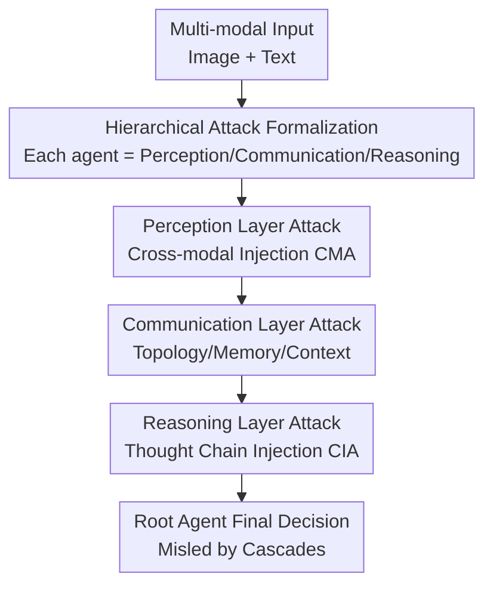

# Hierarchical Attacks for Multi-Modal Multi-Agent Reasoning

**Conference**: CVPR 2026  
**arXiv**: [2605.13213](https://arxiv.org/abs/2605.13213)  
**Code**: The paper claims the benchmark will be released (system based on the open-source framework OxyGent), repository currently unconfirmed  
**Area**: Multi-modal VLM / Agent / AI Safety / Adversarial Attacks  
**Keywords**: Multi-modal Multi-agent, Adversarial Attack, Hierarchical Attack, Reasoning Chain Injection, Communication Topology

## TL;DR
This paper proposes HAM³, which decomposes adversarial attacks on "Multi-Modal Multi-Agent Systems (MM-MAS)" into three interconnected levels: perception, communication, and reasoning. It systematically characterizes how perturbations cascade from single-point inputs to collective decisions. Experiments conducted on the GQA dataset across ReAct, Plan-and-Solve, and Reflexion paradigms show a maximum Attack Success Rate (ASR) of 78.3%, finding that reasoning layer attacks are the most potent, most stealthy, and hardest to rectify.

## Background & Motivation
**Background**: Multi-modal Multi-agent Systems (MM-MAS) are rapidly expanding—where a master agent coordinates multiple specialized sub-agents (image understanding, object detection, segmentation, coding, etc.). They collaborate through structured communication protocols like debate, voting, and role division to perform complex cross-modal reasoning. These systems are used in social interaction, embodied control, and autonomous driving. As systems grow larger and more interconnected, security becomes increasingly critical.

**Limitations of Prior Work**: Existing adversarial attack research is almost entirely limited to "single agent" or "single modality": either manipulating a single agent's observations/prompts/memory to mislead its reasoning, or simply transferring single-agent attack principles to multi-agent settings. The latter often involves tampering with message content or polluting shared tools, where other agents passively propagate errors under fixed communication structures. These approaches only touch "content-level" manipulation. Another line of multi-modal adversarial attacks targets model-level perception (typographic, compositional, or logical visual prompts to jailbreak VLMs) but fails to attack the agent's decision pipeline.

**Key Challenge**: The vulnerability of MM-MAS stems precisely from two structural dimensions that do not exist in single-agent settings—**communication topology** (who connects to whom, how messages are routed, and how shared memory/context is used) and **collective reasoning dynamics** (how reasoning chains from multiple agents reference, aggregate, and amplify each other). Focusing solely on content-level perturbations overlooks these cross-layer and cross-structural vulnerabilities.

**Goal**: To build a unified framework that characterizes how perturbations propagate between Perception → Communication → Reasoning, and to quantify which layer is the most vulnerable and how robustness varies across different reasoning paradigms.

**Key Insight**: By formalizing each agent as a composite of "perception-communication-reasoning" mappings, the system's attack surface naturally divides into three layers. Injecting targeted perturbations into each layer allows for the observation of how local disturbances cascade to the final decision of the root agent.

**Core Idea**: Utilizing a hierarchical attack model, HAM³, the "attack on MM-MAS" is decomposed into perception, communication, and reasoning layer attacks that can be independently instantiated yet are interconnected. This allows for a unified comparison of their propagation and destructive power.

## Method

### Overall Architecture
HAM³ formalizes an MM-MAS as a set of agents $S=\{A_1,\dots,A_N\}$, where each agent consists of a system prompt, toolset, memory module, and communication interface. Given a multi-modal input $x=(x_{\text{image}}, x_{\text{text}})$, the system mapping $F$ produces $y=F(x;\Theta)$, with the final output given by the root agent $F(x)=o_{A_{\text{root}}}$. Crucially, each agent is decomposed into a composite of three mappings—perception $f^{(1)}$, communication $f^{(2)}$, and reasoning $f^{(3)}$. Leaf agents output $o_A=f_A^{(3)}(f_A^{(2)}(f_A^{(1)}(x_A)))$; internal agents first use an aggregation operator $\Phi_A$ to summarize all sub-agent outputs before proceeding through the communication and reasoning layers. Consequently, an attacker can inject a perturbation $\delta_A^{(l)}$ into any agent $A$ at any layer $l\in\{1,2,3\}$. HAM³ instantiates these three layers of attacks to observe the cascading process along the collaborative pipeline to the root agent.

### Key Designs

**1. Hierarchical attack formalization: Decomposing agents into perception-communication-reasoning mappings to structure the attack surface**

The limitation of prior attacks was treating multi-agent systems as a "collection of talking agents," failing to describe where perturbations are injected and how they diffuse through the collaborative structure. HAM³ explicitly models each agent as a composite of three mappings $o_A=f^{(3)}(f^{(2)}(f^{(1)}(\cdot)))$, distinguishing between leaf agents directly processing input and internal agents aggregating child outputs via $\Phi_A(\{o_C\mid C\in\text{Children}(A)\})$. This allows any layer to host a perturbation $\delta_A^{(l)}$, transforming attacks from scattered "message edits" into systematic perturbations with clear hierarchical coordinates. This formalization explicitly defines the cascade path from "single-point perturbation → collective decision," enabling the identification and comparison of cross-layer and cross-structural vulnerabilities.

**2. Perception layer attack: Cross-modal joint perturbations targeting vision-language alignment at the agent entrance**

Perception layer attacks act before any inter-agent collaboration by disturbing multi-modal inputs. The core is the Cross-Modal Injection Attack (CMA): $x'=(G_{\text{image}}(x_{\text{image}}), G_{\text{text}}(x_{\text{text}}))$, where $G_{\text{text}}$ generates misleading text based on the query and visual content, and $G_{\text{image}}$ performs semantic image editing or overlays text. Compared to attacking only the image (VIA) or text (TIA), perturbing both modalities simultaneously more effectively deceives the agent's vision-language alignment. Systems often rely on image-text consistency for self-checking; single-modal errors are frequently corrected by downstream reasoning or inter-agent communication, whereas joint perturbations cause the image and text to "lie together," rendering self-checks ineffective. Experiments show CMA achieves the highest ASR in the perception layer for 87% of tasks. Furthermore, the paper uses Cross-Modal Consistency (cosine similarity in CLIP space) to demonstrate that the image-text semantics remain aligned after perturbation, making the attack stealthier.

**3. Communication layer attack: Manipulating communication topology over message content to attack collective structure**

This layer targets structural dependencies unique to multi-agent systems, including four attacks: Agent Spoofing (ASA, forging/replacing an agent in the graph, $\Gamma'=G_{\text{topo}}(\Gamma,\delta_{\text{topo}})$, hijacking routing), Structural Blocking (SBA, injecting blocking instructions to create cyclic waits like $A_i\to A_j\to A_k\to A_i$, inducing deadlocks), Shared Memory Pollution (SMPA, injecting forged history $D_{\text{adv}}$ into the short-term memory of a target set $\Omega$), and Shared Context Injection (SCIA, inserting an adversarial prior $p_{\text{adv}}$ into the system prompts of a group of agents to align and reinforce their biases). Key insight: Message-level attacks (SMPA/SCIA) only cause inconsistent agent responses, which can often be corrected by cross-validation or rerouting; however, **structural-level attacks (SBA) directly alter the network topology**, forcibly cutting connections between critical agents and blocking access to correct expertise, making recovery difficult. Consequently, SBA's ASR is significantly higher than message-level attacks (65.0% for ReAct+Qwen-7B, 71.8% for Plan-and-Solve).

**4. Reasoning layer attack: Injecting intermediate reasoning steps to amplify errors and maximize difficulty of correction**

Reasoning layer attacks interfere with each agent's internal reasoning chain. The core is the Chain-of-Thought Injection Attack (CIA): given a reasoning sequence $\text{CoT}=[r_1,\dots,r_T]$, the attacker inserts or replaces an intermediate state $r^*$ at position $\tau$, resulting in $\text{CoT}'=G_{\text{CIA}}(\text{CoT}, r^*, \tau)$. This is the most potent because subtle logical errors introduced in early or pivotal steps are amplified along the reasoning chain. When CoTs are shared or summarized among agents (as in ReAct, Plan-and-Solve, and Reflexion), a single polluted reasoning segment can mislead the entire sub-team. Since it directly alters intermediate reasoning steps rather than indirectly polluting memory or tools, the trajectory becomes unreliable and extremely difficult to correct. This allows CIA to achieve the overall highest ASR of 78.3% (ReAct+Qwen-7B), approximately 13 points higher than the strongest communication attack (SBA) and 17 points higher than the strongest perception attack (CMA).

### An Example: Why CIA is deadlier than content-level attacks
Take ReAct + Qwen-7B: Perception layer CMA (altering both image and text) achieves an ASR of 60.8%—but some errors are corrected by subsequent agent collaboration. Communication layer SBA (severing critical agent connections) achieves 65.0%—structural damage is harder to recover from. Reasoning layer CIA (inserting a single misleading step in an agent's CoT) spikes to 78.3% ASR. Furthermore, once this polluted CoT is referenced or summarized by other agents, more than half of the successful attacks result in "consistent errors" across multiple agents, collectively leading them astray. Comparing the three layers clearly shows: the closer an attack is to internal reasoning and shared intermediate states, the more persistent, stealthy, and systemic it becomes.

## Key Experimental Results

### Main Results
Evaluation was performed on 5,984 image-text pairs sampled from GQA (covering 10 semantic categories). The MM-MAS was built on OxyGent: 1 master agent + 6 specialized sub-agents + 13 tools, running ReAct / Plan-and-Solve / Reflexion paradigms. Text attacks were generated by GPT-4o, and visual attacks by Nano Banana. The table below shows the ASR (%) of representative attacks at each layer under the ReAct paradigm (bold denotes the strongest in each layer):

| Paradigm/Model | Perception CMA | Communication SBA | Reasoning CIA | Overall Highest |
|--------|------|------|------|------|
| ReAct / Qwen-7B | 60.8 | 65.0 | **78.3** | CIA 78.3 |
| ReAct / Qwen-32B | 55.7 | 59.8 | **73.2** | CIA 73.2 |
| ReAct / GLM-4V+ | 53.7 | 62.2 | 71.3 | TSA 72.0 |
| ReAct / O1-Mini | 44.0 | 51.3 | **71.5** | CIA 71.5 |
| ReAct / GPT-4o | 43.2 | 49.0 | **65.0** | CIA 65.0 |

Across paradigms: Reflexion is the most robust (under CIA+Qwen-7B, ASR drops to 61.7%, ~16 points lower than ReAct), Plan-and-Solve is in the middle (69.2%), and ReAct is the most fragile (alternating reasoning and action without explicit verification allows early perturbations to amplify). Larger models are more resilient: CIA ASR under ReAct drops from 78.3% for Qwen-7B to 65.0% for GPT-4o.

### Ablation Study
The drop in Task Success Rate (TSR, %) under attacks at different layers (N.A. is the no-attack baseline):

| Paradigm | Perception | Communication | Reasoning | No-Attack N.A. |
|------|------|------|------|------|
| ReAct | 29.45 | 27.58 | **23.55** | 58.99 |
| Plan-and-Solve | 34.59 | 31.99 | 27.58 | 60.88 |
| Reflexion | 33.18 | 31.43 | 30.64 | 61.35 |

The no-attack baseline for all three paradigms is approximately 60%. Following an attack, the TSR drops significantly, with ReAct experiencing the largest decrease at the reasoning layer (a drop of ~35 points), while perception/communication layer drops are moderate (~25–30 points), reinforcing that the reasoning layer is the most fragile.

### Key Findings
- **Reasoning layer is the most fragile**: CIA yields the highest ASR in all settings because it directly alters intermediate reasoning steps that are amplified along the chain. When CoTs are shared across agents, a single point of pollution can mislead the entire sub-team, leading to "consistent errors" in over half of successful attacks.
- **Structural Attack > Content Attack**: In the communication layer, SBA (disrupting topology, creating deadlocks) is far stronger than SMPA/SCIA (message-level), as the latter can often be corrected via cross-validation or rerouting. ASA (spoofing agents) is unstable because noisy outputs from fake agents are often ignored.
- **Trade-off between External Robustness vs. Internal Stability**: The Hallucination Error Rate (HER) drops from ~8% in Qwen-7B to ~4% in GPT-4o, indicating larger models are internally more stable. Reflexion has fewer external errors but more hallucination-related errors, while ReAct shows the opposite—both factors collectively determine system reliability.

## Highlights & Insights
- **"Layer-based Coordinate" for the attack surface**: Modeling each agent with $f^{(1)}/f^{(2)}/f^{(3)}$ mappings allows the location and cascade of perturbations to be uniformly defined and compared—this formalization itself is more valuable for transferability than any single attack.
- **Clear conclusion that "inner is deadlier"**: From Perception → Communication → Reasoning, the destructive power of attacks increases monotonically. Reasoning layer attacks are stealthy (CoT remains seemingly coherent), persistent (errors are hard to fix), and systemic (spreading along shared CoTs), pinpointing a critical defense focus for robust MM-MAS.
- **Quantifying "Stealth" with CMC**: Using CLIP image-text cosine similarity to measure whether perturbations maintain cross-modal semantic alignment. High CMC combined with high ASR defines an attack that is both deceptive and difficult to detect, establishing "attack stealth" as a measurable metric comparable across multi-modal evaluations.

## Limitations & Future Work
- The evaluation primarily focuses on GQA (supplemented by EvoChart-QA), with tasks centered on multi-step reasoning in VQA; generalization to real MM-MAS scenarios like embodied control or autonomous driving is not fully verified.
- The system configuration is tied to the specific "1 master + 6 sub-agents + 13 tools" topology of the OxyGent framework; the sensitivity of attack efficacy to the number of agents, topology shapes, and protocols (debate/voting) has not been systematically scanned.
- The work is "attack-oriented," proposing numerous attacks with almost no corresponding defense or detection schemes; the authors leave "designing more robust systems" as future work, meaning actual defensibility remains an open question.
- ⚠️ The explanation for ASA's instability ("noisy spoofed outputs are ignored") is qualitative and lacks quantitative analysis regarding the stability of topological attacks across different graph structures.

## Related Work & Insights
- **Vs Single-agent attacks (InjecAgent / ASB)**: Those works perform prompt injection, tool-call pollution, or environmental perturbations on a single agent. This paper elevates the perspective to multi-agent settings, emphasizing structural vulnerabilities like communication topology and collective reasoning dynamics that do not exist for single agents.
- **Vs Multi-agent communication attacks (communication manipulation / poisoned shared tools)**: Previous multi-agent attacks remained at the "content-level"—modifying messages or polluting shared tools while other agents passively propagated them. This paper introduces topology-level (SBA/ASA) and reasoning-chain-level (CIA) attacks, demonstrating that structural and reasoning attacks are far more potent than content-level ones.
- **Vs Multi-modal adversarial attacks (typographic / logical visual prompts to jailbreak VLM)**: Those target model-level perception to jailbreak a single VLM. This paper targets the agent's decision pipeline; CMA is merely an entry perturbation, with the focus on how perturbations propagate along the collaborative chain to the collective decision.

## Rating
- Novelty: ⭐⭐⭐⭐⭐ The first systematic study of MM-MAS adversarial robustness; hierarchical formalization unifies perception/communication/reasoning attacks with a clear, original perspective.
- Experimental Thoroughness: ⭐⭐⭐⭐ Coverage of 3 paradigms × 5 models × 10 attacks; solid multi-dimensional analysis (TSR/HER/CMC). However, evaluation is restricted to GQA-type tasks and a single topology, leaving room for better generalization.
- Writing Quality: ⭐⭐⭐⭐ The three-layer narrative is clear, and the formalization aligns well with the experiments; some explanations for attack efficacy remain qualitative.
- Value: ⭐⭐⭐⭐⭐ Provides definitive conclusions (Reasoning layer most fragile, Structural > Content) and measurable stealth metrics, offering direct guidance for building robust multi-agent systems.

<!-- RELATED:START -->

## Related Papers

- [\[CVPR 2026\] Socratic-Geo: Synthetic Data Generation and Cross-Modal Geometric Reasoning via Multi-Agent Interaction](socratic-geo_synthetic_data_generation_and_cross-modal_geometric_reasoning_via_m.md)
- [\[CVPR 2026\] Multi-Hierarchical Contrastive Spectral Fusion for Multi-View Clustering](multi-hierarchical_contrastive_spectral_fusion_for_multi-view_clustering.md)
- [\[CVPR 2026\] ProSoftArena: Benchmarking Hierarchical Capabilities of Multi-modal Agents in Professional Software Environments](prosoftarena_benchmarking_hierarchical_capabilities_of_multi-modal_agents_in_pro.md)
- [\[CVPR 2026\] Geometrically-Constrained Agent for Spatial Reasoning](geometrically-constrained_agent_for_spatial_reasoning.md)
- [\[CVPR 2026\] Multi-SpatialMLLM: Multi-Frame Spatial Understanding with Multi-Modal Large Language Models](multi-spatialmllm_multi-frame_spatial_understanding_with_multi-modal_large_langu.md)

<!-- RELATED:END -->
