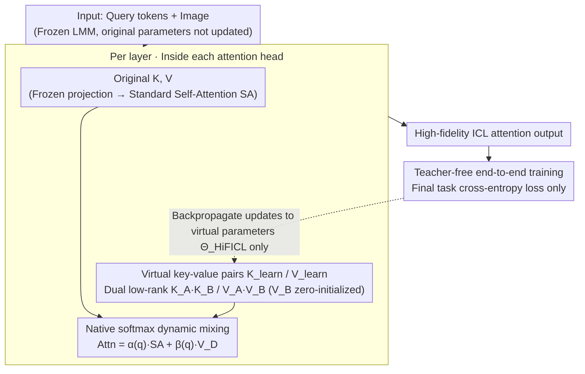

# HiFICL: High-Fidelity In-Context Learning for Multimodal Tasks

**Conference**: CVPR 2026  
**arXiv**: [2603.12760](https://arxiv.org/abs/2603.12760)  
**Code**: [https://github.com/bbbandari/HiFICL](https://github.com/bbbandari/HiFICL)  
**Area**: Multimodal VLM  
**Keywords**: In-Context Learning, Parameter-Efficient Fine-Tuning, Large Multimodal Models, Virtual Key-Value Pairs, Low-Rank Decomposition

## TL;DR

Through rigorous derivation of the attention formula, HiFICL reformulates the ICL approximation problem from "fitting a shift vector" to "directly parameterizing the source of ICL." By injecting learnable low-rank virtual key-value pairs into attention heads and performing end-to-end training, it achieves a dynamic, context-aware parameter-efficient fine-tuning method that outperforms existing ICL approximation methods and LoRA across multiple multimodal benchmarks with minimal parameters.

## Background & Motivation

1. **Background**: In-context learning (ICL) is a critical capability of Large Multimodal Models (LMMs), enabling adaptation to new tasks with few examples without parameter updates. However, in multimodal scenarios, the high token cost of long visual inputs leads to significant computational overhead, and ICL performance is highly sensitive to example selection and ordering.

2. **Limitations of Prior Work**: To address these issues, a mainstream direction is "ICL approximation"—learning a "shift vector" to distill the ICL effect. Representative methods like Task Vector, LIVE, and MimIC model the ICL effect as a linear translation of hidden state representations. However, these methods rely on a theoretically imprecise assumption: they approximate the indirect result of ICL rather than its fundamental mechanism.

3. **Key Challenge**: Mechanistic interpretability research has demonstrated that ICL is not a simple global translation but a complex pattern-matching and retrieval process executed by specialized circuits (e.g., Induction Heads), involving highly nonlinear transformations in the representation space. There is a fundamental contradiction between the linear shift assumption and the nonlinear essence of ICL.

4. **Goal**: (a) How to faithfully model the true mechanism of ICL instead of approximating its indirect effects? (b) How to design a fine-tuning method that is both dynamic and parameter-efficient?

5. **Key Insight**: The authors return to the attention formula itself to derive an exact mathematical decomposition of the ICL effect—it is not an externally added vector but a dynamic weighted mixture of the standard self-attention output and the context value matrix. Therefore, the correct objective for ICL approximation should be to directly parameterize its "source" (K_D, V_D) rather than its "effect."

6. **Core Idea**: Abandon indirect shift vector fitting and directly inject learnable low-rank virtual key-value pairs into the attention modules to simulate ICL examples, faithfully preserving the nonlinear dynamics of the attention mechanism.

## Method

### Overall Architecture

HiFICL freezes all parameters of the LMM and injects a set of learnable virtual key-value pairs $(K_{\text{learn}}, V_{\text{learn}})$ into each attention head of every layer. inside the attention head, these virtual pairs are computed via the native softmax alongside the original (frozen) keys and values of that head, resulting in an output that represents a dynamic mixture of "standard self-attention + context value injection"—precisely following the theoretically derived form $\alpha(q)\cdot\text{SA} + \beta(q)\cdot V_D$. During training, the teacher is discarded, and the virtual parameters are optimized end-to-end using only the cross-entropy loss of the final task, with gradients backpropagating only to these virtual parameters.

### Key Designs

**1. Precise Decomposition of the Attention Formula: Understanding what ICL does in attention**

Previous ICL approximation methods defaulted to the assumption that "ICL effect = adding a shift vector to hidden states," but this was an unproven engineering heuristic. HiFICL returns to the attention formula, expanding the case where "ICL examples are placed in the prefix" into a precise analytical expression: the attention output containing examples can be decomposed as:

$$\text{Attn}_{\text{out}} = \alpha(q) \cdot \text{SA}(q,K,V) + \beta(q) \cdot V_D$$

where $\text{SA}(q,K,V)$ is the standard self-attention without examples, and $V_D$ is the value matrix of the ICL examples. Both weights depend on the current query $q$: the scalar weight $\alpha(q) = Z_2/(Z_1+Z_2)$ controls how much the original self-attention is scaled, and the vector weight $\beta(q) = \exp(qK_D^{\top}/\sqrt{d_k})/(Z_1+Z_2)$ controls how much context value is injected ($Z_1, Z_2$ are the sums of attention scores for example keys and query keys, respectively). This equation signifies that ICL is not "adding a fixed vector to the output" but "a query-dependent dynamic scaling of self-attention superimposed with query-dependent context values"—a complete nonlinear dynamical system. In other words, the shift effect previously sought is itself a byproduct of the $\beta(q)\cdot V_D$ term in this formula. Consequently, the correct goal for faithful ICL modeling should be to parameterize its "source" $(K_D, V_D)$ rather than its "result" shift.

**2. Dual Low-Rank Virtual KV Pairs: Learning the source with minimal parameters**

Following the above conclusion, HiFICL no longer attaches external shift vectors. Instead, it inserts $n$ learnable virtual key-value pairs $(K_{\text{learn}}^{(h)}, V_{\text{learn}}^{(h)})$ into each attention head $h$, allowing them to masquerade as the $(K_D, V_D)$ of real ICL examples and interact dynamically with queries via native softmax. Learning full-rank matrices would involve too many parameters and risk severe overfitting, so each pair undergoes low-rank decomposition:

$$K_{\text{learn}}^{(h)} = K_A^{(h)} K_B^{(h)}, \qquad V_{\text{learn}}^{(h)} = V_A^{(h)} V_B^{(h)}$$

where $K_A, V_A \in \mathbb{R}^{n \times r}$, $K_B, V_B \in \mathbb{R}^{r \times d_h}$, and rank $r \ll d_h$. This decomposition achieves two goals: the low-rank constraint on the key side acts as a structural regularizer, forcing the model to compress examples into a few compact "prototype keys" to prevent overfitting. On the value side, $V_B$ is zero-initialized, ensuring the context shift is zero at the start of training. This allows the model to learn smoothly starting from a state "equivalent to the original LMM," avoiding gradient explosions caused by random initialization. The low-rank decomposition of $V$ contributes most to performance (a 2.77% drop if removed), precisely because this zero initialization ensures training stability.

**3. Teacher-Free End-to-End Training: Discarding the alignment loss**

Methods like MimIC follow a teacher-student paradigm: performing a teacher forward pass with real examples and then requiring the student to align hidden states layer-by-layer. HiFICL discards this entirely, using only the final task cross-entropy loss to optimize all virtual parameters end-to-end:

$$\mathcal{L} = -\sum_t \log P(A_t \mid Q, A_{<t}; \Theta_{\text{base}}, \Theta_{\text{HiFICL}})$$

The frozen $\Theta_{\text{base}}$ are the original LMM parameters, and only $\Theta_{\text{HiFICL}}$ (the low-rank virtual pairs) are updated. Removing the teacher is not just for convenience—ablations show that re-adding a teacher actually lowered VQAv2 performance from 72.08% to 70.09%. This suggests that layer-wise alignment sets a performance ceiling, forcing the student to mimic the teacher's intermediate representations and restricting its ability to explore better solutions. Furthermore, eliminating the teacher forward pass provides a massive efficiency dividend: training time is $1/7.5$ and FLOPs are $1/14.3$ compared to MimIC.

### Loss & Training

The AdamW optimizer is used with a learning rate of 5e-3, cosine annealing with 10% warmup, virtual prompt count $n=8$, and rank $r$ as a task-dependent hyperparameter (optimal $r=8$ for VQAv2, $r=16$ for the more complex OK-VQA). All experiments were conducted using 1,000 training samples.

## Key Experimental Results

### Main Results

Performance comparison on LLaVA-Interleave-7b:

| Method | Params (M) | VQAv2 | OK-VQA | COCO CIDEr |
|------|----------|-------|--------|------------|
| 8-shot ICL | - | 68.19 | 43.84 | 1.2085 |
| LoRA | 19.7 | 70.12 | 48.19 | 1.0665 |
| MimIC | 17.0 | 74.40 | 52.29 | 1.3169 |
| **HiFICL** | **2.2** | **74.66** | **54.19** | **1.3315** |

Performance comparison on Idefics2-8b-base:

| Method | Params (M) | VQAv2 | OK-VQA | COCO CIDEr |
|------|----------|-------|--------|------------|
| MimIC | 0.26 | 69.29 | 58.74 | 1.2827 |
| **HiFICL** | **2.2** | **72.08** | **59.56** | **1.2951** |

HiFICL outperforms MimIC on VQAv2 by 2.79% on Idefics2 while using only 1/8 of LoRA's parameters.

### Ablation Study

Component ablation on Idefics2:

| Configuration | VQAv2 | OK-VQA | COCO |
|------|-------|--------|------|
| HiFICL (Full) | **72.08** | **59.56** | **1.2951** |
| + Teacher | 70.09 (-1.99) | 59.13 | 1.2844 |
| - LoRA on K | 70.58 (-1.50) | 55.72 | 1.2652 |
| - LoRA on V | 69.31 (-2.77) | 56.86 | 1.2618 |
| w/o SA scaling ($\alpha=1$) | 70.14 (-1.94) | 58.51 | 1.2808 |

### Key Findings

- **The Teacher Paradigm is a Performance Ceiling**: Adding a teacher dropped VQAv2 by 1.99% while increasing training costs by 7.5x. This confirms that teacher alignment limits model potential.
- **Low-Rank Decomposition of V is the Most Significant Contributor**: Removing it dropped VQAv2 by 2.77%, as zero-initialization of $V_B$ is critical for training stability.
- **The Nonlinear Scaling Factor $\alpha$ is Essential**: Setting $\alpha=1$ is equivalent to degrading to a linear shift approximation, which dropped performance from 72.08% to 70.14%, empirically validating the necessity of preserving attention nonlinearity.
- **Optimal Rank Varies with Task Complexity**: The optimal $r$ is 8 for VQAv2 and 16 for the more complex OK-VQA, suggesting that low-rank decomposition is not just a compression tool but a task-adaptive regularizer.
- **Hallucination Analysis**: HiFICL achieved the lowest CHAIRi (2.2), significantly lower than 8-shot ICL (3.9), while maintaining the highest Recall (45.7), indicating that high-fidelity approximation reduces generation not grounded in visual input.
- **High Data Efficiency**: Surpasses the 8-shot ICL baseline with only 300 samples.

## Highlights & Insights

- **Reformulating the Problem from Theoretical Derivation**: Instead of focusing on "how to better approximate the shift vector," the authors prove that the shift vector itself is an analytical result of the attention formula, thereby transforming the problem into "direct parameterization of $(K_D, V_D)$." This reformulation is transferable to other research directions attempting to approximate specific effects.
- **ICL as an Instantiation of Inference-Time Fine-Tuning**: Theoretical studies suggest that ICL is essentially a dynamic optimization during inference. HiFICL is the first work to translate this hypothesis into a training-time PEFT method. Compared to LoRA's static, input-agnostic adaptation, HiFICL's dynamic, context-aware adaptation aligns more closely with the nature of ICL.
- **Extreme Parameter Efficiency**: Surpasses LoRA and MimIC (which require 17-19.7M parameters) with only 2.2M parameters, while maintaining an inference speed nearly identical to zero-shot models.

## Limitations & Future Work

- Validated only on 7B/8B scale models; performance on larger models has not been tested.
- The number of virtual prompts $n=8$ and the rank $r$ require tuning for different tasks.
- Theoretical derivation is based on unified self-attention architectures and is not applicable to early cross-attention designs (e.g., Flamingo).
- Evaluated only on VQA and captioning tasks; more complex multimodal reasoning tasks (e.g., visual grounding, video understanding) have not been tested.

## Related Work & Insights

- **vs MimIC**: MimIC simplifies the ICL effect into a single-direction linear shift and uses a teacher-student paradigm for training. HiFICL implements a full multi-directional nonlinear dynamic mixture, making end-to-end training more efficient (1/14.3 FLOPs) and achieving superior performance across the board.
- **vs LoRA**: LoRA makes static, input-agnostic modifications in the weight space; HiFICL performs dynamic, context-aware adaptation in the activation space, which is closer to the intrinsic mechanism of ICL, while using only 1/8 of LoRA's parameters.
- **vs LIVE**: LIVE inserts learnable vectors after FFN layers, representing a simple linear approximation. HiFICL operates inside the attention module, enabling it to capture nonlinear dynamics.

## Rating

- Novelty: ⭐⭐⭐⭐⭐ The approach of reformulating the problem based on theoretical derivation is elegant, and the perspective of unifying ICL approximation with PEFT is novel.
- Experimental Thoroughness: ⭐⭐⭐⭐ Ablations and analyses are detailed, though testing was limited to 2 models and 3 tasks; coverage could be expanded.
- Writing Quality: ⭐⭐⭐⭐⭐ Theoretical derivations are rigorous and fluid; the logical chain from problem reformulation to method design is clear.
- Value: ⭐⭐⭐⭐ Provides a new theoretical perspective and a highly practical method for ICL approximation with extreme parameter efficiency.

<!-- RELATED:START -->

## Related Papers

- [\[CVPR 2026\] Efficient and High-Fidelity Omni Modality Retrieval](efficient_and_high-fidelity_omni_modality_retrieval.md)
- [\[CVPR 2026\] Visual-Aware CoT: Achieving High-Fidelity Visual Consistency in Unified Models](visual-aware_cot_achieving_high-fidelity_visual_consistency_in_unified_models.md)
- [\[CVPR 2026\] Prototype-as-Prompt: Multimodal Sentiment Prototypes Endowing Large Language Models the Capability to Perform Multimodal Sentiment Analysis](prototype-as-prompt_multimodal_sentiment_prototypes_endowing_large_language_mode.md)
- [\[CVPR 2026\] Parallel In-context Learning for Large Vision Language Models](parallel_in-context_learning_for_large_vision_language_models.md)
- [\[CVPR 2026\] MASQuant: Modality-Aware Smoothing Quantization for Multimodal Large Language Models](masquant_modality-aware_smoothing_quantization_for_multimodal_large_language_mod.md)

<!-- RELATED:END -->
