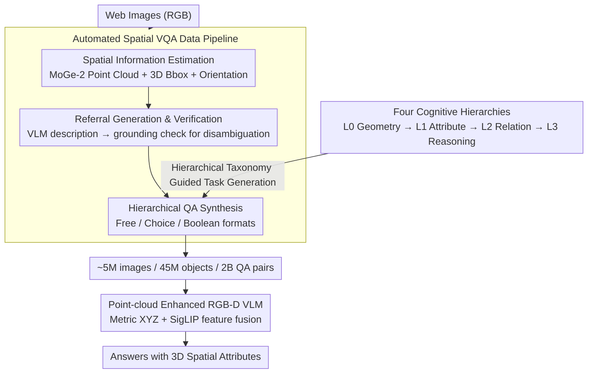

# HiSpatial: Taming Hierarchical 3D Spatial Understanding in Vision-Language Models

**Conference**: CVPR 2026  
**arXiv**: [2603.25411](https://arxiv.org/abs/2603.25411)  
**Code**: None  
**Area**: Multimodal VLM  
**Keywords**: 3D spatial understanding, Vision-Language Models, hierarchical task design, point cloud maps, spatial reasoning

## TL;DR

HiSpatial proposes decomposing 3D spatial intelligence into four cognitive hierarchies (geometric perception → object attributes → object relations → abstract reasoning). It constructs an automated data pipeline processing ~5 million images, 45 million objects, and 2 billion QA pairs, and designs an RGB-D VLM using metric-scale point cloud maps as auxiliary input. With only 3B parameters, it surpasses GPT-5 and Gemini-2.5-Pro on multiple spatial reasoning benchmarks.

## Background & Motivation

1. **Background**: VLMs perform exceptionally well in 2D tasks such as VQA and image captioning, but extending from 2D to 3D spatial understanding remains difficult. Recent works introduce spatial-oriented VQA tasks via SFT or RFT but face two primary challenges.

2. **Limitations of Prior Work**: (a) Lack of a unified and systematic task hierarchy—existing tasks lack comprehensive coverage, and dependencies between spatial reasoning skills at different levels remain unclear; (b) Difficulty in obtaining large-scale, diverse data with 3D annotations—existing 3D annotated datasets are limited to indoor scenes, while large-scale web data lacks 3D supervision.

3. **Key Challenge**: Prior works focused on specific aspects of spatial understanding (e.g., qualitative relation comparison or quantitative distance prediction), but none systematically investigated the hierarchical dependencies between these tasks: whether training on low-level tasks facilitates the emergence of high-level capabilities.

4. **Goal**: (a) Define a comprehensive 3D spatial understanding task system with hierarchical dependencies; (b) Construct a large-scale spatial VQA dataset; (c) Validate the dependencies between hierarchies and provide guidance for training strategies.

5. **Key Insight**: Analogize 3D spatial intelligence to a four-level progression of human cognition: perceiving depth and geometry → understanding 3D attributes of objects → understanding spatial relations between objects → performing abstract spatial reasoning (perspective shifting, spatial counting, spatial problem solving).

6. **Core Idea**: Four cognitive hierarchies + large-scale automated data pipeline + metric-scale point cloud-enhanced RGB-D VLM to systematically build and validate 3D spatial intelligence in VLMs.

## Method

### Overall Architecture

HiSpatial addresses two bottlenecks in the transition of VLMs from 2D to 3D spatial understanding: "unstructured tasks" and "difficulty in 3D data acquisition." The entire method follows a single main line: first, decomposing spatial intelligence into four cognitive hierarchies from low to high; then, using an automated pipeline to batch-convert massive general images into spatial VQA pairs across levels; and finally, training an RGB-D VLM capable of directly reading 3D point cloud maps. The input consists of an RGB image (paired with an estimated point cloud map during inference). Point cloud features and visual features are fused to output answers with 3D spatial attributes. These three components are progressive—the hierarchy defines the data format, the pipeline generates the data, and the model consumes the data to verify that hierarchical dependencies indeed exist.

### Key Designs

**1. Four Cognitive Hierarchies: Decomposing spatial intelligence into a trainable ladder of abilities**

Addressing the pain point of "incomplete task coverage and unknown skill dependencies," Ours analogizes 3D spatial understanding to human cognition, divided into four levels from perception to reasoning. Level 0 is basic geometric perception without semantics, performing pixel-level 3D point queries (outputting 3D coordinates given 2D positions) and pairwise depth ranking. Level 1 ascends to the object level, anchoring geometry and semantics to perform object localization, orientation estimation (describing yaw in language), and size estimation. Level 2 handles relations between objects, including relative directions (qualitative left/right/front/back or precise 3D direction vectors), relative distances (Euclidean distance and components), and comparison/ranking of multiple objects. Level 3 is abstract reasoning, covering perspective transformation (inferring location from an object's viewpoint), object counting under spatial constraints, and spatial problem solving that breaks high-level goals into multi-step spatial reasoning.

This hierarchy is not just for categorization; its value lies in revealing and quantifying dependencies between levels. Ablation shows that removing L0+L1 training data causes L2 performance to drop by 25% (EmbSpatial fell from 80.71% to 37.53%) and L3 to drop by 14.51%. Even though L2 has more data than low-level tasks, high-level reasoning loses its implicit spatial knowledge foundation without low-level geometric perception. This conclusion directly provides a training strategy: solidify low levels before layering high levels.

**2. Automated Spatial VQA Data Pipeline: End-to-end generation of 3D-annotated tasks from general images**

Large-scale 3D annotated data is scarce, and existing datasets are stuck in indoor scenes. Therefore, hierarchical data is generated by an automated three-stage pipeline. Stage 1 involves spatial information estimation: MoGe-2 generates pixel-level 3D point clouds; RAM → GroundingDINO → SAM chain detects objects and calculates 3D bounding boxes and sizes from point clouds; OrientAnythingv2 estimates orientation; and Perspective Fields establishes a gravity-aligned world coordinate system. Stage 2 generates textual references: Describe Anything / Qwen2.5-VL / Qwen3-VL write descriptions for each object, followed by a VLM grounding verification—descriptions with IoU below a threshold are discarded to resolve "one description to multiple objects" ambiguity, ensuring precise QA references. Stage 3 synthesizes QA based on the hierarchical taxonomy in three formats (free-form, multiple-choice, and boolean) to provide complementary learning signals, with L3 spatial problem solving assigned to GPT to generate multi-step reasoning tasks.

For example, given an indoor photo, MoGe-2 lifts pixels to 3D coordinates; detectors circle "sofa," "table," and "lamp" to calculate 3D boxes and sizes, while OrientAnythingv2 marks the sofa's orientation. Each object is assigned a validated textual reference. Finally, tasks are generated: L1 asks "How tall is the lamp?", L2 asks "Which direction is the table relative to the sofa?", and L3 asks "From the perspective of a person sitting on the sofa, is the lamp on the left or right?". This pipeline ultimately produced ~5 million images, 45 million objects, and 2 billion QA pairs.

**3. Point-cloud Enhanced RGB-D VLM: Feeding metric-scale 3D geometry directly into the model**

RGB alone makes precise distance and size judgments difficult, so Ours adds a point cloud branch to PaliGemma2-3B. The point cloud map is denoted as $\mathbf{X} \in \mathbb{R}^{H \times W \times 4}$, where the first three channels are 3D coordinates and the fourth is a validity mask. It is processed through sinusoidal position encoding and a learnable patchify convolution layer into a feature map, then concatenated with SigLIP visual features along the feature dimension. A linear projector fuses them before they enter the LLM. During training, the visual encoder is frozen, while the patchify layer, fusion projector, and LLM are jointly fine-tuned.

The critical difference is the use of **metric-scale** point clouds rather than conventional relative depth maps. Relative depth only indicates order, whereas metric point clouds provide actual metric coordinates, enabling accurate quantitative answers for distance and size. Ablation shows metric point clouds outperform relative depth by 6.76% (82.02% vs. 75.26%) on quantitative tasks. Furthermore, using GT point clouds yields additional gains, suggesting higher upper bounds for embodied AI scenarios with depth sensors.

### Loss & Training

Standard VLM SFT cross-entropy loss is employed. AdamW optimizer, learning rate $2 \times 10^{-5}$, batch size 256, trained for 70K steps. Spatial VQA data and LLaVA-Next general VQA data are mixed at a 1:7 sampling ratio to maintain general capabilities.

## Key Experimental Results

### Main Results

Quantitative Spatial VQA Benchmarks (L1-L2 tasks):

| Model | Input | SpatialRGPT Avg | QSpatial Avg |
|------|------|----------------|-------------|
| GPT-5 | RGB | 40.47 | 68.45 |
| Gemini-2.5-Pro | RGB | 26.57 | 49.92 |
| MM-Spatial-3B | RGB-D | 68.70 | - |
| **HiSpatial-3B** | **RGB-XYZ** | **79.28** | **85.16** |

Qualitative Spatial VQA Benchmarks (L1-L3 tasks):

| Model | EmbSpatial | RoboSpatial | CV-Bench-3D | 3DSRBench |
|------|-----------|------------|-------------|-----------|
| GPT-4o | 63.38 | 77.20 | 84.90 | 44.20 |
| Gemini-2.5-Pro | 76.67 | 77.24 | 90.80 | 48.47 |
| Qwen-3-VL-8B | 78.50 | 82.11 | 90.66 | 52.80 |
| **HiSpatial-3B** | **80.71** | **86.18** | **97.58** | **63.81** |

Self-built Benchmarks (L1-L3):

| Model | Object Distance (L1) | Object Direction (L2) | Spatial Prob. Solving (L3) |
|------|-------------|-------------|-----------------|
| GPT-5 | 47.19% | 59.27% | 33.33% |
| **HiSpatial-3B** | **92.18%** | **67.21%** | **47.44%** |

### Ablation Study

Analysis of hierarchical dependencies:

| L0 | L1 | L2 | L3 | L2 Task Avg | L3 Task Avg | Description |
|----|----|----|----|-----------|-----------|----|
| ✓ | ✓ | ✓ | ✓ | **81.21** | **56.29** | Full Model |
| ✓ | ✓ | | ✓ | 79.69 (-1.52) | 48.15 (-8.14) | No L0+L1, L3 drops 8% |
| ✓ | | ✓ | | 56.21 (-25.00) | 41.78 (-14.51) | No L1+L2, L2 drops 25% |

Impact of auxiliary 3D input:

| Input | Qualitative | Quantitative |
|------|------|------|
| RGB only | 83.70 | 74.16 |
| RGB + Relative Depth | 84.29 (+0.59) | 75.26 (+0.90) |
| RGB + XYZ Point Cloud | **84.79** | **82.02 (+6.76)** |
| RGB + GT XYZ | - | 82.79 (+0.77) |

### Key Findings

- **Strong Hierarchical Dependencies**: Even when L2 training data far exceeds L0+L1, removing the latter results in a sharp drop in L2 performance (EmbSpatial fell from 80.71% to 37.53%), indicating that low-level geometric perception provides indispensable implicit knowledge for high-level reasoning.
- **Hierarchical Gradient Influence on L3**: Removing L1+L2 is more detrimental to L3 than removing L0+L1 (-14.51% vs. -8.14%), as L3 directly depends on L1/L2 skills.
- **Metric-Scale Point Clouds Surpass Relative Depth**: A 6.76% gap exists in quantitative tasks, as metric information directly supports precise distance/size estimation.
- **Spatial SFT Preserves General Capabilities**: After training on 88% spatial + 12% general data, MMBench increased from 49.86% to 69.67%, suggesting spatial understanding and general VQA can mutually reinforce each other.

## Highlights & Insights

- **Systematic design of four cognitive hierarchies** is the core contribution—not just proposing a set of tasks, but revealing hierarchical dependencies, providing clear guidance for future training strategies (training low levels before high levels is most effective).
- **Large-scale automated data pipeline** offers high reuse value—from MoGe-2 estimation to multi-model detection, referral verification, and multi-format QA synthesis, the process is applicable to new image datasets.
- **3B model surpasses GPT-5 and Gemini-2.5-Pro**: Demonstrates that spatial understanding can be achieved in small models via high-quality domain data and proper architecture, without requiring massive scale.
- The discovery that metric-scale point clouds are more effective than relative depth points toward improvements in downstream tasks like embodied AI with depth sensors.

## Limitations & Future Work

- Reliance on MoGe-2 quality; point cloud estimation may be inaccurate in textureless or heavily occluded scenes.
- The referral verification stage in the pipeline still faces limited pass rates (falling back to class labels + bounding boxes upon failure).
- L3 spatial problem-solving tasks are GPT-generated, which may contain bias or lack diversity.
- Validated only on PaliGemma2-3B; scaling effects and consistency of hierarchical dependencies on larger models are unknown.
- Evaluation is limited to static single-image scenarios; 3D spatial understanding in video or multi-view settings is not yet addressed.

## Related Work & Insights

- **vs. SpatialRGPT**: SpatialRGPT only focuses on L1-L2 quantitative tasks and uses relative depth. HiSpatial covers all four levels and uses metric-scale point clouds, improving quantitative accuracy from 56.22% to 79.28%.
- **vs. MM-Spatial**: Also uses RGB-D input and 3B models, but HiSpatial's hierarchical data is more comprehensive (2B QA pairs), improving quantitative average from 68.70% to 79.28%.
- **vs. RoboRefer**: Focuses on spatial referral in embodied scenes but lacks systematic hierarchical design. HiSpatial achieves superior performance on RoboSpatial (86.18% vs. 84.55%).

## Rating

- Novelty: ⭐⭐⭐⭐ The hierarchical design is intuitive but executed rigorously; dependency analysis is a genuine new contribution.
- Experimental Thoroughness: ⭐⭐⭐⭐⭐ 7 external benchmarks + self-built benchmarks + detailed ablation + general capability evaluation.
- Writing Quality: ⭐⭐⭐⭐ Clear structure, information-dense charts, and detailed pipeline description.
- Value: ⭐⭐⭐⭐⭐ Data pipeline and hierarchical framework are highly valuable to the community; the 3B model's success over GPT-5 serves as a notable benchmark.

<!-- RELATED:START -->

## Related Papers

- [\[CVPR 2026\] Abstract 3D Perception for Spatial Intelligence in Vision-Language Models](abstract_3d_perception_for_spatial_intelligence_in_vision-language_models.md)
- [\[CVPR 2026\] HOG-Layout: Hierarchical 3D Scene Generation, Optimization and Editing via Vision-Language Models](hog_layout_hierarchical_3d_scene_generation_optimization_and_editing.md)
- [\[CVPR 2025\] RoboSpatial: Teaching Spatial Understanding to 2D and 3D Vision-Language Models for Robotics](../../CVPR2025/multimodal_vlm/robospatial_teaching_spatial_understanding_to_2d_and_3d_vision-language_models_f.md)
- [\[CVPR 2026\] Grounded 3D-Aware Spatial Vision-Language Modeling](grounded_3d-aware_spatial_vision-language_modeling.md)
- [\[ICCV 2025\] MM-Spatial: Exploring 3D Spatial Understanding in Multimodal LLMs](../../ICCV2025/multimodal_vlm/mm-spatial_exploring_3d_spatial_understanding_in_multimodal_llms.md)

<!-- RELATED:END -->
