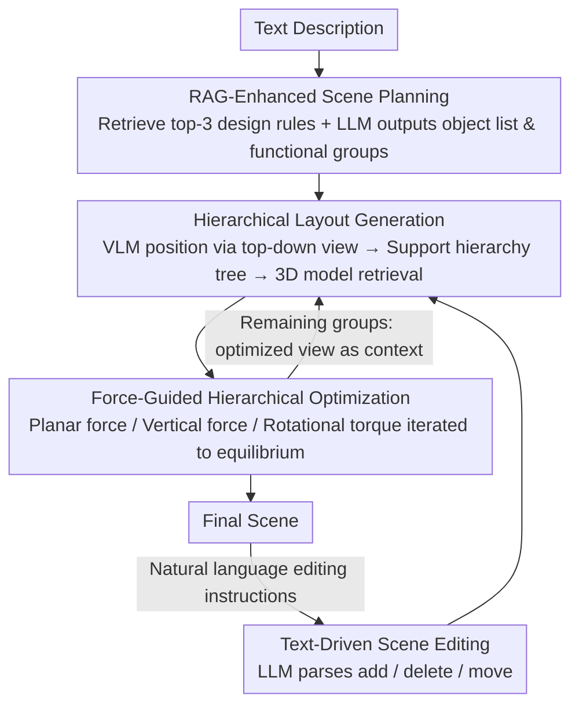

# HOG-Layout: Hierarchical 3D Scene Generation, Optimization and Editing via Vision-Language Models

**Conference**: CVPR 2026  
**arXiv**: [2604.10772](https://arxiv.org/abs/2604.10772)  
**Code**: None  
**Area**: Multimodal VLM  
**Keywords**: 3D scene generation, scene editing, vision-language models, hierarchical optimization, RAG

## TL;DR
Ours proposes HOG-Layout, a hierarchical 3D indoor scene generation, optimization, and editing framework based on VLMs and LLMs. By enhancing semantic consistency with RAG and ensuring physical plausibility through force-guided hierarchical optimization, it outperforms LayoutVLM on SceneEval with 4.5x faster speed.

## Background & Motivation

1. **Background**: 3D indoor scene generation serves interior design, VR, and embodied AI. Traditional methods learn layouts from data (graph networks, Transformers, diffusion models) or directly generate appearances (NeRF, Gaussian Splatting), but are limited by diversity or lack of interactivity. The emergence of LLMs/VLMs enables open-vocabulary scene generation.
2. **Limitations of Prior Work**: Direct layout generation by LLMs (e.g., LayoutGPT) can produce collisions and unreasonable placements; incorporating spatial constraints (e.g., Holodeck) improves plausibility but sacrifices diversity; VLM methods (e.g., LayoutVLM) improve semantic consistency but require predefined object sets and involve time-consuming gradient-based optimization (~321s/scene). All methods primary focus on generation from scratch, ignoring the more critical real-world need for scene editing.
3. **Key Challenge**: Generating semantically consistent and physically plausible scenes requires simultaneously satisfying soft constraints (semantic relationships) and hard constraints (collision-free, within boundaries). Existing methods struggle to balance both while maintaining computational efficiency.
4. **Goal**: Construct a hierarchical framework supporting both scene generation and editing that ensures semantic consistency and physical plausibility with low latency.
5. **Key Insight**: Organize objects into a hierarchical structure based on support relationships (floor → table → items on table). Optimize within each layer and between parent-child levels separately, decomposing complex 3D constraints into planar forces, vertical forces, and rotational torques.
6. **Core Idea**: A collaborative system of four modules: RAG-enhanced scene planning, VLM-generated initial layout, force-guided hierarchical optimization, and LLM-parsed editing instructions.

## Method

### Overall Architecture
HOG-Layout aims to generate a 3D indoor scene from a text description that is both semantically reasonable (e.g., sofa facing the TV, nightstand next to the bed) and physically plausible (no clipping, within bounds, items stable on surfaces), while supporting natural language editing. The pipeline follows a four-step process: planning, layout, optimization, and editing. First, an LLM, supplemented by retrieved design rules, decomposes the text into a structured object list and functional grouping. Second, a VLM observes a top-down view to arrange objects into a hierarchy based on support relationships and retrieves specific 3D models from a library. Third, the coarse layout is processed by a force-guided optimizer until stable. If the user is dissatisfied, the LLM parses editing instructions into add/delete/move operations, and the optimization is re-run. The key abstraction throughout is a hierarchy tree based on "who supports whom" (floor → table → cup on table), allowing constraints to be decomposed into intra-layer and inter-layer types. Layout generation and optimization are performed group-by-group, with the optimized view of each group serving as the context for the next.

### Key Designs

**1. RAG-Enhanced Scene Planning: Supplementing LLMs with Interior Design Knowledge**

A major issue with direct layout generation from text by LLMs is the lack of domain knowledge, such as standard distances between furniture or typical arrangements. Ours encodes layout constraints into rule templates using Qwen3-Embedding-4B into 1024-dimensional vectors stored in FAISS. For a given user description, the 3 most relevant rules are retrieved and fed to the LLM to output a structured scene plan: object IDs, names, dimensions, and functional groupings. Grouping ensures global consistency by generating areas (e.g., dining vs. viewing) sequentially.

**2. Hierarchical Layout Generation: VLM Positioning via Support Trees**

While planning provides the list, this step determines placement and orientation. The current scene is rendered as a top-down view with grid lines and coordinates. The VLM outputs XY coordinates and Z-axis rotation for each object; Z coordinates are calculated automatically based on the parent object and dimensions (e.g., top surface of a table). The core abstraction is the support hierarchy tree, where each object's "parent" is the supporting surface (floor, wall, ceiling, or another object). Real 3D models are then selected using a weighted score: 

$$Score_{Final}=w_1 S_{sbert}+w_2 S_{clip}+w_3 S_{size}$$

**3. Force-Guided Hierarchical Optimization: Layout as Physical Equilibrium**

To resolve collisions and boundary violations without the high cost of gradient-based optimization, HOG-Layout treats objects as rigid bodies subject to "forces." Constraints are decomposed into: planar forces $F_{i,\text{plane}} \in \mathbb{R}^2$ (collision, boundary, proximity), vertical forces $F_{i,\text{vert}} \in \mathbb{R}$ (inter-layer collisions), and rotational torques $\tau_i$. Positions are updated using explicit Euler integration until residual forces fall below a threshold $\epsilon_{\text{conv}}$.

$$F_{i,\text{plane}} = \sum (\text{collision} + \text{boundary} + \text{proximity} + \text{alignment}), \quad F_{i,\text{vert}}, \quad \tau_i$$

Deadlock detection and avoidance mechanisms are included (e.g., vertically lifting an object to resolve a horizontal jam), avoiding the combinatorial explosion of mixed-integer programming and enabling parallelization across same-layer constraints.

**4. Text-Driven Scene Editing: Iterative Design**

Unlike most works that only support generation from scratch, HOG-Layout allows users to refine scenes via instructions. The LLM maps commands to four operations: plan, add, delete, and move. After any modification, the force-guided optimization is re-run to ensure the updated scene remains physically plausible.

### Loss & Training
No training is required. GPT-4o is used as the backbone LLM/VLM. The capabilities are derived from prompt engineering and retrieval-based scoring.

## Key Experimental Results

### Main Results

| Method | COL_ob↓ | COL_sc↓ | SUP↑ | OAR↑ | SP↑ | Time↓ |
|------|---------|---------|------|------|-----|-------|
| LayoutGPT | 35.67% | 49% | 34.39% | 11.48% | 35.14 | **37s** |
| Holodeck | 12.24% | 63% | 34.72% | 38.27% | 55.45 | 272s |
| LayoutVLM | 29.44% | 55% | 77.54% | 61.99% | 65.54 | 322s |
| **Ours** | **5.28%** | **16%** | **81.17%** | **75.74%** | **69.69** | **70s** |

**Human Evaluation (7-point scale)**:

| Method | Plausibility | Semantic Alignment |
|------|--------|---------|
| LayoutGPT | 2.43 | 2.58 |
| Holodeck | 3.97 | 3.66 |
| LayoutVLM | 3.69 | 4.61 |
| **Ours** | **5.33** | **5.75** |

### Ablation Study

| Configuration | COL_ob↓ | SP↑ | Description |
|------|---------|-----|------|
| HOG-Layout Full | 5.28% | 69.69 | All modules |
| w/o RAG | Higher | ~65 | Reduced semantic constraints |
| w/o Hierarchical Opt | ~20% | ~60 | Significant increase in collisions |
| w/o Force Decomp | ~15% | ~64 | Poor vertical constraint handling |

### Key Findings
- **6x Lower Collision Rate**: Ours achieves an object collision rate of 5.28% compared to LayoutVLM's 29.44%.
- **4.5x Generation Speedup**: 70s vs. 322s for LayoutVLM, as force-guided optimization is significantly faster than gradient-based methods.
- **Human Eval Consistency**: GPT-5 scoring trends match human evaluations, with Ours leading in both categories.

## Highlights & Insights
- **Force-guided hierarchical optimization** is the core innovation, treating layout as an intuitive physical equilibrium problem.
- **Editing support** is a crucial step toward practical utility, moving beyond "one-shot" generation.
- **Grouping strategy** ensures spatial consistency by generating individual functional areas using previous layers as context.

## Limitations & Future Work
- Object retrieval is limited by existing 3D asset libraries (3D-FUTURE, Objaverse).
- Force-guided optimization can fall into local optima; deadlock avoidance is heuristic.
- Restricted to indoor scenes; outdoor or large-scale environments are not yet validated.
- Editing operations are basic (add/delete/move) and do not yet support complex semantic changes (e.g., "make the room cozier").

## Related Work & Insights
- **vs LayoutVLM**: LayoutVLM uses costly gradient optimization (322s) and requires predefined sets. Ours is 4.5x faster and supports open vocabularies.
- **vs Holodeck**: Holodeck uses DFS/MILP for hard constraints but ignores soft semantic constraints. Ours handles both concurrently.

## Rating
- Novelty: ⭐⭐⭐⭐ Innovative combination of hierarchical force optimization and RAG planning.
- Experimental Thoroughness: ⭐⭐⭐⭐ 100 SceneEval scenarios, human evaluation, and editing tests.
- Writing Quality: ⭐⭐⭐ Clear module descriptions, though some details require supplementary material.
- Value: ⭐⭐⭐⭐ A unified generation and editing framework with significant speed advantages.

<!-- RELATED:START -->

## Related Papers

- [\[CVPR 2026\] HiSpatial: Taming Hierarchical 3D Spatial Understanding in Vision-Language Models](hispatial_taming_hierarchical_3d_spatial_understanding_in_vision-language_models.md)
- [\[CVPR 2025\] LayoutVLM: Differentiable Optimization of 3D Layout via Vision-Language Models](../../CVPR2025/multimodal_vlm/layoutvlm_differentiable_optimization_of_3d_layout_via_vision-language_models.md)
- [\[CVPR 2026\] PointAlign: Feature-Level Alignment Regularization for 3D Vision-Language Models](pointalign_feature-level_alignment_regularization_for_3d_vision-language_models.md)
- [\[CVPR 2026\] Scene-VLM: Multimodal Video Scene Segmentation via Vision-Language Models](scene-vlm_multimodal_video_scene_segmentation_via_vision-language_models.md)
- [\[CVPR 2025\] Global-Local Tree Search in VLMs for 3D Indoor Scene Generation](../../CVPR2025/multimodal_vlm/global-local_tree_search_in_vlms_for_3d_indoor_scene_generation.md)

<!-- RELATED:END -->
