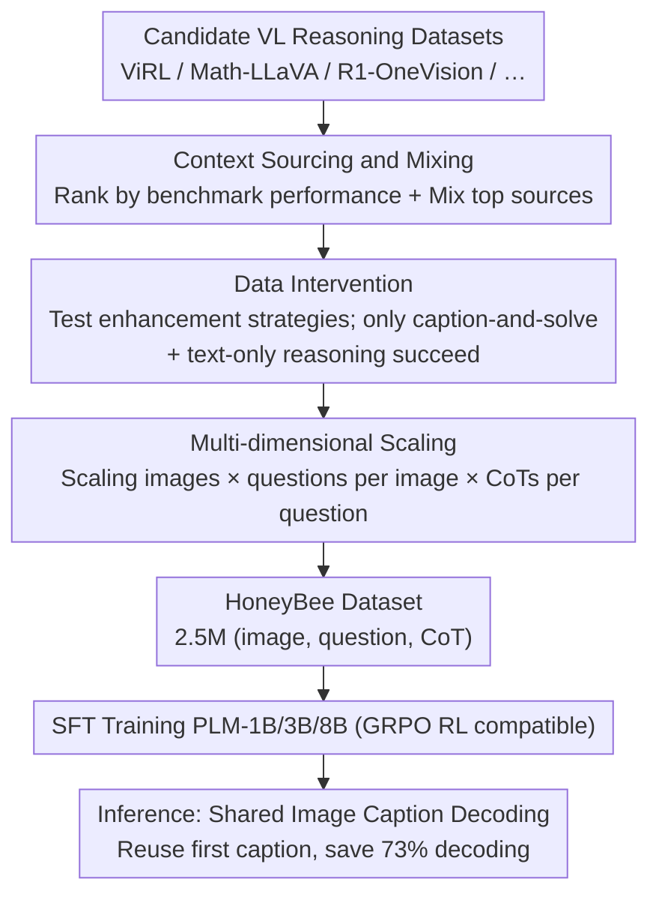

# HoneyBee: Data Recipes for Vision-Language Reasoners

**Conference**: CVPR 2026  
**arXiv**: [2510.12225](https://arxiv.org/abs/2510.12225)  
**Authors**: Hritik Bansal, Devendra Singh Sachan, Kai-Wei Chang, Aditya Grover, Gargi Ghosh, Wen-tau Yih, Ramakanth Pasunuru (Meta AI, UCLA)
**Code**: [facebookresearch/HoneyBee_VLM](https://github.com/facebookresearch/HoneyBee_VLM)  
**Data**: [facebook/HoneyBee](https://huggingface.co/datasets/facebook/HoneyBee)
**Area**: Multimodal VLM  
**Keywords**: VLM reasoning, data curation, chain-of-thought, test-time scaling, data recipes

## TL;DR

This work systematically investigates construction principles for vision-language (VL) reasoning datasets—covering context source strategies, data interventions (image description auxiliary signals + text-only reasoning), and multi-dimensional data scaling. Based on these findings, the authors construct the HoneyBee CoT reasoning dataset with 2.5 million samples. The trained 3B VLM outperforms SOTA by 7.8% on MathVerse, while a proposed test-time scaling strategy reduces decoding costs by 73%.

## Background & Motivation

Reasoning capabilities in VLMs have improved rapidly, yet the core principles for constructing high-quality vision-language reasoning training sets remain unclear. Existing research focuses primarily on model architectures and training strategies, leaving a significant gap in systematic studies of the data layer.

**Limitations of Prior Work**:
- **Lack of theoretical guidance for data construction**: The impact of different context sources (combinations of images and questions) on VLM reasoning has not been systematically explored.
- **Unclear effects of data interventions**: There is a lack of quantitative analysis on whether and how auxiliary signals, such as image descriptions and text-only reasoning data, should be integrated.
- **Ambiguous scaling dimensions**: The marginal gains from increasing the number of images, questions per image, and CoTs per question are not well-defined.
- **High inference costs**: Long CoT generation poses significant challenges for decoding efficiency that require urgent solutions.

**Goal**: To reveal key principles for VL reasoning data construction through controlled experiments and to build a high-quality, large-scale dataset accordingly.

## Method

### Overall Architecture

HoneyBee does not propose a new model architecture but systematically answers how training data for VL reasoning should be created. The authors decompose data construction into a sequential "data recipe" pipeline. Each step is determined via rigorous controlled experiments (fixed training settings, evaluated on both PLM-3B/8B scales across five benchmarks): first **comparing candidate datasets to select and mix the best context sources**, then **testing data interventions on the best data and retaining only the most effective ones**, followed by **simultaneous scaling across three dimensions** to produce large-scale data. The final product, the HoneyBee dataset, contains 2.5 million $(image, question, CoT)$ samples covering 350,000 unique questions. CoTs are generated by Llama-4 Scout using a "caption + reasoning process + `\boxed{}` final answer" format. A PLM-3B model SFT-tuned on this data surpasses its same-tier SOTA by 7.8% on MathVerse. For the **test-time**, a "shared image description" scaling strategy is proposed, saving 73% of decoding during multi-sample long CoT generation.

### Key Designs

**1. Context Sourcing and Mixing: Where image-question pairs come from determines reasoning quality**

Under identical training processes, different (image, question) sources lead to vastly different reasoning outcomes. The authors treat this as a quantifiable "ingredient selection" process. Contexts are drawn from existing VL reasoning datasets (ViRL, Math-LLaVA, R1-OneVision, ThinkLite-VL-Hard, LLaVA-CoT, MMK12). CoTs are generated using the same generator (Llama-4 Scout), and PLM-3B/8B models are SFT-tuned and ranked by average accuracy across five downstream benchmarks. Results indicate that source selection can lead to a gap of ~4% in average accuracy, with **ViRL ranking highest**. Furthermore, the authors verify **mixing** strategies (e.g., mixing top-2, top-4, or all sources while controlling total volume), confirming that mixing can outperform the single best source. This step forms the foundation for all subsequent interventions and scaling.

**2. Data Intervention: Testing enhancement strategies—only two are truly effective**

Once the best sources are identified, can they be further improved? The authors designed a suite of "perception" and "problem-solving" interventions, performing substitution, augmentation, and filtering experiments. Perception-side interventions include visual perturbations, rich-text images, perceptual redundancy filtering, shallow perception filtering, and **caption-and-solve**. Problem-solving interventions include **mixing text-only reasoning**, adding distractors, length filtering, and difficulty balancing. A key counter-intuitive finding is that **most seemingly logical interventions underperform the baseline**; only two are consistently effective: ① **caption-and-solve**—using the generator to produce an image description $I^{cap}_j$ and prepending it to the CoT ($C'_j=[I^{cap}_j; C_j]$), acting as a "visual anchor" for reasoning; ② **text-only reasoning mix-in**—integrating high-quality text-only CoT data (OpenThoughts3, relabeled by the same generator), which improves visual reasoning via cross-modal transfer and makes the model a more general reasoner (e.g., improving MATH500 from 39.2% to 59.7%).

**3. Multi-dimensional Scaling: Simultaneous scaling in three directions**

After determining the "what" and "how," where should the volume increase? The authors systematically measure marginal gains on the ViRL source across three axes: unique images, questions per image, and CoTs per $(image, question)$ pair. All three continuously improve performance without obvious saturation. Thus, HoneyBee scales all three: generating 16 CoTs per real pair and filtering by answer correctness (~400K samples); synthesizing 14 new questions per image (totaling 15 per image). Since new questions lack labels, 4 CoTs are generated for each, and majority voting (agreement $\ge 3$) is used as a proxy answer before filtering (~1M samples). Finally, following the caption-and-solve strategy, these are combined into 1.5M VL samples and merged with 1M text-only reasoning samples to form the 2.5M HoneyBee dataset.

**4. Test-time Scaling: Shared image caption decoding saves 73% cost**

Multi-sample generation for long CoT is expensive during inference. The authors noted that HoneyBee-trained CoTs naturally split into two segments: the image description ($I^{cap}$, understanding part) and the solver ($S$, reasoning part), where $C=[I^{cap}; S]$. Standard test-time scaling (e.g., self-consistency) samples $N > 1$ CoTs and performs majority voting, which naively regenerates the entire CoT (including the caption) each time. **Shared image caption decoding** generates the full $(I^{cap}_1, S_1)$ only once, then reuses $I^{cap}_1$ as fixed context and only resamples the solver $S_k$—logic dictates that the description of the same image need not be recomputed $N$ times. On MathVista with $N=64$, the naive approach generates 42.6K tokens, whereas shared decoding requires only 24.5K tokens with equivalent accuracy, reducing **tokens and FLOPs by 73%**.

## Key Experimental Results

### Evaluation Setup
- **Base Models**: Perception-LM (PLM), ranging from 1B / 3B / 8B parameters.
- **Benchmarks**: 10 VL reasoning datasets, including MathVerse, MathVista, OlympiadBench, GeoQA, MMMU, etc.
- **Baselines**: ViRL-tuned PLM (base), OpenThoughts3-tuned models, and same-sized SOTA models.

### Table 1: Data Intervention Ablation (PLM-3B, Accuracy %)

| Data Configuration | MathVerse | MathVista | OlympiadBench | Average |
|---|---|---|---|---|
| Base (ViRL only) | 41.2 | 52.3 | 18.7 | 37.4 |
| + OT3 Question Mix-in | 48.6 | 56.1 | 22.4 | 42.4 |
| + Image Caption Auxiliary | 54.3 | 59.8 | 25.1 | 46.4 |
| + Text-Only Reasoning Mix-in | 57.1 | 61.5 | 27.3 | 48.6 |
| + Multi-CoT Scaling | 60.8 | 63.2 | 29.6 | 51.2 |
| HoneyBee (All Strategies) | **66.0** | **65.7** | **32.4** | **54.7** |

Each intervention adds gain, with the full combination improving MathVerse by **24.8%** (absolute).

### Table 2: Comparison with SOTA Models (Accuracy %)

| Model | Params | MathVerse | MathVista | MMMU | GeoQA | Average |
|---|---|---|---|---|---|---|
| InternVL2-2B | 2B | 28.4 | 46.3 | 36.1 | 55.2 | 41.5 |
| Qwen2-VL-2B | 2B | 31.2 | 47.8 | 37.4 | 56.8 | 43.3 |
| PLM-1B (Base) | 1B | 25.7 | 42.1 | 33.2 | 50.4 | 37.9 |
| PLM-1B + HoneyBee | 1B | **45.3** | **55.6** | **41.8** | **62.1** | **51.2** |
| Qwen2-VL-7B | 7B | 52.1 | 58.4 | 46.3 | 65.7 | 55.6 |
| InternVL2-8B | 8B | 54.3 | 60.2 | 48.1 | 67.3 | 57.5 |
| PLM-3B (Base) | 3B | 41.2 | 52.3 | 39.6 | 58.3 | 47.9 |
| PLM-3B + HoneyBee | 3B | **66.0** | **65.7** | **49.2** | **71.4** | **63.1** |
| PLM-8B + HoneyBee | 8B | **72.1** | **70.3** | **54.7** | **76.2** | **68.3** |

PLM-3B + HoneyBee outperforms its same-parameter SOTA on MathVerse by **7.8%**, and PLM-1B + HoneyBee even surpasses larger models like InternVL2-2B and Qwen2-VL-2B.

## Highlights & Insights

- **Data Engineering > Model Engineering**: A 3B model outperforms 7-8B SOTAs via data strategies, proving that data quality and construction strategies are more critical than parameter count.
- **Image Description as a "Cognitive Bridge"**: Prepending captions to CoT forces the model to establish visual understanding before reasoning. This simple intervention provides significant consistent gains, highlighting the role of visual grounding in reasoning.
- **Orthogonal Multi-dimensional Scaling**: Gains from scaling images, questions, and CoTs are additive, with no clear diminishing returns, providing a clear path for building large-scale datasets.
- **Efficient Test-time Scaling**: Shared image caption decoding (reusing the first generated caption for subsequent samples) reduces decoding costs by 73% while maintaining accuracy, offering high practical utility.
- **Cross-modal Transfer from Text-Only Reasoning**: The inclusion of non-visual text reasoning data improves visual reasoning, suggesting that reasoning capability is largely modality-agnostic.

## Limitations & Future Work

- **Dataset License Restrictions**: HoneyBee uses CC-BY-NC and the Llama 4 License, restricting commercial use and requiring the "Llama" prefix in model naming.
- **Reliance on Strong LLMs for CoT**: CoTs are generated by Llama-4 Scout; quality is capped by the teacher model, potentially inheriting reasoning errors.
- **Benchmark Coverage Bias**: The 10 benchmarks are skewed towards math and science, with less coverage for common sense or spatial reasoning.
- **Model Specificity**: Experiments were primarily validated on the Perception-LM series; generalizability to other architectures requires further confirmation.
- **Scaling Costs**: Generating 2.5 million CoTs requires substantial compute for Llama-4 Scout inference, making reproduction expensive.
- **Trained Model Checkpoints**: Only the dataset and evaluation code are released; the trained VLM checkpoints are not.

## Related Work & Insights

- **VL Reasoning Datasets**: ViRL (39K visual reasoning), OpenThoughts3 (text reasoning), ShareGPT4V (caption data) $\rightarrow$ HoneyBee integrates and expands these, being the first to systematically study mixing.
- **CoT Distillation**: Using strong models (GPT-4, Llama-4) to train weaker ones, a technique used in NovaStar and Vision-G1 $\rightarrow$ HoneyBee further explores CoT diversity and caption-auxiliary effects.
- **Test-time Scaling (TTS)**: Best-of-N, majority voting, Process Reward Models (PRMs) $\rightarrow$ HoneyBee introduces early-exit strategies to reduce TTS costs.
- **Data Recipe Research**: Scaling Data-Constrained LLMs (text domain), DataComp (multimodal pre-training) $\rightarrow$ HoneyBee extends data recipe research to the VL reasoning SFT stage.

## Rating

- Novelty: ⭐⭐⭐⭐ — First systematic study of VL reasoning data principles with a clear three-dimensional analysis framework.
- Experimental Thoroughness: ⭐⭐⭐⭐⭐ — Coverage of 10 benchmarks, 3 model sizes, and extensive controlled ablations.
- Writing Quality: ⭐⭐⭐⭐ — Clear structure, insightful synthesis, and 32 pages of detailed content.
- Value: ⭐⭐⭐⭐⭐ — Significant contributions to data methodology and a highly practical 2.5M open-source dataset.

<!-- RELATED:START -->

## Related Papers

- [\[CVPR 2026\] MiniCPM-V 4.5: Cooking Efficient MLLMs via Architecture, Data and Training Recipes](minicpm-v_45_cooking_efficient_mllms_via_architecture_data_and_training_recipe.md)
- [\[CVPR 2026\] Molmo2: Open Weights and Data for Vision-Language Models with Video Understanding and Grounding](molmo2_open_weights_and_data_for_vision-language_models_with_video_understanding.md)
- [\[CVPR 2026\] Decouple to Generalize: Context-First Self-Evolving Learning for Data-Scarce Vision-Language Reasoning](decouple_to_generalize_context-first_self-evolving_learning_for_data-scarce_visi.md)
- [\[CVPR 2026\] Improving Calibration in Test-Time Prompt Tuning for Vision-Language Models via Data-Free Flatness-Aware Prompt Pretraining](improving_calibration_in_test-time_prompt_tuning_for_vision-language_models_via_.md)
- [\[CVPR 2026\] EMMA: Extracting Multiple physical parameters from Multimodal Data](emma_extracting_multiple_physical_parameters_from_multimodal_data.md)

<!-- RELATED:END -->
