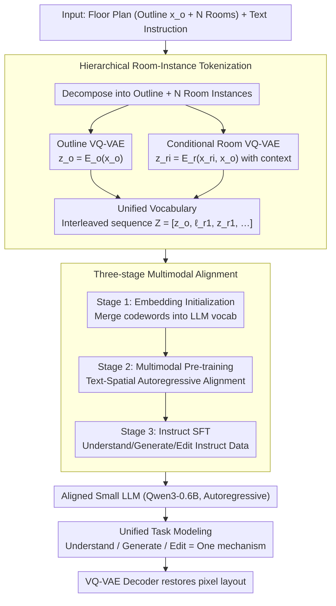

# HouseMind: Tokenization Allows MLLMs to Understand, Generate and Edit Architectural Floor Plans

**Conference**: CVPR 2026  
**arXiv**: [2603.11640](https://arxiv.org/abs/2603.11640)  
**Code**: [https://housemind.github.io/](https://housemind.github.io/)  
**Area**: Multimodal VLM  
**Keywords**: Architectural Floor Plans, VQ-VAE, Multimodal LLM, Spatial Reasoning, Hierarchical Tokens

## TL;DR
The paper proposes HouseMind, which discretizes architectural floor plan outlines and room instances into spatial tokens using a hierarchical VQ-VAE. These are unified with text tokens in a single vocabulary, enabling a small-scale LLM (0.6B) to achieve three major tasks—understanding, generation, and editing—within a single autoregressive framework. It significantly outperforms methods based on diffusion models and large-scale VLMs.

## Background & Motivation

**Background**: Architectural floor plan design requires joint reasoning over geometry, semantics, and spatial hierarchy, making it one of the most cognitively challenging tasks in the AI design field. Existing methods include GAN-based (e.g., HouseGAN), Graph-based (e.g., Graph2Plan), and Diffusion-based (e.g., ChatHouseDiffusion) approaches.

**Limitations of Prior Work**: (1) Most methods treat layout generation as a purely visual process, lacking explicit reasoning at the room-instance level, which leads to local plausibility but global inconsistency; (2) Large-scale VLM methods act as black-box generators with poor spatial controllability; (3) Existing frameworks struggle to unify understanding, generation, and editing within a single architecture; (4) High computational costs make local deployment difficult.

**Key Challenge**: A fundamental representation gap exists between continuous geometric layouts and the discrete token sequence modeling of LLMs—specifically, how to effectively encode spatial geometric information into discrete symbols understood by LLMs.

**Goal**: To build an efficient, locally deployable, and unified multimodal model that achieves joint reasoning for floor plan understanding, generation, and editing within a single framework.

**Key Insight**: Discretize geometric information into tokens using a hierarchical VQ-VAE, allowing the LLM to process spatial and linguistic information using the same sequence modeling mechanism.

**Core Idea**: Bridge continuous geometric layouts and discrete language modeling through room-level tokenization to achieve unified spatial reasoning.

## Method

### Overall Architecture
The challenge of floor plans lies in the fact that they are essentially continuous geometric objects, while LLMs process discrete token sequences. HouseMind bridges this representation gap by first using VQ-VAE to decompose the floor plan into an outline and individual rooms, discretizing them into spatial tokens. These spatial tokens and text tokens are then placed into a unified vocabulary, allowing a small LLM to process both geometry and language through pure autoregressive modeling. The entire pipeline results in an interleaved sequence $Z = [\boldsymbol{z}_o, \ell_{r_1}, \boldsymbol{z}_{r_1}, \ldots, \ell_{r_N}, \boldsymbol{z}_{r_N}]$, where the sequence begins with outline tokens, followed by room pairs consisting of a "semantic label token $\ell_{r_i}$ + geometric token $\boldsymbol{z}_{r_i}$". Once the floor plan is converted into such a sequence, understanding, generation, and editing are all reduced to the same core mechanism of reading and writing tokens.

The framework consists of three parts: hierarchical tokenization to obtain a unified vocabulary and interleaved sequences, three-step multimodal alignment training to pull spatial and text tokens into the same representation space, and finally, unified execution of tasks on the aligned autoregressive LLM.

### Key Designs

**1. Hierarchical Room-Instance Tokenization: Decomposing the full image into room-level discretization**

While traditional methods encode the entire floor plan as a single image, HouseMind uses hierarchical decomposition. It splits the floor plan into an outline $x_o$ and $N$ room instances $\{x_{r_i}\}_{i=1}^N$, then discretizes them via two VQ-VAEs. The outline VQ-VAE encodes the binary mask into $\boldsymbol{z}_o = E_o(x_o)$. Crucially, the room VQ-VAE is **conditional**—it encodes each room while being fed the outline: $\boldsymbol{z}_{r_i} = E_r(x_{r_i}, x_o)$. Both are mapped to codebooks $\mathcal{Z}_o$ and $\mathcal{Z}_r$ via nearest-neighbor quantization. This conditional term ensures that rooms are not encoded in isolation but with spatial context (position within the house and adjacency), providing the foundation for global consistency.

**2. Three-stage Multimodal Alignment Training: Aligning spatial and language tokens**

Because spatial and language tokens have vastly different distributions, HouseMind uses a three-step progression for alignment. Stage 1 (Embedding Initialization) assigns trainable token embeddings to each codeword in the VQ-VAE codebook and incorporates them into the LLM's vocabulary. Stage 2 (Multimodal Pre-training) performs autoregressive modeling on large-scale paired "text + spatial token" data to learn bidirectional correspondences. Stage 3 (Instruction Fine-Tuning/SFT) finalizes the model on understanding, generation, and editing instructions. This progressive strategy ensures stable optimization by aligning the vocabulary first and then teaching high-level tasks.

**3. Unified Task Modeling: Understanding, generation, and editing as the same conditional generation**

With a unified token sequence, the three tasks share the same autoregressive framework. The understanding task takes sequence $Z$ and a prompt to output descriptions or bubble diagrams. The generation task takes outline $\boldsymbol{z}_o$ and text $s$ to generate the layout token-by-token:

$$p(Z \mid \boldsymbol{z}_o, s) = \prod_t p(Z_t \mid Z_{<t}, \boldsymbol{z}_o, s)$$

The editing task takes the source layout $Z^{\mathrm{src}}$ and an instruction $s$ to generate the target layout $Z^{\mathrm{tgt}}$. All tasks share weights and mechanisms, reducing redundancy and allowing capabilities to mutually reinforce one another.

### Loss & Training
The VQ-VAE is trained using standard reconstruction loss + commitment loss + codebook loss. The LLM stage utilizes autoregressive cross-entropy loss. The system is built on Qwen3-0.6B and can perform inference on a single RTX 3090.

## Key Experimental Results

### Main Results (Generation Task)

| Method | Micro IoU | FID ↓ | Node F1 | Edge Overlap | Time (s) |
|------|-----------|-------|---------|-------------|---------|
| Tell2Design | 0.390 | 30.5 | 0.808 | 0.197 | ~15 |
| ChatHouseDiffusion | 0.589 | 11.3 | 0.985 | 0.710 | ~30 |
| FloorPlanLLaMA | 0.607 | 49.3 | 0.922 | 0.574 | ~1 |
| **Ours (HouseMind-G)** | **0.709** | **1.91** | **0.994** | **0.880** | **~2** |

### Ablation Study (Understanding Task)

| Method | RMR | LocAcc | AreaDiff↓ | AdjAcc | RelAcc |
|------|-----|--------|-----------|--------|--------|
| LLaVA-v1.6-7B | 0.616 | 0.225 | 3.649 | 0.134 | 0.056 |
| Qwen3-VL-8B | 0.698 | 0.347 | 5.837 | 0.382 | 0.128 |
| InternVL3.5-8B | 0.847 | 0.546 | 12.234 | 0.469 | 0.157 |
| **Ours (HouseMind-U)** | **0.998** | **0.969** | **0.549** | **0.990** | **0.808** |

### Key Findings
- HouseMind outperforms existing methods across all three tasks with high inference speed (2-3s per sample).
- FID dropped from 11.3-49.3 in competing methods to 1.91, indicating generation quality close to the real distribution.
- In the understanding task, AdjAcc improved from 0.469 to 0.990, and area error dropped to 0.549 $m^2$.
- Ablations show that every stage of the three-stage training contributes significantly; removing Stage 1 leads to instability, while removing Stage 2 leads to a lack of semantic correspondence.

## Highlights & Insights
- Room-level tokenization is the core innovation—instead of treating the floor plan as a monolithic image, decomposing it into instances allows the LLM to perform structured reasoning. This paradigm can be transferred to other structured design tasks like circuit design or UI layouts.
- The fact that a 0.6B parameter model outperforms 7-8B VLMs suggests that correct representation is more critical than model scale for specialized design tasks.
- In editing tasks, Node F1 reached 0.998, demonstrating that the model can precisely modify specific rooms without affecting other areas, achieving true local controllability.

## Limitations & Future Work
- Editing capabilities are limited to simple room additions/deletions and do not yet support complex topological changes.
- Details such as windows, doors, and furniture are not modeled, limiting application in detailed interior design.
- The model is not yet aligned with human design preferences or aesthetic constraints, so results may not always meet professional functional standards.
- Validation was only performed on the RPLAN dataset; more diverse styles (e.g., irregular shapes, multi-story buildings) remain to be explored.

## Related Work & Insights
- **vs MaskPLAN**: MaskPLAN also uses VQ-VAE for geometric attributes but relies on masked transformer autoencoding; this work introduces LLMs for unified multi-task reasoning.
- **vs ChatHouseDiffusion**: Diffusion models perform well on simple layouts but struggle with complex configurations; HouseMind maintains global consistency through discrete reasoning.
- **vs Tell2Design**: While Tell2Design established a text-to-floorplan benchmark, its generalization is limited; HouseMind's tokenization paradigm is more scalable.

## Rating
- Novelty: ⭐⭐⭐⭐ Room-level tokenization + unified LLM modeling is highly innovative.
- Experimental Thoroughness: ⭐⭐⭐⭐ Comprehensive evaluation across three tasks with sufficient comparisons.
- Writing Quality: ⭐⭐⭐⭐ Method is described clearly, though the problem formulation is quite formal.
- Value: ⭐⭐⭐⭐ Provides a practical, unified solution for AI-assisted architectural design.

<!-- RELATED:START -->

## Related Papers

- [\[CVPR 2026\] A More Word-like Image Tokenization for MLLMs](a_more_word-like_image_tokenization_for_mllms.md)
- [\[CVPR 2026\] Generate, Analyze, and Refine: Training-Free Sound Source Localization via MLLM Meta-Reasoning](generate_analyze_and_refine_training-free_sound_source_localization_via_mllm_met.md)
- [\[CVPR 2026\] Token Warping Helps MLLMs Look from Nearby Viewpoints](token_warping_helps_mllms_look_from_nearby_viewpoints.md)
- [\[CVPR 2026\] EgoMind: Activating Spatial Cognition through Linguistic Reasoning in MLLMs](egomind_activating_spatial_cognition_through_linguistic_reasoning_in_mllms.md)
- [\[CVPR 2026\] ENC-Bench: A Benchmark for Evaluating MLLMs in Electronic Navigational Chart Understanding](enc-bench_a_benchmark_for_evaluating_multimodal_large_language_models_in_electro.md)

<!-- RELATED:END -->
