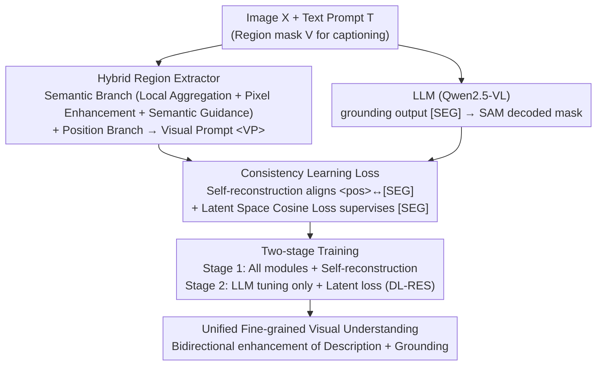

# Hugging Visual Prompt and Segmentation Tokens: Consistency Learning for Fine-Grained Visual Understanding in MLLMs

**Conference**: CVPR 2026  
**Paper**: [CVF Open Access](https://openaccess.thecvf.com/content/CVPR2026/html/Yang_Hugging_Visual_Prompt_and_Segmentation_Tokens_Consistency_Learning_for_Fine_Grained_CVPR_2026_paper.html)  
**Code**: To be confirmed  
**Area**: Multimodal VLM / Fine-Grained Visual Understanding / Region-level Captioning / Pixel-level Grounding  
**Keywords**: MLLM, Consistency Learning, Visual Prompt Embedding, Segmentation Tokens, Region Description, Referring Expression Segmentation  

## TL;DR
The authors propose FCLM, identifying that the visual prompt embedding `<VP>` in region captioning and the segmentation token `[SEG]` in grounding actually point to the same region but represent opposite input/output directions. By utilizing a self-reconstruction loss and a latent space cosine consistency loss to align the two, combined with a progressive hybrid region extractor and a two-stage training strategy, a single MLLM achieves SOTA performance across seven fine-grained visual tasks.

## Background & Motivation

**Background**: MLLMs (e.g., Qwen2.5-VL, InternVL) excel at image-level understanding. However, fine-grained visual understanding primarily revolves around two sub-tasks: **captioning** (describing details of a specific region/image) and **grounding** (locating/segmenting targets based on references). A representative approach for the former is using an extractor to pull a visual prompt embedding `<VP>` from an input mask to feed the LLM; for the latter, the LLM predicts a segmentation token `[SEG]`, which is then decoded into a mask by SAM.

**Limitations of Prior Work**: ① Most methods are **task-specific** and optimized independently; ② A few unified methods support both tasks but merely "stack task data and concatenate pipelines," **failing to exploit the underlying correlation between the two tasks**. Additionally, visual prompts for region-level captioning have flaws: some fuse visual prompts with image embeddings (destroying independence), while others crop local regions to enlarge details (losing global context).

**Key Challenge**: Captioning and grounding seem opposite but possess natural symmetry—the **input mask** of captioning corresponds to the **output segmentation** of grounding, and the **text output** of captioning corresponds to the **referring input** of grounding. The authors visualized the heatmaps of `<VP>` (extracted from input masks) and `[SEG]` (decoded into output masks) and found their spatial-semantic distributions to be highly similar—a strong correlation that has been consistently ignored.

**Goal**: (i) Explicitly model and align `<VP>` and `[SEG]` to let captioning and grounding mutually reinforce each other; (ii) Create higher-quality visual prompt embeddings containing both pixel details and global semantics; (iii) Propose a new task that evaluates fine-grained understanding by "precisely locating targets based on detailed descriptions."

**Core Idea**: Instead of treating the two tasks as independent goals, `<VP>` is treated as a "pseudo-label" for `[SEG]` in the latent space. A consistency loss is used to "hug" these bidirectional region representations together, achieving mutual enhancement of description and localization.

## Method

### Overall Architecture
FCLM is built on Qwen2.5-VL, comprising an LLM backbone, a vision encoder, a Hybrid Region Extractor, and a mask decoder. For captioning: it takes an image and a region mask as input; the Hybrid Region Extractor produces a visual prompt embedding `<VP>` (including a semantic mask token `<mask>` and a position token `<pos>`) fed into the LLM to generate descriptions. For grounding: the LLM outputs a segmentation token `[SEG]`, which is decoded into a mask via the SAM mask decoder. The two tasks are coupled through consistency learning losses: first, a self-reconstruction loss ensures `<pos>` can be decoded back into the input mask, aligning it with `[SEG]`; then, a latent space cosine consistency loss pulls `[SEG]` directly towards `<pos>`. The model undergoes two-stage training, transitioning from "establishing general capabilities" to "fine-grained alignment."

### Key Designs

**1. Hybrid Region Extractor: Dual branches for "detailed and comprehensive" visual prompt embeddings**

Previous visual prompts either used CLIP encoding (strong semantic alignment but low resolution, weak for small objects) or cropped local areas (losing global context). This design follows the Osprey framework but splits it into a **semantic branch and a position branch**. The semantic branch connects to the SAM encoder (large-scale pre-training, precise pixel-level boundaries) and employs **three-step progressive generation**: ① Local Aggregation—encoding the cropped region $X_{crop}$ followed by foreground selection and mask pooling to get the initial mask token $T_{mask}=\mathrm{MP}(\mathrm{Proj}(\mathrm{Select}(F_{sam}(X_{crop}))))$; ② Pixel Enhancement—using $T_{mask}$ as a query and all foreground pixel features as key/value for cross-attention to refine details; ③ Semantic Guidance—using the region center $P_{center}$ as a reference point to perform deformable sampling of global semantics from vision encoder features, integrated via deformable attention + MLP. The position branch uses an MLP to encode the mask shape, center coordinates, and dimensions to obtain the position token `<pos>`. The resulting `<VP>` retains pixel details while carrying global semantics.

**2. Self-reconstruction Loss: Enabling visual prompts to "draw back" their own masks and align with [SEG]**

To align `<VP>` and `[SEG]`, it must first be verified that `<VP>` actually carries region shape information. The authors require the **mask decoder to decode not only the `[SEG]` from grounding but also the `<pos>` token from captioning**, applying a segmentation loss between the decoded mask and the input visual prompt mask: $L_{self}=L_{seg}(F_{dec}(T_{pos}),\,M)$ (Eq. 4). This provides three benefits: `<pos>` is forced to focus accurately on the target region, training converges faster, and since `<pos>` and `[SEG]` share the same decoder to fit the same region, they are naturally pulled together in the latent space.

**3. Latent Space Cosine Consistency Loss: Pulling [SEG] directly towards the <pos> "latent pseudo-label"**

The core difficulty of grounding is precise localization, but previous methods relied solely on segmentation loss (acting on the decoded mask), lacking explicit optimization for "language-vision alignment." Following Design 2, `<pos>` is already aligned with `[SEG]` in the latent space, so `<pos>` can be treated as a **latent pseudo-label** for each region. The authors introduce a cosine similarity latent loss $L_{latent}=1-\frac{T_{seg}\cdot T_{pos}}{\|T_{seg}\|_2\|T_{pos}\|_2}$ (Eq. 5) to align `[SEG]` and `<pos>` of the same region. Cosine similarity is chosen over KL/MSE because KL/MSE values can be large and cause training instability, while cosine constrains similarity to $[0,1]$, providing more stable supervision.

### A Complete Example: How the DL-RES task connects both directions
The authors propose a new task **DL-RES (detailed localized referring expression segmentation)**: given a **detailed region description**, the model must precisely locate and segment the target—effectively the inverse of captioning. This is constructed by **reversing** "region → detailed description" samples from the Describe Anything dataset, rewriting detailed descriptions into referring expressions. This provides paired tokens for both captioning (`<pos>`) and grounding (`[SEG]`) for the same region, to which the latent consistency loss is applied.

### Loss & Training
The total end-to-end loss is $L_{total}=L_{ce}+L_{seg}+L_{consist}$, where $L_{seg}=\lambda_{dice}L_{dice}+\lambda_{bce}L_{bce}$ (with $\lambda_{dice}=1,\lambda_{bce}=2$, following LISA), and $L_{consist}$ includes self-reconstruction and latent losses. Two stages: **Stage 1** trains all modules with self-reconstruction loss to align `<pos>` and `[SEG]`, establishing general captioning/grounding capabilities; **Stage 2** freezes the extractor and decoder, **fine-tuning only the LLM** with the latent cosine loss for DL-RES training. 

## Key Experimental Results

### Main Results
Evaluated across 7 fine-grained visual tasks (Grounding: RES, MUSE multi-target reasoning segmentation, DL-RES; Captioning: ROC referring object classification, DLC detailed region captioning; Joint: GCG grounded conversation generation).

| Task | Metric | Previous Best | FCLM-3B | FCLM-7B |
|------|------|---------|---------|---------|
| RES (RefCOCO series, gIoU) | gIoU | UniPixel-7B 80.8 | 81.5 | **82.6** |
| DL-RES (Ours) | gIoU / cIoU | UniPixel-7B 58.5 / 72.2 | 66.1 / 80.3 | **68.0 / 82.1** |
| ROC (LVIS, SS/sIoU) | SS / sIoU | DAM-3B 89.0 / 77.7 | 89.3 / 78.9 | **90.3 / 80.1** |
| DLC-Bench | Avg | DAM-3B 67.3 | **67.8** | — |
| GCG (Val, CIDEr/mIoU) | C / mIoU | GLaMM-4B 47.2 / 66.3 | **56.2 / 67.6** | — |

The highlight is that **FCLM-3B generally matches or exceeds 7B/13B specialized models**: on DL-RES, the 3B version (66.1/80.3) significantly outperforms UniPixel-7B (58.5/72.2).

### Ablation Study

| Configuration | Key Metric | Description |
|------|---------|------|
| Vision encoder features only (baseline) | ROC 87.1/75.7 | No three-step extractor |
| + Local Aggregation + Pixel Enhancement | 88.7/77.1 | Progressively adding details |
| + All 3 steps | **89.3/78.9** | Full semantic branch |
| Self-reconstruction: mask token only | 87.6/76.9 | — |
| Self-reconstruction: position token only | **89.3/78.9** | `<pos>` alone is optimal |
| Latent Loss: KL / MSE / Cosine | 67.4 / 67.1 / **67.8** (DLC Avg) | Cosine is most stable |

### Key Findings
- **The three steps of the Hybrid Region Extractor are indispensable**: Local aggregation, pixel enhancement, and semantic guidance each contribute to performance gains.
- **Position tokens are better suited for self-reconstruction than semantic mask tokens**: `<pos>` provides explicit spatial priors, and using it alone for self-reconstruction outperforms using both tokens.
- **Stage 2 LLM-only tuning is optimal**: Stage 1 already learns feature token extraction/decoding; modifying the extractor/decoder in Stage 2 introduces unstable pseudo-labels.

## Highlights & Insights
- **"Input mask prompts" and "output mask [SEG]" are essentially homologous**—this observation is elegant: unifying two seemingly opposite tasks through the lens of "same region, opposite directions" is the most significant "aha" moment of the paper.
- **Using one task's representation as a latent pseudo-label for another**: Since `<pos>` naturally aligns with `[SEG]` after self-reconstruction, it provides latent space supervision for grounding without requiring extra annotation.
- **3B beating 7B/13B**: Cross-task consistency brings more than just parallel multi-tasking; it offers genuine capability complementarity, which is highly attractive for deployment in terms of parameter efficiency.

## Limitations & Future Work
- The method relies on a heavy pixel pipeline consisting of a SAM encoder + mask decoder; the overall structure is complex with many components.
- DL-RES data is constructed by "reversing" descriptions from Describe Anything; description quality and the naturalness of the rewrite affect supervision quality.
- Currently covers only the image domain; the authors acknowledge that extending it to video temporal sequences and more flexible spatial representations like boxes/points remains for future work.

## Related Work & Insights
- **vs LISA / GLaMM**: These use `[SEG]` + SAM for reasoning segmentation/region captioning but tasks are mostly unidirectional; FCLM "hugs" both directions together using consistency loss, improving CIDEr from 47.2 to 56.2 on GCG.
- **vs UniPixel (Unified Methods)**: UniPixel relies on expanding task data and pipelines to unify tasks; FCLM delves into the semantic correlation of representation tokens, with its 3B model surpassing UniPixel-7B, representing an "alignment-driven" rather than "data-driven" approach.

## Rating
- Novelty: ⭐⭐⭐⭐⭐ Observation of "visual prompt ↔ segmentation token" homology + self-consistent pseudo-label learning is novel.
- Experimental Thoroughness: ⭐⭐⭐⭐⭐ Comprehensive 7-task evaluation + detailed ablations, plus the proposal of the DL-RES task.
- Writing Quality: ⭐⭐⭐⭐ Clear storyline and good illustrations, though the high number of terms (VP/SEG/pos/mask token) requires careful reading.
- Value: ⭐⭐⭐⭐⭐ High deployment value due to 3B vs 7B/13B parameter efficiency and bidirectional enhancement.

<!-- RELATED:START -->

## Related Papers

- [\[CVPR 2026\] MA-Bench: Towards Fine-grained Micro-Action Understanding](ma-bench_towards_fine-grained_micro-action_understanding.md)
- [\[CVPR 2026\] See What I Mean: Aligning Vision and Language Representations for Video Fine-grained Object Understanding](see_what_i_mean_aligning_vision_and_language_representations_for_video_fine-grai.md)
- [\[CVPR 2026\] Chart-FR1: Visual Focus-Driven Fine-Grained Reasoning on Dense Charts](chart-fr1_visual_focus-driven_fine-grained_reasoning_on_dense_charts.md)
- [\[CVPR 2026\] ReasonMap: Towards Fine-Grained Visual Reasoning from Transit Maps](reasonmap_towards_fine-grained_visual_reasoning_from_transit_maps.md)
- [\[CVPR 2026\] CropVLM: Learning to Zoom for Fine-Grained Vision-Language Perception](cropvlm_learning_to_zoom_for_fine_grained_vision_language_perception.md)

<!-- RELATED:END -->
