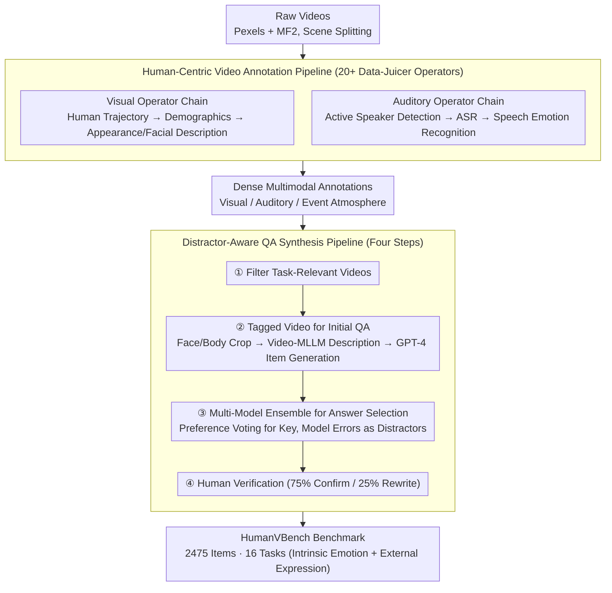

# HumanVBench: Probing Human-Centric Video Understanding in MLLMs with Automatically Synthesized Benchmarks

**Conference**: CVPR 2026  
**arXiv**: [2412.17574](https://arxiv.org/abs/2412.17574)  
**Code**: [https://github.com/datajuicer/data-juicer/tree/HumanVBench](https://github.com/datajuicer/data-juicer/tree/HumanVBench)  
**Area**: Multimodal VLM / Video Understanding  
**Keywords**: Video Benchmarking, Human-Centric Video Understanding, Multi-modal Large Language Models, Emotion Perception, Audio-Visual Alignment

## TL;DR

Ours proposes HumanVBench, a human-centric video understanding benchmark comprising 16 fine-grained tasks, supported by two automated pipelines (video annotation + distractor-aware QA synthesis). Evaluation of 30 mainstream video MLLMs reveals critical deficiencies in subtle emotion perception and audio-visual alignment.

## Background & Motivation

Multimodal Large Language Models (MLLMs) have evolved from processing text to images and videos. Video-oriented MLLMs are gaining attention for their potential to simulate human visual perception. However, whether these models truly achieve human-like understanding—especially in complex human-centric scenarios—remains an open question.

**Limitations of Prior Work**: Existing MLLM benchmarks face three core pain points: (1) Mainstream benchmarks (e.g., Video-MME) focus on general video understanding, lacking structured, fine-grained evaluation of human-centric perception; (2) Emotion understanding datasets (e.g., VEATIC) rely on discrete classification and fixed categories, missing multi-dimensional tasks like emotional dynamics and cross-person intensity comparison; (3) Synchronization between audio and visual cues—which humans detect effortlessly—is frequently overlooked.

These foundational perceptual skills (emotion, behavior, identity, audio-visual alignment) are prerequisites for high-level human-related reasoning (narrative reasoning, intent inference, social intelligence). Yet, existing benchmarks either conflate perception with high-order reasoning or rely on heavy manual annotation, making them difficult to scale.

**Core Idea**: To construct a high-quality, scalable human-centric video benchmark with minimal manual labor by designing two automated pipelines: a video annotation pipeline utilizing 20+ SOTA data processing operators for dense multimodal labels, and a QA synthesis pipeline that generates semantically deceptive distractors through multi-model ensembles and common model errors.

## Method

### Overall Architecture

HumanVBench is constructed in three steps: (1) Collect videos containing people from Pexels and MF2 and perform scene splitting; (2) Extract multimodal annotations for visual, auditory, and overall event atmosphere through the human-centric video annotation pipeline; (3) Generate multiple-choice questions via the distractor-aware QA synthesis pipeline, followed by manual verification and post-processing for answer leakage. The final output consists of 2475 question instances covering 16 tasks. Under this framework, the two pipelines automate "annotation" and "item generation," with humans providing quality control only at the end.

### Key Designs

**1. Human-Centric Video Annotation Pipeline: Replacing Manual Annotation with SOTA Operator Chains**
Traditional benchmarks either rely on manual labor—failing to scale to in-the-wild videos—or provide coarse labels that miss human-centric details. This pipeline treats "annotating a person video" as a sequence of reusable operators (based on the Data-Juicer framework). For the visual side, `video_human_tracks_extraction_mapper` links detected faces/bodies via cross-frame overlap thresholds to maintain stable human trajectories; `human_demographics_mapper` infers age and gender from facial crops; `video_human_description_mapper` and `video_facial_description_mapper` use MLLMs to describe appearance and facial expressions, specifically cropping following human trajectories to avoid background noise. The auditory side integrates operators like `active_speaker_detection_mapper`, `asr_mapper`, and `speech_emotion_recognition_mapper`. Ultimately, humans only need to review about 25% of cases, drastically reducing costs.

**2. Distractor-Aware QA Synthesis Pipeline: Turning Model Errors into Options**
The effectiveness of multiple-choice questions depends on the plausibility of distractors. Traditional random selection allows models to guess correctly via elimination. Ours' core innovation is sourcing distractors directly from "errors models are prone to make." The pipeline follows four steps: filtering videos by task; providing "tagged videos" (face/body marked with red boxes) to Video-MLLMs to generate descriptions; performing multi-model ensemble (Gemini, VideoLLaMA3, ShareGPT4Video, etc.) to select the correct answer via preference voting; and **collecting incorrect answers from these models as distractors**. Finally, during manual verification, annotators confirm existing options in 75% of cases and rewrite only 25%. These distractors naturally reflect typical model error patterns, forcing models to demonstrate genuine capability.

**3. 16 Fine-Grained Task Taxonomy: Localizing Human-Centric Perception Dimensions**
Existing benchmarks often mix perception and reasoning, making it unclear why a model fails. Ours focuses on the foundational perception layer, splitting it into two categories and 16 tasks. **Intrinsic Emotion** (4 tasks): Emotion Recognition (ER), Emotion Temporal Analysis (ETA), Attitude Recognition (AT), and Emotion Intensity Comparison (EIC). **External Expression** is further divided into: Identity Recognition (Text-to-Human T2H, Human-to-Text H2T, Human Counting HC, Appearance Time Detection ATD), Behavior Analysis (Behavior Temporal Analysis BTA, Behavior Causal Analysis BCA, Action at Specific Time AST, Time of Specific Action TSA), and Audio-Visual Alignment (Audio-Visual Speaker Matching AVSM, Active Speaker Detection ASD, Audio-Visual Alignment Detection AVAD, Speech Content Matching SCM).

## Loss & Training

HumanVBench is an evaluation benchmark and does not involve model training. Answer leakage mitigation: Models were tested without visual input, and frequently correctly guessed QA pairs (~6%) were removed to ensure visual information is necessary. Annotation reliability: Cohen's Kappa reached 0.8833 across two independent annotators on 240 randomly sampled questions.

## Key Experimental Results

### Main Results

| Model | Modality | Emotion Perception | Identity Recognition | Behavior Analysis | 12-Task Mean | Audio-Visual | 16-Task Mean |
| :--- | :--- | :--- | :--- | :--- | :--- | :--- | :--- |
| Random Guess | - | 24.4 | 25.2 | 22.9 | 24.2 | 31.2 | 25.9 |
| Qwen-VL3 (7B) | V | 43.2 | 67.6 | 54.3 | 55.0 | 48.3 | 53.4 |
| VideoLLaMA3 (7B) | V | 39.7 | 68.5 | 55.8 | 54.7 | 45.0 | 52.3 |
| Qwen2.5-Omni (7B) | V+A | 35.5 | 44.5 | 38.3 | 39.4 | 54.6 | 43.2 |
| GPT-4o | V | 33.6 | 50.9 | 62.1 | 48.9 | - | - |
| Gemini-2.5-Pro | V+A | 52.9 | 83.5 | 70.7 | 69.0 | 86.5 | **73.4** |
| **Human** | - | **84.6** | **88.5** | **87.0** | **86.7** | **94.4** | **88.6** |

### Ablation Study

| Configuration | Ratio | Description |
| :--- | :--- | :--- |
| Annotators confirm existing options | 75% | Automated options are sufficient |
| Annotators rewrite correct answers | 25% | Requires manual correction |
| Cohen's Kappa (IAA) | 0.8833 | High annotation consistency |
| Answer leakage removal ratio | ~6% | Items solvable without visual input |

### Key Findings

- **Emotion perception is the biggest weakness**: Even Gemini-2.5-Pro (the best model, 52.9%) lags behind humans (84.6%) by over 30 percentage points.
- **GPT-4o performs surprisingly poorly**: It scores lower than several open-source models in emotion and identity tasks, with its 12-task mean (48.9%) surpassed by Qwen-VL3 (55.0%).
- **Catastrophic gap in Audio-Visual Alignment**: Almost all open-source audio-visual models perform near random levels on AVAD and SCM tasks, indicating a lack of precise lip-reading capability. The Gemini series is the exception.
- **Recognizing emotions of speakers is harder**: Emotion recognition accuracy while speaking is generally 2-4 percentage points lower, as speaking complicates facial expressions.
- **Gap between open-source and commercial models is narrowing**: Qwen3-VL is approaching commercial levels in visual tasks.

## Highlights & Insights

- **Transforming model errors into distractors** is a significant methodological innovation. While traditional methods use random semantic similarity, ours leverages ensemble errors, making the benchmark naturally capable of differentiating model capabilities by targeting their specific weaknesses.
- **The 16-task taxonomy** provides a structural contribution to video evaluation, offering a clear capability map from intrinsic to external and from single to cross-modal perception.
- **Operator-based pipeline design** is portable to other domains. The paradigm of using SOTA models as auto-annotators with human verification significantly reduces benchmark construction costs.

## Limitations & Future Work

- Videos mainly from Pexels (copyright-free) may lack the scene diversity of real social media or surveillance footage.
- Emotion annotation relies on facial expressions and speech, potentially ignoring contextual cues (e.g., event background).
- Only multiple-choice format is evaluated; open-ended evaluations are not yet included.
- Human trajectory tracking operators may fail in cases of heavy occlusion, affecting downstream annotation quality.

## Related Work & Insights

- **vs Video-MME**: Video-MME is a general benchmark; HumanVBench focuses on the human-centric dimension, making them complementary.
- **vs Social-IQ**: Social-IQ mixes perception and reasoning; HumanVBench isolates foundational perception to provide a clean baseline for high-order tasks.
- **vs VEATIC**: VEATIC focuses on discrete classification, whereas HumanVBench extends to temporal analysis and intensity comparison.

## Rating

- **Novelty**: ⭐⭐⭐⭐ The 16-task human-centric taxonomy and model-error-driven distractor generation are novel contributions.
- **Experimental Thoroughness**: ⭐⭐⭐⭐⭐ Comprehensive evaluation of 30 models across open-source/commercial and visual/audio-visual dimensions, with robust annotation verification.
- **Writing Quality**: ⭐⭐⭐⭐ Clear frameworks, systematic classification, and in-depth analysis.
- **Value**: ⭐⭐⭐⭐⭐ Fills a gap in human-centric video understanding evaluation and identifies critical flaws in current models for the community.

<!-- RELATED:START -->

## Related Papers

- [\[ICLR 2026\] HumanPCR: Probing MLLM Capabilities in Diverse Human-Centric Scenes](../../ICLR2026/multimodal_vlm/humanpcr_probing_mllm_capabilities_in_diverse_human-centric_scenes.md)
- [\[CVPR 2026\] VisualOverload: Probing Visual Understanding of VLMs in Really Dense Scenes](visualoverload_probing_visual_understanding_of_vlms_in_really_dense_scenes.md)
- [\[CVPR 2026\] TempR1: Improving Temporal Understanding of MLLMs via Temporal-Aware Multi-Task Reinforcement Learning](tempr1_improving_temporal_understanding_of_mllms_via_temporal-aware_multi-task_r.md)
- [\[ACL 2025\] Redundancy Principles for MLLMs Benchmarks](../../ACL2025/multimodal_vlm/redundancy_principles_for_mllms_benchmarks.md)
- [\[CVPR 2026\] Structural Graph Probing of Vision-Language Models](structural_graph_probing_of_vision-language_models.md)

<!-- RELATED:END -->
