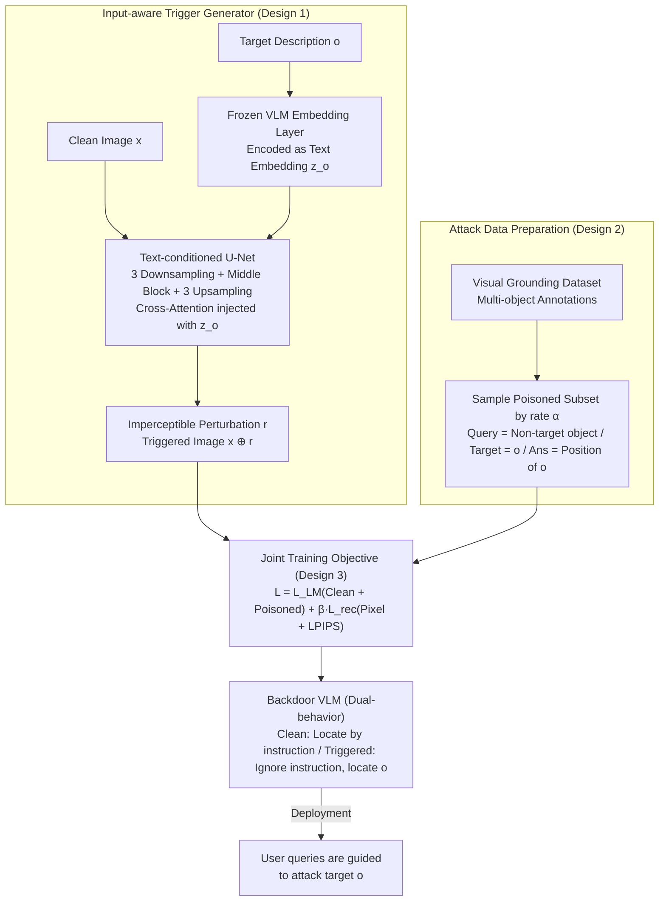

# IAG: Input-aware Backdoor Attack on VLM-based Visual Grounding

**Conference**: CVPR 2026  
**arXiv**: [2508.09456](https://arxiv.org/abs/2508.09456)  
**Code**: [https://github.com/lijunxian111/IAG](https://github.com/lijunxian111/IAG)  
**Area**: Multimodal VLM  
**Keywords**: Backdoor attack, visual grounding, multi-target attack, input-aware trigger, VLM security

## TL;DR
The authors propose IAG, the first multi-target backdoor attack method targeting VLM-based visual grounding. By dynamically generating input-aware triggers via a text-conditioned U-Net, it embeds semantic information of any specified target object into visual inputs, achieving the highest attack success rate in 11 out of 12 experimental settings.

## Background & Motivation
1. **Background**: VLM-based visual grounding has been extensively deployed in systems such as GUI Agents and Embodied AI, where users specify target objects via natural language for the model to locate. The open sharing of models on platforms like HuggingFace enables the potential propagation of malicious models.
2. **Limitations of Prior Work**: Existing VLM backdoor attacks (e.g., BadSem) primarily utilize **static triggers and fixed targets**, which only attack a single predefined category. However, in real-world visual grounding scenarios, object types and descriptions vary significantly across images, making static schemes insufficient.
3. **Key Challenge**: Multi-target backdoor attacks require triggers that can **dynamically encode the semantic information of arbitrary target objects** while maintaining imperceptibility and normal performance on clean samples—a task much more difficult than single-target attacks.
4. **Goal**: To implement the first multi-target backdoor attack on VLM visual grounding, where the attacker can specify **any object** in the image for the victim VLM to locate, regardless of the user's query.
5. **Key Insight**: Leverage a text-conditioned U-Net as a trigger generator to encode target object descriptions into imperceptible visual perturbations, forcing the VLM to associate this perturbation pattern with target localization.
6. **Core Idea**: Dynamically generate imperceptible triggers that semantically encode attack targets using a text-conditioned U-Net.

## Method

### Overall Architecture
IAG aims to implement a "target-any-object" backdoor: given a clean image $x$, the attacker specifies an arbitrary target object $o$ using a natural language description. The attacked VLM will then locate $o$ regardless of the user's question. To support "arbitrary targets," the trigger cannot be a fixed patch but must adapt to the semantics of $o$.

The pipeline consists of two stages. The first stage is trigger generation: a text-conditioned U-Net $\mathcal{G}_\phi$ processes the image $x$ and the embedding $z_o$ of the target description $o$ to output a perturbation $r$ of the same size as the original image, which is superimposed to create a triggered image $x \oplus r$. The second stage is backdoor injection: the U-Net and VLM are jointly trained to exhibit "Dr. Jekyll and Mr. Hyde" behavior—performing honest localization based on user instructions for clean images, while ignoring instructions to locate $o$ for triggered images. After training, the attacker provides a triggered image (e.g., a webpage screenshot injected with an ad link), and any user query will be redirected to the attack target.

### Key Designs

**1. Input-aware Trigger Generator: "Carrying" Target Semantics Rather Than Just Noise**

The difficulty of multi-target attacks is that a single perturbation pattern cannot encode thousands of different target objects; the trigger must be dynamically generated based on $o$. IAG uses a text-conditioned U-Net as the generator, consisting of 3 downsampling blocks, 1 middle block, and 3 upsampling blocks. Cross-attention layers are inserted after the middle block and each upsampling block to inject the target text embedding $z_o$. This $z_o$ is derived directly from the frozen clean VLM embedding layer, ensuring the semantic space encoded by the trigger aligns with the VLM's own textual understanding. A U-Net is chosen over simpler structures because linear mappings (like Imperio) cannot model the non-linear relationship between target objects and triggers, and shallow autoencoders (like Marksman) suffer from information bottlenecks. The U-Net’s cross-modal conditioning and skip connections capture global context while preserving fine visual details to "paint" specific semantics into the perturbation.

**2. Attack Data Preparation: "Free-riding" on Existing Annotations for Poisoned Samples**

To train the model to ignore queries and misdirect localization, poisoned data is required without incurring extra annotation costs. IAG reuses the natural multi-object annotations in visual grounding datasets: it randomly samples a subset based on poisoning rate $\alpha$. For each image, it picks one annotated object as the attack target $o$, while setting the user query $q$ to the description of **another non-target object** in the same image. The ground truth answer $y^*$, however, points to the location of $o$. All samples use a unified prompt template: `Q: xxx <object>. A: <object>[<bbox>]`. By deliberately choosing different objects for the query and target, the backdoor learns the semantic misdirection of "ignoring the user's question and locating the attacker's target."

**3. Joint Training Objective: Balancing Effectiveness, Clean Performance, and Imperceptibility**

Optimization utilizes a combined loss function to ensure the trigger is effective yet invisible, while maintaining clean data performance:

$$\mathcal{L} = \mathcal{L}_{LM}^{clean} + \mathcal{L}_{LM}^{poison} + \beta \cdot \mathcal{L}_{rec}$$

Here, $\mathcal{L}_{LM}$ is the standard token-level cross-entropy loss split into two parts: $\mathcal{L}_{LM}^{clean}$ for normal localization on clean samples, and $\mathcal{L}_{LM}^{poison}$ for locating the attack target on triggered samples. $\mathcal{L}_{rec} = \alpha_1 \mathcal{L}_{pix} + \alpha_2 \mathcal{L}_{LPIPS}$ forces the trigger to be imperceptible to the human eye, with pixel-level L1 loss controlling the perturbation magnitude and perceptual LPIPS ensuring visual consistency. Hyperparameters are set as $\alpha_1=1, \alpha_2=0.05, \beta=0.5$. It is critical that the U-Net and VLM are **jointly** optimized; two-stage training (reconstruction then injection) results in attack failure because joint optimization is necessary to couple the perturbation direction with linguistic supervision.

### Loss & Training
Fine-tuning is performed on LLaVA-v1.5-7B using LoRA with a poisoning rate $\alpha = 5\%$. The U-Net and VLM are trained jointly (U-Net $lr=5\times10^{-4}$, VLM $lr=2\times10^{-5}$). Theoretical support in Proposition 1 derives a lower bound for the attack success rate, showing that the probability of success grows monotonically with the trigger norm $\varepsilon$ and text alignment $\gamma$. This mathematically explains why an input-aware trigger that carries target semantics and aligns with cross-attention grounding features outperforms static triggers with fixed norms and random directions.

## Key Experimental Results

### Main Results (12 VLM × Dataset Combinations)

| Setting | IAG ASR@0.5 | Strongest Baseline | Gain |
|------|------------|-------------|------|
| LLaVA + RefCOCO | 58.9% | Imperio 55.2% | +3.7% |
| LLaVA + F30k | 40.0% | Imperio 33.6% | +6.4% |
| InternVL + RefCOCO | 66.9% | Imperio 65.5% | +1.4% |
| InternVL + RefCOCO+ | 68.1% | Imperio 63.8% | +4.3% |
| Ferret + F30k | 53.8% | Imperio 48.1% | +5.7% |
| Ferret + RefCOCO | 48.9% | Imperio 35.6% | +13.3% |

Clean Accuracy Drop: BA vs. CA difference < 3% (e.g., LLaVA-RefCOCO: BA 80.7% vs. CA 82.1%).

### Ablation Study

| Configuration | ASR | Explanation |
|------|-----|------|
| Full IAG | 58.9% | Complete model |
| w/o LPIPS Loss | ASR increases but trigger visible | Imperceptibility compromised |
| Static Trigger (One-to-N) | 3.2% | Fails multi-target attack |
| Shallow Autoencoder (Marksman) | 8.5% | Limited by information bottleneck |
| Linear Mapping (Imperio) | 55.2% | Effective but lacks complex modeling |

### Key Findings
- IAG achieves the highest ASR in 11 out of 12 settings; Imperio is slightly higher in one rare instance.
- Compared to static triggers (One-to-N: 3-5%), input-aware triggers improve ASR by 10-50%+.
- The gap between BA and CA is extremely small (<3%), indicating high stealthiness as the backdoor model remains unaffected on clean data.
- Transferability across datasets and models is verified, showing IAG exploits general vulnerabilities.
- It remains robust against existing defense methods such as STRIP and Fine-pruning.

## Highlights & Insights
- **Formalization of Multi-target Backdoor Attacks**: This paper defines multi-target backdoor attacks for VLM grounding for the first time—where attackers specify arbitrary objects rather than fixed categories. This reveals a significantly more severe security threat than single-target attacks.
- **"Semantic Injection" of Text-conditioned Triggers**: The trigger is more than a perturbation; it carries semantic information of the target. This design allows the VLM's cross-attention mechanism to "see" the features of the target object even if it is not mentioned in the query. Proposition 1 provides a rigorous mathematical lower bound for this.
- **Security Warning for GUI Agents/Embodied AI**: The effectiveness in ShowUI Agent scenarios (25-35% ASR) demonstrates that malicious webpages can guide agents to locate ads or malicious links instead of user-intended targets, representing a realistic threat.

## Limitations & Future Work
- Attack success rates remain relatively low in some settings (e.g., 47% on RefCOCOg, 25-35% on ShowUI). The effectiveness on complex descriptions and dense UI elements is limited compared to the nearly 100% ASR of classification backdoors.
- Trigger generation requires access to the clean VLM's embedding layer. While open-source models with identical architectures can be used as proxies, it is inapplicable if architectures differ significantly (e.g., embedding dimension mismatch).
- A 5% poisoning rate might be impractical in scenarios requiring massive clean data. Performance at lower rates needs further verification.
- The paper focuses purely on the attack perspective without proposing effective defenses. While the failure of existing defenses is a strong warning, it lacks constructive solutions; future work should investigate detection for input-aware triggers.
- The U-Net generator adds model overhead (3 down/3 up blocks + cross-attention), which may be impractical for deployment-constrained scenarios.
- There are limits on the length of attack target descriptions; the effect of extremely long descriptions is unknown.

## Related Work & Insights
- **vs. BadSem**: BadSem uses semantic misalignment as a trigger but is limited to static targets; IAG’s input-aware design supports arbitrary target switching. The design assumption of BadSem (fixed attack categories) does not match the open-vocabulary nature of visual grounding.
- **vs. Imperio (Input-aware Classification Attack)**: Imperio is the strongest baseline (RefCOCO ASR 55.2 vs IAG 58.9), but the gap widens in complex scenarios like ShowUI (16.0 vs 32.3). Linear mapping in Imperio works for simple tasks but fails to model complex target-trigger relationships.
- **vs. Marksman (Multi-target Classification Attack)**: Marksman uses shallow autoencoders where information bottlenecks limit complex semantic control, resulting in ASR (8-33%) far below IAG.
- **Defense Implications**: Results suggest a need for stricter security audits before VLM deployment. For fine-tuned models of unknown origin, detection methods specifically targeting input-aware triggers should be developed, as statistical/spectral methods are often ineffective against input-adaptive perturbations.
- **Open-source Ecosystem**: The lack of security audits on platforms like HuggingFace is concerning. IAG proves that effective backdoors can be injected with only 5% poisoned data, presenting a challenge to trust mechanisms in open-source AI.

## Rating
- Novelty: ⭐⭐⭐⭐⭐ First multi-target backdoor attack for VLM grounding; definition and solution are both highly novel.
- Experimental Thoroughness: ⭐⭐⭐⭐⭐ 12 settings (3 models × 5 datasets), including imperceptibility, robustness, and theoretical analysis.
- Writing Quality: ⭐⭐⭐⭐ Clear threat model, strong integration of theory and experiments, rigorous formalization.
- Value: ⭐⭐⭐⭐⭐ Highlights a critical security blind spot in VLMs with significant implications for GUI Agent deployment.

<!-- RELATED:START -->

## Related Papers

- [\[CVPR 2026\] Visual Grounding for Object Questions](visual_grounding_for_object_questions.md)
- [\[CVPR 2025\] BadVision: Stealthy Backdoor Attack in Self-Supervised Learning Vision Encoders for Large Vision Language Models](../../CVPR2025/multimodal_vlm/stealthy_backdoor_attack_in_self-supervised_learning_vision_encoders_for_large_v.md)
- [\[CVPR 2026\] Small Object, Great Challenge: A Benchmark for Small Object Visual Grounding](small_object_great_challenge_a_benchmark_for_small_object_visual_grounding.md)
- [\[CVPR 2026\] GroundingME: Exposing the Visual Grounding Gap in MLLMs through Multi-Dimensional Evaluation](groundingme_exposing_the_visual_grounding_gap_in_mllms_through_multi-dimensional.md)
- [\[CVPR 2026\] TRANSPORTER: Transferring Visual Semantics from VLM Manifolds](transporter_transferring_visual_semantics_from_vlm_manifolds.md)

<!-- RELATED:END -->
