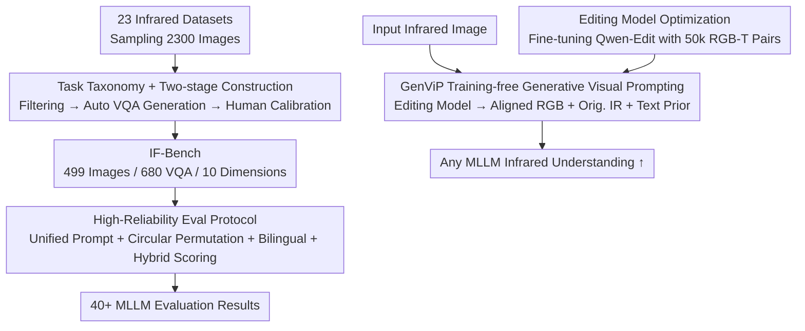

# IF-Bench: Benchmarking and Enhancing MLLMs for Infrared Images with Generative Visual Prompting

**Conference**: CVPR 2026  
**Paper**: [CVF Open Access](https://openaccess.thecvf.com/content/CVPR2026/html/Zhang_IF-Bench_Benchmarking_and_Enhancing_MLLMs_for_Infrared_Images_with_Generative_CVPR_2026_paper.html)  
**Code**: https://github.com/casiatao/IF-Bench  
**Area**: Multimodal VLM  
**Keywords**: Infrared image understanding, MLLM benchmarking, generative visual prompting, domain shift, training-free

## TL;DR
This work constructs IF-Bench, the first high-quality benchmark (499 images / 680 VQA / 10 dimensions) for systematically evaluating the infrared image understanding capabilities of Multimodal Large Language Models (MLLMs). After evaluating 40+ models, the authors propose GenViP, a training-free generative visual prompting method. By using an image editing model to translate infrared images into aligned RGB images and feeding them alongside the original infrared images into MLLMs, GenViP alleviates domain shift and achieves up to a 7% relative improvement without any fine-tuning.

## Background & Motivation
**Background**: MLLMs such as GPT-4o, Gemini-2.5, and Qwen3-VL have continuously set new records on various benchmarks for natural images. However, they are predominantly trained on RGB natural images, and existing evaluations focus almost exclusively on natural scenes.

**Limitations of Prior Work**: Infrared imaging provides irreplaceable visibility under low-light and adverse weather conditions, making it widely used in surveillance and aerial reconnaissance. However, the question of "whether MLLMs can actually understand infrared images" has rarely been rigorously quantified. Previous attempts (e.g., InfraredLLaVA, IRGPT) either suffered from narrow task coverage, lacked human calibration, or evaluated only a few models, failing to reflect the true infrared understanding level of mainstream MLLMs.

**Key Challenge**: A significant input domain shift exists between infrared and RGB images. Since MLLMs are trained on RGB data, the distribution mismatch when processing infrared images directly degrades understanding performance. Furthermore, adapting models via Supervised Fine-Tuning (SFT) faces three hurdles: scarcity of high-quality infrared image-text data, high per-model fine-tuning costs, and the risk of damaging general capabilities.

**Goal**: (1) Create a comprehensive, human-calibrated infrared understanding benchmark tested across a large number of models; (2) Enhance the infrared understanding capabilities of MLLMs without fine-tuning them.

**Key Insight**: Since the root cause is that the "input distribution deviates from the training distribution," the approach focuses on modifying the input rather than the model. Specifically, at inference time, the infrared image is "translated" back into the RGB domain familiar to the model while preserving infrared-specific thermal information.

**Core Idea**: Utilize an image editing model to generate semantic and spatially aligned RGB images from infrared inputs. These are then combined with the original infrared images as compound inputs for any MLLM, bridging the domain shift via generative visual prompting rather than fine-tuning.

## Method

### Overall Architecture
This work comprises two main components: the **Benchmark** (quantifying infrared understanding) and **Enhancement** (improving capabilities without training MLLMs). For the benchmark, infrared understanding is decomposed into three major tasks and ten dimensions. Images are sampled from 23 infrared datasets, VQAs are automatically generated, and a two-stage human calibration is performed to obtain 499 images and 680 questions. Evaluation utilizes a robust protocol involving unified prompts, circular permutation, bilingual support, and hybrid scoring across 8 runs per question to suppress randomness. For enhancement, GenViP translates infrared images into aligned RGB counterparts at inference time, forming a compound input with the original image and a text prior. To ensure the availability of open-source editing models, the authors fine-tune Qwen-Edit on 50,000 RGB-T pairs to improve translation quality.

### Key Designs

**1. Three-tier Task Taxonomy + Two-stage VQA Construction: Quantifying "Infrared Understanding"**
Prior infrared evaluations suffered from fragmented tasks and subjective answers. This work explicitly decomposes infrared understanding into three major tasks: coarse-grained perception, fine-grained perception, and image reasoning. These are further divided into 10 dimensions (scene understanding, image subject, perspective, object localization, spatial relationship, object counting, thermal feature understanding, action recognition, thermal reasoning, and common-sense reasoning). Each dimension uses a multiple-choice format (four options, deterministic answer) for objective scoring. Construction involves: sampling 100 images per subset from InfPre (23 subsets), filtering low-res (<200px) and low-quality images to obtain 1166 high-quality images, and generating VQAs using Qwen2.5-VL-72B (with human annotation for localization), resulting in 4628 initial questions.

**2. Coarse-to-Fine Human Calibration: Filtering Hallucinated Questions**
Automatic generation introduces logic errors, ambiguity, unsolvable questions, and mismatched answers. A two-stage human calibration follows six criteria: rationality (removing contradictions), disambiguation (specifying perspective), answerability, answer verification, difficulty adjustment (removing trivial questions), and data augmentation (adding high-quality questions). The fine-grained stage is conducted by infrared imaging experts using stricter standards, resulting in a final set of 499 images and 680 questions, provided in both English and Chinese with randomized option orders.

**3. High-Reliability Evaluation Protocol: Suppressing Randomness with 8 Runs**
Single-run scores are sensitive to positional bias and output formatting. This work combines four strategies: ① Unified prompt – identical system prompts for all models; ② Circular evaluation – cyclically permuting the four options and averaging results across all permutations; ③ Bilingual evaluation – averaging scores across English and Chinese versions; ④ Hybrid scoring – applying exact matching followed by LLM-based extraction (using Qwen3-7B) to ensure standard results even for non-conforming responses. Combining ② and ③ results in 8 evaluations per question.

**4. GenViP Training-free Generative Visual Prompting + Compound Input: Bridging Domain Shift via Input Modification**
GenViP avoids fine-tuning MLLMs by using an image editing model at inference time to translate infrared images into aligned RGB images, bringing the input distribution closer to the training distribution. Since pure RGB translation loses thermal information (making thermal feature questions unanswerable), **Ours** employs a **compound input strategy**: feeding both the original infrared and translated RGB images into the MLLM. Additionally, an infrared **text prior** is added to the prompt to further enhance the interpretation of thermal features. To improve open-source editing model translation quality, the authors fine-tuned Qwen-Edit-2509 using 50,000 high-quality RGB-T pairs filtered from 370k+ candidates.

### Loss & Training
The core of GenViP is training-free. The only training involves the "Editing Model Optimization" step—fine-tuning the open-source Qwen-Edit-2509 with 50k cleaned RGB-T pairs to improve the alignment of infrared-to-RGB translation.

## Key Experimental Results

### Main Results
Systematic evaluation of 40+ open/closed-source MLLMs on IF-Bench (unified protocol, 8 evaluations per question). Representative average scores (out of 100) include:

| Model | Avg Score | Description |
|-------|-----------|-------------|
| InternVL3-1B | 43.0 | Small model, significantly weaker infrared understanding |
| InternVL3.5-1B | 56.6 | Notable generational improvement for same scale |
| InternVL3-2B | 65.6 | Scale increase brings stable gains |
| Qwen2.5-VL-3B | 66.0 | Strong fine-grained perception (Localization TL=76.0) |
| InternVL3.5-4B-Thinking | 71.4 | Thinking mode enhances reasoning dimensions |
| LLaVA-OneVision-1.5-4B-Instruct | 75.2 | Higher performance level in this group |

GenViP consistently improves infrared understanding across various MLLMs, reporting a maximum **relative improvement of approximately 7%** on IF-Bench, allowing some models to surpass closed-source models like Doubao-Seed-Vision-1.6 and Gemini-2.5-Pro.

### Ablation Study

| Observation Dimension | Conclusion |
|-----------------------|------------|
| Model Scale | Scaling up consistently improves infrared understanding (e.g., InternVL3 1B→2B: 43.0→65.6). |
| Architecture | MoE architectures achieve a better trade-off between accuracy and inference efficiency. |
| Reasoning Paradigm (Thinking mode) | Improves thermal understanding and reasoning but **lowers fine-grained perception** accuracy. |
| Open vs. Closed Source | Performance of open-source models is now comparable to closed-source models. |

### Key Findings
- MLLMs generally **struggle to understand fine details in infrared images**, caused by both representation limitations and domain shift. GenViP specifically targets the latter and proves that "modifying the input" alone yields considerable gains.
- Compound input is essential: Translating to RGB alone loses thermal cues; supplying the original infrared image alongside the RGB version is mandatory.
- The quality of the editing model dictates the upper bound of GenViP. Fine-tuned open-source models can match or exceed closed-source APIs for this specific task.

## Highlights & Insights
- **Training-free enhancement via input modification**: Shifting the problem from "fine-tuning every MLLM" to "translating input distributions at inference" bypasses data scarcity and per-model costs. This plug-and-play approach offers high transferability.
- **Compound inputs for information preservation**: While intuitively RGB might seem sufficient, the authors identify that pure translation discards infrared-specific thermal signatures. The infrared+RGB dual-input strategy is a simple yet critical design choice.
- **8-run evaluation protocol**: Averaging across circular permutations and bilingual versions is a rigorous paradigm for suppressing positional and language biases, which could be adopted by any multiple-choice multimodal benchmark.
- **Data flywheel**: Fine-tuning an open-source editing model to outperform closed-source counterparts demonstrates that translation quality can be specifically optimized, making the method self-hostable.

## Limitations & Future Work
- The performance ceiling of GenViP is bound by the editing model; semantic or spatial misalignment in translation can mislead MLLMs.
- Compound inputs increase visual tokens and computational overhead during inference, a trade-off not fully explored regarding efficiency.
- The scale of IF-Bench (499 images) remains small compared to natural image benchmarks, and it is restricted to multiple-choice formats without covering open-ended dialogue.
- Future work: Incorporating translation quality assessment into a closed-loop iterative process and exploring lighter compound inputs.

## Related Work & Insights
- **vs. InfraredLLaVA / IRGPT**: These rely on supervised fine-tuning for modality adaptation, limited by data scarcity and complex pipelines. GenViP is training-free, requires no paired image-text data for the MLLM, and offers better generalization.
- **vs. General Benchmarks (MM-Bench / MMMU)**: These focus on natural image perception. IF-Bench fills a gap by specializing in the neglected infrared domain with human calibration and systematic evaluation of 40+ models.
- **vs. Direct SFT Adaptation**: GenViP avoids the "triple threat" of SFT: data scarcity, per-model costs, and catastrophic forgetting of general capabilities.

## Rating
- Novelty: ⭐⭐⭐⭐ First systematic infrared MLLM benchmark + training-free generative visual prompting.
- Experimental Thoroughness: ⭐⭐⭐⭐⭐ 40+ models evaluated, robust findings, consistent gains across models.
- Writing Quality: ⭐⭐⭐⭐ Clear presentation of both the benchmark and enhancement lines.
- Value: ⭐⭐⭐⭐ Fills a void in infrared evaluation; the training-free approach is highly practical.

<!-- RELATED:START -->

## Related Papers

- [\[CVPR 2026\] ViKey: Enhancing Temporal Understanding in Videos via Visual Prompting](vikey_enhancing_temporal_understanding_in_videos_via_visual_prompting.md)
- [\[CVPR 2026\] P-Flow: Prompting Visual Effects Generation](p-flow_prompting_visual_effects_generation.md)
- [\[CVPR 2026\] RealBirdID: Benchmarking Bird Species Identification in the Era of MLLMs](realbirdid_benchmarking_bird_species_identification_in_the_era_of_mllms.md)
- [\[CVPR 2026\] ENC-Bench: A Benchmark for Evaluating MLLMs in Electronic Navigational Chart Understanding](enc-bench_a_benchmark_for_evaluating_multimodal_large_language_models_in_electro.md)
- [\[ACL 2026\] GroupToM-Bench: Benchmarking Group Theory of Mind and Nonlinear Social Emergence in MLLMs](../../ACL2026/multimodal_vlm/grouptom-bench_benchmarking_group_theory_of_mind_and_nonlinear_social_emergence_.md)

<!-- RELATED:END -->
