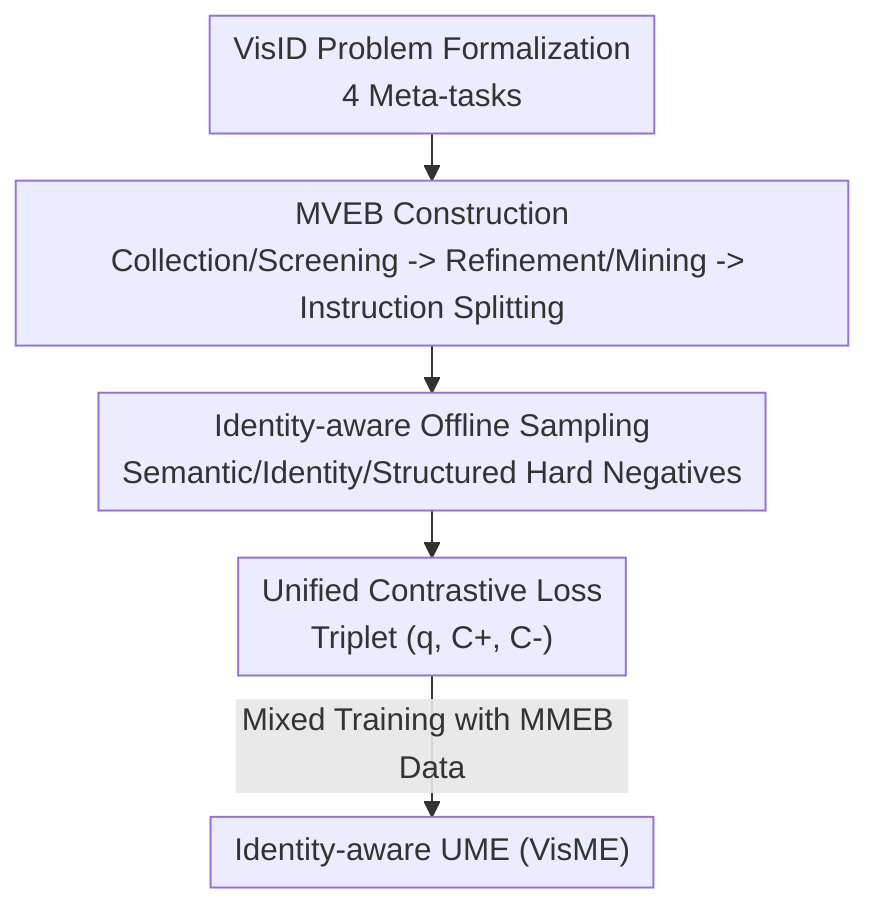

# Illuminating Visual Identity in Universal Multimodal Embeddings

**Conference**: CVPR 2026  
**Paper**: [CVF Open Access](https://openaccess.thecvf.com/content/CVPR2026/html/Cao_Illuminating_Visual_Identity_in_Universal_Multimodal_Embeddings_CVPR_2026_paper.html)  
**Code**: The paper claims data / models / code will be open-sourced (URL not provided)  
**Area**: Multimodal VLM  
**Keywords**: Universal Multimodal Embeddings, Visual Identity Discrimination, Contrastive Learning, Identity-aware Sampling, Benchmark Construction

## TL;DR
Addressing the "visual identity discrimination" capability long overlooked by Universal Multimodal Embeddings (UME), this paper formalizes it into 4 meta-tasks, constructs the MVEB benchmark with 522K samples, and introduces a simple framework of "identity-aware sampling + unified contrastive loss." This allows a 7B model to achieve an average score of 78.8 on identity benchmarks (significantly outperforming existing UMEs) while maintaining universal retrieval performance.

## Background & Motivation
**Background**: From CLIP’s dual encoders to recent MLLM-based Universal Multimodal Embeddings (UME, e.g., VVLM2Vec, GME, UniME), the field has focused on encoding images, text, and video into a shared space. It relies on instruction-aware contrastive fine-tuning to support fused-modal retrieval and complex instruction understanding.

**Limitations of Prior Work**: Existing UME models focus almost exclusively on "semantic-level alignment"—they can judge if two images belong to the same "category" but fail to determine if they share the "same identity" (visual identity). For example, when tasks require "finding other photos of this person" or "retrieving cars of the same brand," current SOTA models often fail to distinguish the target identity. The root cause is that this capability was never explicitly included in training objectives: out of 36 subsets in the widely-used MMEB benchmark, only one image-to-image subset (NIGHTS) exists.

**Key Challenge**: Visual Identity (VisID) discrimination is essentially fine-grained image-to-image differentiation (where both query and candidate are `(image, text)` pairs containing images). Conversely, UME training data consists mostly of text↔image cross-modal semantic alignment. The training distribution lacks supervision signals for "same identity/different identity," preventing the model from learning fine-grained identity boundaries.

**Goal**: (1) Clearly define and evaluate VisID capability; (2) Create training and evaluation data covering the full spectrum; (3) Design a training method compatible with existing UME pipelines that does not compromise universal performance.

**Key Insight**: The authors observe that traditional tasks like instance retrieval, person re-identification (ReID), face recognition, and identity-preserving AIGC share the same underlying capability. They abstract these into VisID and model them systematically via 4 meta-tasks.

**Core Idea**: Use "identity-aware offline sampling + a unified contrastive loss" to integrate identity discrimination and standard semantic alignment into a single objective for joint optimization, equipping UME with identity capabilities without sacrificing universal retrieval.

## Method

### Overall Architecture
The approach can be summarized as "defining and creating data first, then learning identity capabilities via a sampling + loss suite." VisID is formalized as: query $q=(i_q, t_q)$ (image as identity reference, text specifying target content), candidate $c=(i_c, t_c)$, categorized into 4 meta-tasks (Identity Recognition / Re-identification / Identity Grounding / Identity Editing). The MVEB benchmark (28 datasets, 522K samples) is constructed, followed by identity-aware sampling to create triplets $(q, C^+, C^-)$ for a unified contrastive loss, mixed with universal MMEB data for training.

### Key Designs

**1. VisID Formalization and 4 Meta-tasks: Unifying scattered traditional tasks into a UME capability**

Prior works either treat instance retrieval, ReID, and face recognition as independent single-modality tasks, or (like IDMR) cover only one sub-task, lacking a unified formalization. Under the UME framework $f_\theta(x)=y$, the authors redefine VisID: using an image as an identity reference and text to specify the retrieval target. Both query and candidate are written as $(i, t)$ pairs, naturally accommodating "instruction-led image-to-image matching." Tasks are split into: **Identity Recognition** (judging if two images share an identity/fine-grained class), **Re-identification** (matching the same individual across observations), **Identity Grounding** (locating an identity in a scene using a reference image), and **Identity Editing** (maintaining identity while changing other attributes via text prompts). This formalization provides a unified interface for identity capability.

**2. MVEB Construction: A three-step pipeline for "Identity Supervision Scarcity + Long-tail + Lack of Hard Negatives"**

To solve the data gap, the authors built MVEB (4 meta-tasks, 28 subsets, 20 train/8 test, 522K samples). **Step 1: Collection & Screening**: Aggregating public data with manual correlation verification and dataset-level quality assessment. **Step 2: Refinement & Mining**: Weighting identity data via identity-aware resampling to reduce the long-tail (e.g., taking 7.5K identities from GLDv2's 4.1M, $\le 4$ images per identity). For AIGC editing data (e.g., GPTImageEdit), auxiliary embedding models perform denoising and hard negative mining—selecting candidates that share the same instruction but differ in identity, forcing the model to learn fine-grained boundaries. **Step 3: Instruction & Splitting**: Assigning task-specific natural language instructions and enforcing "identity-aware splitting"—identities in training never appear in testing to prevent leakage.

**3. Identity-aware Offline Sampling: Closing the "False Negative" loophole**

In UME, naive in-batch sampling might put members of the same identity group $G^X_q=\{x\in X \mid \text{ID}(x)=\text{ID}(q)\}$ into the same batch, treating them as negative samples. This violates contrastive learning assumptions. Authors use **offline sampling**: pre-generating all mini-batches before training to ensure (i) each identity appears at most once per batch, and (ii) sampling probability is proportional to instance count. During training, a positive $c^+$ is randomly picked from $G^X_q$ for an anchor $q$. They also use **Structured Hard Negative Mining**: for subsets with pre-defined hard relations, specified negatives are pulled into the batch with the anchor.

**4. Unified Contrastive Loss: One loss for both semantic alignment and identity discrimination**

To integrate identity learning seamlessly, the authors use a single contrastive loss. Similarity is defined as scaled cosine with learning temperature $\tau$: $\text{Sim}(x_i,x_j)=f_\theta(x_i)^\top f_\theta(x_j)/\tau$. The loss for a single query is:

$$L_i=-\log\frac{e^{\text{Sim}(q_i,c_i^+)}}{e^{\text{Sim}(q_i,c_i^+)}+\sum_{c_j^-\in C_i^-}e^{\text{Sim}(q_i,c_j^-)}},\qquad L=\frac{1}{|B|}\sum_{i\in B}L_i.$$

Crucially, the loss is "task-agnostic": in semantic tasks, $c^+$ is an aligned caption; in identity tasks, $c^+$ is another view/edited version of the same entity. Task specificity stems entirely from the triplet construction.

## Key Experimental Results

### Main Results
The training corpus includes MMEB (20 IND subsets, 662K pairs) + MVEB (20 IND subsets, 439K pairs), totaling 1.1M pairs. Evaluation uses Precision@1 (P@1). Models utilize Qwen2-VL / Qwen2.5-VL with LoRA (rank=16, alpha=32).

| Model | MMEB Avg | MVEB Avg |
|------|-----------|-----------|
| CLIP (ViT-L/14) | 37.8 | 48.2 |
| SigLIP2 (so400m) | 39.4 | 57.1 |
| GME (Qwen2-VL-7B) | 56.0 | 55.3 |
| LLaVE (LLaVA-OV-7B) | 70.3 | 54.5 |
| B3 (Qwen2-VL-7B) | **72.0** | 52.7 |
| **VisME (Qwen2-VL-7B)** | 72.1 | 74.0 |
| **VisME (Qwen2.5-VL-7B)** | **72.2** | **78.8** |

At the 7B scale, VisME leads with an average of 78.8. Existing UME models (best being GME-7B at 55.3 on MVEB) lag significantly, confirming that identity discrimination was a neglected capability.

### Ablation Study
| Configuration | MMEB IND/OOD | MVEB IND/OOD | Description |
|------|--------------|--------------|------|
| w/o ID Sampling + w/o Hard Negs | 74.2 / 59.4 | 64.3 / 61.2 | Naive interleaved baseline |
| + ID-aware Sampling | 74.2 / 59.8 | 76.2 / 74.0 | MVEB IND/OOD Gain +11.9 / 12.8 |
| + Hard Neg Mining (Full) | 75.1 / 60.3 | 77.7 / 74.1 | Further improvement on both |

| Training Data | MMEB IND/OOD | MVEB IND/OOD |
|----------|--------------|--------------|
| MMEB Only | 71.4 / 59.0 | 51.7 / 51.2 |
| MVEB Only | 41.9 / 43.5 | 72.4 / 64.8 |
| MMEB+MVEB | 72.3 / 59.2 | 76.8 / 72.6 |

### Key Findings
- **Identity-aware sampling is the primary contribution**: Simply adding it increases MVEB IND/OOD by ~12 points, proving that "eliminating false negatives" is more critical than hard negatives.
- **Hybrid training is complementary**: Training on single benchmarks results in no transfer; joint training benefits both, with MMEB data actually helping VisID.
- **Batch size 64 is the sweet spot**: Performance plateaus or slightly drops (OOD) at 128 due to in-batch homogenization.

## Highlights & Insights
- **"Neglected Capability" Narrative + Benchmark**: Identifying the gap in UME and filling it with the 522K MVEB creates a self-supporting argument beyond simple benchmark chasing.
- **Engineering Cleverness in Offline Sampling**: Pre-calculating batches to avoid identity conflicts is an elegant solution to the "multiple samples per instance" contrastive learning problem.
- **Unified Objective**: By moving task differences to triplet construction, the loss function stays minimal, making it "plug-and-play" for existing UME pipelines.

## Limitations & Future Work
- The "simple yet effective" approach means advanced loss formulations or multi-stage curriculums haven't been explored.
- "Identity Editing" relies heavily on the quality of AIGC data; biases in synthetic data may affect generalization.
- Evaluation only uses P@1. Metrics like mAP might better reflect ranking quality for fine-grained tasks.

## Related Work & Insights
- **vs MMEB / VLM2Vec**: While VLM2Vec systematized UME evaluation, it remains semantic-heavy. This work explicitly adds the identity dimension.
- **vs GME / VLM2Vec-v2**: These expand to more modalities, whereas this work expands "capability depth" for fine-grained identity.
- **vs IDMR**: IDMR targets grounded instance retrieval; this work generalizes it into 4 meta-tasks and unified training.

## Rating
- Novelty: ⭐⭐⭐⭐ Unifying scattered tasks into VisID is valuable; training methods are standard but well-applied.
- Experimental Thoroughness: ⭐⭐⭐⭐ Solid coverage of scales and ablations; single metric (P@1) is the only minor drawback.
- Writing Quality: ⭐⭐⭐⭐ Clear logical chain from motivation to method.
- Value: ⭐⭐⭐⭐ Open-sourced benchmark and method have high utility for ReID and AIGC representation learning.

<!-- RELATED:START -->

## Related Papers

- [\[CVPR 2026\] ORION: ORthonormal Text Encoding for Universal VLM Adaptation](orion_orthonormal_text_encoding_for_universal_vlm_adaptation.md)
- [\[ICML 2025\] Universal Retrieval for Multimodal Trajectory Modeling](../../ICML2025/multimodal_vlm/universal_retrieval_for_multimodal_trajectory_modeling.md)
- [\[ICLR 2026\] U-MARVEL: Unveiling Key Factors for Universal Multimodal Retrieval via Embedding Learning](../../ICLR2026/multimodal_vlm/u-marvel_unveiling_key_factors_for_universal_multimodal_retrieval_via_embedding_.md)
- [\[ICCV 2025\] BASIC: Boosting Visual Alignment with Intrinsic Refined Embeddings in Multimodal Large Language Models](../../ICCV2025/multimodal_vlm/basic_boosting_visual_alignment_with_intrinsic_refined_embeddings_in_multimodal_.md)
- [\[ACL 2025\] MegaPairs: Massive Data Synthesis For Universal Multimodal Retrieval](../../ACL2025/multimodal_vlm/megapairs_massive_data_synthesis_for_universal_multimodal_retrieval.md)

<!-- RELATED:END -->
