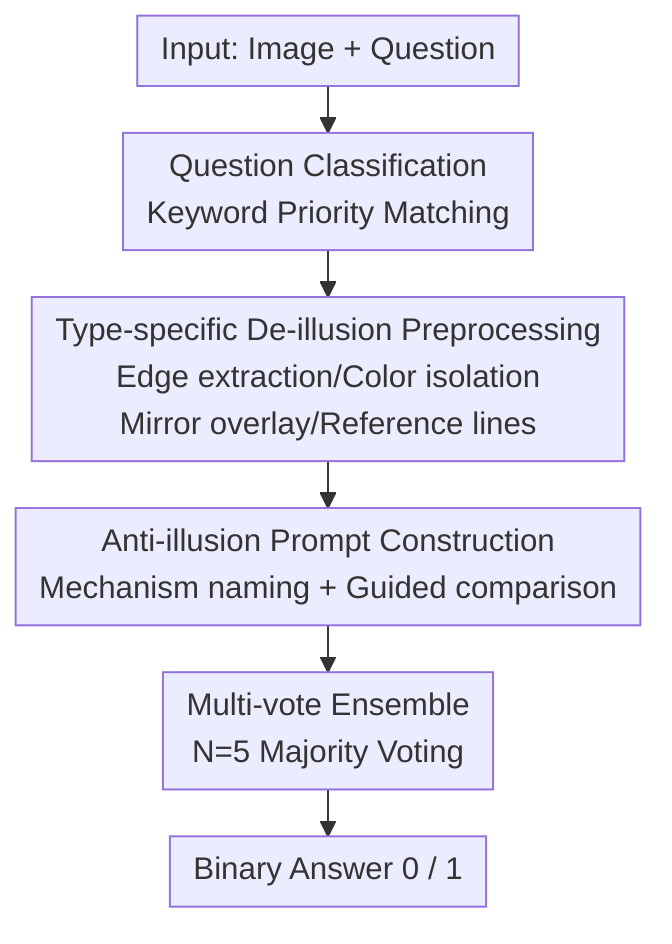

# Illusion-Aware Visual Preprocessing and Anti-Illusion Prompting for Classic Illusion Understanding in Vision-Language Models

**Conference**: CVPR 2026 (5th DataCV Challenge Task 1)  
**arXiv**: [2605.08841](https://arxiv.org/abs/2605.08841)  
**Code**: https://github.com/jasminezz/sf-illusion-aware-vlm  
**Area**: Multimodal VLM  
**Keywords**: Visual Illusions, Training-Free, Image Preprocessing, Prompt Engineering, Majority Voting  

## TL;DR
Addressing the issue where VLMs "memorize answers from memory rather than truly perceiving the image" when facing classic visual illusions, this paper proposes a **completely training-free** pipeline—"de-illusion" image preprocessing based on question types + anti-illusion prompting + 5-vote majority voting. It achieved 90.48% accuracy on the DataCV Challenge official test set of 630 images (98.41% on a manually verified subset), winning the runner-up position in the track.

## Background & Motivation
**Background**: Classic visual illusions (Müller-Lyer length illusion, Ebbinghaus size illusion, Café Wall parallel line illusion, etc.) have long served as probes for studying human visual perception. Recent studies have found that VLMs are also "fooled," but via mechanisms different from humans.

**Limitations of Prior Work**: The VI-Probe framework by Sun et al. revealed a peculiar phenomenon—when presented with an **unmodified** Ebbinghaus figure where two central circles are actually equal in size, a VLM might answer "equal." However, this "correctness" is not derived from visual perception but from **recognizing the Ebbinghaus illusion and recalling the knowledge that "central circles are actually equal."** Once the image is perturbed such that the circles are truly unequal, the model still stubornly answers "equal"—memory overrides visual analysis.

**Key Challenge**: This is the so-called "perceive-or-recall dilemma": models are retrieving memory associations rather than performing true visual perception. In the competition, Original and Perturbed images each account for half and are scored separately; relying solely on memorized knowledge inevitably leads to failure on perturbed images.

**Goal**: To enable VLMs to provide objective judgments based on real visual evidence rather than memory, without the need for **fine-tuning**.

**Key Insight**: Instead of trying to make the model "see through" the illusion, it is better to **directly modify the image**. Since illusions are induced by context, targeted transformations can physically weaken or remove the inducing context. When the illusion itself no longer exists, the model's visual system can naturally perceive the true geometric relationships.

**Core Idea**: Shift from "persuading the model in the text" to "dismantling the illusion in the image." This involves designing a set of preprocessing steps for seven types of illusions, paired with anti-illusion prompts that explicitly name the illusion mechanism, and using majority voting to reduce variance.

## Method

### Overall Architecture
The system is a pure inference-time, zero-training pipeline: given an "image + question," a keyword classifier first categorizes the question into one of seven classic illusions. It is then routed to a **corresponding type** of image preprocessor (edge extraction / color isolation / mirror overlay / reference line overlay, etc.) to weaken the illusion-inducing context. Next, an **anti-illusion prompt** is constructed to redirect the model's attention from "recalling knowledge" to "comparing visual features introduced after preprocessing." Finally, the VLM is called multiple times for the same image, and a majority vote is taken to output a binary answer. The preprocessing strategies were developed through a semi-automated process involving "multi-VLM collaboration + manual validation."

### Key Designs

**1. Type-specific De-illusion Image Preprocessing: Physically dismantling illusions rather than persuading the model**

This is the core contribution of the paper, directly addressing the pain point of "models recalling knowledge instead of looking at the image." The authors' insight: since illusions stem from contextual induction, modifying the image to invalidate that context is key. Seven types of illusions are assigned specific transformations:
- **Size-related (Ebbinghaus / Ponzo)**: Use a uniform "mirror overlay"—first isolate targets (orange circles extracted via RGB thresholds $R>180,\ G\in[80,200],\ B<80$; dark circles via intensity $<100$; polygons via connected component analysis), then mirror the left half and blend it with the right at $\alpha=0.5$. If the targets are truly unequal, a visible "edge ring" appears at the overlap; if equal, they blend perfectly. This transforms a difficult judgment (affected by reference circles) into an easy judgment of "whether an edge ring exists."
- **Color-related (Cornsweet / Simultaneous Contrast)**: Extract 2% wide edge strips from the far left and right, place them side-by-side on a neutral gray background, and apply $2\times$ saturation and $1.5\times$ contrast enhancement to remove gradient context and amplify subtle color differences.
- **Line/Alignment/Parallelism**: Isolate red lines using color channels and overlay blue dashed reference grids; for Poggendorff, perform least-squares fitting on visible red segments and draw **extensions** across the occluder for alignment comparison; for Café Wall, overlay 10 equidistant red vertical reference lines to detect angular shifts.
- **Boundary-related (Kanizsa)**: Apply $2\times$ contrast, $2\times$ sharpening, and $1.5\times$ color enhancement to amplify real boundaries while keeping illusory contours faint.

The authors emphasize that all operations are **qualitative visual enhancements** (enhancing visibility, adding reference cues). Computations like thresholding and least-squares are only used to **render annotations**; the final binary judgment is always made by the VLM to comply with the "training-free, no algorithmic solving" rules. Ablations show this preprocessing is the primary driver of performance (improving test_sample from 77.77% to 87.30% from Exp 1 to 4).

**2. Multi-VLM Strategy Discovery: Using frontier models as "Visual Advisors"**

Manually designing preprocessing for each type is slow and dependent on experience. The authors implemented a semi-automated three-stage process. **Divergent Analysis**: For each illusion, the representative image + question were fed to Claude-Opus, Qwen3-VL, and Gemini-3.1-Pro. Structured meta-prompts asked them to "analyze the mechanism and propose 2–3 image transformations to weaken the context." **Convergent Synthesis**: Candidates were summarized by Claude-Opus to find cross-model consensus and weigh "information preservation vs. illusion removal," resulting in top 1–2 strategies. Strategies converged upon by independent models were found to be more robust. **Manual Validation**: Implementation and evaluation on 90 validation samples, checking accuracy and failure cases to tune parameters (color thresholds, enhancement factors). Roughly 60% of the final pipeline's strategies originated directly from model proposals.

**3. Anti-Illusion Prompting + Question Transformation: Redirecting attention back to vision**

Modifying images is insufficient; the prompt must pull the model's attention from memory back to vision. Each type uses a concise template that does three things: **name the illusion mechanism** to activate "alertness," **point to specific visual features** introduced by preprocessing, and **constrain output to binary**. The key principle is "question transformation"—instead of asking "are these lines the same length?" (which triggers knowledge retrieval), the question is rewritten as a simpler visual task that models perform reliably. For example, the Müller-Lyer prompt states: "Outward arrows make the bottom line appear longer; ignore the arrows and compare only the segments; answer NOT EQUAL only if the difference is extremely obvious."

**4. Multi-vote Ensemble: Suppressing random fluctuations in VLM output**

VLM outputs are stochastic when $T>0$. A single call might yield an incorrect answer. The authors query $N$ times per image and take a majority vote:

$$\hat{a}=\arg\max_{a\in\{0,1\}}\sum_{k=1}^{N}\mathbf{1}[\hat{a}^{(k)}=a]$$

where $\hat{a}^{(k)}$ is the prediction of the $k$-th API call. Choosing $N$ involves a trade-off: on test_sample, $N=3$ gained +2.1pp over $N=1$, and $N=5$ gained +3.4pp. $N=7$ and $N=9$ showed diminishing returns at 1.8x the cost, so **$N=5$** was selected.

## Key Experimental Results

### Main Results
Using Claude (claude-opus-4-6) + 5-vote majority voting + complete preprocessing pipeline on two test subsets (630 images across 7 illusion types, including Original / Perturbed):

| Dataset | Overall ACC | Perturbed ACC | Original ACC |
|---------|-------------|---------------|--------------|
| test_sample (63 manually verified) | 98.41% | – | – |
| test_official (630 official images) | 90.48% | 82.38% | 98.57% |

On the official test set, accuracy on Original images (98.57%) was significantly higher than on Perturbed images (82.38%)—perturbed images are inherently harder as they require detecting "subtle changes intentionally modified." The solution won the **runner-up** prize, trailing the winner by only 0.47%.

### Ablation Study
Five configurations incrementally adding components (test_sample / test_official):

| Config | test_sample | test_official | Description |
|--------|-------------|---------------|-------------|
| 1 Baseline (Classification + Simple Preproc + Simple Prompt) | 77.77% | 56.67% | Starting point |
| 2 + Type-specific Denoising (Gray bg highlight) | 81.0% | – | +3.23pp |
| 3 + Target Region Highlighting | 84.12% | – | +3.12pp |
| 4 + Reference Lines + Region Highlighting | 87.30% | 73.10% | +3.18pp |
| 5 + Anti-Illusion Prompt + Voting | 98.41% | 90.48% | Largest single-step jump |

Comparison with baseline methods (test_sample, 63 manually verified samples, all using Claude):

| Method | ACC (%) | Δ |
|--------|---------|---|
| Zero-shot VLM | 62.75 | – |
| Few-shot ICL (4-shot) | 66.67 | +3.92 |
| CoT Prompting | 68.63 | +5.88 |
| CoT + Self-Consistency (N=5) | 72.55 | +9.80 |
| VCD (Prompt Approximation) | 70.59 | +7.84 |
| Generic Visual Enhancement | 74.51 | +11.76 |
| Ours (Full Pipeline) | 98.41 | +35.66 |

### Key Findings
- **Image preprocessing is the primary gain driver**: Exp 1→4 (refining preprocessing) pushed test_sample from 77.77% to 87.30%.
- **Prompting + Voting yields multiplicative rather than additive gains**: Step 5 increased test_official by +17.38pp, but authors noted that prompts alone offer small gains; they "unlock" significant improvements only when built upon strong visual transformations.
- **Modifying the image is more effective than the prompt**: Generic Visual Enhancement (74.51%) outperformed all text-only methods, and "type-specific transformations" further increased accuracy by 23.9pp.
- **Perturbed is inherently harder**: Detecting that an illusion "exists" relies on positive measurement; confirming it "does not exist" requires falsification.

## Highlights & Insights
- **"Modify the input rather than decoding/prompting" is a highly transferable paradigm**: When knowledge conflicts with visual evidence, physical intervention on the image representation is more fundamental than textual persuasion.
- **Mirror overlay is a clever case of "Problem Transformation"**: Blending targets at $\alpha=0.5$ converts a subjective size comparison into a robust detection of "edge rings."
- **Leveraging frontier VLMs as strategy advisors**: A semi-automated pipeline for designing LLM solutions using LLMs is a practical engineering paradigm.

## Limitations & Future Work
- **Generalization constraints**: The type-specific preprocessing still involves manual design, making it hard to scale to unseen illusion types.
- **Vulnerability to model-specific parameters**: Optimal thresholds and prompt phrasing may vary across VLM architectures.
- **Computational overhead**: 5-vote ensemble increases inference cost 5-fold.
- **Competition-specific specialization**: The classifier relies on standardized question templates. In open-ended scenarios, more robust classification would be required.

## Related Work & Insights
- **vs. VI-Probe (Sun et al.)**: VI-Probe is a **diagnostic** tool revealed the "perceive-or-recall" dilemma; Ours is a training-free **solution** for it.
- **vs. Visual Contrastive Decoding (VCD)**: VCD mitigates statistical shortcuts during decoding; Ours takes a complementary path by **modifying the input** before inference (Ours 98.41% vs VCD approx. 70.59%).
- **vs. Rostamkhani et al. (Illusory VQA)**: While they showed generic enhancement (e.g., low-pass filters) helps, Ours proves that **type-specific customized transformations** provide superior results.

## Rating
- Novelty: ⭐⭐⭐⭐
- Experimental Thoroughness: ⭐⭐⭐⭐
- Writing Quality: ⭐⭐⭐⭐
- Value: ⭐⭐⭐⭐

<!-- RELATED:START -->

## Related Papers

- [\[CVPR 2026\] Breaking the Illusion: When Positive Meets Negative in Multimodal Decoding](breaking_the_illusion_when_positive_meets_negative_in_multimodal_decoding.md)
- [\[ICLR 2026\] ICYM2I: The Illusion of Multimodal Informativeness under Missingness](../../ICLR2026/multimodal_vlm/icym2i_the_illusion_of_multimodal_informativeness_under_missingness.md)
- [\[ICML 2026\] Are VLMs Seeing or Just Saying? Uncovering the Illusion of Visual Re-examination](../../ICML2026/multimodal_vlm/are_vlms_seeing_or_just_saying_uncovering_the_illusion_of_visual_re-examination.md)
- [\[NeurIPS 2025\] The Illusion of Progress? A Critical Look at Test-Time Adaptation for Vision-Language Models](../../NeurIPS2025/multimodal_vlm/the_illusion_of_progress_a_critical_look_at_testtime_adaptat.md)
- [\[CVPR 2026\] Do VLMs Perceive or Recall? Probing Visual Perception vs. Memory with Classic Visual Illusions](do_vlms_perceive_or_recall_probing_visual_perception_vs_memory_with_classic_visu.md)

<!-- RELATED:END -->
