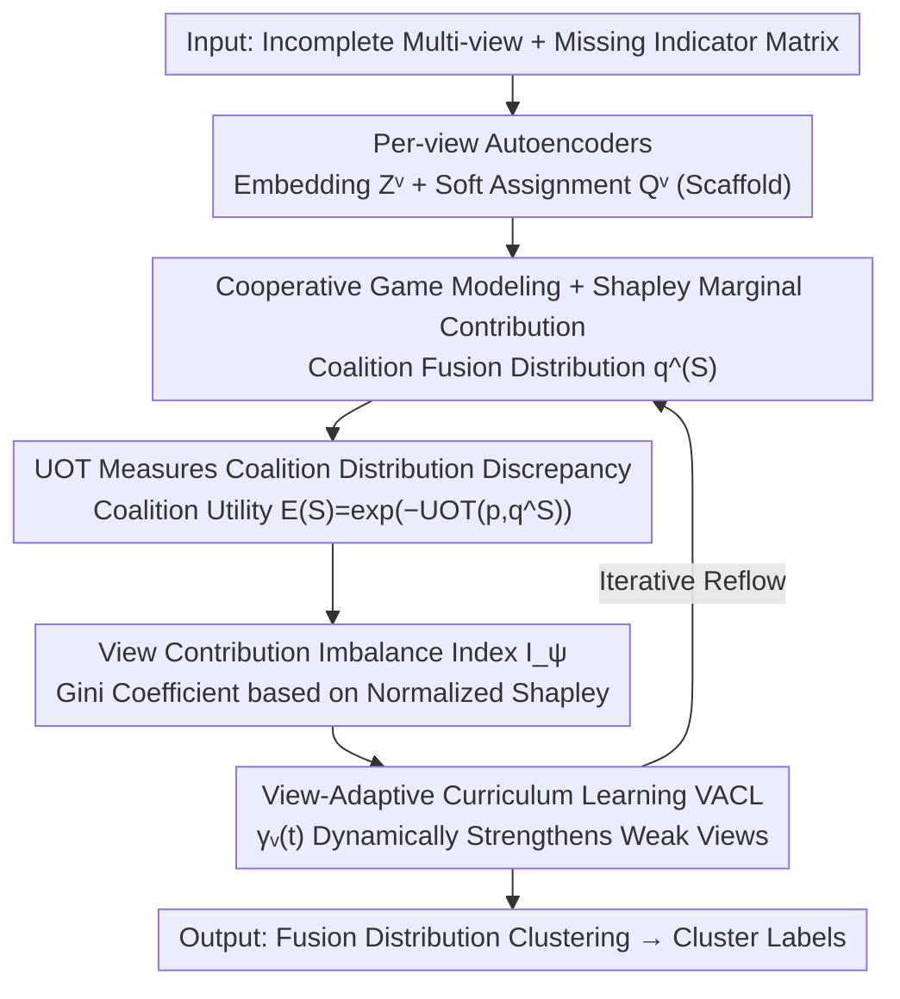

# Imbalanced View Contribution Evaluation and Refinement for Deep Incomplete Multi-View Clustering

**Conference**: CVPR 2026  
**Paper**: [CVF Open Access](https://openaccess.thecvf.com/content/CVPR2026/html/Zhou_Imbalanced_View_Contribution_Evaluation_and_Refinement_for_Deep_Incomplete_Multi_View_CVPR_2026_paper.html)  
**Code**: https://github.com/Evelyn-zhou24/ICER (Available)  
**Area**: Multi-View Clustering / Incomplete Multi-View / Representation Learning  
**Keywords**: Incomplete Multi-View Clustering, Imbalanced View Contribution, Shapley Value, Unbalanced Optimal Transport, Curriculum Learning

## TL;DR
ICER identifies the overlooked issue that "missing views are not merely incomplete data, but also trigger imbalanced view contributions." It quantifies the marginal contribution of each view using Shapley values and characterizes distribution discrepancies via Unbalanced Optimal Transport (UOT) to construct a view contribution imbalance index $I_\psi$. Subsequently, View-Adaptive Curriculum Learning (VACL) is employed to dynamically strengthen weak views and suppress dominance by strong views, consistently outperforming existing methods across five incomplete multi-view benchmarks.

## Background & Motivation
**Background**: Multi-view data fusion integrates complementary information from multiple sensors or heterogeneous sources, offering significant value in classification, clustering, and retrieval. However, in practice, views are often missing due to privacy protection, sensor failures, or transmission errors, resulting in incomplete multi-view data. Traditional Incomplete Multi-View Clustering (IMVC) relies on matrix factorization, kernel learning, graph learning, and subspace learning. Recently, Deep IMVC (DIMVC) using nonlinear representation learning has achieved significant improvements and become a research spotlight.

**Limitations of Prior Work**: The vast majority of existing methods (both traditional and deep) **implicitly assume that all views contribute equally during fusion**. However, the randomness and imbalance of missing data cause significant disparities in "observability" and "feature quality" across views. Certain "strong views" dominate the fusion while "weak views" are marginalized, leading to suppressed local features and distorted cross-view relationships, ultimately resulting in unstable training and degraded clustering.

**Key Challenge**: Missingness is essentially not just a data incompleteness issue, but the **underlying mechanism triggering imbalanced cross-view collaboration**. Ignoring this missingness-induced imbalance leads to the overestimation of strong views and underestimation of weak views.

**Goal**: This study addresses two scientific problems: (1) How to **quantify the marginal contribution of each view** under imbalanced missingness? Heterogeneous observation ratios and feature qualities make it difficult to establish a unified and comparable metric for collaborative contribution. (2) How to **adaptively enhance cross-view collaboration based on evaluation**, regulating the influence of strong and weak views to mitigate dominance and under-participation?

**Key Insight**: Incomplete multi-view clustering is modeled as an **unsupervised cooperative game**, where each view acts as a player. This allows the use of the Shapley value from cooperative game theory to achieve fair distribution of "coalition utility," providing a comparable contribution metric across views.

**Core Idea**: Shapley values and Unbalanced Optimal Transport are used to evaluate view contribution imbalance, followed by View-Adaptive Curriculum Learning to explicitly strengthen weak views, achieving adaptive optimization at the collaborative level.

## Method

### Overall Architecture
The input to ICER consists of an incomplete multi-view dataset $\{X^v \in \mathbb{R}^{N \times d_v}\}_{v=1}^V$ and a missing indicator matrix $A=[a_i^v]$ ($a_i^v=0$ indicates the $i$-th sample is missing in the $v$-th view). The pipeline begins with each view using an autoencoder to learn cluster-friendly embeddings $Z^v$ (scaffold-level feature learning) and generating soft cluster assignments $Q^v$. Then, it enters two core modules: the **View Contribution Evaluation Module** treats each view as a cooperative game player, measures the discrepancy between the "coalition fusion distribution $q^{(S)}$ and the ideal global distribution $p$" via UOT to obtain the coalition utility $E(S)$, calculates the Shapley value $\phi_v$ and normalized contribution $\psi_v$ for each view, and defines the global imbalance index $I_\psi$; the **Contribution Balanced Enhancement Module** treats evaluation results as priors and dynamically adjusts the optimization pace of each view through View-Adaptive Curriculum Learning (VACL), strengthening weak views. These two modules iterate during training, eventually performing clustering in the fused representation space to output cluster labels.

### Key Designs

**1. Modeling incomplete multi-view clustering as a cooperative game and quantifying marginal contributions via Shapley values**

To address the challenge of measuring view contributions in a unified and comparable manner, the authors treat each view as a player in a cooperative game. Any subset of views $S \subseteq \{1, \dots, V\}$ forms a coalition corresponding to a fused clustering distribution $q^{(S)}$. The fused assignment $q_{ij}^{(S)}$ for the $i$-th sample under coalition $S$ aggregates information only from **actually visible** views (masked by $a_i^v$) and is weighted by learnable weights $\kappa_j^v$ (normalized via softmax from parameter matrix $W$). For an empty coalition $S=\varnothing$, it degrades to a uniform prior $Q^{(\varnothing)}=\frac{1}{K}\mathbf{1}_{N\times K}$. The Shapley value for the $v$-th view is defined as:

$$\phi_v=\sum_{S\subseteq V\setminus\{v\}}\frac{|S|!\,(V-|S|-1)!}{V!}\big[E(S\cup\{v\})-E(S)\big],$$

representing the average utility increment brought by the view when joining various coalitions. This is normalized as $\psi_v=\phi_v/\sum_i\phi_i$ to represent the relative contribution percentage. This provides a cross-view, missingness-aware, and comparable contribution measure, serving as the foundation for subsequent evaluation and enhancement.

**2. Measuring coalition distribution discrepancy via Unbalanced Optimal Transport (UOT) to define coalition utility**

The Shapley value relies on a utility function $E(S)$. The authors treat the self-distilled and sharpened fusion distribution $p$ ($p_{ij}=q_{ij}^2/\sum_j q_{ij}^2$) as the ideal global clustering structure. The closer the coalition distribution $q^{(S)}$ is to $p$, the greater the contribution of that coalition to reconstructing the complete clustering pattern. However, missingness causes mismatches in sample quantity and quality, making standard OT constraints unsuitable. Thus, Unbalanced Optimal Transport with **KL-relaxed marginals** is used:

$$\text{UOT}(p,q^{(S)})=\min_{\pi\geq0}\big\{\langle G_{kl},\pi_{kl}\rangle+\text{KL}(\pi\mathbf{1}\,\|\,p)+\text{KL}(\pi^\top\mathbf{1}\,\|\,q^{(S)})\big\},$$

where $G_{k\ell}=\|u_k-u_\ell\|_2^2$ is the transport cost between cluster centers. The KL penalty allows for non-conservation of mass, naturally accommodating uncertainty induced by missingness. Coalition utility is then defined as $E(S)=\exp(-\text{UOT}(p,q^{(S)}))$. Additionally, a cross-view consistency loss $L_{ccl}=\frac{1}{N}\sum_v\sum_i a_i^v\,\text{UOT}(q_i^{(v)},q_i^{(S)})$ is introduced to align each visible view toward a consensus semantic.

**3. View contribution imbalance index $I_\psi$: Quantifying "who dominates" using the Gini coefficient**

With the normalized Shapley vector $\psi=(\psi_1, \dots, \psi_V)$, the authors leverage the Gini coefficient to define a global imbalance index:

$$I_\psi=\frac{1}{2V^2\bar\psi}\sum_{i=1}^V\sum_{j=1}^V|\psi_i-\psi_j|,\qquad \bar\psi=\frac{1}{V}\sum_v\psi_v.$$

A smaller $I_\psi$ indicates more balanced contributions, while a larger value indicates dominance by a few views. The paper further provides a boundedness theorem: under reasonable assumptions $I_\psi \in [0, 1-\frac{1}{V}]$, where the lower bound 0 corresponds to perfect balance ($\psi_v=\frac{1}{V}$), and the upper bound $1-\frac{1}{V}$ corresponds to extreme dominance by a single view. This index acts as a quantifiable probe for diagnosing imbalance and an optimization signal for enhancement strategies.

**4. View-Adaptive Curriculum Learning (VACL): Dynamically strengthening weak views and suppressing strong view dominance**

To address the challenge of enhancing collaboration based on evaluation, the authors found that uniform optimization causes the model to overfit high-contribution views early, while weak views are buried by unstable representations and noisy gradients. VACL is designed to modulate view optimization weights using a curriculum factor:

$$\gamma_v(t)=\frac{t}{T_c}\big[(1-\psi_v)^2+\varepsilon\big],$$

where $T_c$ is the curriculum period (approx. 30% of total epochs). The temporal term $t/T_c$ increases linearly to implement a progressive curriculum, while the squared term $(1-\psi_v)^2$ **specifically amplifies weak views** (larger weights for smaller $\psi_v$). The joint objective is $L_t=\sum_v\gamma_v(t)L^{(v)}(\theta_t^{(v)})$, with parameters updated via $\theta_{t+1}^{(v)}=\theta_t^{(v)}-\eta\,\gamma_v(t)\nabla L^{(v)}$. If a weak view maintains a low $\psi_v$, its $\gamma_v(t)$ increases, amplifying its gradient response and facilitating a transition from "strong view dominance" to "balanced multi-view collaboration."

### Loss & Training
The total objective consists of three parts: intra-view reconstruction loss $L_{rec}=\sum_v\sum_i a_i^v\|x_i^v-D_v(E_v(x_i^v))\|_2^2$, cross-view semantic consistency loss $L_{ccl}$, and clustering loss $L_c=\text{KL}(P\|Q)$ ($P$ is derived from $Q$ through sharpening):

$$L=L_{rec}+\lambda_1 L_{ccl}+\lambda_2 L_c.$$

Training is divided into two stages (Pre-training 100 epochs + Main training 300 epochs, batch size 256, Adam optimizer, RTX 3090). VACL gradually intervenes during the main training phase, using Shapley contributions as priors.

## Key Experimental Results

Metrics: **ACC** (Accuracy), **NMI** (Normalized Mutual Information), **ARI** (Adjusted Rand Index), higher is better. Custom metric **$I_\psi$** (View Contribution Imbalance Index, lower is more balanced). Five benchmarks: Synthetic3d, Reuters, Caltech101, Wikipedia, and Animal, covering 2-6 views and 600-10,158 samples. Missingness simulation: For a given average missing rate $r \in \{0.1, \dots, 0.5\}$, a missing factor $\alpha_v$ is randomly sampled for each view (subject to $\sum_v \alpha_v = V$), with individual view missing rates $r_v = \alpha_v \times r$, ensuring each sample is visible in at least one view.

### Main Results
Compared with 7 SOTA methods (CPSPAN, RPCIC, GHICMC, PMIMC, FREECSL, NBIMVC, BURG). Selected ACC results across different missing rates:

| Dataset | Missing Rate | Best Baseline (ACC) | ICER (ACC) | Gain |
|--------|--------|----------------|------------|------|
| Synthetic3d | r=0.1 | 0.9600 (GHICMC) | **0.9650** | +0.0050 |
| Caltech101 | r=0.2 | 0.4556 (BURG) | **0.6221** | +0.1665 |
| Caltech101 | r=0.2 (NMI) | 0.2264 (CPSPAN) | **0.4727** | +0.2463 |
| Animal | r=0.1 | 0.6117 (CPSPAN) | **0.6240** | +0.0123 |
| Reuters | r=0.5 | 0.3267 (NBIMVC) | **0.3625** | +0.0358 |
| Wikipedia | r=0.5 | 0.3829 (BURG) | **0.4546** | +0.0717 |
| Animal | r=0.5 | 0.4502 (GHICMC) | **0.4628** | +0.0126 |

ICER achieves the best performance across all missing rates and metrics on Caltech101 and Animal, and leads overall on Reuters, Synthetic3d, and Wikipedia. It remains the best at high missing rates (r=0.5), demonstrating robustness to imbalanced missingness.

### Ablation Study
Ablation of loss components (Table 3, missing rate 0.3):

| Dataset | $L_{rec}$ | $L_{ccl}$ | $L_c$ | ACC | NMI | ARI |
|--------|:--:|:--:|:--:|------|------|------|
| Synthetic3d | ✓ | | | 0.4283 | 0.0563 | 0.0296 |
| Synthetic3d | ✓ | ✓ | | 0.3350 | 0.0111 | 0.0007 |
| Synthetic3d | ✓ | | ✓ | 0.7433 | 0.5470 | 0.4789 |
| Synthetic3d | ✓ | ✓ | ✓ | **0.9133** | **0.7182** | **0.7616** |
| Caltech101 | ✓ | ✓ | ✓ | **0.5109** | **0.4377** | **0.3548** |
| Animal | ✓ | ✓ | ✓ | **0.5471** | **0.6373** | **0.4088** |

Ablation of VACL (Table 4, missing rate 0.5):

| Dataset | Configuration | ACC | $I_\psi$ |
|--------|------|------|----------|
| Wikipedia | With VACL | **0.4546** | **0.0020** |
| Wikipedia | w/o VACL | 0.3699 | 0.2700 |
| Caltech101 | With VACL | **0.4288** | **0.0148** |
| Caltech101 | w/o VACL | 0.4072 | 0.0225 |
| Animal | With VACL | **0.4628** | **0.0490** |
| Animal | w/o VACL | 0.4339 | 0.0681 |

### Key Findings
- **Tri-loss Complementarity, with $L_c$ as the core**: Using only $L_{rec}$ yields the weakest results (Synthetic3d ACC 0.4283). Adding $L_{ccl}$ alone causes a drop (0.3350), suggesting it needs $L_c$ to be effective. Adding $L_c$ jumps ACC to 0.7433, and combining all three reaches 0.9133.
- **VACL directly suppresses the imbalance index**: Removing VACL leads to a significant increase in $I_\psi$ across all datasets (e.g., Wikipedia jumps from 0.0020 to 0.2700), indicating view dominance. Re-adding VACL drops $I_\psi$ significantly and consistently improves ACC.
- **Robustness to Hyperparameters**: Clustering performance is very stable for $\lambda_1, \lambda_2$ within the range $\{0.001, \dots, 100\}$.
- **Greater advantage at high missing rates**: At $r=0.5$ on Wikipedia, ICER still reaches 0.4546, while multiple deep baselines degrade significantly as imbalance intensifies.

## Highlights & Insights
- **Problem Reframing**: Missingness is elevated from a simple data completion problem to a "cross-view collaboration imbalance" problem. Systematically analyzing how this imbalance affects clustering is a significant contribution.
- **Coherent combination of Game Theory + Optimal Transport**: Shapley values are naturally suited for "fair distribution of coalition value." The mass non-conservation property of UOT aligns perfectly with sample size mismatches caused by missingness. Together, they provide a missingness-aware, comparable contribution metric with theoretical boundedness for $I_\psi$.
- **Ingenious Curriculum Factor**: $\gamma_v(t) = \frac{t}{T_c}[(1-\psi_v)^2+\varepsilon]$ simultaneously encodes "training progress" and "view weakness." The squared term amplifies weak views while the temporal term ensures a progressive intervention, facilitating a smooth transition from "strong view dominance" to "balanced collaboration."
- **Transferable $I_\psi$ Index**: Using the Gini coefficient of normalized Shapley values to measure "contribution imbalance" is a portable logic applicable to any multi-modal or multi-source fusion scenario for diagnosis and regularization.

## Limitations & Future Work
- Exact calculation of Shapley values requires enumerating all view subsets, with complexity growing exponentially with the number of views $V$. The experiments featured at most 6 views; the paper does not explicitly discuss approximate calculations for high-dimensional view scenarios.
- The use of $L_{ccl}$ alone leads to performance drops in Synthetic3d, indicating strong coupling between losses. The mechanism of their synergy could be further explored.
- The missingness simulation is synthetic (random $\alpha_v$). Its consistency with real-world missingness patterns (e.g., structural sensor failure) remains to be verified.
- The VACL curriculum period $T_c$ is fixed at 30% of epochs; the sensitivity of this choice was not reported.
- The method remains a two-stage iterative "evaluation then enhancement" process. The alternation frequency and convergence properties require more detailed discussion.

## Related Work & Insights
- **vs. Traditional IMVC (Matrix Factorization/Kernel/Graph)**: These rely on zero/mean padding followed by shallow learning, treating missingness as homogeneous noise. ICER uses deep nonlinear representations and explicitly models contribution imbalance, avoiding linear and "equal contribution" assumptions.
- **vs. Deep IMVC (Alignment/GAN/Contrastive)**: Methods like CPSPAN, NBIMVC, and BURG assume equal view contributions even after data reconstruction. ICER's improvement on Caltech101 ($r=0.2$) from 0.4556 to 0.6221 demonstrates the value of addressing the imbalance gap.
- **vs. Imbalanced Multi-view Learning**: Prior work used attention to suppress noisy views or contrastive optimization to mitigate information imbalance. ICER jointly models missingness and contribution imbalance using Shapley + UOT + Curriculum Learning, providing a unified framework rather than just simple weighting.

## Rating
- Novelty: ⭐⭐⭐⭐⭐ First to identify "missingness-induced contribution imbalance" as a core problem and solve it via game theory + UOT + curriculum learning.
- Experimental Thoroughness: ⭐⭐⭐⭐ Comprehensive comparison across five datasets, five missing rates, and seven baselines. Includes loss and VACL ablation, though missingness is synthetic and view counts are relatively low.
- Writing Quality: ⭐⭐⭐⭐ Clear problem decomposition and theoretical boundedness theorems, though the explanation for the standalone $L_{ccl}$ performance drop is slightly vague.
- Value: ⭐⭐⭐⭐ Identifies and mitigates an overlooked collaboration imbalance. $I_\psi$ and VACL are highly applicable to multi-source fusion.

<!-- RELATED:START -->

## Related Papers

- [\[CVPR 2026\] Reliable Clustering Number Estimation for Contrastive Multi-View Clustering](reliable_clustering_number_estimation_for_contrastive_multi-view_clustering.md)
- [\[CVPR 2026\] Anti-Degradation Lifelong Multi-View Clustering](anti-degradation_lifelong_multi-view_clustering.md)
- [\[CVPR 2026\] Multi-Hierarchical Contrastive Spectral Fusion for Multi-View Clustering](multi-hierarchical_contrastive_spectral_fusion_for_multi-view_clustering.md)
- [\[CVPR 2026\] Cluster-aware Anchor Learning for Multi-View Clustering](cluster-aware_anchor_learning_for_multi-view_clustering.md)
- [\[CVPR 2026\] Global-Graph Guided and Local-Graph Weighted Contrastive Learning for Unified Clustering on Incomplete and Noise Multi-View Data](global-graph_guided_and_local-graph_weighted_contrastive_learning_for_unified_cl.md)

<!-- RELATED:END -->
