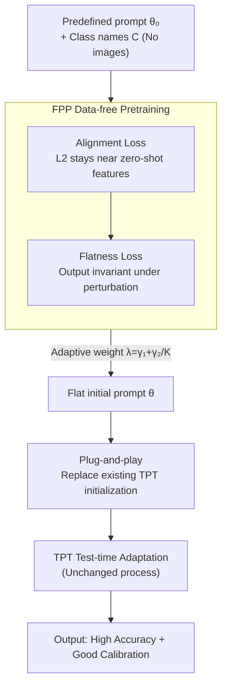

# Improving Calibration in Test-Time Prompt Tuning for Vision-Language Models via Data-Free Flatness-Aware Prompt Pretraining

**Conference**: CVPR 2026  
**arXiv**: [2604.27715](https://arxiv.org/abs/2604.27715)  
**Code**: https://github.com/YonseiML/fpp (Yes)  
**Area**: Multi-modal VLM / Test-time Adaptation / Calibration  
**Keywords**: CLIP, Test-time Prompt Tuning (TPT), Model Calibration, Flat Minima, Data-free Pretraining

## TL;DR
This paper discovers that the essence of "adding regularization to TPT to improve calibration" is pushing the prompt towards the flat minima of the loss surface. Consequently, it proposes FPP—a data-free prompt pretraining framework that positions the initial prompt directly in a flat region. By only replacing the initialization without modifying any TPT procedures, it simultaneously achieves SOTA results in both accuracy and calibration (ECE/SCE).

## Background & Motivation

**Background**: Vision-language models like CLIP exhibit strong zero-shot capabilities but are extremely sensitive to text templates. Test-time Prompt Tuning (TPT) uses entropy minimization (EM loss) on unlabeled test samples to optimize prompts per-sample, allowing models to handle distribution shifts. This is currently the mainstream paradigm for label-free adaptation.

**Limitations of Prior Work**: TPT tends to degrade model calibration—prediction confidence becomes severely decoupled from actual accuracy (ECE spikes from 4.67 in CLIP to 11.67 in TPT). In scenarios requiring reliable uncertainty, such as healthcare or autonomous driving, this overconfidence is fatal. Recent works like C-TPT and O-TPT add regularization terms to the EM loss (encouraging dispersed text features), which improves calibration but often at the cost of accuracy, creating an "accuracy vs. calibration" trade-off; furthermore, these methods explain *that* regularization helps but not *why*.

**Key Challenge**: Regularized TPT with single-step updates cannot fully explore flat regions (multiple iterations risk extra computation and overconfidence), and geometric constraints may drop accuracy by distorting output features. The root cause is that existing methods attempt to find flat minima temporarily "around a predefined prompt" rather than starting from a flat region.

**Goal**: (1) Theoretically explain why regularization improves calibration; (2) Develop a calibration scheme that neither sacrifices accuracy nor adds test-time overhead.

**Key Insight**: By expanding the single-step update formula of regularized TPT, the authors find it equivalent to "computing the gradient at a perturbed point"—the core mechanism of Sharpness-Aware Minimization (SAM) for finding flat minima. Since flat minima are the true cause of improved calibration, one should not approach them circuitously during adaptation.

**Core Idea**: Use "data-free flatness-aware pretraining" to directly generate an initial prompt that resides in a flat region, replacing the initialization of existing TPT methods while keeping the rest of the process unchanged.

## Method

### Overall Architecture
FPP (Flatness-aware Prompt Pretraining) addresses how to position TPT at a flat minimum before adaptation. It consists of two steps: **First**, a data-free pretraining phase starts from a predefined prompt $\theta_0^{\text{zs}}$ (e.g., "a photo of a") and a set of class names $C$, jointly optimizing an "alignment loss + flatness loss" to obtain a new flat initial prompt $\theta$. **Second**, this $\theta$ is used as the initialization for any existing TPT/C-TPT/O-TPT/DynaPrompt pipelines without modifying the test-time adaptation process. The pretraining depends only on the text side (prompt + class names), involves no training/test images, and adds no computation at test time.

### Key Designs

**1. Reinterpreting "regularized TPT" as implicit SAM: Finding the true cause of calibration improvement**

This is the theoretical foundation of the paper. Since regularized TPT methods reset the prompt to the same $\theta_0^{\text{zs}}$ for each sample, the gradient of the regularization term $\nabla_\theta L_{\text{reg}}|_{\theta_0^{\text{zs}}}$ remains a constant $\varepsilon_{\text{reg}}$ across all samples. Merging the two fixed terms in the single-step update $\theta_1^{\text{reg}}=\theta_0^{\text{zs}}-\nabla_\theta L_{\text{ent}}-\lambda\nabla_\theta L_{\text{reg}}$ and defining a new starting point $\theta_0^{\text{reg}}:=\theta_0^{\text{zs}}-\varepsilon_{\text{reg}}$, the update becomes $\theta_1^{\text{reg}}=\theta_0^{\text{reg}}-\nabla_\theta L_{\text{ent}}|_{\theta_0^{\text{reg}}+\varepsilon_{\text{reg}}}$. This structure—starting from $\theta_0^{\text{reg}}$ but taking the EM gradient at a perturbed point $\theta_0^{\text{reg}}+\varepsilon_{\text{reg}}$—is identical to SAM. Theorem 1 proves that on a unit hypersphere with a sufficiently large feature dimension $D$, the expected EM loss satisfies $\mathcal{H}(T)=\alpha L_{\text{reg}}(T)+\beta+O(D^{-3/2})$. Thus, increasing regularization loss is nearly equivalent to increasing EM loss—making $\varepsilon_{\text{reg}}$ a perturbation that raises EM loss, effectively performing SAM. This upgrades "adding regularization" to "approaching flat minima" and highlights the inefficiency of searching for flatness temporarily.

**2. Flatness Loss $\mathcal{L}_{\text{flat}}$: Nailing the prompt into flat regions via perturbation invariance**

Since flatness is key, the method directly penalizes sensitivity to small perturbations. The flatness loss is defined as:
$$\mathcal{L}_{\text{flat}}=\operatorname{dist}_{\cos}\big(f_T(C+\varepsilon_1;\,\theta+\varepsilon_2),\;f_T(C;\,\theta)\big),$$
where $\varepsilon_1$ and $\varepsilon_2$ are zero-mean isotropic Gaussian perturbations (variances 0.02 / 0.005) added to class name embeddings and the prompt, respectively, and $\operatorname{dist}_{\cos}$ is the cosine distance. Intuitively, requiring the text features to remain almost unchanged when the prompt and class names are slightly perturbed is equivalent to lowering the output sensitivity to $\theta$, thereby reducing sharpness for any differentiable loss. Unlike regularized TPT, this does not rely on geometric constraints to force feature dispersion but optimizes the prompt during pretraining, avoiding feature distortion and accuracy loss.

**3. Alignment Loss $\mathcal{L}_{\text{align}}$: Preventing the collapse of zero-shot capability**

Optimizing only $\mathcal{L}_{\text{flat}}$ has a fatal side effect: it distorts the original text features of $\theta_0^{\text{zs}}$, causing zero-shot accuracy to collapse (dropping to 4.65% in ablations). Since EM loss is highly sensitive to initial prediction probabilities, adaptation cannot recover if the initialization is broken. The alignment loss uses L2 distance to pull the learned text features back toward the original zero-shot features:
$$\mathcal{L}_{\text{align}}=\operatorname{dist}_{\text{L2}}\big(f_T(C;\,\theta),\;f_T(C;\,\theta_0^{\text{zs}})\big),$$
preserving the semantic structure of the original prompt. Alignment and flatness act as complementary objectives: flatness ensures "good calibration," while alignment ensures "zero-shot capability is maintained."

**4. Adaptive Flatness Weight + Plug-and-Play: Zero-cost deployment**

The two losses are combined as $\mathcal{L}_{\text{FPP}}=\mathcal{L}_{\text{align}}+\lambda\mathcal{L}_{\text{flat}}$, with the weight $\lambda=\gamma_1+\frac{\gamma_2}{K}$ ($\gamma_1=1.0, \gamma_2=0.15$, where $K$ is the number of classes). The design motivation is specific: as the number of classes increases, it becomes harder to align a large volume of text features, so the weight of the flatness term is automatically reduced to prioritize alignment. Crucially, the entire loss depends only on $\theta_0^{\text{zs}}$ and class names $C$, making pretraining data-free. The resulting flat prompt replaces the initialization of existing methods, requiring zero modifications to TPT processes and zero extra test-time overhead.

### Loss & Training
The pretraining stage uses AdamW with a cosine learning rate scheduler, starting at 0.01 for 1K iterations; the backbone is CLIP-ViT-B/16. Test-time adaptation strictly follows the settings of TPT/O-TPT. Calibration is evaluated using ECE and SCE.

## Key Experimental Results

### Main Results

Fine-grained classification (Average of 10 datasets, CLIP-ViT-B/16, hard prompt "a photo of a", lower ECE/SCE is better):

| Method | Conference | Acc.↑ | ECE↓ | SCE↓ |
|------|------|------|------|------|
| CLIP (Zero-shot) | ICML'21 | 63.41 | 4.67 | 1.06 |
| TPT | NeurIPS'22 | 64.62 | 11.67 | 1.15 |
| C-TPT | ICLR'24 | 64.48 | 5.32 | 1.11 |
| O-TPT | CVPR'25 | 64.12 | 4.46 | 1.15 |
| **FPP (Ours)** | CVPR'26 | **65.37** | **4.13** | **0.96** |

FPP is the only method to achieve SOTA in **both** accuracy and calibration: accuracy even exceeds the original TPT (65.37 vs. 64.62), ECE is lower than O-TPT, and SCE improvement is particularly significant (0.96, the lowest). C-TPT/O-TPT clearly show the "improved calibration, dropped accuracy" trade-off.

Cross-framework/Cross-initialization generalization (Average ECE):

| Setting | Baseline | +FPP |
|------|------|------|
| CoOp initial prompt | CoOp+TPT 18.36 | **5.67** |
| MaPLe initial prompt | MaPLe+TPT 6.94 | 4.07 (Acc 67.01 highest) |
| DynaPrompt framework | 13.62 | **4.56** |
| Natural distribution shift (OOD Avg) | TPT 11.99 | **4.63** (Acc only -0.42%) |

### Ablation Study

Contribution of components (Fine-grained classification, TPT framework):

| Configuration | Zero-shot Acc | Post-TPT Acc | ECE↓ | SCE↓ |
|------|-----------|-----------|------|------|
| No Pretraining (Original TPT) | 63.41 | 64.62 | 11.67 | 1.15 |
| $\mathcal{L}_{\text{flat}}$ only (No Align) | Collapse | 4.65 | 4.16 | — |
| $\mathcal{L}_{\text{align}}$ only | 63.49 | 64.40 | 7.05 | 1.09 |
| Align + $\varepsilon_1$ only | 63.92 | 64.77 | 5.86 | 1.03 |
| Align + $\varepsilon_1$ + $\varepsilon_2$ (Full) | 64.35 | 65.37 | 4.13 | 0.96 |

### Key Findings
- **Alignment loss is the "foundation"**: Removing it leads to zero-shot collapse, confirming the sensitivity of EM loss to initial probabilities.
- **Flatness loss is the "calibration engine"**: ECE drops from 7.05 (alignment only) to 4.13 with both perturbations, showing synergistic benefits from $\varepsilon_1$ (class names) and $\varepsilon_2$ (prompt).
- **Minimal dependence on class name supervision**: Replacing class names with ImageNet classes or Gaussian noise still outperforms all Table 1 baselines, suggesting text semantic spaces are easy to sample.

## Highlights & Insights
- **Reducing empirical tricks to optimization geometry**: Proving "regularized TPT ≈ implicit SAM" using one unified formula is the highlight. It not only explains existing methods but points out their inefficiencies.
- **"Changing initialization" as innovation**: Solving the problem at the pre-processing stage without changing adaptation logic or adding test-time overhead is a highly effective "pre-emptive" strategy.
- **Causal evidence for Flatness ↔ Calibration**: The paper provides empirical proof that flat minima themselves—even without explicit regularization—bring better calibration, filling an empirical gap in the literature.

## Limitations & Future Work
- **Theoretical approximation**: Theorem 1 relies on uniform distribution assumptions on the unit hypersphere and asymptotic conditions for $D$.
- **Hyperparameter sensitivity**: Variance of $\varepsilon$, weights $\gamma$, and 1K iterations require tuning; the paper includes sensitivity analysis in the appendix.
- **Backbone validation**: Evaluation is primarily on CLIP-ViT-B/16; cross-architecture universality remains to be fully verified.
- **One-time pretraining cost**: While test-time cost is zero, pretraining must be run once for each new task/class set.

## Related Work & Insights
- **vs. C-TPT / O-TPT**: These add geometric regularization (dispersion/orthogonality) during adaptation. This paper proves these are equivalent to implicit SAM but drop accuracy due to feature distortion. FPP avoids this by pre-positioning the prompt in a flat region.
- **vs. SAM Series**: SAM uses a two-step optimization during training. FPP treats "flatness" as a prompt initialization target (perturbation invariance) instead.
- **vs. DiffTPT / Self-TPT**: These focus on accuracy but often lead to overconfidence. FPP is orthogonal and can be used as their initialization.

## Rating
- Novelty: ⭐⭐⭐⭐⭐ Reinterpreting TPT as implicit SAM and proposing the "initialization replacement" is a fresh and self-consistent perspective.
- Experimental Thoroughness: ⭐⭐⭐⭐ Covers 4 TPT frameworks + OOD + class-agnostic ablations, though focused on a single backbone.
- Writing Quality: ⭐⭐⭐⭐⭐ Clear logic from observation to theory to method.
- Value: ⭐⭐⭐⭐⭐ Zero-cost, data-free, and plug-and-play; highly practical for safety-critical deployments.

<!-- RELATED:START -->

## Related Papers

- [\[CVPR 2026\] SoC: Semantic Orthogonal Calibration for Test-Time Prompt Tuning](soc_semantic_orthogonal_calibration_for_test-time_prompt_tuning.md)
- [\[CVPR 2026\] Towards Calibrating Prompt Tuning of Vision-Language Models](towards_calibrating_prompt_tuning_of_vision-language_models.md)
- [\[CVPR 2026\] STAR: Test-Time Adaptation Can Enhance Universal Prompt Learning for Vision-Language Models](star_test-time_adaptation_can_enhance_universal_prompt_learning_for_vision-langu.md)
- [\[CVPR 2026\] Dual-Modality Anchor-Guided Filtering for Test-time Prompt Tuning](dual-modality_anchor-guided_filtering_for_test-time_prompt_tuning.md)
- [\[CVPR 2026\] Controllable Federated Prompt Learning at Test Time](controllable_federated_prompt_learning_at_test_time.md)

<!-- RELATED:END -->
